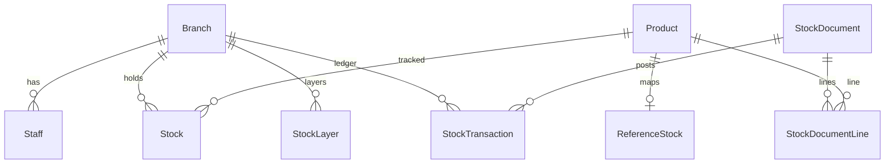

# Prisma Kernel (Phase 1)

Minimal inventory schema for the first stock-document vertical slice.

## Models (10)

| Model | Purpose |
|-------|---------|
| `Branch` | HO or shop location |
| `Staff` | User identity + role |
| `Product` | SKU master |
| `ReferenceStock` | Hook group / supplier / product group mapping |
| `Stock` | Branch + product quantity snapshot |
| `StockLayer` | FIFO cost layers |
| `StockTransaction` | Immutable ledger rows |
| `StockDocument` | Batch document header |
| `StockDocumentLine` | Document line items |
| `DocumentCounter` | Running document ref numbers |

## Enums (5)

| Enum | Values |
|------|--------|
| `Role` | `HO_FINANCE`, `HO_ADMIN`, `HO_OPERATIONS`, `SH_STAFF` |
| `BranchType` | `HO`, `SH` |
| `ProductType` | `TRACKED`, `CONSUMABLE` |
| `DocType` | `PURCHASE`, `TRANSFER_OUT`, `TRANSFER_IN`, `ADJUSTMENT`, `PERFORMANCE` |
| `DocStatus` | `DRAFT`, `SUBMITTED`, `SHIPPED`, `CONFIRMED`, `RECEIVED`, `POSTED`, `TRANSFERRED` |

`StockDocument.status` uses `DocStatus` (typed enum, not free string).

## Deferred (later phases)

- Finance: `GlAccount`, `JournalEntry`, vouchers
- POS: `Sale`, `SaleItem`, `Receipt`
- Auth: `Session`, `WorkSession`
- Month control: `BranchMonthState`, `MonthControl`
- Pricing: `SellingPrice`, `PricingPolicy`
- Risk / tax snapshots

## Migrations

Migration SQL is **not** generated or applied in Phase 1. When ready:

1. Review schema with team
2. Run `npx prisma migrate dev --name init_kernel` against a dev database
3. Commit migration files in a separate PR

## ER diagram

