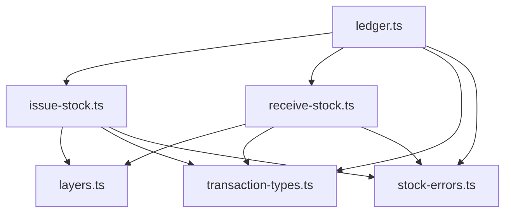

# Stock Ledger Foundation (Phase 3)

Status: **Superseded for per-event writes** — see [architecture/02_PERIOD_STOCK_LEDGER_DECISION.md](./architecture/02_PERIOD_STOCK_LEDGER_DECISION.md)  
Scope: Historical design for centralized stock mutation (Phase 3). Per-event `issueStock` / `receiveStock` / `StockTransaction` creation is **retired**.

> **2026-07 decision:** ASA-CON retired per-event StockTransaction creation. Operational REC, DEY, and CNT remain source documents. Future StockTransaction records will be generated only from Cost Calculation based on locked END Stock Documents.

---

## 1. Purpose

Phase 3 establishes the **inventory ledger foundation**: the only code path that may change branch stock quantities, average cost, FIFO layers, and ledger rows.

### Goals

| Goal | Description |
|------|-------------|
| Centralized mutation | Inbound via `receiveStock()`; outbound via `issueStock()` — separate APIs in `lib/stock/ledger.ts` |
| Kernel alignment | Uses Phase 1 models: `Stock`, `StockLayer`, `StockTransaction` |
| Audit trail | Every mutation produces immutable `StockTransaction` rows with before/after qty and value |
| Transaction safety | One outer `prisma.$transaction` per business operation; inner functions receive `tx` |
| Future-ready | Document POST, POS checkout, and finance hooks integrate later without duplicating FIFO logic |

### Non-goals (Phase 3)

Stock documents, UI, POS, finance, print, and summary are **not** implemented in Phase 3. This phase delivers ledger services and tests only.

---

## 2. Core invariants

These rules are locked before any Phase 3 code is merged.

### 2.1 Single mutation entry

| Rule | Detail |
|------|--------|
| All stock mutations | Inbound → `receiveStock()` only. Outbound → `issueStock()` only. Both exported from `lib/stock/ledger.ts` |
| API separation | **Never** use `issueStock()` for inbound quantity. **Never** use `receiveStock()` for outbound quantity |
| No direct Prisma writes | Routes, components, and other domains must not call `tx.stock.update`, `tx.stockLayer.create/update`, or `tx.stockTransaction.create` except inside `lib/stock/*` |
| Dev seed scripts | Exempt (non-production tooling only) |

### 2.2 Document lifecycle boundary (future phases)

| Action | Mutates stock? |
|--------|----------------|
| SAVE (draft lines) | **No** |
| SEND / CONFIRM / SHIP | **No** |
| **POST** (document status → `POSTED`) | **Yes** — calls ledger via posting service (Phase 4+) |

Phase 3 implements the ledger; Phase 4 wires document POST to it.

### 2.3 Transaction nesting

| Layer | May open `prisma.$transaction`? |
|-------|----------------------------------|
| `lib/stock/ledger.ts` (top-level public API) | **Yes** — when caller does not pass `tx` |
| Domain orchestrators (e.g. future `posting.ts`) | **Yes** — one transaction per POST |
| `issue-stock.ts`, `receive-stock.ts`, `layers.ts` | **No** — must accept `tx: Prisma.TransactionClient` |
| API routes, React, middleware | **No** |

**Golden rule:** Inner functions accept `tx` and must not call `prisma.$transaction` or `$transaction` on a nested client.

### 2.4 Quantity convention — split APIs (not signed qty)

`issueStock()` and `receiveStock()` are **directional, not signed**. Both accept **positive magnitude only** (`qty > 0`). Callers choose the function by intent.

| Function | Direction | `qty` argument | Creates layers? |
|----------|-----------|----------------|-----------------|
| `receiveStock()` | **Inbound only** | Must be `> 0` | Yes — creates `StockLayer` |
| `issueStock()` | **Outbound only** | Must be `> 0` (magnitude) | No — consumes layers (FIFO) |
| Either | Skipped | `qty === 0` | No-op, not an error |

**Hard rules:**

1. **`issueStock()` is outbound-only.** It decrements `Stock.qty` and writes `StockTransaction.qtyOut`.
2. **`receiveStock()` is inbound-only.** It increments `Stock.qty`, creates layers, and writes `StockTransaction.qtyIn`.
3. **Do not use `issueStock()` for positive inbound quantity.** All inbound paths — PURCHASE, TRANSFER_IN, positive ADJUSTMENT — call `receiveStock()`.
4. **Do not use signed qty** to select direction inside a single function. Posting (Phase 4+) maps document lines to the correct function per line.

**Validation:** `issueStock()` rejects `qty <= 0`; `receiveStock()` rejects `qty <= 0`. Wrong-direction calls are programmer errors, not silent coercions.

> **Note vs reference:** `asa-con/lib/stock.ts` uses one signed `issueStock()` (positive = inbound, negative = outbound). v0 **splits** this into two explicit functions — do not port the signed convention.

### 2.5 Layer purity

- `layers.ts` functions are **deterministic** given `tx`, branch, product, and qty — no HTTP, no cookies, no `NextResponse`.
- `lib/stock/**` must not import from `app/` or `components/`.

---

## 3. Planned modules

All files live under `lib/stock/`. Public surface exported from `lib/stock/index.ts` (and `lib/stock/ledger.ts` as the primary entry).

```
lib/stock/
├── ledger.ts              # Public API: issueStock, receiveStock; optional $transaction wrapper
├── issue-stock.ts         # Outbound-only: positive qty magnitude per line
├── receive-stock.ts       # Inbound-only: positive qty per line; creates StockLayer rows
├── layers.ts              # FIFO consume + layer create (tx-only, no $transaction)
├── stock-errors.ts        # Typed domain errors (InsufficientStock optional, validation)
├── transaction-types.ts   # Input/output types, StockRefType constants
├── index.ts               # Barrel exports
└── README.md              # Module contract (updated in Phase 3)
```

### Module responsibilities

| Module | Owns | Must not |
|--------|------|----------|
| `transaction-types.ts` | `IssueStockInput`, `ReceiveStockInput`, `StockMoveItem`, `StockRefType` enum/constants | Prisma calls |
| `stock-errors.ts` | `StockLedgerError`, error codes | Business workflow |
| `layers.ts` | `consumeLayers(tx, …)`, `createLayer(tx, …)` — FIFO by `createdAt` | Open transactions |
| `receive-stock.ts` | Inbound: update `Stock.qty`/`avgCost`, create layer, write `StockTransaction` | Outbound logic |
| `issue-stock.ts` | Outbound-only: consume layers, decrement `Stock.qty`, write `qtyOut` transaction | Inbound logic, layer create |
| `ledger.ts` | Exports `issueStock` / `receiveStock`; opens `$transaction` when `tx` omitted | HTTP, document status, routing inbound to `issueStock` |

### Dependency direction



---

## 4. FIFO / layer strategy

Based on Phase 1 schema (`StockLayer`, `Stock`, `StockTransaction`) and reference behaviour from `asa-con/lib/stock.ts`.

### 4.1 Ownership

| Entity | Role |
|--------|------|
| `Stock` | Branch + product **snapshot**: `qty`, `avgCost` (moving average on inbound) |
| `StockLayer` | FIFO cost buckets: `qty`, `qtyRemain`, `unitCost`, optional `refType`/`refId` |
| `StockTransaction` | Immutable audit row: `qtyIn`/`qtyOut`, before/after qty/value, `refType`/`refId`/`refLineId`, optional `documentId` |

`Stock.qty` is updated in the same `tx` as ledger rows — not a separate source of truth.

### 4.2 Inbound (`receiveStock` only)

**Only `receiveStock()` may perform inbound mutations.**

1. Validate `qty > 0` — reject otherwise.
2. Resolve or create `Stock` row for `(branchId, productId)`.
3. Determine `unitCost`: caller-provided, else current `Stock.avgCost`, else `0`.
4. Update `Stock.qty` and recalculate moving-average `avgCost`.
5. Create `StockLayer` with `qty` = `qtyRemain` = received qty.
6. Insert `StockTransaction` with `qtyIn > 0`, before/after fields populated.

### 4.3 Outbound (`issueStock` only)

**Only `issueStock()` may perform outbound mutations.**

1. Validate `qty > 0` (magnitude) — reject otherwise. **Do not pass negative qty**; use positive magnitude only.
2. Load `Stock` row (create with qty 0 if missing — outbound still allowed).
3. Consume `StockLayer` rows ordered by `createdAt` ascending (FIFO).
4. **Layer shortfall:** value remainder at current `Stock.avgCost` (do not throw merely for insufficient layers).
5. Decrement `Stock.qty` by outbound amount (may go negative — see §4.4).
6. Insert `StockTransaction` with `qtyOut > 0`, before/after fields populated.

### 4.4 Negative stock policy

Validation is **layered**: the ledger is permissive; posting/orchestration may be stricter.

| Layer | Policy |
|-------|--------|
| **Ledger (`issueStock`)** | **Allows negative** `Stock.qty` when outbound exceeds on-hand. Does not throw for insufficient stock. Layer shortfall valued at `avgCost`. |
| **POS (Phase 5+)** | Uses ledger as-is — **must not block** checkout for insufficient stock (reference governance §1.2). |
| **Stock document POST (Phase 4+)** | Posting service (`posting.ts`) may add **stricter validation per `DocType`** before calling ledger — e.g. block TRANSFER_OUT when qty insufficient, while ADJUSTMENT may allow corrections. Stricter rules live in posting, **not** in `issueStock()` / `receiveStock()`. |

Negative stock at the ledger level is a **valid state** (reporting / reconciliation). Document-type business rules are enforced one layer above the ledger.

### 4.5 Zero qty

Lines with `qty === 0` are skipped. Not an error.

---

## 5. Transaction boundaries

### 5.1 Who opens `$transaction`

| Caller | Pattern |
|--------|---------|
| `ledger.issueStock(input)` without `input.tx` | Opens one `$transaction`, runs outbound items (`qty > 0` each), commits |
| `ledger.receiveStock(input)` without `input.tx` | Opens one `$transaction`, runs inbound items (`qty > 0` each), commits |
| `ledger.issueStock({ …, tx })` / `ledger.receiveStock({ …, tx })` | Joins caller's existing transaction — no nested `$transaction` |
| Future `posting.postDocument(…)` | Opens `$transaction`, maps lines → `receiveStock` and/or `issueStock` per line direction, same `tx` |
| Future POS checkout | Opens `$transaction`, sale rows + `issueStock({ qty: saleQty })` only — never `receiveStock` for sales |

### 5.2 Who stays pure / tx-only

| Module | Inputs | Side effects |
|--------|--------|--------------|
| `layers.ts` | `tx`, branchId, productId, qty | DB via `tx` only |
| `issue-stock.ts` | `tx`, one line context | DB via `tx` only |
| `receive-stock.ts` | `tx`, one line context | DB via `tx` only |
| `transaction-types.ts` | — | None |
| `stock-errors.ts` | — | None |

### 5.3 Idempotency note (future)

Document POST and POS should pass stable `refLineId` per line for traceability. Duplicate POST protection is a **posting-layer** concern (Phase 4), not ledger core.

---

## 6. Not allowed in Phase 3

| Category | Examples |
|----------|----------|
| Stock document UI | `StockDocumentPage`, pickers, grids |
| Stock document workflow | `workflow.ts`, `validation.ts`, save/send/confirm |
| Stock document API routes | `app/api/stock-document/*` |
| POS | `lib/pos/checkout.ts`, sale models |
| Finance | Voucher hooks, GL posting |
| Print / PDF | `summary.ts`, print payloads |
| Summary UI | Group totals, shop-summary |
| React | Any `lib/stock/*.tsx` |
| HTTP in lib | `NextResponse`, `next/headers` in `lib/stock/` |
| Schema changes | No new Prisma models in Phase 3 |
| Migrations | No automatic `prisma migrate dev` |

Phase 3 deliverable: **`lib/stock/` ledger modules + unit tests** under `__tests__/lib/stock/`.

---

## 7. Future integration notes

Phase 3 ends when ledger functions are tested in isolation. Later phases attach business flows without duplicating FIFO logic.

### 7.1 Stock document POST (Phase 4+)

```
POST /api/stock-document/[id]/post  (thin route)
  → lib/stock/posting.ts postDocument(prisma, { documentId, staffId })
      → prisma.$transaction
          → validate status (CONFIRMED / RECEIVED / …)
          → per-line doc-type validation (may reject before ledger — stricter than ledger alone)
          → inbound lines  → receiveStock({ tx, qty, … })
          → outbound lines → issueStock({ tx, qty, … })   # qty > 0 magnitude only
          → update StockDocument.status = POSTED
```

Posting maps line direction to the correct function. **Never** route inbound qty through `issueStock()`.

SAVE route continues to write `StockDocument` + lines only — **never** calls ledger.

### 7.2 POS checkout (Phase 5+)

```
POST /api/pos/checkout  (thin route)
  → lib/pos/checkout.ts
      → prisma.$transaction
          → create Sale / SaleItem (when Sale model exists)
          → ledger.issueStock({ tx, qty: soldQty, refType: "POS_SALE", refId: sale.id })
              # outbound-only; positive qty; ledger allows negative on-hand
```

Must not inline `stock.update` in the route. Must not call `receiveStock()` for sales.

### 7.3 Finance voucher hooks (Phase 7+)

- Ledger completes first inside the same `tx` when required.
- `lib/finance/actions/*` receives computed costs from ledger results — finance never writes `Stock` or `StockLayer`.

### 7.4 Audit command (after Phase 3)

```bash
rg "stock\.update|stockLayer\.|stockTransaction\.create" app/ lib/ --glob "*.ts"
```

Approved writers: `lib/stock/**` only (plus dev seed scripts).

---

## 8. Testing strategy (Phase 3)

| Test | Assert |
|------|--------|
| Inbound receive | `receiveStock({ qty: 5 })` → `Stock.qty` ↑, layer created, `qtyIn` set |
| Outbound issue | `issueStock({ qty: 3 })` → `Stock.qty` ↓, layers consumed FIFO, `qtyOut` set |
| Wrong API rejected | `issueStock({ qty: 5 })` for inbound intent → not used; `receiveStock` required |
| Zero qty skipped | No rows written |
| Negative stock (ledger) | `issueStock` succeeds when on-hand < qty (POS policy) |
| Posting stricter rules | Phase 4 tests: posting may reject before ledger for specific DocTypes |
| Transaction join | Caller-passed `tx` — no nested `$transaction` |
| No direct writes outside lib | Grep guard in CI (manual until CI added) |

Tests use test database or mocked `tx` — TBD at implementation time.

---

## 9. Related docs

- [01_MODULAR_MONOLITH_BOUNDARIES.md](./01_MODULAR_MONOLITH_BOUNDARIES.md) — global invariants
- [04_PRISMA_KERNEL.md](./04_PRISMA_KERNEL.md) — schema models
- [05_AUTH_PERMISSIONS.md](./05_AUTH_PERMISSIONS.md) — RBAC (unchanged in Phase 3)
- Reference: `asa-con/lib/stock.ts`, `asa-con/docs/05_INVENTORY_ACCOUNTING_ARCHITECTURE_v1.md`, `asa-con/docs/09_inventory-governance.md`

---

## 10. Phase 3 acceptance criteria

- [ ] `lib/stock/ledger.ts` exports `issueStock()` and `receiveStock()`
- [ ] `issueStock()` is outbound-only; `receiveStock()` is inbound-only; neither accepts signed qty
- [ ] Inbound never routed through `issueStock()`
- [ ] FIFO logic lives in `layers.ts` only
- [ ] No `$transaction` inside `layers.ts`, `issue-stock.ts`, `receive-stock.ts`
- [ ] No imports from `app/`, `components/`, or `next/server` in `lib/stock/`
- [ ] Unit tests cover inbound, outbound, zero skip, and tx join
- [ ] `npm run build` passes
- [ ] No stock-document UI, POS, or finance code added

**Implementation requires explicit approval after this document is reviewed.**
