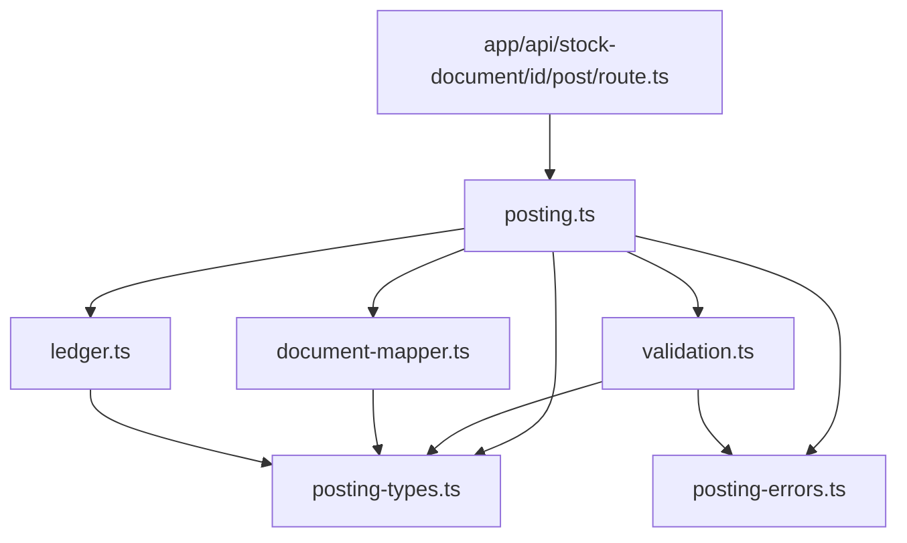
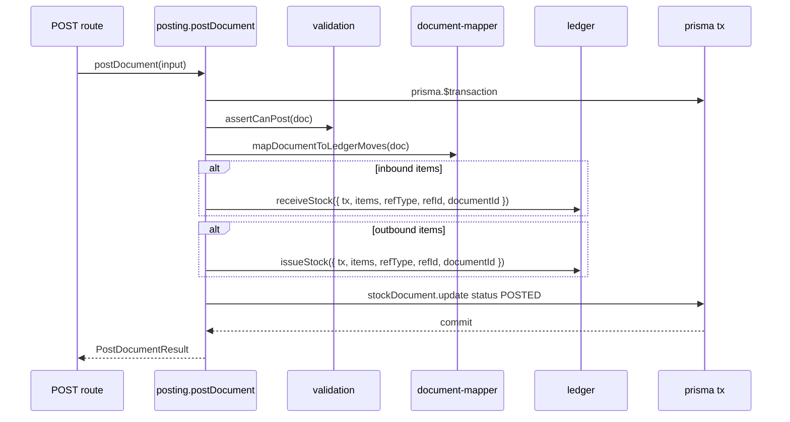

# Stock Document Posting (Phase 4)

Status: Planned — architecture only (no implementation in this document)  
Scope: Stock-document **posting workflow** and orchestration boundary on top of Phase 3 ledger  
Reference: `asa-con/lib/stock-document/executeLedgerPost.ts`, workflow routes — rewrite clean in `lib/stock/`, do not copy legacy code

---

## 1. Purpose

Phase 4 connects **`StockDocument` → ledger** through a single orchestration layer. Phase 3 delivered stock mutation primitives; Phase 4 delivers the **POST workflow** that turns approved documents into ledger rows.

### Goals

| Goal | Description |
|------|-------------|
| Connect document → ledger | `postDocument()` maps document lines to `receiveStock()` / `issueStock()` per direction |
| Posting orchestration boundary | Workflow decisions live in `lib/stock/posting.ts`; ledger stays direction-agnostic |
| Centralized status mutation | **`posting.ts` is the only module allowed to write `StockDocument.status`** (and related workflow timestamps) |
| Atomic POST | Status flip to `POSTED` and ledger writes commit in **one** outer transaction |
| Thin API | Routes parse HTTP, auth, and delegate — no business rules inline |

### Non-goals (Phase 4)

React UI complexity, PDF/print, POS checkout, finance voucher posting, summary rendering, and month-gate implementation are **not** Phase 4 deliverables. Phase 4 delivers posting services, thin POST API, and tests.

---

## 2. Core invariants

These rules extend Phase 3 ledger invariants ([06_STOCK_LEDGER_FOUNDATION.md](./06_STOCK_LEDGER_FOUNDATION.md)).

### 2.1 SAVE vs POST

| Action | Mutates `Stock` / layers / `StockTransaction`? | Mutates document lines? |
|--------|-----------------------------------------------|-------------------------|
| **SAVE** (draft persist) | **No** | Yes — `StockDocument` + `StockDocumentLine` only |
| SEND / SHIP / CONFIRM / RECEIVE / TRANSFER | **No** | Status/timestamps only (via `posting.ts`) |
| **POST** | **Yes** — via ledger | Status → `POSTED` + audit columns |

**Hard rule:** SAVE never calls `issueStock()` or `receiveStock()`.

### 2.2 Orchestration vs ledger

| Layer | Responsibility |
|-------|----------------|
| **`posting.ts`** | Eligibility, status transitions, document → ledger mapping, opens outer `$transaction` |
| **`ledger.ts`** | Stock mutation only — joins caller `tx`; no document awareness |
| **API routes** | HTTP parse, session/role check, call `postDocument()` — no Prisma workflow logic |

**Hard rules:**

1. **`posting.ts` is the only workflow layer** allowed to call `ledger.issueStock()` / `ledger.receiveStock()` for stock documents.
2. **`posting.ts` is the only module** allowed to mutate `StockDocument.status` (all workflow transitions, not only POST).
3. **Posting orchestrates; ledger mutates stock** — posting must not inline `tx.stock.update`, `tx.stockLayer.*`, or `tx.stockTransaction.create`.
4. **No signed qty to ledger** — `document-mapper.ts` splits lines into inbound (`receiveStock`) and outbound (`issueStock`) batches with positive magnitudes only.

### 2.3 Who may call ledger (recap)

| Caller | Allowed? |
|--------|----------|
| `lib/stock/posting.ts` | **Yes** — stock documents |
| `lib/pos/checkout.ts` | **Yes** — Phase 5+ |
| API routes, React, components | **No** |
| SAVE / SEND routes | **No** |

### 2.4 Module purity

- `lib/stock/posting*.ts`, `validation.ts`, `document-mapper.ts` must not import from `app/` or `components/`.
- No `NextResponse`, `next/headers`, or React in `lib/stock/`.

---

## 3. Planned modules

New files under `lib/stock/` (alongside Phase 3 ledger modules):

```
lib/stock/
├── posting.ts           # Public API: postDocument(); future workflow transitions
├── validation.ts        # Post eligibility, doc-type rules, line checks
├── document-mapper.ts   # StockDocument → receiveStock / issueStock item batches
├── posting-errors.ts    # PostingPostError, transition errors, HTTP-safe codes
├── posting-types.ts     # PostDocumentInput, PostDocumentResult, transition types
├── ledger.ts            # (Phase 3) issueStock, receiveStock
├── …                    # other Phase 3 modules unchanged
└── index.ts             # export postDocument + ledger public API
```

### Module responsibilities

| Module | Owns | Must not |
|--------|------|----------|
| `posting-types.ts` | Input/output types, `PostDocumentInput`, mapped ledger batches | Prisma calls |
| `posting-errors.ts` | `PostingError`, error codes (`ALREADY_POSTED`, `INVALID_STATUS`, …) | Ledger FIFO logic |
| `validation.ts` | `assertCanPost(doc)`, doc-type post rules, line sanity | Open transactions, status writes |
| `document-mapper.ts` | `mapDocumentToLedgerMoves(doc)` → `{ inbound, outbound, branchId }` | Status updates, `$transaction` |
| `posting.ts` | `postDocument()`, status → `POSTED`, audit fields; future `submitDocument`, etc. | Inline stock row writes |

### Dependency direction



---

## 4. Status transition rules

Phase 1 schema `DocStatus`: `DRAFT`, `SUBMITTED`, `SHIPPED`, `CONFIRMED`, `RECEIVED`, `POSTED`, `TRANSFERRED`.

All status writes go through **`posting.ts`** functions (Phase 4 implements `postDocument`; other helpers are planned in the same module).

### 4.1 Allowed transitions (no stock mutation)

| From | Action (posting fn) | To | Typical doc types |
|------|---------------------|-----|-------------------|
| — | create / save draft | `DRAFT` | All |
| `DRAFT` | submit / order | `SUBMITTED` | TRO, ADJ, PUR, TRI |
| `SUBMITTED` | ship | `SHIPPED` | TRO, PUR, TRI |
| `SHIPPED` | confirm received | `CONFIRMED` | TRO, ADJ (shop ack) |
| `SHIPPED` | receive goods | `RECEIVED` | PUR, TRANSFER_IN |
| `CONFIRMED` | mark transferred | `TRANSFERRED` | ADJ (and TRO pairing rules TBD) |

> Phase 4 **implements POST only**. Other rows are documented so SAVE/SEND routes migrated later do not bypass `posting.ts`.

### 4.2 POST transition (stock mutation)

| From (eligible) | Action | To | Ledger |
|-----------------|--------|-----|--------|
| `SUBMITTED` | post | `POSTED` | Yes — default outbound docs (TRO, PERFORMANCE) |
| `CONFIRMED` | post | `POSTED` | Yes — TRO, ADJ after shop confirm |
| `RECEIVED` | post | `POSTED` | Yes — PUR, TRANSFER_IN after goods receipt |

**Doc-type postable status sets** (reference-aligned, v0 locked):

| DocType | Postable from |
|---------|---------------|
| `TRANSFER_OUT` | `SUBMITTED`, `CONFIRMED` |
| `PERFORMANCE` | `SUBMITTED`, `CONFIRMED` |
| `ADJUSTMENT` | `SUBMITTED`, `CONFIRMED` |
| `PURCHASE` | `SUBMITTED`, `CONFIRMED`, `RECEIVED` |
| `TRANSFER_IN` | `SUBMITTED`, `CONFIRMED`, `RECEIVED` |

Implicit confirm on POST (reference behaviour): if posting from `SUBMITTED` and doc type allows it, posting may set `confirmedAt` / `confirmedByStaffId` when not already set — **inside the same POST transaction**, before ledger calls.

### 4.3 Forbidden transitions

| Transition | Reason |
|------------|--------|
| `POSTED` → any | **POSTED is terminal** for workflow and editing |
| `DRAFT` → `POSTED` | Must pass through submit/confirm/receive gates |
| `SHIPPED` → `POSTED` (direct) | Must confirm/receive first (except implicit confirm policy above from `SUBMITTED` only) |
| Double POST | `postDocument()` rejects `status === POSTED` |
| POST with zero eligible lines | Rejected — except ADJ all-zero delta policy (see §6) |

### 4.4 POSTED is terminal

- `POSTED` documents are **locked** — no further status changes, no line edits, no re-POST.
- Ledger rows already written; reversal is a **future** compensating document (out of Phase 4 scope).

### 4.5 RECEIVE / CONFIRM interaction

| Status | Meaning | Stock impact |
|--------|---------|--------------|
| `CONFIRMED` | Shop (or HO) acknowledged shipment / count approval | None — readiness gate for POST |
| `RECEIVED` | Inbound goods checked in (PUR / TRANSFER_IN) | None — readiness gate for POST |

POST requires the correct gate per doc type (§4.2). CONFIRM and RECEIVE are **workflow-only** — implemented as `posting.ts` transition helpers without ledger calls.

### 4.6 Transfer document behaviour

**TRANSFER_OUT (TRO)** — shop-initiated outbound to HO:

1. Shop: `DRAFT` → `SUBMITTED` (order)
2. HO ops: `SUBMITTED` → `SHIPPED` (ship)
3. Shop: `SHIPPED` → `CONFIRMED` (confirm received at HO side semantics per reference)
4. HO: `CONFIRMED` or `SUBMITTED` → **`POSTED`** + `issueStock()` at **fromLocId** branch

**TRANSFER_IN (TRI)** — inbound to HO/shop:

1. HO: `DRAFT` → `SUBMITTED` → `SHIPPED`
2. Receiver: `SHIPPED` → `RECEIVED`
3. Finance/HO: `RECEIVED` (or `CONFIRMED`) → **`POSTED`** + `receiveStock()` at **toLocId** branch

Pairing of TRO/TRI ref numbers is **validation** concern (Phase 4+ / ops), not ledger concern.

---

## 5. Transaction boundaries

### 5.1 POST flow (single outer transaction)



| Step | Owner | Notes |
|------|-------|-------|
| Open `$transaction` | **`posting.ts` only** | One transaction per `postDocument()` call |
| Validate | `validation.ts` | Throws before any mutation |
| Map lines | `document-mapper.ts` | Pure transform |
| Ledger calls | `ledger.ts` | **Must pass `tx`** — no nested `$transaction` |
| Status update | `posting.ts` | Same `tx` as ledger — atomic commit |

### 5.2 Nested transaction rule

| Caller | Pattern |
|--------|---------|
| `postDocument(input)` without `input.tx` | `posting.ts` opens `$transaction`; passes `tx` to ledger |
| `postDocument({ …, tx })` | Joins outer batch (e.g. future finance POST) — posting must not open nested `$transaction` |
| `ledger.issueStock({ …, tx })` | Never opens `$transaction` when `tx` provided |

**Golden rule:** At most **one** `$transaction` per POST. Ledger joins; it does not nest.

### 5.3 Failure behaviour

Any validation error or ledger error **rolls back** the entire transaction — status stays pre-POST, no partial ledger rows.

---

## 6. Validation boundaries

Validation is **layered**. Each layer owns distinct concerns.

### 6.1 Ledger validates (Phase 3 — permissive)

| Check | Behaviour |
|-------|-----------|
| `qty > 0` per item | Required; `qty === 0` skipped |
| `qty < 0` | **Rejected** — wrong API |
| Missing `productId` | Rejected |
| Insufficient on-hand | **Allowed** on `issueStock()` — negative `Stock.qty` OK |
| FIFO / avg cost | Handled inside ledger |

Ledger does **not** know document type, status, or branch pairing rules.

### 6.2 Posting validates (Phase 4 — strict orchestration)

| Check | Owner |
|-------|-------|
| Document exists | `validation.ts` |
| `status !== POSTED` | `validation.ts` |
| Status in postable set for `docType` | `validation.ts` |
| At least one line (with doc-type exceptions) | `validation.ts` |
| Branch id resolved (`fromLocId` / `toLocId` / `branchId`) | `validation.ts` + `document-mapper.ts` |
| **TRANSFER_OUT** insufficient stock | **Optional reject in posting** before `issueStock()` — stricter than ledger |
| **ADJUSTMENT** `reviewPostingDelta` present and consistent | `validation.ts` |
| **ADJUSTMENT** all-zero deltas | Allow POST with **no ledger calls** (reference behaviour) |
| **PERFORMANCE** lines non-zero | `validation.ts` |
| Duplicate POST / idempotency | `posting.ts` (status gate) |

### 6.3 UI validates (display / UX only)

| Check | Notes |
|-------|-------|
| Required fields before enable POST button | UX — not authoritative |
| END / CNT / ADJ picker completeness | Drives `reviewPostingDelta` — server re-validates |
| Role-based action visibility | `lib/permissions/` — server still enforces |

**Server wins:** UI checks are never sufficient alone.

### 6.4 Document-type-specific validation (posting layer)

| DocType | Posting-specific rule |
|---------|----------------------|
| `TRANSFER_OUT` | Post from `fromLocId`; may block if `Stock.qty < line qty` (configurable strict mode) |
| `TRANSFER_IN` | Post from `toLocId`; inbound only |
| `PURCHASE` | Prefer `RECEIVED` status; inbound only |
| `ADJUSTMENT` | Use `reviewPostingDelta` (not raw `qty`) as posting magnitude; sign → direction |
| `PERFORMANCE` | Outbound only from `fromLocId`; consumption / issue |

---

## 7. Document → ledger mapping

`document-mapper.ts` converts `StockDocument` + lines into two batches. **Never** pass signed qty to ledger.

### 7.1 Branch resolution

| DocType | Ledger branch |
|---------|---------------|
| `TRANSFER_OUT` | `fromLocId` |
| `PERFORMANCE` | `fromLocId` |
| `TRANSFER_IN` | `toLocId` |
| `PURCHASE` | `toLocId` |
| `ADJUSTMENT` | `fromLocId ?? toLocId ?? document.branchId` |

### 7.2 Direction mapping

| DocType | Line condition | Ledger call | `qty` |
|---------|----------------|-------------|-------|
| `TRANSFER_OUT` | `line.qty !== 0` | `issueStock` | `abs(qty)` |
| `PERFORMANCE` | `line.qty !== 0` | `issueStock` | `abs(qty)` |
| `TRANSFER_IN` | `line.qty !== 0` | `receiveStock` | `abs(qty)` |
| `PURCHASE` | `line.qty !== 0` | `receiveStock` | `abs(qty)` |
| `ADJUSTMENT` | `reviewPostingDelta > 0` | `receiveStock` | `delta` |
| `ADJUSTMENT` | `reviewPostingDelta < 0` | `issueStock` | `abs(delta)` |
| `ADJUSTMENT` | `reviewPostingDelta === 0` | skip | — |

### 7.3 Ledger call shape

Common fields for every POST:

```typescript
refType: `STOCK_DOC_${doc.docType}`   // e.g. STOCK_DOC_TRANSFER_OUT
refId: doc.id
documentId: doc.id
date: doc.date (or post timestamp — TBD locked at implementation)
refLineId: line.id                    // via StockMoveItem.lineId
tx: outerTransaction
```

Posting may call **`receiveStock` once** (inbound batch) and **`issueStock` once** (outbound batch) per document, or one call per direction with aggregated items — implementation choice; both directions in the **same** outer `tx`.

### 7.4 PERFORMANCE rules

- Treat like **outbound-only** `TRANSFER_OUT` for mapping purposes.
- Every non-zero line → `issueStock({ qty: abs(line.qty) })` at `fromLocId`.
- No inbound lines on PERFORMANCE documents.
- Ledger negative-stock policy applies (no posting-side block by default — align with POS governance).

### 7.5 Unit cost

| Direction | `unitCost` on `StockMoveItem` |
|-----------|-------------------------------|
| `receiveStock` | Caller-provided if available; else ledger falls back to `Stock.avgCost` |
| `issueStock` | Omitted — FIFO / avgCost from ledger |

Phase 1 `StockDocumentLine` has no `unitCost` column — PURCHASE/TRI unit cost sourcing is a **future** enhancement (ReferenceStock / line extension).

---

## 8. Not allowed in Phase 4

| Category | Examples |
|----------|----------|
| React UI complexity | Full `StockDocumentPage`, grids, pickers |
| PDF / print | `/api/stock-document/[id]/pdf`, print payloads |
| POS checkout | `lib/pos/checkout.ts` |
| Finance voucher posting | `lib/finance/*` hooks on POST |
| Summary rendering | `summary.ts`, shop-summary |
| Direct stock mutation | `tx.stock.update` outside `lib/stock/ledger*` |
| Direct status mutation | `tx.stockDocument.update({ data: { status } })` outside `posting.ts` |
| Ledger from routes | `issueStock()` / `receiveStock()` in `app/api/**` |
| Nested `$transaction` | posting → ledger → `$transaction` |
| Schema changes | No new Prisma models in Phase 4 |
| Migrations | No automatic `prisma migrate dev` |

Phase 4 deliverable: **`lib/stock/posting*` modules + thin POST API route + unit/integration tests**.

---

## 9. Future integration notes

### 9.1 POS checkout (Phase 5+)

```
POST /api/pos/checkout
  → lib/pos/checkout.ts
      → prisma.$transaction
          → create Sale (when model exists)
          → ledger.issueStock({ tx, refType: POS_SALE, … })
```

POS **never** calls `posting.ts` — only ledger. Posting remains document-specific.

### 9.2 Finance hooks (Phase 7+)

```
postDocument()
  → prisma.$transaction
      → ledger (stock first)
      → lib/finance/actions/postStockDocumentVoucher({ tx, doc, ledgerResult })
```

Finance reads computed costs from ledger results — never writes `Stock` / `StockLayer`.

### 9.3 Inventory reports

Reports read `StockTransaction` + `StockDocument` join — no re-posting. POSTED status is the cutover point for "document affected ledger".

### 9.4 Audit tooling

```bash
# Status writes — posting.ts only
rg "stockDocument\.update" app/ lib/ --glob "*.ts"

# Stock writes — lib/stock only
rg "stock\.update|stockLayer\.|stockTransaction\.create" app/ lib/ --glob "*.ts"

# Ledger callers — posting + pos only
rg "issueStock\(|receiveStock\(" app/ lib/ --glob "*.ts"
```

Approved: `lib/stock/posting.ts`, `lib/stock/ledger.ts`, `lib/pos/checkout.ts` (future), dev seeds.

---

## 10. Acceptance criteria

Phase 4 is complete when:

- [ ] `lib/stock/posting.ts` exports `postDocument()` as the single POST orchestrator
- [ ] `postDocument()` opens one outer `$transaction`; ledger joins via `tx` (no nested `$transaction`)
- [ ] POST atomically writes ledger rows **and** sets `status = POSTED` (rollback on any failure)
- [ ] `document-mapper.ts` maps doc types per §7 — inbound → `receiveStock`, outbound → `issueStock`; no signed qty
- [ ] `validation.ts` enforces postable status per doc type; rejects double POST
- [ ] **No** `StockDocument.status` mutation outside `posting.ts` (grep guard)
- [ ] **No** stock row mutation outside `lib/stock/*` ledger modules
- [ ] Thin route: `POST /api/stock-document/[id]/post` delegates to `postDocument()` only
- [ ] Unit tests: mapping (all doc types), validation failures, atomic tx (mock tx), ADJ zero-delta POST
- [ ] Integration tests (optional): POST with test DB
- [ ] `npm run build` passes
- [ ] No POS, finance, PDF, or summary code added

### Planned tests (TBD at implementation)

| Test | Assert |
|------|--------|
| TRO POST | `issueStock` only; `qtyOut` transactions; status `POSTED` |
| TRI POST | `receiveStock` only; layer created |
| ADJ mixed deltas | Both `receiveStock` and `issueStock` in one tx |
| ADJ all zero | POST succeeds; no ledger calls |
| Invalid status | Throws before ledger |
| Already POSTED | Rejected |
| Tx join | Caller `tx` — posting does not open `$transaction` |
| TRANSFER_OUT strict | Posting rejects insufficient qty when strict flag enabled |

---

## Related docs

- [01_MODULAR_MONOLITH_BOUNDARIES.md](./01_MODULAR_MONOLITH_BOUNDARIES.md) — SAVE / POST invariants
- [04_PRISMA_KERNEL.md](./04_PRISMA_KERNEL.md) — `StockDocument`, `DocStatus`, lines
- [06_STOCK_LEDGER_FOUNDATION.md](./06_STOCK_LEDGER_FOUNDATION.md) — ledger API, FIFO, tx rules
- Reference: `asa-con/lib/stock-document/executeLedgerPost.ts`, `asa-con/docs/11_stock-document-adj-ui-and-post.md`

---

**Implementation requires explicit approval after this document is reviewed.**
