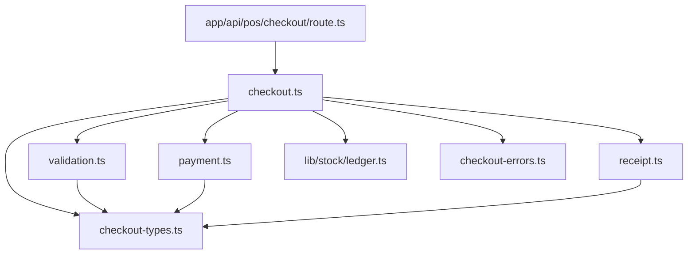
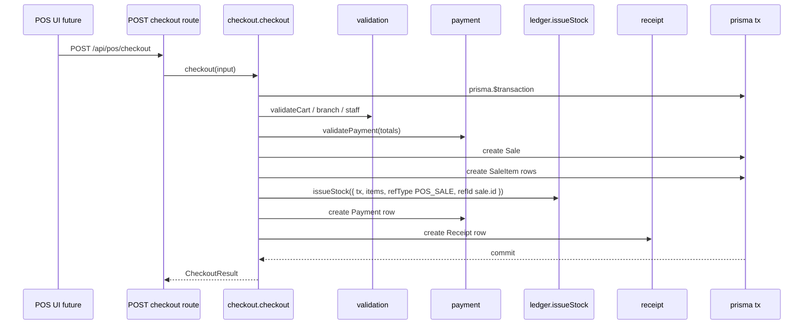

# POS Checkout Architecture (Phase 5)

Status: **Updated 2026-07** — checkout no longer issues stock / StockTransaction  
Scope: POS checkout flow  
See also: [architecture/02_PERIOD_STOCK_LEDGER_DECISION.md](./architecture/02_PERIOD_STOCK_LEDGER_DECISION.md)

> **2026-07 decision:** ASA-CON retired per-event StockTransaction creation. Checkout creates Sale / Payment / Receipt (REC) only. It does **not** call `issueStock`. Non-inventory sale Finance may remain; COGS/inventory posting waits for Cost Calculation on locked END.

---

## 1. Purpose

Phase 5 connects **shop POS sales → inventory ledger** through a dedicated checkout orchestration layer. Phase 3 delivered ledger primitives; Phase 4 wired stock documents. Phase 5 wires **retail checkout** without coupling to `StockDocument`.

### Goals

| Goal | Description |
|------|-------------|
| POS checkout flow | End-to-end sale: cart → payment → receipt in one atomic operation |
| Sales orchestration | `lib/pos/checkout.ts` owns sale creation, payment, and ledger call order |
| Direct ledger integration | Checkout calls `ledger.issueStock()` only — never `posting.ts` |
| Separation from documents | POS never reads or writes `StockDocument`; parallel stock path for retail |

### Non-goals (Phase 5)

Finance vouchers, PDF/print complexity, dashboards, loyalty, promotions engine, and full POS UI are **not** Phase 5 deliverables. Phase 5 delivers checkout services, thin checkout API, Prisma model design (schema change in same phase when approved), and tests.

---

## 2. Core invariants

These rules extend Phase 3 ledger and Phase 4 posting boundaries ([06_STOCK_LEDGER_FOUNDATION.md](./06_STOCK_LEDGER_FOUNDATION.md), [07_STOCK_DOCUMENT_POSTING.md](./07_STOCK_DOCUMENT_POSTING.md), [ARCHITECTURE_GUARDS.md](./ARCHITECTURE_GUARDS.md)).

### 2.1 POS vs stock documents

| Rule | Detail |
|------|--------|
| POS never touches `StockDocument` | No create/update/read for document workflow in checkout |
| POS never calls `posting.ts` | Document POST and POS checkout are independent orchestrators |
| POS calls `ledger.issueStock()` directly | Outbound-only; positive qty magnitude per line |
| SAVE / cart state does not mutate stock | Cart persistence (if any) is pre-checkout only — no ledger until checkout commits |

### 2.2 Checkout atomicity

| Rule | Detail |
|------|--------|
| One checkout = one outer `prisma.$transaction` | Sale + items + payment + receipt + stock in single commit |
| No nested `$transaction` | `checkout.ts` opens tx; `ledger.issueStock({ tx, … })` joins |
| Failure rolls back all | Partial sale without stock (or vice versa) is forbidden |

### 2.3 Negative stock policy

| Layer | Policy |
|-------|--------|
| **Ledger (`issueStock`)** | Allows negative `Stock.qty` — does not throw for insufficient on-hand |
| **POS checkout** | **Must not block** checkout for insufficient stock (align with reference governance; do not port legacy route’s hard stock check) |
| **Stock documents** | Posting may be stricter per `DocType` — unrelated to POS |

> **Note vs reference:** Legacy `asa-con` checkout inlined FIFO and threw on insufficient stock. v0 checkout **delegates to ledger** and allows negative on-hand at POS level.

### 2.4 Direction and qty convention

- **`issueStock()` only** at checkout — never `receiveStock()` (returns/refunds are Phase 5+ / future).
- **Positive magnitude only** — no signed qty convention.
- **Zero qty lines** skipped by ledger — cart validation should reject empty checkout before tx.

---

## 3. Planned modules

All files live under `lib/pos/`. Public surface exported from `lib/pos/index.ts`.

```
lib/pos/
├── checkout.ts           # Public API: checkout(); opens outer $transaction
├── validation.ts         # Cart, branch, staff, product eligibility
├── payment.ts            # Payment amount/method validation and Payment row create
├── receipt.ts            # Receipt number assignment and Receipt row create
├── checkout-errors.ts    # CheckoutError, error codes
├── checkout-types.ts     # CheckoutInput, CheckoutResult, cart line types
├── index.ts              # Barrel exports
└── README.md             # Module contract (updated in Phase 5)
```

### Module responsibilities

| Module | Owns | Must not |
|--------|------|----------|
| `checkout-types.ts` | Input/output types, cart line shape | Prisma calls |
| `checkout-errors.ts` | `CheckoutError`, HTTP-safe codes | Ledger FIFO logic |
| `validation.ts` | Cart sanity, branch/staff, sellable products | Open transactions |
| `payment.ts` | Paid/change calculation, `Payment` row | Stock mutation |
| `receipt.ts` | Receipt numbering, `Receipt` row | Stock mutation |
| `checkout.ts` | Orchestration: Sale → SaleItem → `issueStock` → payment/receipt | `posting.ts`, direct stock Prisma |

### Dependency direction



**Hard boundary:** `lib/pos/**` must not import from `lib/stock/posting.ts` or `StockDocument` types for workflow.

---

## 4. Planned Prisma models (architecture only)

Phase 5 implementation includes schema additions — **not applied in this document**. Planned models align with reference behaviour, simplified for v0.

### 4.1 Sale

| Field | Purpose |
|-------|---------|
| `id` | Primary key |
| `branchId` | Shop branch |
| `staffId` | Cashier (optional FK to Staff) |
| `total` | Decimal — sale total |
| `status` | e.g. `COMPLETED` (enum TBD); void/refund future |
| `createdAt` | Sale timestamp |

### 4.2 SaleItem

| Field | Purpose |
|-------|---------|
| `id` | Primary key |
| `saleId` | FK → Sale |
| `productId` | FK → Product (nullable for manual lines TBD) |
| `qty` | Sold quantity (Decimal or Int — TBD; ledger uses integer trunc/ceil policy locked at implementation) |
| `unitPrice` | Decimal |
| `lineTotal` | Decimal |
| `cost` | Decimal — populated from ledger/FIFO result post-issue (optional Phase 5) |

### 4.3 Payment

| Field | Purpose |
|-------|---------|
| `id` | Primary key |
| `saleId` | FK → Sale |
| `method` | Enum: CASH, CARD, QR, TRANSFER, … |
| `amount` | Decimal — amount tendered |
| `change` | Decimal — change due (cash) |
| `reference` | Optional external ref |

One sale may have one primary payment row in Phase 5 minimal scope; split payments future.

### 4.4 Receipt

| Field | Purpose |
|-------|---------|
| `id` | Primary key |
| `saleId` | FK → Sale (unique) |
| `receiptNo` | Human-readable sequential per branch/day |
| `issuedAt` | Timestamp |

Receipt is **sales evidence** — not a stock document, not a ledger row.

### 4.5 CashSession (optional)

| Field | Purpose |
|-------|---------|
| `id` | Primary key |
| `branchId` | Shop |
| `staffId` | Opener |
| `openedAt` / `closedAt` | Shift bounds |
| `openingFloat` / `closingBalance` | Decimal |

Deferred if Phase 5 scope stays minimal — architecture slot only.

### 4.6 ProductType interaction

| `ProductType` | Checkout stock behaviour |
|---------------|---------------------------|
| `TRACKED` | `issueStock()` for sold qty |
| `CONSUMABLE` | No ledger call (service/consumable — cost from avg or fixed rule TBD) |

Lock exact CONSUMABLE policy at implementation; do not inline FIFO in checkout.

---

## 5. Checkout flow



### Step order (inside transaction)

1. **Validate cart** — non-empty, products exist, branch context, permissions (route may pre-check role).
2. **Validate payment** — paid ≥ total (or exact rules per method), change calculated with Decimal helpers.
3. **Create `Sale`** header with totals.
4. **Create `SaleItem`** rows from cart lines.
5. **Call `issueStock()`** for all **TRACKED** lines — batch or per-line; same `tx`.
6. **Finalize payment** — insert `Payment` row linked to sale.
7. **Finalize receipt** — assign `receiptNo`, insert `Receipt` row.
8. **Commit** — all or nothing.

Optional: update `SaleItem.cost` from ledger transaction unit costs after issue — read-back via ledger result or `StockTransaction` query in same tx (implementation choice).

---

## 6. Transaction boundaries

### 6.1 Who opens `$transaction`

| Module | May open `prisma.$transaction`? |
|--------|----------------------------------|
| `lib/pos/checkout.ts` | **Yes** — one per checkout |
| `lib/stock/ledger.ts` | **No** during checkout — receives `tx` |
| `lib/stock/posting.ts` | **No** — not involved |
| `app/api/pos/checkout/route.ts` | **No** — delegate only |

### 6.2 Join pattern

```typescript
// checkout.ts (conceptual)
return prisma.$transaction(async (tx) => {
  const sale = await tx.sale.create({ … })
  await tx.saleItem.createMany({ … })

  await issueStock({
    tx,
    branchId,
    items: trackedLines.map(/* positive qty */),
    refType: "POS_SALE",
    refId: sale.id,
    documentId: null,
    date: sale.createdAt,
  })

  await createPayment(tx, …)
  await createReceipt(tx, …)
  return { sale, receiptNo, … }
})
```

### 6.3 Failure behaviour

Any validation, payment, or ledger error **rolls back** sale rows and stock — customer is not charged in DB terms (no committed sale).

---

## 7. POS → ledger mapping

### 7.1 Mapping rules

| Cart line | Ledger call | `qty` |
|-----------|-------------|-------|
| TRACKED product, qty > 0 | `issueStock()` | positive integer magnitude |
| CONSUMABLE | skip | — |
| qty === 0 | skip (reject at validation) | — |

### 7.2 Ledger payload

| Field | Value |
|-------|-------|
| `branchId` | Sale shop branch |
| `refType` | `"POS_SALE"` (or `STOCK_REF_TYPES.POS_SALE`) |
| `refId` | `sale.id` |
| `documentId` | `null` — not a stock document |
| `date` | Sale timestamp |
| `items[].lineId` | `saleItem.id` for audit traceability |
| `items[].productId` | Product sold |
| `items[].qty` | Outbound magnitude only |

### 7.3 Hard rules

1. **Never** call `receiveStock()` in checkout.
2. **Never** use signed qty — outbound only via `issueStock()`.
3. **Never** duplicate FIFO in checkout — ledger owns layer consumption.
4. **Never** pass `documentId` pointing at `StockDocument`.

---

## 8. Validation boundaries

### 8.1 UI validation (non-authoritative)

| Check | Notes |
|-------|-------|
| Cart non-empty before Pay | UX |
| Price display | UX — server recomputes |
| Payment method selected | UX |

### 8.2 Checkout validation (`validation.ts`)

| Check | Owner |
|-------|-------|
| Cart has ≥1 billable line | `validation.ts` |
| Branch + staff context | `validation.ts` |
| Product exists and is sellable | `validation.ts` |
| Qty > 0 per line | `validation.ts` |
| Totals match server calculation | `validation.ts` + Decimal |
| **Insufficient stock** | **Do not reject** at POS (ledger allows negative) |

### 8.3 Payment validation (`payment.ts`)

| Check | Owner |
|-------|-------|
| `paid >= total` (cash) or exact (card) | `payment.ts` |
| Change = paid − total (Decimal math) | `payment.ts` |
| Valid payment method enum | `payment.ts` |

### 8.4 Ledger validation (Phase 3)

| Check | Behaviour |
|-------|-----------|
| `qty > 0` | Required per item |
| Missing `productId` | Rejected |
| Insufficient layers / qty | **Allowed** — negative stock OK |

---

## 9. Receipt rules

### 9.1 Purpose

- Receipt is **accounting/sales evidence** for the customer and shop audit.
- Receipt is **NOT** a `StockDocument` — no `DocStatus`, no POST workflow.
- Stock impact is recorded only via `StockTransaction` from `issueStock()`.

### 9.2 Receipt numbering

- Sequential `receiptNo` per branch (and optionally per business day) — implementation TBD.
- Assigned inside checkout transaction after sale id is known.

### 9.3 Void / refund (future — not Phase 5)

| Action | Future approach |
|--------|-----------------|
| Void same day | Status flip on `Sale` + compensating `receiveStock()` or reversal service — **not** `posting.ts` |
| Refund | Partial `receiveStock()` with `refType: POS_REFUND` — new orchestrator `lib/pos/refund.ts` |
| Receipt reprint | Read-only — no stock mutation |

Document void/refund policy in Phase 5 architecture only; **no implementation** in Phase 5 minimal scope unless explicitly approved.

---

## 10. Not allowed in Phase 5

| Category | Examples |
|----------|----------|
| StockDocument coupling | Import `StockDocument`, call `postDocument()` |
| `posting.ts` usage | Any import from `lib/stock/posting.ts` in POS |
| Finance voucher posting | GL hooks in checkout tx |
| PDF / print complexity | Full receipt PDF, Z-read print |
| Dashboard / reporting | Sales dashboards, HO analytics |
| Loyalty / member | Points, member lookup |
| Promotion engine | Discount rules engine (simple line discount TBD minimal) |
| React UI complexity | Full POS terminal UI — thin API + minimal stub page at most |
| Inline stock Prisma | `tx.stock.update`, `tx.stockLayer.*` in checkout |
| Nested `$transaction` | ledger opening own tx when `tx` passed |

Phase 5 deliverable: **`lib/pos/checkout*` + schema migration + thin `POST /api/pos/checkout` + tests**.

---

## 11. Future integration notes

### 11.1 Finance voucher hooks (Phase 7+)

```
checkout()
  → prisma.$transaction
      → Sale / Payment / Receipt
      → issueStock({ tx, … })
      → lib/finance/actions/postSaleVoucher({ tx, sale })  // when enabled
```

Finance never writes `Stock` or `StockLayer`.

### 11.2 Refund flow

- New orchestrator `lib/pos/refund.ts` — calls `receiveStock()` for returned TRACKED qty.
- Never routes refunds through `posting.ts`.

### 11.3 Cash session close

- `CashSession.closedAt` + tender reconciliation — read sales/payments; no stock mutation.

### 11.4 Daily summary

- Aggregate `Sale` / `Payment` by branch/day — read-only; shares patterns with future `lib/stock/summary.ts` for inventory (separate concern).

### 11.5 Inventory reporting

- POS sales appear in reports via `StockTransaction.refType = POS_SALE` join to `Sale` through `refId`.

### 11.6 Audit commands (extend [ARCHITECTURE_GUARDS.md](./ARCHITECTURE_GUARDS.md))

```bash
# POS must not call posting
rg "postDocument|from ['\"]./posting|from ['\"]@/lib/stock/posting" lib/pos/ --glob "*.ts"

# Ledger callers — posting + checkout only
rg "issueStock\s*\(|receiveStock\s*\(" lib/ app/ --glob "*.ts" --glob "!**/__tests__/**"

# POS must not touch StockDocument
rg "stockDocument" lib/pos/ --glob "*.ts"
```

---

## 12. Acceptance criteria

Phase 5 is complete when:

- [ ] `lib/pos/checkout.ts` exports `checkout()` as the single checkout orchestrator
- [ ] `checkout()` opens one outer `$transaction`; `issueStock({ tx, … })` joins — no nested `$transaction`
- [ ] Checkout atomically creates Sale (+ items, payment, receipt) and ledger rows
- [ ] POS calls **`issueStock()` only** — never `receiveStock()`, never `postDocument()`
- [ ] **No** `StockDocument` dependency in `lib/pos/**`
- [ ] **No** insufficient-stock block at checkout (ledger negative policy respected)
- [ ] Cart/S SAVE (if implemented) does not mutate stock
- [ ] Thin route: `POST /api/pos/checkout` delegates to `checkout()` only
- [ ] Prisma models `Sale`, `SaleItem`, `Payment`, `Receipt` migrated
- [ ] Unit tests: mapping, payment validation, tx atomicity (mock tx), ledger call with `{ tx }`
- [ ] Grep guards pass per ARCHITECTURE_GUARDS §3
- [ ] `npm run build` passes
- [ ] No finance, PDF, dashboard, or promotion engine code added

### Planned tests (TBD at implementation)

| Test | Assert |
|------|--------|
| Happy path checkout | Sale + items + receipt + `StockTransaction.qtyOut` |
| CONSUMABLE line | No ledger call for consumable SKU |
| TRACKED outbound | `issueStock` once with positive qtys |
| Negative stock | Checkout succeeds when on-hand < qty |
| Tx join | `issueStock` receives same `tx`; no second `$transaction` |
| Rollback | Failure after sale create rolls back all |
| No posting import | `lib/pos/**` does not import posting |
| Payment mismatch | Rejected before ledger |

---

## Related docs

- [01_MODULAR_MONOLITH_BOUNDARIES.md](./01_MODULAR_MONOLITH_BOUNDARIES.md) — POS → stock invariant
- [06_STOCK_LEDGER_FOUNDATION.md](./06_STOCK_LEDGER_FOUNDATION.md) — ledger API, negative stock
- [07_STOCK_DOCUMENT_POSTING.md](./07_STOCK_DOCUMENT_POSTING.md) — document path (orthogonal)
- [ARCHITECTURE_GUARDS.md](./ARCHITECTURE_GUARDS.md) — grep rules, ledger callers
- Reference: `asa-con/app/api/pos/checkout/route.ts`, `asa-con/prisma/schema.prisma` (Sale models)

---

**Implementation requires explicit approval after this document is reviewed.**
