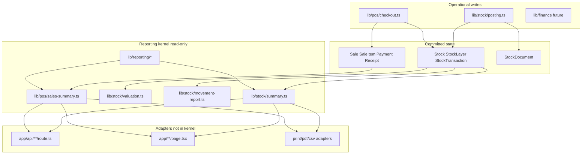
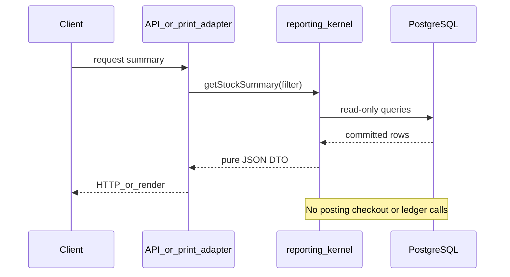
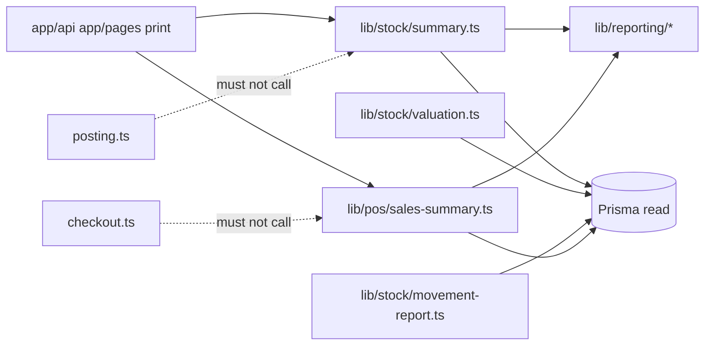

# Reporting and Summary Kernel

Status: Planned — architecture only (no reporting modules or UI in this document)  
Scope: Centralized read-model and aggregation architecture for stock, inventory valuation, movement, sales, and branch summaries  
Related: [01_MODULAR_MONOLITH_BOUNDARIES.md](./01_MODULAR_MONOLITH_BOUNDARIES.md), [06_STOCK_LEDGER_FOUNDATION.md](./06_STOCK_LEDGER_FOUNDATION.md), [08_POS_CHECKOUT_ARCHITECTURE.md](./08_POS_CHECKOUT_ARCHITECTURE.md), [09_REFERENCE_DATA_AND_PRODUCT_TYPES.md](./09_REFERENCE_DATA_AND_PRODUCT_TYPES.md), [ARCHITECTURE_GUARDS.md](./ARCHITECTURE_GUARDS.md)

---

## 1. Purpose

Phase 6 introduces a **reporting kernel** — a centralized, read-only aggregation layer that turns committed operational data into summary and report payloads. Operational writes (posting, checkout, finance vouchers) stay in their domain orchestrators; reporting **reads** the same truth without mutating it.

### Goals

| Goal | Description |
|------|-------------|
| **Reporting kernel** | One place for inventory and sales aggregation logic — not duplicated in pages, API routes, or print templates |
| **Centralized aggregation layer** | Shared queries, grouping, and rollups under `lib/stock/*` and `lib/pos/*` summary modules plus `lib/reporting/*` cross-cutting helpers |
| **Shared summary logic** | Screen, print, PDF, CSV/XLSX, and future dashboards consume the **same** pure-data functions |
| **Separation of writes and reads** | Posting and checkout commit state; reporting observes committed state only |

### Non-goals (this document / Phase 6 kernel)

| Non-goal | Notes |
|----------|-------|
| Dashboard React UI | Adapters only — consume kernel output later |
| Report pages / charts | Out of scope until kernel is approved and implemented |
| Finance voucher posting | Future integration reads summaries; does not live in reporting kernel |
| Cache / snapshot tables / materialized views | **Not in Phase 6** — read live committed tables first (§7.1) |
| Inline repair or reconciliation writes | Reports surface anomalies; fixes belong in operational modules |

### Architectural placement



---

## 2. Core invariants

These rules are **non-negotiable** for every reporting module. They extend [09_REFERENCE_DATA_AND_PRODUCT_TYPES.md §7.0](./09_REFERENCE_DATA_AND_PRODUCT_TYPES.md) and [01_MODULAR_MONOLITH_BOUNDARIES.md](./01_MODULAR_MONOLITH_BOUNDARIES.md).

| # | Invariant |
|---|-----------|
| 1 | **Inventory truth derives from `StockTransaction` + ledger** — on-hand snapshots from `Stock`, valuation from `StockLayer` / avg-cost policy via ledger helpers |
| 2 | **Sales truth derives from `Sale` / `SaleItem` / `Payment` / `Receipt`** — revenue, tender, receipt count, cashier attribution |
| 3 | **Reports must not infer stock from `SaleItem` alone** — no summing sale qty as on-hand; relate sales to inventory only via explicit ledger joins (`refType`, `refId`, `refLineId`) |
| 4 | **Reporting is read-only** — Prisma `findMany`, `aggregate`, `groupBy`, raw read queries only |
| 5 | **No stock mutation in reporting modules** — no `issueStock`, `receiveStock`, `postDocument`, `checkout`, or direct `stock.update` |
| 6 | **No direct React/UI logic in reporting kernel** — no JSX, hooks, or component imports in `lib/stock/summary.ts`, `lib/pos/sales-summary.ts`, or `lib/reporting/*` |

### Source-of-truth matrix

| Report dimension | Source of truth | Must not use as inventory truth |
|------------------|-----------------|----------------------------------|
| On-hand qty | `Stock.qty` (+ optional movement roll-up from `StockTransaction`) | `SaleItem.qty` |
| Movement in/out | `StockTransaction` (`qtyIn`, `qtyOut`, `refType`, dates) | Document lines without POST, sale lines alone |
| Inventory value (default summary) | `Stock.qty` × `Stock.avgCost` per TRACKED row ([§5.3](#53-valuation)) | `SaleItem.lineTotal`, `SaleItem.cost` alone |
| Inventory value (detailed FIFO report) | `StockLayer` remaining layers via `valuation.ts` — separate report, not mixed into default summary | Blended avgCost + FIFO without labeling |
| Sales revenue | `SaleItem` (+ header `Sale` status filters) | `StockTransaction` amounts |
| Tender breakdown | `Payment` | Inferred from sale header only |
| Receipt count | `Receipt` (or distinct `Sale` with receipt policy) | `receiptNo` as stock key |

**Expected gaps:** `CONSUMABLE` and future `SERVICE` sale lines may have **no** matching `StockTransaction` — this is correct; reports use left joins and `ProductType` filters, never back-fill ledger from sales.

---

## 3. Planned modules

Phase 6 implementation (after this document is approved) adds the following. Paths are canonical — adapters must import these, not reimplement queries.

### 3.1 Stock reporting (`lib/stock/`)

| Module | Responsibility |
|--------|----------------|
| [`lib/stock/summary.ts`](../lib/stock/summary.ts) | Branch/product stock summary — current qty, optional movement totals, filters by `ProductType` via `product-type-rules` |
| [`lib/stock/valuation.ts`](../lib/stock/valuation.ts) | Inventory value — layer-based FIFO and/or `Stock.avgCost` policy; extended cost for TRACKED only |
| [`lib/stock/movement-report.ts`](../lib/stock/movement-report.ts) | Ledger movement report — in/out by period, document type, `refType`, product, branch |

### 3.2 POS / sales reporting (`lib/pos/`)

| Module | Responsibility |
|--------|----------------|
| [`lib/pos/sales-summary.ts`](../lib/pos/sales-summary.ts) | Sales aggregates — revenue, payment breakdown, cashier, product and `ProductType` grouping, receipt counts |

### 3.3 Shared reporting utilities (`lib/reporting/`)

| Module | Responsibility |
|--------|----------------|
| [`lib/reporting/date-range.ts`](../lib/reporting/date-range.ts) | Normalize date boundaries (day/month, branch timezone policy TBD), inclusive/exclusive end rules |
| [`lib/reporting/report-types.ts`](../lib/reporting/report-types.ts) | Shared DTOs — dimension keys, summary row shapes, filter inputs (pure TypeScript types) |
| [`lib/reporting/report-errors.ts`](../lib/reporting/report-errors.ts) | Domain errors for invalid filters, empty scope, permission context missing — no HTTP types |

### 3.4 Summary module split guidance

[`lib/stock/summary.ts`](../lib/stock/summary.ts) is the **public entrypoint** for stock summaries (stable import path for adapters). Implementation **must not** grow into a god file — keep orchestration thin and delegate to focused modules as logic expands.

| Internal module (when split) | Responsibility |
|------------------------------|----------------|
| `lib/stock/stock-summary.ts` | Core on-hand qty roll-up, TRACKED filters, branch/product grouping |
| `lib/stock/branch-summary.ts` | Branch-level stock snapshot aggregation |
| `lib/stock/product-summary.ts` | Product-level stock rows and totals |
| `lib/stock/stock-summary-types.ts` | Filter/result types shared by stock summary modules |

**Rules:**

- **`summary.ts` stays the facade** — re-exports or delegates to internal modules; adapters import `getStockSummary` (or equivalent) from the stable path only.
- **Public API remains stable** through `lib/stock/index.ts` exports — internal file splits do not break routes, print, or tests.
- Same pattern may apply to `sales-summary.ts` if POS rollups grow (split internally; keep one public entry).

### 3.5 Public surface

Each domain re-exports summary entry points from its `index.ts` where appropriate. Adapters (API routes, print jobs) call **named functions** with explicit filter objects — not ad hoc Prisma in routes.

```typescript
// Planned shape — illustrative only
export async function getStockSummary(
  prisma: PrismaClient,
  filter: StockSummaryFilter
): Promise<StockSummaryResult>

export async function getSalesSummary(
  prisma: PrismaClient,
  filter: SalesSummaryFilter
): Promise<SalesSummaryResult>
```

---

## 4. Reporting dimensions

All summary modules accept a **filter object** that combines zero or more dimensions. Grouping keys are defined in `lib/reporting/report-types.ts` so screen and export share the same shape.

| Dimension | Field sources | Used by |
|-----------|---------------|---------|
| **By branch** | `Stock.branchId`, `Sale.branchId`, `StockTransaction.branchId` | Stock summary, movement, sales, daily branch summary |
| **By product** | `productId`, join `Product` for code/name | Stock summary, movement, sales product roll-up |
| **By ProductType** | `Product.productType`, `SaleItem.productType` (snapshot at sale) | All summaries — via `lib/products/product-type-rules.ts` |
| **By day / month** | `StockTransaction.createdAt`, `Sale.soldAt` (or equivalent), date-range helper | Movement report, sales summary, daily branch summary |
| **By document type** | `StockDocument.type` joined through `StockTransaction.refId` when `refType` is document family | Movement report (non-POS ledger rows) |
| **By refType** | `StockTransaction.refType` — e.g. `POS_SALE`, document posting ref constants | Movement report, sales-to-ledger trace |
| **By staff / cashier** | `Sale.cashierId` / `Sale.createdById` (exact field from schema at implementation) | Sales summary, daily branch summary |

### Dimension composition rules

- **Stock modules** default to TRACKED inventory participation unless filter explicitly includes other types per policy (§5).
- **Sales modules** include all sellable types (`TRACKED`, `CONSUMABLE`, future `SERVICE`) for revenue; split buckets by `productType`.
- **Cross-domain daily branch summary** — see [§4.1 Composite reporting](#41-composite-reporting-daily-branch-summary).

### 4.1 Composite reporting (daily branch summary)

Daily branch summary **composes** separate kernel outputs — it does **not** redefine aggregation in SQL.

| Step | Module | Output |
|------|--------|--------|
| 1 | `getSalesSummary()` / `lib/pos/sales-summary.ts` | Revenue, tender, cashier, receipt count for branch + day |
| 2 | `getStockSummary()` / `lib/stock/summary.ts` | On-hand snapshot (and optional movement totals) for same branch |
| 3 | Adapter or thin `lib/reporting/composite.ts` | Merge DTOs by shared keys (`branchId`, `date`) — **no new rollups** |

**Rules:**

- **Do not** build one giant cross-domain SQL query that joins `SaleItem` to `Stock` to infer inventory from sales.
- **Do not** mix stock truth and sales truth in a single kernel query — each domain kernel reads its own source tables.
- Composite layer may **merge, align columns, and attach metadata** only; any numeric aggregation stays in the domain kernel that owns the source of truth.

---

## 5. Inventory summary rules

### 5.1 Current quantity

| Rule | Detail |
|------|--------|
| Primary source | `Stock.qty` per `(branchId, productId)` for TRACKED products |
| Movement cross-check | Optional roll-up: sum `qtyIn - qtyOut` from `StockTransaction` over all time or period — used for audit views, not as silent overwrite of `Stock.qty` |
| ProductType | Only **`TRACKED`** participates in default on-hand stock summary |
| CONSUMABLE | Excluded from default on-hand totals; optional separate section if HO maintains consumable stock rows |
| SERVICE / NON_STOCK (future) | Excluded entirely from inventory summary |

### 5.2 Movement

| Rule | Detail |
|------|--------|
| Source | `StockTransaction` only |
| Inbound | `qtyIn > 0` — purchasing, transfer in, adjustments, refunds (future) |
| Outbound | `qtyOut > 0` — POS (`refType` POS_SALE), transfer out, adjustments, documents |
| Traceability | Join to source via `refType`, `refId`, `refLineId` — POS via `Sale.id` / `SaleItem.id` per [09 §6.3](./09_REFERENCE_DATA_AND_PRODUCT_TYPES.md) |

### 5.3 Valuation

**Default v0 policy (locked for Phase 6):**

| Report | Valuation method | Module |
|--------|------------------|--------|
| **Stock summary** (default) | `Stock.qty` × `Stock.avgCost` per `(branchId, productId)` | `summary.ts` (+ `decimal.ts`) |
| **Detailed valuation report** | FIFO from remaining `StockLayer` rows | `valuation.ts` |

**Rules:**

| Rule | Detail |
|------|--------|
| Default summary value | **`Stock.qty` × `Stock.avgCost`** — this is the standard on-hand value in branch/product stock summary |
| FIFO | **Separate detailed report** via `valuation.ts` — layer remaining qty × layer cost; not the default summary number |
| No silent mixing | **Do not** combine avgCost summary totals and FIFO layer totals in the **same** summary payload without explicit labeling (e.g. separate columns `valueAvgCost` vs `valueFifo`) |
| TRACKED only | Default inventory value applies to TRACKED rows with `Stock` records |
| Decimal math | Use `lib/stock/decimal.ts` — no raw float arithmetic ([ARCHITECTURE_GUARDS.md §6](./ARCHITECTURE_GUARDS.md)) |
| CONSUMABLE | Not in inventory valuation totals; COGS at sale uses separate rule (configured cost / snapshot) — not FIFO issue |
| SERVICE | Revenue-only; zero inventory value |

### 5.4 Negative stock handling

**Locked policy (Phase 6):**

| Rule | Detail |
|------|--------|
| Valid state | Negative `Stock.qty` is **valid** at ledger level ([06_STOCK_LEDGER_FOUNDATION.md](./06_STOCK_LEDGER_FOUNDATION.md)) |
| Quantity display | Reports **show negative qty as-is** — **no clamping to zero** in kernel |
| Value display | **`value = qty × avgCost`** — value **may be negative** when qty is negative; **no clamping to zero** in kernel |
| FIFO detailed report | Same qty truth; layer-based value follows `valuation.ts` rules — still no zero clamp in kernel |
| Alerts | UI/adapter concern — kernel returns numeric truth |

### 5.5 ProductType participation (reporting)

Central policy: `lib/products/product-type-rules.ts` — reporting imports **`participatesInLedgerAtSale`**, sellable checks, and future helpers — **no scattered `if (productType === …)` in adapters**.

| ProductType | Stock summary | Movement from POS | Sales summary |
|-------------|---------------|-------------------|---------------|
| TRACKED | Yes | Yes (`StockTransaction` from `issueStock`) | Yes |
| CONSUMABLE | Default exclude | No POS movement | Yes (revenue) |
| SERVICE (future) | Exclude | No | Yes (service revenue bucket) |

---

## 6. Sales summary rules

All sales reporting reads **`Sale` / `SaleItem` / `Payment` / `Receipt`** with status filters (e.g. completed sales only — exact enum values from schema at implementation).

### 6.1 Revenue totals

| Metric | Source |
|--------|--------|
| Gross / net line revenue | Sum `SaleItem` amounts (fields per schema — `lineTotal`, discounts TBD) |
| Header-level adjustments | `Sale` level discount/tax when present |
| Status filter | Exclude void/cancelled when those statuses exist |

### 6.2 Payment breakdown

| Metric | Source |
|--------|--------|
| By tender | Group `Payment` by `PaymentMethod` |
| Sale linkage | Payments tied to `saleId` |
| Over/short | Future cash session — read-only compare to `Payment` sums |

### 6.3 Cashier summary

| Metric | Source |
|--------|--------|
| By cashier | Group by `Sale.cashierId` (or canonical staff field) |
| Receipt count | Count distinct `Sale` or `Receipt` per cashier per period |

### 6.4 Product summary

| Metric | Source |
|--------|--------|
| By product | Group `SaleItem` by `productId` |
| Qty sold | Sum `SaleItem.qty` — **sales dimension only**, not stock on-hand |

### 6.5 ProductType grouping

| Metric | Source |
|--------|--------|
| Split buckets | Group by `SaleItem.productType` snapshot |
| Management reports | TRACKED vs CONSUMABLE vs SERVICE revenue columns |

### 6.6 Receipt count

| Metric | Source |
|--------|--------|
| Count | Distinct `Receipt.id` or `Sale` with receipt policy |
| Identity | `receiptNo` is display-only — not a join key to inventory ([09 §6.3](./09_REFERENCE_DATA_AND_PRODUCT_TYPES.md)) |

### 6.7 Void / refund reporting rules

| Topic | Rule |
|-------|------|
| **Day sales history / calendar day cell** | Show **gross** sales by `Sale.createdAt` (Bangkok calendar date). **Do not** subtract refunds from the day amount — shows what was sold that day. |
| **Month gross sales** | Sum `Sale.total` for `SaleStatus.COMPLETED` sales where `Sale.createdAt` falls in the selected month. |
| **Month refunds** | Sum `Refund.amount` where `Refund.createdAt` falls in the selected month (cash-out month), **not** the original sale month. |
| **Month net sales** | `Month Gross Sales − Month Refunds`. Shown in the month summary panel only — not baked into daily gross cells. |
| **Void** | Filter by `SaleStatus`; voided sales excluded from revenue totals — no ledger mutation from reporting |
| **Partial refund** | Aggregate from committed `Refund` rows only; sale day gross unchanged |

Kernel: `lib/pos/sales-dashboard-metrics.ts` — `getSalesDashboardMetrics()`.

---

## 7. Transaction and consistency model

### 7.1 No cache or materialized views in Phase 6

Phase 6 reporting reads **live committed tables** only:

| Phase 6 | Later (after DTO/query semantics stable) |
|---------|------------------------------------------|
| Direct Prisma reads against `Stock`, `StockTransaction`, `Sale`, etc. | Optional snapshot tables, materialized views, or cache layers |
| No Redis/in-memory report cache | Scheduled jobs may populate snapshots — separate from kernel design |
| No pre-aggregated summary tables | Kernel may **read** snapshots once semantics are locked — not in initial Phase 6 |

**Rationale:** Aggregation rules (avgCost vs FIFO, composite DTO shape, ProductType filters) must stabilize before persisting derived report data. Premature caching hides contract drift.

### 7.2 Consistency rules

| Rule | Detail |
|------|--------|
| **Eventually consistent** | Reports reflect last committed transaction; no read-your-writes guarantee across concurrent checkout/post |
| **No workflow transactions** | Reporting modules **must not** call `prisma.$transaction` for business workflows |
| **Read committed state only** | Default Prisma read isolation; no `SERIALIZABLE` reporting locks |
| **Optional read-only tx** | Single `findMany` batch may use `$transaction` with read-only intent for snapshot consistency — **no writes inside** |
| **No inline repair** | If summary detects mismatch (e.g. movement roll-up ≠ `Stock.qty`), report flags it — **does not** call `stock.update` or ledger |



---

## 8. Shared rendering philosophy

Locked in [01_MODULAR_MONOLITH_BOUNDARIES.md](./01_MODULAR_MONOLITH_BOUNDARIES.md): **one summary path** for screen, print, and export.

### 8.1 Reporting adapter boundary

Adapters sit **outside** the kernel. They translate transport/format — they do **not** own aggregation logic.

| Adapter | May | Must not |
|---------|-----|----------|
| **`app/api/**/route.ts`** | Auth, parse query/body → filter DTO → call kernel → `NextResponse.json` | `groupBy` / rollups on `StockTransaction`, `SaleItem`, etc. |
| **Print / PDF adapters** | Call same kernel functions as API; map DTO to template rows | Second query path with duplicate summary SQL |
| **CSV / XLSX export** | Serialize kernel DTO columns | Recompute totals in export script |
| **React pages / server components** | Fetch API or invoke kernel on server; format numbers/dates | Inline Prisma aggregation for report totals |

**Allowed call pattern:**

```typescript
// app/api/reports/stock-summary/route.ts — illustrative
const filter = parseStockSummaryQuery(request)
const result = await getStockSummary(prisma, filter)
return NextResponse.json(result)
```

Print/export uses **`getStockSummary(prisma, filter)`** (or `getSalesSummary`) with the **same filter shape** — not a forked helper.

### 8.2 Layer roles

| Layer | Role |
|-------|------|
| **Reporting kernel** | Returns pure data — arrays, totals, dimension keys, metadata (period, branch name via read joins) |
| **API routes** | Auth, parse query params → filter object → call kernel → `NextResponse.json` |
| **React pages** | Fetch API or server component calls kernel — formatting, tables, charts |
| **Print / PDF** | Template receives same DTO as screen — no second query path |
| **CSV / XLSX** | Serialize same DTO — column mapping in adapter only |

**Forbidden:** parallel summary logic in `components/**`, `app/**/page.tsx`, or route files that bypasses `lib/stock/summary.ts` / `lib/pos/sales-summary.ts`.

---

## 9. Reporting boundaries

Reporting modules and `lib/reporting/**` **must not**:

| Forbidden | Reason |
|-----------|--------|
| Call `lib/stock/posting.ts` / `postDocument()` | Posting is operational write |
| Call `lib/pos/checkout.ts` / `checkout()` | Checkout is operational write |
| Call `issueStock()` / `receiveStock()` | Ledger mutation |
| Mutate `Stock`, `StockLayer`, `StockTransaction` | Inventory truth is ledger-owned |
| Create vouchers, payments, sales | Finance/POS write domains |
| Use Prisma `.create`, `.update`, `.upsert`, `.delete` | Read-only kernel |

### Allowed imports (examples)

| Import | Use |
|--------|-----|
| `@/lib/shared/prisma` | Read client (passed in or imported for server adapters calling kernel) |
| `@/lib/stock/decimal` | Display-safe aggregation of costs/values |
| `@/lib/products/product-type-rules` | ProductType participation filters |
| `@/lib/reporting/*` | Shared types, date range, errors |
| `@/generated/prisma/client` | Types, enums, read queries |

### Call graph (reporting)



---

## 10. Future extensibility

The kernel is designed so adapters can grow without forking aggregation logic.

| Extension | Approach |
|-----------|----------|
| **Dashboard adapters** | GraphQL or REST routes map kernel DTOs to chart series — no new rollups in UI |
| **CSV / XLSX export** | Flatten `StockSummaryResult` / `SalesSummaryResult` rows in export adapter |
| **Finance summaries** | Finance reads sales/inventory value DTOs; posts vouchers elsewhere — never inside `summary.ts` |
| **Inventory aging** | New `lib/stock/aging-report.ts` reads `StockLayer` ages — same read-only rules |
| **Turnover reports** | Compose movement report + sales summary via [§4.1](#41-composite-reporting-daily-branch-summary) — separate kernel calls, DTO merge only |
| **Branch comparison** | Multi-branch filter on existing kernels; normalized per-branch rows in DTO |
| **Scheduled snapshots** | **Post–Phase 6** — materialized views or snapshot tables populated by jobs after DTO semantics stable ([§7.1](#71-no-cache-or-materialized-views-in-phase-6)); kernel may read snapshots when present |

---

## 11. Audit / guard rules

Extend [ARCHITECTURE_GUARDS.md](./ARCHITECTURE_GUARDS.md) with reporting-specific greps. Run from repository root.

### 11.1 Prisma writes inside reporting modules

```bash
rg "\.(create|update|upsert|delete|createMany|updateMany|deleteMany)\s*\(" lib/stock/summary.ts lib/stock/valuation.ts lib/stock/movement-report.ts lib/pos/sales-summary.ts lib/reporting/ --glob "*.ts"
```

**Expected:** no hits (except `__tests__/**` mocks).

### 11.2 React imports in reporting kernel

```bash
rg "from ['\"]react['\"]|useState|useEffect|useCallback|useMemo" lib/stock/summary.ts lib/stock/valuation.ts lib/stock/movement-report.ts lib/pos/sales-summary.ts lib/reporting/ --glob "*.ts"
```

**Expected:** no hits.

### 11.3 NextResponse imports in reporting kernel

```bash
rg "NextResponse|from ['\"]next/server['\"]" lib/stock/summary.ts lib/stock/valuation.ts lib/stock/movement-report.ts lib/pos/sales-summary.ts lib/reporting/ --glob "*.ts"
```

**Expected:** no hits — HTTP stays in `app/api/**`.

### 11.4 stock.update inside reporting

```bash
rg "stock\.(update|upsert|create|delete)|stockLayer\.(update|create|delete)|stockTransaction\.create" lib/stock/summary.ts lib/stock/valuation.ts lib/stock/movement-report.ts lib/pos/sales-summary.ts lib/reporting/ --glob "*.ts"
```

**Expected:** no hits.

### 11.5 Reporting must not call operational orchestrators

```bash
rg "postDocument|from ['\"].*posting|checkout\s*\(|issueStock\s*\(|receiveStock\s*\(" lib/stock/summary.ts lib/stock/valuation.ts lib/stock/movement-report.ts lib/pos/sales-summary.ts lib/reporting/ --glob "*.ts"
```

**Expected:** no hits.

### 11.6 Duplicate summary logic in adapters (manual review)

```bash
rg "stockTransaction\.(findMany|groupBy|aggregate)|saleItem\.(findMany|groupBy|aggregate)" app/ components/ --glob "*.ts" --glob "*.tsx"
```

**Expected:** zero business rollups outside kernel after Phase 6 — routes may call kernel only.

---

## 12. Acceptance criteria

Phase 6 **implementation** (code) is complete when:

- [ ] Reporting kernel modules exist at paths in §3 — centralized, no duplicate rollups in UI/routes
- [ ] **Stock truth tied to ledger** — on-hand/movement/valuation from `Stock` / `StockTransaction` / `StockLayer`, not `SaleItem`
- [ ] **Sales truth tied to sales tables** — revenue/payment/cashier from `Sale` / `SaleItem` / `Payment` / `Receipt`
- [ ] **Reporting remains read-only** — grep audits in §11 pass
- [ ] **Reusable across UI/print/export** — one DTO path; adapters call kernel only ([§8.1](#81-reporting-adapter-boundary))
- [ ] **Default valuation** — stock summary uses `qty × avgCost`; FIFO only in `valuation.ts` ([§5.3](#53-valuation))
- [ ] **No Phase 6 cache/snapshots** — live table reads only ([§7.1](#71-no-cache-or-materialized-views-in-phase-6))
- [ ] **Composite reports** — daily branch summary merges separate stock + sales DTOs ([§4.1](#41-composite-reporting-daily-branch-summary))
- [ ] **ProductType policy** — filters use `lib/products/product-type-rules.ts`
- [ ] **`npm run build`** passes
- [ ] **`npm test`** passes (unit tests for date-range, filter validation, mock aggregation)
- [ ] [ARCHITECTURE_GUARDS.md](./ARCHITECTURE_GUARDS.md) updated with §11 patterns (or reference this doc)
- [ ] [09_REFERENCE_DATA_AND_PRODUCT_TYPES.md §7](./09_REFERENCE_DATA_AND_PRODUCT_TYPES.md) cross-links this doc

**This document does not require code to be "accepted"** — review and explicit approval precede implementation.

---

## Related docs

- [03_DOMAIN_MAP.md](./03_DOMAIN_MAP.md) — domain ownership including `lib/stock/summary.ts`
- [06_STOCK_LEDGER_FOUNDATION.md](./06_STOCK_LEDGER_FOUNDATION.md) — ledger fields used by movement/valuation
- [07_STOCK_DOCUMENT_POSTING.md](./07_STOCK_DOCUMENT_POSTING.md) — document `refType` for non-POS movement
- [08_POS_CHECKOUT_ARCHITECTURE.md](./08_POS_CHECKOUT_ARCHITECTURE.md) — §11.4 daily summary, §11.5 inventory join via `POS_SALE`
- [reference/ASA_CON_LESSONS.md](./reference/ASA_CON_LESSONS.md) — avoid duplicate summary logic (legacy lesson)

---

**Implementation of Phase 6 reporting code requires explicit approval after this document is reviewed.**
