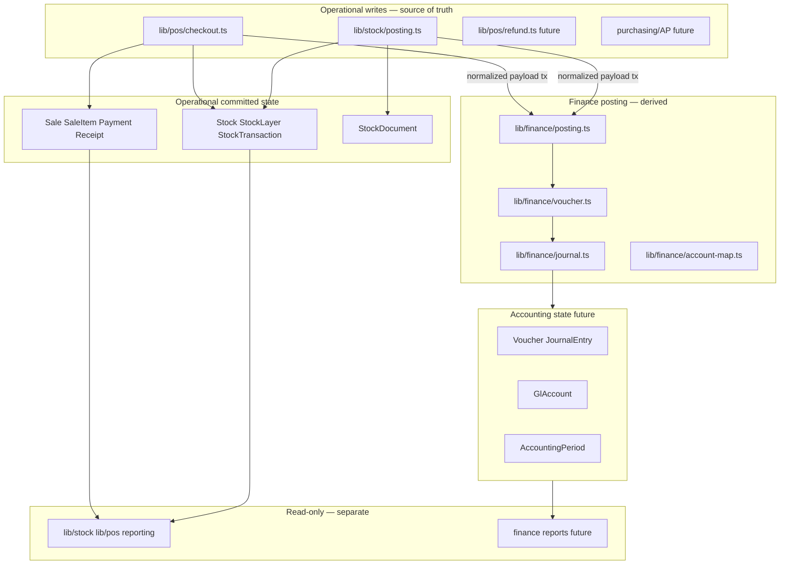
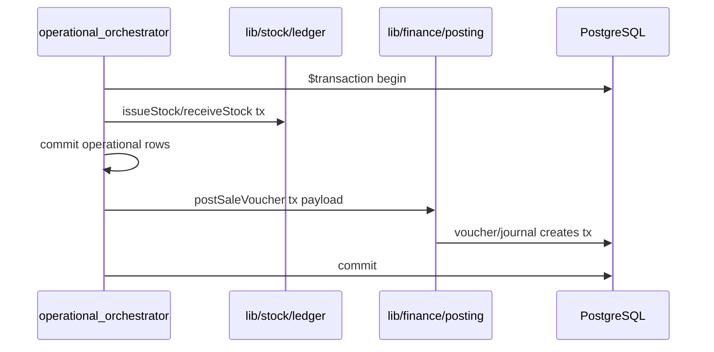
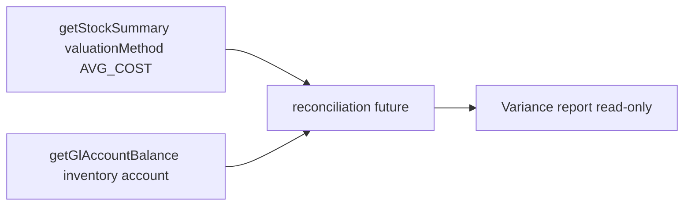

# Finance Posting Architecture (Phase 7)

Status: **Done** — implemented. This document remains the architecture reference for posting invariants and boundaries (not a feature checklist).  
Scope: General ledger foundation, voucher/journal posting, and operational → accounting integration boundaries  
Primary finance direction: [FINANCE_TRANSACTION_UNIVERSE.md](./FINANCE_TRANSACTION_UNIVERSE.md) (Appendix C — current project position)  
Related: [01_MODULAR_MONOLITH_BOUNDARIES.md](./01_MODULAR_MONOLITH_BOUNDARIES.md), [06_STOCK_LEDGER_FOUNDATION.md](./06_STOCK_LEDGER_FOUNDATION.md), [07_STOCK_DOCUMENT_POSTING.md](./07_STOCK_DOCUMENT_POSTING.md), [08_POS_CHECKOUT_ARCHITECTURE.md](./08_POS_CHECKOUT_ARCHITECTURE.md), [09_REFERENCE_DATA_AND_PRODUCT_TYPES.md](./09_REFERENCE_DATA_AND_PRODUCT_TYPES.md), [10_REPORTING_AND_SUMMARY_KERNEL.md](./10_REPORTING_AND_SUMMARY_KERNEL.md), [ARCHITECTURE_GUARDS.md](./ARCHITECTURE_GUARDS.md)

---

## 1. Purpose

Phase 7 introduces a **finance posting foundation** — a centralized accounting layer that records **derived** journal entries from committed operational events. Inventory and sales remain owned by stock and POS orchestrators; finance **observes** those events and posts double-entry vouchers without mutating operational truth.

### Goals

| Goal | Description |
|------|-------------|
| **Finance posting foundation** | One place for GL posting logic — not scattered in routes, POS pages, or reporting |
| **Voucher/journal architecture** | Immutable posted vouchers with balanced journal lines tied to chart of accounts |
| **Operational → accounting integration** | Normalized hooks from `postDocument()` and `checkout()` (and future refund/AP flows) into finance |
| **Separation of operational vs accounting truth** | Stock ledger and sales tables remain authoritative for inventory and revenue; GL is a parallel derived record |

### Non-goals (this document / Phase 7 foundation)

| Non-goal | Notes |
|----------|-------|
| Finance UI / GL screens | Adapters only after kernel is approved |
| Accounting reports / trial balance UI | Out of scope until posting kernel is stable |
| Tax / VAT engine | Architecture hooks only (§13) |
| Bank reconciliation UI | Future |
| Prisma schema migration | Document models only — separate approved migration |
| Inline GL in POS or stock routes | Forbidden — finance modules only |

### Architectural placement



---

## 2. Core invariants

These rules extend Phase 3–6 boundaries. Finance **must not** become a second inventory or sales system.

| # | Invariant |
|---|-----------|
| 1 | **Finance never owns inventory truth** — on-hand, movement, and valuation derive from `Stock` / `StockTransaction` / `StockLayer` |
| 2 | **Finance never owns sales truth** — revenue, tender, and receipt count derive from `Sale` / `SaleItem` / `Payment` / `Receipt` |
| 3 | **Finance observes committed operational events** — posts after (or within the same tx as) operational rows are written; never drives stock/POS workflow state |
| 4 | **Accounting posting is append-only** — posted journals are not edited in place |
| 5 | **Vouchers/journal entries are immutable after posting** — corrections via **compensating entries** only |
| 6 | **No direct stock mutation from finance** — no `issueStock`, `receiveStock`, `stock.update`, or ledger Prisma writers |
| 7 | **No direct POS mutation from finance** — no creating/updating `Sale`, `SaleItem`, `Payment`, or `Receipt` from finance modules |
| 8 | **Accounting is derived, not authoritative for inventory** — GL inventory balance may differ from sub-ledger until reconciliation (§11) |

### Truth ownership matrix

| Domain | Operational source of truth | Finance role |
|--------|----------------------------|--------------|
| On-hand qty | `Stock.qty` + ledger | May post inventory asset/expense entries from **payload** — never recompute qty from GL |
| Stock movement | `StockTransaction` | Reference via `refType` / `refId` — no movement from voucher alone |
| Sales revenue | `Sale` / `SaleItem` | Post revenue/tender GL lines from sale payload |
| Document cost | Ledger result / document lines | Post PURCHASE/ADJUSTMENT entries from posting hook payload |
| GL balance | `JournalEntry` / `JournalEntryLine` | Authoritative **for accounting only** |

---

## 3. Planned modules

Phase 7 implementation (after this document and schema are approved) adds the following under `lib/finance/`. HTTP and React stay in `app/` and `components/`.

| Module | Responsibility |
|--------|----------------|
| [`lib/finance/posting.ts`](../lib/finance/posting.ts) | **Public orchestrator** — `postVoucherFromOperationalEvent()`, joins caller `tx`; maps event type → voucher builder |
| [`lib/finance/voucher.ts`](../lib/finance/voucher.ts) | Voucher header + lines create (draft/posted); `voucherNo` assignment; status transitions |
| [`lib/finance/journal.ts`](../lib/finance/journal.ts) | Journal entry + lines; double-entry validation; immutability after post |
| [`lib/finance/account-map.ts`](../lib/finance/account-map.ts) | Chart mapping — operational event + dimensions → `GlAccount` codes (**centralized, deterministic** — see §3.1) |
| [`lib/finance/validation.ts`](../lib/finance/validation.ts) | Balanced debits/credits, period open, account active, amount precision |
| [`lib/finance/posting-errors.ts`](../lib/finance/posting-errors.ts) | `FinancePostingError`, codes — no HTTP types |
| [`lib/finance/posting-types.ts`](../lib/finance/posting-types.ts) | Normalized payloads from stock/POS hooks, voucher DTOs, ref constants |
| [`lib/finance/decimal.ts`](../lib/finance/decimal.ts) | Money math — `toMoney`, rounding policy, currency scale (extends stock decimal patterns) |

### Hook modules (thin adapters from operational domains)

Operational orchestrators call **named hook functions** — not raw voucher Prisma from `posting.ts` / `checkout.ts` bodies beyond one import:

| Hook (planned path) | Called from | Event |
|---------------------|-------------|-------|
| `postStockDocumentVoucher({ tx, doc, ledgerResult })` | `lib/stock/posting.ts` (optional, when finance enabled) | Document POST |
| `postSaleVoucher({ tx, sale, ledgerResult })` | `lib/pos/checkout.ts` (optional) | POS checkout |
| `postRefundVoucher({ tx, refund, ledgerResult })` | `lib/pos/refund.ts` (future) | Refund |
| `postExpenseVoucher({ tx, … })` | future expense orchestrator | Non-stock expense |

Hooks live under `lib/finance/hooks/` or as exports from `posting.ts` — **finance owns implementation**; operational modules only invoke with `{ tx }`.

### Public surface

```typescript
// Planned shape — illustrative only
export async function postOperationalVoucher(
  input: OperationalVoucherInput & { tx: Prisma.TransactionClient }
): Promise<PostedVoucherResult>
```

Barrel: `lib/finance/index.ts` exports posting entry points and types only.

### 3.1 Deterministic account mapping (`account-map.ts`)

All GL account resolution for operational events **must** flow through `lib/finance/account-map.ts`. Mapping is **centralized and deterministic** — same inputs always yield the same accounts.

| Rule | Detail |
|------|--------|
| Single owner | `account-map.ts` — not scattered `if (branchId === …)` in `posting.ts`, `checkout.ts`, routes, pages, or reporting |
| Mapping inputs | Derive accounts from **event type** (e.g. `POS_SALE`, `STOCK_DOC_POST`), **`ProductType`**, and **branch / category dimensions** only as defined in the map |
| No ad-hoc conditions | Avoid inline branch/product/account branching outside the map module |
| Forbidden locations | Routes, React pages, `lib/reporting/**`, operational orchestrators (beyond calling finance hooks) |

```typescript
// Illustrative — all resolution lives in account-map.ts
resolveAccounts({ eventType, productType, branchId, categoryKey? }): AccountMapping
```

Operational hooks pass **normalized payloads**; finance posting calls `account-map.ts` — hooks do not pick GL codes themselves.

---

## 4. Planned Prisma models (architecture only — no schema yet)

Models below are **design targets** for a dedicated migration PR. Field names may refine at implementation.

### 4.1 `GlAccount`

| Field (conceptual) | Purpose |
|--------------------|---------|
| `id`, `code`, `name` | Chart of accounts identity |
| `accountType` | ASSET, LIABILITY, EQUITY, REVENUE, EXPENSE (enum TBD) |
| `isActive`, `deleted` | Posting eligibility |
| `parentId` (optional) | Hierarchy for reporting |

### 4.2 `Voucher` / `VoucherLine`

| Concept | Purpose |
|---------|---------|
| `Voucher` header | Business document: `voucherNo`, `date`, `status` (DRAFT / POSTED / VOIDED-compensated), `branchId`, `periodId` |
| `VoucherLine` | Pre-journal staging lines or summary lines (implementation choice) |
| `refType`, `refId`, `refNo` | Link to operational source (document refNo, sale id, etc.) |

**v0 cardinality lock:** **1 Voucher → exactly 1 `JournalEntry`**. Multiple journal entries per voucher is **not allowed in v0**. Keep finance posting simple until reconciliation and GL reporting stabilize; split/multi-entry vouchers may be added in a later phase.

### 4.3 `JournalEntry` / `JournalEntryLine`

| Concept | Purpose |
|---------|---------|
| `JournalEntry` | Posted GL header — immutable after post; **1:1 with `Voucher` in v0** |
| `JournalEntryLine` | `glAccountId`, `debit`, `credit`, `memo`, dimensional tags (see §6.4) |
| **Constraint** | Sum(debits) = Sum(credits) per entry |

### 4.4 `AccountingPeriod`

| Concept | Purpose |
|---------|---------|
| `periodKey` | e.g. `2026-05` |
| `status` | OPEN / CLOSED |
| `branchId` or HO-global | Scope TBD at migration |
| Posting guard | Reject or warn on closed period (policy §10) |

### 4.5 Optional future models

| Model | Purpose |
|-------|---------|
| `MonthClose` | Month-end checklist, close audit, lock timestamps |
| `FinancePostingLog` | **Centralized idempotency / replay protection** — see §9.3 |

**FinancePostingLog (when enabled — not required for initial Phase 7 kernel):**

| Rule | Detail |
|------|--------|
| Central owner | Idempotency strategy lives in finance — **not** ad-hoc duplicate checks in `posting.ts`, `checkout.ts`, or routes |
| Key | `(refType, refId, eventVersion)` → posted voucher id |
| Replay protection | Retries return existing voucher — no second GL post |
| Operational modules | Call finance hook only; **must not** implement their own “already posted?” guards beyond delegating to finance |

**Not in initial kernel:** tax lines, multi-currency rate tables, bank statement import — §13.

---

## 5. Operational integration boundaries

Operational orchestrators **remain owners** of business workflow and outer transactions. Finance **joins** with normalized payloads.

### 5.1 Stock document posting → finance

```
postDocument()
  → prisma.$transaction
      → receiveStock / issueStock (ledger first)
      → StockDocument.status = POSTED
      → postStockDocumentVoucher({ tx, doc, ledgerResult })  // optional when enabled
```

| Rule | Detail |
|------|--------|
| Ledger before GL | Stock mutations complete before voucher lines use costs/qty from `ledgerResult` |
| Payload | `doc` (header + lines), `ledgerResult` (applied moves, unit costs) — finance does not re-read ledger to mutate |
| Failure policy | **Phase 7 default: same-transaction strict** — if GL posting fails, entire operational tx rolls back (see §9.2) |
| No workflow reopen | Finance must not change `DocStatus` or re-invoke `postDocument()` |

### 5.2 POS checkout → finance

```
checkout()
  → prisma.$transaction
      → Sale / SaleItem / Payment / Receipt
      → issueStock({ tx, … })
      → postSaleVoucher({ tx, sale, ledgerResult })  // optional when enabled
```

| Rule | Detail |
|------|--------|
| Sales rows first | Revenue/tender amounts from committed `Sale` / `Payment` |
| COGS/inventory lines | From `ledgerResult` issue costs — not from `SaleItem.qty` alone for inventory identity |
| No `receiptNo` as GL key | Use `sale.id` + `refType` (§7) |
| Checkout owns tx | Finance hook receives `{ tx }` — no nested `$transaction` |

### 5.3 Future refund flow

| Rule | Detail |
|------|--------|
| Orchestrator | `lib/pos/refund.ts` — not finance |
| Stock | `receiveStock()` for returned TRACKED qty |
| Finance | `postRefundVoucher({ tx, refund, ledgerResult })` — compensating revenue/COGS pattern |
| Never | Refund through `posting.ts` or finance calling `receiveStock()` |

### 5.4 Future purchasing / AP flow

| Rule | Detail |
|------|--------|
| Operational | Purchase receipt / AP invoice orchestrator (future) may call `postDocument()` or dedicated AP module |
| Finance | AP liability + GRNI/inventory capitalization entries from **posted** operational payload |
| Separation | AP aging and payment runs are finance workflows — they do not post stock directly |

### 5.5 Future expense flow

| Rule | Detail |
|------|--------|
| Operational | Expense request / approval (future) — no stock ledger unless capitalized inventory |
| Finance | `postExpenseVoucher` — expense + cash/AP lines |
| SERVICE / non-stock | Revenue/expense categories per [09_REFERENCE_DATA_AND_PRODUCT_TYPES.md](./09_REFERENCE_DATA_AND_PRODUCT_TYPES.md) |

### Integration summary

| Caller | Owns | Finance receives |
|--------|------|------------------|
| `posting.ts` | Document POST + ledger | Document + ledger result payload |
| `checkout.ts` | Sale + ledger | Sale snapshot + ledger result payload |
| `refund.ts` (future) | Refund + receiveStock | Refund snapshot + ledger result |
| Reporting kernel | Nothing (read-only) | **Must not** create vouchers |

---

## 6. Voucher/journal rules

### 6.1 Double-entry only

| Rule | Detail |
|------|--------|
| Balanced entry | Sum of debit amounts = sum of credit amounts per `JournalEntry` |
| Validation | `lib/finance/validation.ts` before persist; reject unbalanced drafts |
| Minimum lines | At least two lines (one debit, one credit) unless system-defined single-account adjustment policy (discouraged) |

### 6.2 Immutability and reversal

| Rule | Detail |
|------|--------|
| Posted = immutable | No `update` on posted `JournalEntry` / lines |
| Corrections | New **compensating voucher** reversing original + corrected entry |
| Void | Operational void does not delete GL — posts reversal voucher linked to same `refType` / `refId` |
| Audit trail | Original + reversal both retained |

### 6.3 Voucher identity

| Field | Role |
|-------|------|
| `voucherNo` | Business-facing sequential or period-scoped number — **not** operational `refNo` |
| `JournalEntry.id` | Internal GL identity |
| `refType` / `refId` | Operational linkage — e.g. `STOCK_DOC_POST`, `POS_SALE` |
| `refNo` | Human-readable operational reference (document `refNo`, etc.) for display/search |

### 6.4 v0 voucher–journal cardinality

| Rule | Detail |
|------|--------|
| **1 Voucher → 1 JournalEntry** | Locked for v0 — one balanced journal per operational event voucher |
| **Not in v0** | Multiple `JournalEntry` rows per `Voucher`, split postings, or multi-stage voucher completion |
| **Rationale** | Simpler posting, validation, and reversal until reconciliation/reporting mature |
| **Future** | Multi-entry vouchers may be introduced with explicit schema + doc revision |

### 6.5 Dimensional governance (v0)

Avoid **dimensional explosion** in Phase 7. GL line dimensions and operational reporting dimensions are **related but separate** — do not mirror every report slice as a GL tag.

| Dimension | v0 policy |
|-----------|-----------|
| **Branch** | Allowed — primary operational dimension |
| **Product group / category** | Optional — only if required by chart policy; keep map rules in `account-map.ts` |
| **Premature dimensions — avoid in v0** | Salesperson, region, campaign, arbitrary user tags, promo codes |

**Rules:**

- New GL dimensions require chart + `account-map.ts` update — not ad-hoc fields on voucher builders
- Phase 6 reporting dimensions (cashier, product, day) **do not automatically become GL dimensions**
- Prefer fewer, stable dimensions until trial balance and reconciliation are proven

---

## 7. Reference strategy

Finance links to operations through **explicit ref fields** — parallel to ledger `StockTransaction.refType` / `refId` / `refLineId` pattern.

### 7.1 Voucher operational refs

| Field | Example | Purpose |
|-------|---------|---------|
| `refType` | `STOCK_DOC_POST`, `POS_SALE`, `POS_REFUND` | Event classifier |
| `refId` | `stockDocument.id`, `sale.id` | Stable UUID linkage |
| `refNo` | Document `refNo`, optional sale display id | Human search — not primary key |

### 7.2 What finance must not use

| Anti-pattern | Why |
|--------------|-----|
| `receiptNo` as accounting or inventory identity | Display-only per [09 §6.3](./09_REFERENCE_DATA_AND_PRODUCT_TYPES.md) |
| `SaleItem.qty` as stock on-hand | Inventory truth is ledger ([10 §2](./10_REPORTING_AND_SUMMARY_KERNEL.md)) |
| `voucherNo` as stock linkage | Wrong layer — stock uses ledger refs |

### 7.3 Inventory linkage for COGS entries

COGS/inventory GL lines **derive amounts** from hook payload built from **ledger result** (`unitCost`, issued qty), with traceability:

```
StockTransaction.refType = POS_SALE
StockTransaction.refId     = sale.id
StockTransaction.refLineId = saleItem.id
         ↕ (same sale.id in voucher refId)
Voucher.refType = POS_SALE
Voucher.refId   = sale.id
```

Finance does not infer missing ledger rows from sale lines alone.

---

## 8. Decimal / money rules

Extends [ARCHITECTURE_GUARDS.md §6](./ARCHITECTURE_GUARDS.md).

| Rule | Detail |
|------|--------|
| **All finance math uses Decimal helpers** | `lib/finance/decimal.ts` — no raw `*` / `/` on money |
| **No JS float arithmetic** | Forbidden for amounts, tax bases, line totals |
| **Currency precision centralized** | e.g. 2 dp display, 6 dp internal — single module defines scale |
| **Rounding policy centralized** | Per-line vs per-voucher rounding documented in `decimal.ts`; half-up TBD at implementation |
| **Boundary conversion** | `.toNumber()` only at UI/export boundary — not mid-posting |
| **Stock vs finance** | Stock costs may use 6 dp (`avgCost`); GL posting may round to account policy — document delta in reconciliation (§11) |

```typescript
// Allowed pattern — illustrative
import { toMoney, roundMoney } from "@/lib/finance/decimal"
const debit = roundMoney(toMoney(lineAmount))
```

---

## 9. Posting orchestration

### 9.1 Transaction ownership

| Rule | Detail |
|------|--------|
| **Operational modules own outer `prisma.$transaction`** | `postDocument()`, `checkout()`, future refund |
| **Finance joins via `{ tx }`** | Same pattern as `issueStock({ tx })` — no nested `$transaction` in finance inner modules |
| **Only `posting.ts` / `checkout.ts` (etc.) open top-level tx** | `lib/finance/voucher.ts` accepts `tx` only when called from orchestrator |



### 9.2 Posting mode — Phase 7 scope lock

| Pattern | Phase 7 | Later (explicit approval) |
|---------|---------|---------------------------|
| **Same-transaction strict posting** | **Default and only mode in Phase 7** — operational + GL commit or roll back together | — |
| Feature flag off | Finance hook skipped when `FINANCE_POSTING_ENABLED=false` — operational path unchanged | — |
| **Async / deferred / queue posting** | **Not in Phase 7** | May be evaluated only after reconciliation, idempotency (`FinancePostingLog`), and retry semantics are fully defined |
| Event-driven posting | **Not in Phase 7** | Separate architecture revision required |

**Operational success** must not depend on reporting — and must not depend on GL when finance is disabled. When finance is enabled in Phase 7, GL failure **rolls back** the operational transaction (strict same-tx).

### 9.3 Idempotency (`FinancePostingLog`)

When `FinancePostingLog` is enabled (optional — may follow initial Phase 7 kernel):

- Key: `(refType, refId, eventVersion)`
- Retry safe: second call returns existing voucher id — no duplicate GL
- **Centralized only** — duplicate-post protection **must not** be implemented ad-hoc in `posting.ts`, `checkout.ts`, routes, or pages
- **`FinancePostingLog` owns replay protection** — operational modules delegate to finance posting entry points

---

## 10. Month/period strategy

### 10.1 Accounting periods

| Concept | Detail |
|---------|---------|
| `AccountingPeriod` | Monthly (or configurable) open/closed window |
| Scope | HO-global vs per-branch — **decide at schema migration**; document both options |
| Open period | Voucher posting allowed |
| Closed period | Posting rejected or routed to adjustment period (policy TBD) |

### 10.2 Operational vs finance timing

| Event | Typical timing |
|-------|----------------|
| Stock document POST | Operational + GL in same tx when enabled |
| POS sale | Operational + GL in same tx when enabled |
| Month close | Close period **after** operational cutover confirmed — no silent back-post without override role |

### 10.3 Future month-close policy

| Topic | Direction |
|-------|-----------|
| `MonthClose` model | Checklist: inventory reconciled, sales closed, GL trial balance |
| Override | `HO_FINANCE` role may post to closed period with audit reason |
| Stock month gate | Document `periodMonth` on `StockDocument` may align with accounting period — separate from GL close |

### 10.4 Out-of-period posting notes

- Operational backdated documents: posting date vs document date — finance uses **posting date** for period assignment unless policy maps document date
- Document early: record in notes; implementation validates in `validation.ts`

---

## 11. Reporting boundaries

Finance reporting is **separate** from Phase 6 operational reporting ([10_REPORTING_AND_SUMMARY_KERNEL.md](./10_REPORTING_AND_SUMMARY_KERNEL.md)).

| Rule | Detail |
|------|--------|
| **Separate kernels** | GL trial balance / ledger reports read `JournalEntry` — not `getStockSummary()` for GL numbers |
| **Inventory valuation ≠ GL balance automatically** | Sub-ledger (`Stock` avgCost/FIFO) and GL inventory account may differ — expected until reconciled |
| **Reconciliation layer (future)** | `lib/finance/reconciliation.ts` compares stock valuation DTO vs GL inventory account — not Phase 7 kernel |
| **No shared giant SQL** | Do not join `StockTransaction` + `SaleItem` + `JournalEntryLine` in one report query across domains |
| **Reporting kernel** | **Must not** create vouchers ([10 §9](./10_REPORTING_AND_SUMMARY_KERNEL.md)) |

### Reconciliation path (future)



---

## 12. Not allowed

| Anti-pattern | Why |
|--------------|-----|
| Finance mutating inventory | Violates ledger boundary ([ARCHITECTURE_GUARDS.md §1](./ARCHITECTURE_GUARDS.md)) |
| Finance mutating sales | POS domain ownership |
| Direct Prisma stock writers in `lib/finance/**` | `stock.update`, `stockTransaction.create`, etc. |
| `receiptNo` as accounting identity | Wrong ref layer (§7) |
| Inline GL logic in POS routes/pages | `app/api/pos/**` delegates to checkout only |
| Inline voucher creation in reporting kernel | Reporting is read-only |
| Finance calling `postDocument()` or `checkout()` | Wrong direction — ops calls finance |
| Finance calling `issueStock()` / `receiveStock()` | Stock mutation only via operational orchestrators |
| Nested `$transaction` in finance modules | Same rule as ledger ([01_MODULAR_MONOLITH_BOUNDARIES.md](./01_MODULAR_MONOLITH_BOUNDARIES.md)) |
| Editing posted journal lines | Immutability (§6) |

---

## 13. Future extensibility

| Extension | Approach |
|-----------|----------|
| **AP/AR** | Voucher types + sub-ledgers; operational events feed normalized payloads |
| **Tax/VAT** | Tax lines on voucher; tax engine computes bases — not inline in POS route |
| **Cash session close** | Read `Payment` aggregates; post tender clearing entries — no stock mutation |
| **Bank reconciliation** | Match bank lines to posted payments — read-only until confirm posts adjustment voucher |
| **Branch accounting** | Dimensional tags on `JournalEntryLine`; branch P&L from GL |
| **Multi-currency** | FX rate table + dual amounts — separate migration |
| **Audit trail** | Who posted, when, from which operational ref |
| **Recurring journals** | Scheduled voucher template — finance-owned job, not stock/POS |

---

## 14. Audit / guard rules

Extend [ARCHITECTURE_GUARDS.md](./ARCHITECTURE_GUARDS.md). Run from repository root.

### 14.1 Stock mutation inside finance

```bash
rg "issueStock\s*\(|receiveStock\s*\(|\.stock\.(update|create|upsert|delete)|stockLayer\.(create|update|delete)|stockTransaction\.create" lib/finance/ --glob "*.ts"
```

**Expected:** no hits.

### 14.2 Operational orchestrator misuse from finance

```bash
rg "postDocument\s*\(|from ['\"].*posting|checkout\s*\(|from ['\"].*checkout" lib/finance/ --glob "*.ts"
```

**Expected:** no hits — finance must not invoke operational workflows.

### 14.3 Prisma writes outside finance posting layer

```bash
rg "\.(create|update|upsert|delete|createMany|updateMany|deleteMany)\s*\(" lib/finance/ --glob "*.ts"
```

**Expected hits (after Phase 7):** only `lib/finance/voucher.ts`, `lib/finance/journal.ts`, and related posting modules — **not** hooks called from ops unless writes stay inside finance modules only.

Manual review: operational hook files under `lib/finance/hooks/` must delegate to `posting.ts` / `voucher.ts` — no direct scattered writes.

### 14.4 React / HTTP in finance kernel

```bash
rg "from ['\"]react['\"]|NextResponse|next/server" lib/finance/ --glob "*.ts"
```

**Expected:** no hits.

### 14.5 GL logic in wrong layers

```bash
rg "journalEntry\.(create|update)|voucher\.(create|update)" app/ components/ lib/pos/ lib/stock/ lib/reporting/ --glob "*.ts"
```

**Expected:** no hits outside `lib/finance/**` (except tests).

### 14.6 Reporting creating vouchers

```bash
rg "postOperationalVoucher|postSaleVoucher|postStockDocumentVoucher|from ['\"]@/lib/finance" lib/reporting/ lib/stock/summary.ts lib/stock/stock-summary.ts lib/pos/sales-summary.ts --glob "*.ts"
```

**Expected:** no hits.

---

## 15. Acceptance criteria

Phase 7 **implementation** (code + schema) is complete when:

- [ ] Finance boundaries centralized under `lib/finance/**` — no scattered GL in routes/POS/stock/reporting
- [ ] **Operational ownership preserved** — `posting.ts` / `checkout.ts` own outer tx; finance joins via `{ tx }`
- [ ] **Tx ownership preserved** — no nested `$transaction` in finance inner modules
- [ ] **Double-entry rules** enforced in `validation.ts` — debits = credits before post
- [ ] **Immutability** — posted entries corrected only via compensating vouchers
- [ ] **Decimal policy** — `lib/finance/decimal.ts` used; no float money math
- [ ] **Ref strategy** — vouchers link via `refType` / `refId` / `refNo`; not `receiptNo` as identity
- [ ] **No stock/POS mutation** from finance — grep audits in §14 pass
- [ ] **v0 voucher–journal** — 1 Voucher → 1 JournalEntry ([§6.4](#64-v0-voucherjournal-cardinality))
- [ ] **Account mapping** — deterministic, centralized in `account-map.ts` ([§3.1](#31-deterministic-account-mapping-account-mapts))
- [ ] **Same-tx strict posting only** — no async/deferred queue in Phase 7 ([§9.2](#92-posting-mode--phase-7-scope-lock))
- [ ] **Idempotency centralized** — no ad-hoc duplicate guards in operational modules ([§9.3](#93-idempotency-financepostinglog))
- [ ] **Dimensional governance** — branch allowed; avoid premature GL dimensions ([§6.5](#65-dimensional-governance-v0))
- [ ] **Hooks documented** — stock POST and POS checkout call finance optionally with normalized payloads
- [ ] **Future reconciliation path** documented — inventory GL vs stock sub-ledger not assumed equal (§11)
- [ ] **`npm run build`** and **`npm test`** pass after migration + modules
- [ ] [ARCHITECTURE_GUARDS.md](./ARCHITECTURE_GUARDS.md) updated with §14 patterns (or cross-link this doc)

**This document does not require schema or code to be "accepted"** — review and explicit approval precede implementation.

---

## Related docs

- [04_PRISMA_KERNEL.md](./04_PRISMA_KERNEL.md) — deferred finance models noted in Phase 1
- [07_STOCK_DOCUMENT_POSTING.md §9.2](./07_STOCK_DOCUMENT_POSTING.md) — document POST finance hook sketch
- [08_POS_CHECKOUT_ARCHITECTURE.md §11.1](./08_POS_CHECKOUT_ARCHITECTURE.md) — checkout finance hook sketch
- [10_REPORTING_AND_SUMMARY_KERNEL.md](./10_REPORTING_AND_SUMMARY_KERNEL.md) — reporting must not post vouchers
- Reference: `asa-con/docs/05_INVENTORY_ACCOUNTING_ARCHITECTURE_v1.md`, `asa-con/docs/27_VOUCHER_CHART_OF_ACCOUNTS.md` (patterns only — do not copy legacy coupling)

---

**Implementation of Phase 7 finance code and Prisma migration requires explicit approval after this document is reviewed.**
