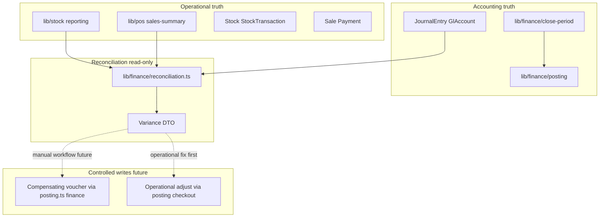
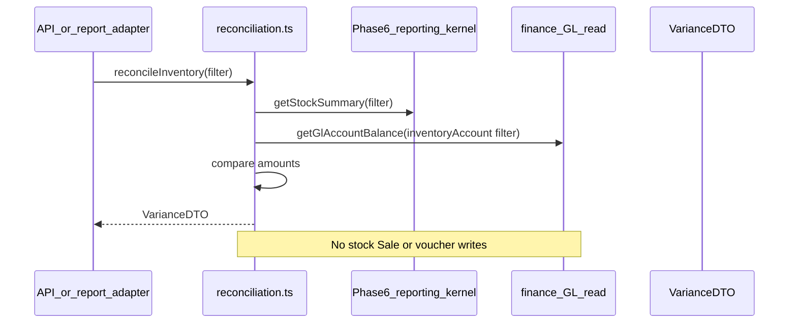

# Finance Reconciliation and Close Policy

Status: **Done** — policy implemented across Phases 7b, 15–22. This document remains the architecture reference for reconciliation and close rules.  
Scope: Reconciliation, period-close governance, and operational-vs-GL consistency policy  
Primary finance direction: [FINANCE_TRANSACTION_UNIVERSE.md](./FINANCE_TRANSACTION_UNIVERSE.md) (Appendix C — current project position)  
Related: [11_FINANCE_POSTING_ARCHITECTURE.md](./11_FINANCE_POSTING_ARCHITECTURE.md), [10_REPORTING_AND_SUMMARY_KERNEL.md](./10_REPORTING_AND_SUMMARY_KERNEL.md), [05_AUTH_PERMISSIONS.md](./05_AUTH_PERMISSIONS.md), [08_POS_CHECKOUT_ARCHITECTURE.md](./08_POS_CHECKOUT_ARCHITECTURE.md), [ARCHITECTURE_GUARDS.md](./ARCHITECTURE_GUARDS.md)

---

## 1. Purpose

After Phase 7 finance posting records **derived** GL entries, the system needs an explicit policy for **comparing** operational truth (stock, sales) with accounting representation (GL) over time — without collapsing one into the other.

### Goals

| Goal | Description |
|------|-------------|
| **Reconciliation foundation** | Centralized read-only comparison of operational summaries vs GL balances |
| **Close-period governance** | OPEN / SOFT_CLOSED / HARD_CLOSED rules for who may post and when |
| **Operational vs accounting consistency** | Document expected gaps and how they are investigated — not assumed zero |
| **Variance handling strategy** | Explain, report, and optionally adjust via controlled workflows — never silent auto-fix |
| **Future audit readiness** | Traceable variance reports, close audit trail, export hooks for external ERP |

### Non-goals (this document)

| Non-goal | Notes |
|----------|-------|
| Reconciliation UI / dashboards | Adapters consume variance DTOs later |
| Automated GL correction | No silent write-back to stock or sales |
| Schema migration | Models referenced architecturally — separate approved migration |
| Phase 7 posting kernel | Reconciliation modules follow or parallel posting kernel — not mixed into `posting.ts` |
| Tax / bank reconciliation detail | Hooks only (§11) |

### Architectural placement



---

## 2. Core invariants

These extend [11_FINANCE_POSTING_ARCHITECTURE.md §2](./11_FINANCE_POSTING_ARCHITECTURE.md) and [10_REPORTING_AND_SUMMARY_KERNEL.md §2](./10_REPORTING_AND_SUMMARY_KERNEL.md).

| # | Invariant |
|---|-----------|
| 1 | **Operational truth remains authoritative for stock and sales** — `Stock` / ledger for inventory; `Sale` / `Payment` for revenue and tender |
| 2 | **GL is accounting representation, not an inventory engine** — GL inventory balance is not used to change `Stock.qty` |
| 3 | **Reconciliation compares domains; it does not redefine truth** — variance explains difference; it does not pick a winner and overwrite the other |
| 4 | **Reconciliation is read-only** — `findMany`, aggregates, DTO assembly only |
| 5 | **No reconciliation process mutates stock directly** — no `issueStock`, `receiveStock`, or stock Prisma writers |
| 6 | **No reconciliation process mutates sales directly** — no `Sale` / `SaleItem` / `Payment` creates or updates |
| 7 | **Close-period status is the only write exception** — `close-period.ts` may update `AccountingPeriod.status` under policy (§7) — not stock or sales |

### Comparison vs correction

| Activity | Allowed in reconciliation module | Correct layer |
|----------|----------------------------------|---------------|
| Compare stock valuation DTO vs GL inventory account | Yes (read) | — |
| Compare sales summary vs revenue GL | Yes (read) | — |
| Post compensating voucher | **No** | `lib/finance/posting.ts` via approved adjustment workflow |
| Fix stock qty | **No** | Operational document POST / adjustment orchestrator |
| Fix sale row | **No** | POS/refund orchestrator (future) |

---

## 3. Planned modules

Implementation (after this document and Phase 7 posting kernel are approved) adds read-only reconciliation and close-policy modules under `lib/finance/`.

| Module | Responsibility |
|--------|----------------|
| [`lib/finance/reconciliation.ts`](../lib/finance/reconciliation.ts) | Orchestrate domain comparisons; return variance DTOs |
| [`lib/finance/reconciliation-types.ts`](../lib/finance/reconciliation-types.ts) | Filters, variance row shapes, domain comparison results |
| [`lib/finance/reconciliation-errors.ts`](../lib/finance/reconciliation-errors.ts) | Invalid scope, missing period, permission context — no HTTP types |
| [`lib/finance/close-period.ts`](../lib/finance/close-period.ts) | Period status transitions OPEN → SOFT_CLOSED → HARD_CLOSED; audit metadata |
| [`lib/finance/close-policy.ts`](../lib/finance/close-policy.ts) | Pure policy: who may post, override rules, late-posting behavior by status |

**Dependencies (read-only calls):**

- Operational: `getStockSummary`, `getFifoValuation` (optional), `getSalesSummary` from Phase 6 kernels
- Finance: GL balance queries (future `lib/finance/gl-balance.ts` or inline read in reconciliation) — **not** operational tables for GL numbers

Reconciliation **must not** import `lib/stock/posting.ts`, `lib/pos/checkout.ts`, or reporting adapters that perform writes.

---

## 4. Reconciliation domains

Each domain compares **operational summary** (left) vs **GL balance or posted voucher totals** (right) for a scoped period and branch. Implementations use **separate queries** per side — no giant cross-domain SQL (§10).

### 4.1 Inventory: stock valuation vs inventory GL account

| Side | Source |
|------|--------|
| Operational | `getStockSummary()` — `valuationMethod: AVG_COST`, totals + optional branch/product rows ([10 §5.3](./10_REPORTING_AND_SUMMARY_KERNEL.md)) |
| Accounting | Sum of posted `JournalEntryLine` debits/credits net on mapped **inventory asset account(s)** for branch/period |

**Notes:** FIFO detailed valuation (`getFifoValuation`) is a separate reconciliation view — do not mix AVG_COST operational total with FIFO without labeling. CONSUMABLE / SERVICE excluded from default stock summary per product-type policy.

### 4.2 Sales: POS totals vs revenue GL

| Side | Source |
|------|--------|
| Operational | `getSalesSummary()` — `Sale` / `SaleItem` revenue for period ([10 §6](./10_REPORTING_AND_SUMMARY_KERNEL.md)) |
| Accounting | Posted revenue account balance or sum of `POS_SALE` voucher lines for period |

**Notes:** ProductType breakdown is operational reporting only unless GL posts split revenue accounts per type.

### 4.3 Payments: tender totals vs cash/tender GL

| Side | Source |
|------|--------|
| Operational | `getSalesSummary().paymentBreakdown` — `Payment` by method |
| Accounting | Cash/bank/card clearing accounts per `account-map.ts` mapping |

**Notes:** Change/over-short is operational display; GL clearing may net differently — document in variance memo.

### 4.4 Refunds vs reversal vouchers

| Side | Source |
|------|--------|
| Operational | Future refund records + `receiveStock` ledger rows (when refund module exists) |
| Accounting | Compensating / reversal vouchers linked via `refType: POS_REFUND`, same `refId` family |

**Notes:** Until refund module exists, domain is documented only — reconciliation returns empty or not-applicable slice.

### 4.5 Branch totals vs HO roll-up

| Side | Source |
|------|--------|
| Operational | Per-branch stock + sales summaries merged in adapter (composite pattern [10 §4.1](./10_REPORTING_AND_SUMMARY_KERNEL.md)) |
| Accounting | HO GL trial balance with branch dimension tags (when present) or sum of branch-scoped account balances |

**Notes:** HO summary is **DTO merge** of per-branch reconciliation results — not one SQL joining all domains.

### Domain summary table

| Domain | Operational kernel | GL source | Typical variance causes |
|--------|-------------------|-----------|-------------------------|
| Inventory | `getStockSummary` | Inventory asset account | Rounding, timing, unposted docs, COGS vs asset policy |
| Revenue | `getSalesSummary` | Revenue accounts | Unposted sales, period boundary, void/refund timing |
| Tender | `paymentBreakdown` | Cash/clearing accounts | Session close timing, change handling |
| Refunds | Refund orchestrator (future) | Reversal vouchers | Missing reversal, partial refund |
| Branch roll-up | Composite summaries | Branch-dimensional GL | Branch tag missing on GL line |

---

## 5. Variance philosophy

Variance between operational and GL figures is **expected and explainable** — not necessarily a bug.

| Category | Normal? | Example |
|----------|---------|---------|
| **Rounding** | Yes | Stock `avgCost` 6 dp vs GL money 2 dp policy ([11 §8](./11_FINANCE_POSTING_ARCHITECTURE.md)) |
| **Timing** | Yes | Sale committed before midnight; GL period cutover at branch timezone boundary |
| **Backdated documents** | Yes | Document `date` in prior month; GL posts to current period per policy |
| **Unposted operational events** | Yes (transient) | Finance disabled or hook failure before strict same-tx enabled |
| **Mapping drift** | Investigate | Wrong account in `account-map.ts` — fix map + compensating entry, not stock row |
| **Missing voucher** | Investigate | Operational POST succeeded with finance off — post adjustment voucher |

### Rules

| Rule | Detail |
|------|--------|
| Report, don't hide | Reconciliation DTO includes `operationalAmount`, `glAmount`, `variance`, `varianceReason` (optional code) |
| No silent auto-correction | Reconciliation **never** writes stock, sales, or vouchers |
| Materiality (future) | Threshold flags for HO review — not Phase 7/8 kernel requirement |
| Negative variance | Allowed — same as negative stock/qty policy; no clamping to zero in variance math |

---

## 6. Reconciliation flow

### 6.1 Standard read-only pipeline



| Step | Action |
|------|--------|
| 1 | **Gather operational summaries** — call Phase 6 kernels with shared date/branch filter |
| 2 | **Gather GL balances** — read posted journal lines / account balances for same scope |
| 3 | **Compare** — compute variance per domain (and per branch when scoped) |
| 4 | **Generate variance DTO** — pure data for screen/export/audit |
| 5 | **Optional manual adjustment workflow (future)** — human approves compensating voucher or operational correction — **outside** reconciliation module |

### 6.2 Public API (planned)

```typescript
// Illustrative — read-only
export async function reconcileInventory(
  prisma: ReconciliationPrisma,
  filter: InventoryReconciliationFilter
): Promise<InventoryReconciliationResult>

export async function reconcileSalesAndTender(
  prisma: ReconciliationPrisma,
  filter: SalesReconciliationFilter
): Promise<SalesReconciliationResult>
```

Adapters in `app/api/**` parse query params → filter → call reconciliation — no rollups in routes.

---

## 7. Period close policy

Extends [11_FINANCE_POSTING_ARCHITECTURE.md §10](./11_FINANCE_POSTING_ARCHITECTURE.md). Close state is stored on `AccountingPeriod` (future schema); transitions owned by `close-period.ts`.

### 7.1 Period statuses

| Status | Meaning |
|--------|---------|
| **OPEN** | Normal posting allowed for the period |
| **SOFT_CLOSED** | Month-end in progress — restricted posting; overrides require finance role + reason |
| **HARD_CLOSED** | Period locked — no routine posting; only controlled adjustment path |

### 7.2 Who may post

| Status | Routine operational + GL (same-tx) | HO_FINANCE override | HO_ADMIN override |
|--------|--------------------------------------|---------------------|-------------------|
| OPEN | Allowed per existing orchestrators | N/A | N/A |
| SOFT_CLOSED | Blocked by default — `close-policy.ts` enforces in finance validation | Allowed with audit reason | Allowed with audit reason |
| HARD_CLOSED | Blocked | Adjustment-period voucher only (§7.4) | Same as finance |

Roles per [05_AUTH_PERMISSIONS.md](./05_AUTH_PERMISSIONS.md) — exact matrix refined at implementation.

### 7.3 Late posting behavior

| Scenario | Policy |
|----------|--------|
| Operational event dated in closed period | Reject or route to **adjustment period** — never silently re-open HARD_CLOSED |
| Backdated stock document POST | Operational date vs GL posting date documented; reconciliation flags timing variance |
| POS sale after SOFT_CLOSED | Block checkout GL hook unless override — operational policy aligned with finance validation |

### 7.4 Adjustment period concept

When HARD_CLOSED prevents posting into period `2026-05`:

- Corrections for `2026-05` errors post into **`2026-06-ADJ`** (or dedicated adjustment period key) with memo linking original `refId`
- Original posted journals **unchanged** — compensating pattern only ([11 §6.2](./11_FINANCE_POSTING_ARCHITECTURE.md))

### 7.5 Audit requirements on close

| Transition | Audit fields (minimum) |
|------------|------------------------|
| OPEN → SOFT_CLOSED | `closedByStaffId`, `closedAt`, optional checklist snapshot |
| SOFT_CLOSED → HARD_CLOSED | `hardClosedByStaffId`, `hardClosedAt`, reconciliation run id (when available) |
| Override post into SOFT_CLOSED | `overrideByStaffId`, `reason`, `refType`, `refId` |

`MonthClose` model (optional, [11 §4.5](./11_FINANCE_POSTING_ARCHITECTURE.md)) may store checklist rows — not required for initial close-policy module.

### 7.6 Close vs operational month gates

| Gate | Owner | Notes |
|------|-------|-------|
| GL period close | `close-period.ts` | Accounting |
| Stock document `periodMonth` | Stock document workflow | May align but **separate** from GL HARD_CLOSED |
| POS day-end | Read-only sales summary | No stock mutation |

---

## 8. Adjustment philosophy

When variance requires correction, **domain ownership** determines the fix path.

| Problem type | First action | GL action |
|--------------|--------------|-----------|
| Wrong on-hand qty | Operational stock adjustment / document POST | Optional follow-up voucher from posting hook |
| Missing sale | Operational POS/checkout correction (future void/refund) | Reversal/compensating voucher |
| GL mapping wrong | Update `account-map.ts` for **future** posts | Compensating voucher for past mis-post |
| Rounding only | Document as immaterial variance | Optional immaterial JE — policy TBD |

### Rules

| Rule | Detail |
|------|--------|
| **Never rewrite posted journals** | Immutability ([11 §6.2](./11_FINANCE_POSTING_ARCHITECTURE.md)) |
| **Adjustments via compensating vouchers only** | New voucher + journal; links to original `refType` / `refId` |
| **Stock adjustments remain operational events first** | `postDocument`, adjustment doc, or refund orchestrator — not reconciliation |
| **Finance adjustments remain GL events** | `lib/finance/posting.ts` — not inline in reconciliation report |
| **Reconciliation does not trigger adjustments automatically** | Future workflow: user approves → separate posting call |

---

## 9. Read/write boundaries

| Module | Read | Write |
|--------|------|-------|
| `reconciliation.ts` | Operational summaries, GL balances, vouchers (read) | **None** |
| `reconciliation-types.ts` | — | — |
| `close-policy.ts` | Period status (pure functions) | **None** |
| `close-period.ts` | `AccountingPeriod` | **`AccountingPeriod.status` + audit fields only** |
| `posting.ts` (Phase 7) | — | Voucher/journal creates (posting kernel) |

### Forbidden in reconciliation / close-policy modules

- `issueStock()` / `receiveStock()` / `postDocument()` / `checkout()`
- `stock.update`, `sale.create`, `sale.update`, `payment.create`
- Voucher/journal `.create` inside `reconciliation.ts`
- Nested `prisma.$transaction` for business workflows — close transition may use single update in one tx

---

## 10. Reporting boundaries

| Report type | Data source | Must not |
|-------------|-------------|----------|
| Operational dashboards | Phase 6 kernels — ledger/sales truth | Use GL as inventory on-hand |
| Finance trial balance | `JournalEntry` / `GlAccount` | Infer stock qty from GL |
| Reconciliation variance | Both sides via `reconciliation.ts` | Single SQL joining `Stock` + `SaleItem` + `JournalEntryLine` |
| Phase 6 daily branch summary | Composite DTO merge ([10 §4.1](./10_REPORTING_AND_SUMMARY_KERNEL.md)) | Include GL balances without separate query |

**No giant cross-domain SQL** — same rule as Phase 6 composite reporting: gather side A, gather side B, compare in reconciliation module.

Reporting kernel ([10_REPORTING_AND_SUMMARY_KERNEL.md](./10_REPORTING_AND_SUMMARY_KERNEL.md)) **must not** create vouchers ([11 §14.6](./11_FINANCE_POSTING_ARCHITECTURE.md)).

---

## 11. Future extensibility

| Extension | Approach |
|-----------|----------|
| **Automated reconciliation suggestions** | Rules engine on variance DTO — human approves before any write |
| **Variance thresholds** | Flag when `abs(variance) > threshold` — config in close-policy |
| **Scheduled month close** | Job calls `close-period.ts` after checklist — audit logged |
| **Branch-level close** | Per-branch `AccountingPeriod` scope — HO roll-up reconciliation |
| **Audit exports** | Serialize variance DTO + close audit to CSV/PDF adapters |
| **External accounting integration** | Export posted journals — import bank lines — reconciliation read-only match |
| **ERP export/import** | Idempotent journal export; no operational overwrite on import |
| **Multi-currency reconciliation** | Separate FX variance domain — post Phase 7 multi-currency migration |

Deferred posting / queue ([11 §9.2](./11_FINANCE_POSTING_ARCHITECTURE.md)) remains out of scope until reconciliation and idempotency semantics are proven in production-like runs.

---

## 12. Audit / guard rules

Extend [ARCHITECTURE_GUARDS.md](./ARCHITECTURE_GUARDS.md) and [11_FINANCE_POSTING_ARCHITECTURE.md §14](./11_FINANCE_POSTING_ARCHITECTURE.md). Run from repository root.

### 12.1 Stock mutation inside reconciliation

```bash
rg "issueStock\s*\(|receiveStock\s*\(|\.stock\.(update|create|upsert|delete)|stockLayer\.|stockTransaction\.create" lib/finance/reconciliation.ts lib/finance/close-period.ts lib/finance/close-policy.ts --glob "*.ts"
```

**Expected:** no hits.

### 12.2 Sale / payment mutation inside reconciliation

```bash
rg "\.sale\.(create|update|upsert|delete)|\.saleItem\.|\.payment\.(create|update)" lib/finance/reconciliation.ts lib/finance/close-policy.ts --glob "*.ts"
```

**Expected:** no hits.

### 12.3 Voucher creation inside reporting or reconciliation

```bash
rg "postOperationalVoucher|postSaleVoucher|voucher\.create|journalEntry\.create" lib/reporting/ lib/finance/reconciliation.ts --glob "*.ts"
```

**Expected:** no hits in `reconciliation.ts` and reporting kernel.

### 12.4 React / HTTP in finance reconciliation kernel

```bash
rg "from ['\"]react['\"]|NextResponse|next/server" lib/finance/reconciliation.ts lib/finance/close-period.ts lib/finance/close-policy.ts lib/finance/reconciliation-types.ts --glob "*.ts"
```

**Expected:** no hits.

### 12.5 Nested `$transaction` in reconciliation

```bash
rg "\.\$transaction\s*\(" lib/finance/reconciliation.ts lib/finance/close-policy.ts --glob "*.ts"
```

**Expected:** no hits in `reconciliation.ts`. `close-period.ts` may use `$transaction` for period status update only — manual review.

### 12.6 Cross-domain SQL in reconciliation (heuristic)

```bash
rg "stockTransaction.*saleItem|saleItem.*journalEntry|stock\.findMany.*journalEntry" lib/finance/reconciliation.ts --glob "*.ts"
```

**Expected:** no hits — compare in application layer after separate reads.

---

## 13. Acceptance criteria

Reconciliation and close-policy **implementation** is complete when:

- [ ] Modules exist at paths in §3 — centralized, not scattered in routes or reporting
- [ ] **Reconciliation remains read-only** — grep audits in §12 pass for stock/sales/voucher writes
- [ ] **Operational ownership preserved** — fixes to stock/sales go through operational orchestrators (§8)
- [ ] **GL ownership preserved** — corrections via compensating vouchers in `posting.ts` only
- [ ] **Variance handling documented and implemented** — DTO includes operational vs GL amounts; no auto-correction
- [ ] **Close-period governance documented and implemented** — OPEN / SOFT_CLOSED / HARD_CLOSED transitions in `close-period.ts` + `close-policy.ts`
- [ ] **No auto-correction behavior** — reconciliation exports variance only
- [ ] **Future adjustment workflow documented** — manual approve → separate posting/orchestrator call (§6.1 step 5)
- [ ] **Separate queries** — no giant cross-domain SQL (§10)
- [ ] Phase 6 kernels used for operational side — not reimplemented rollups
- [ ] **`npm run build`** and **`npm test`** pass after modules + tests added
- [ ] Cross-links from [11_FINANCE_POSTING_ARCHITECTURE.md](./11_FINANCE_POSTING_ARCHITECTURE.md) §11 reconciliation path

**This document does not require schema or code to be "accepted"** — review and explicit approval precede implementation.

---

## Related docs

- [11_FINANCE_POSTING_ARCHITECTURE.md](./11_FINANCE_POSTING_ARCHITECTURE.md) — posting kernel, period model, immutability
- [10_REPORTING_AND_SUMMARY_KERNEL.md](./10_REPORTING_AND_SUMMARY_KERNEL.md) — operational summary sources for reconciliation left-hand side
- [05_AUTH_PERMISSIONS.md](./05_AUTH_PERMISSIONS.md) — `HO_FINANCE` override roles
- [07_STOCK_DOCUMENT_POSTING.md](./07_STOCK_DOCUMENT_POSTING.md) — operational document POST
- [08_POS_CHECKOUT_ARCHITECTURE.md](./08_POS_CHECKOUT_ARCHITECTURE.md) — sales operational truth
- Reference: `asa-con/docs/15_INTERCOMPANY_RECONCILIATION_FLOW.md`, `asa-con/docs/16_MONTH_CLOSE_FLOW_v2.md` (patterns only)

---

**Implementation of reconciliation/close modules and schema requires explicit approval after this document is reviewed.**
