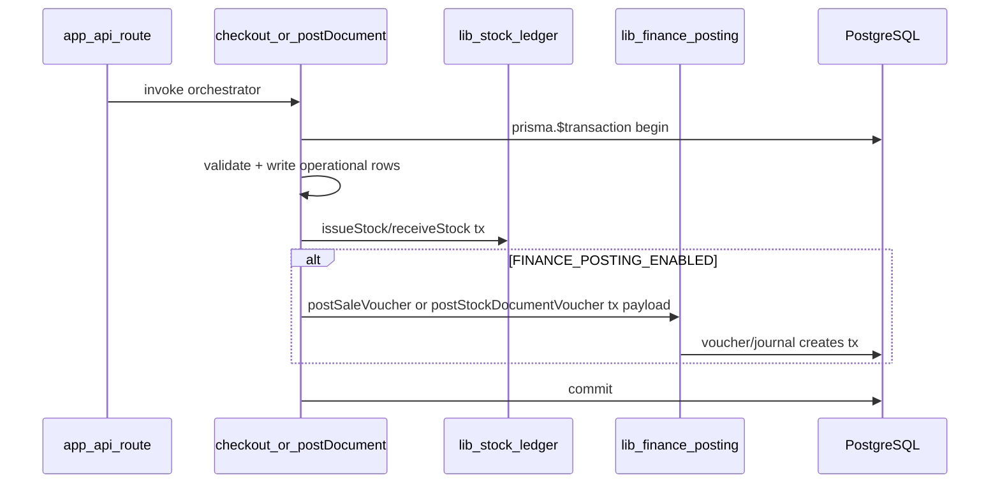
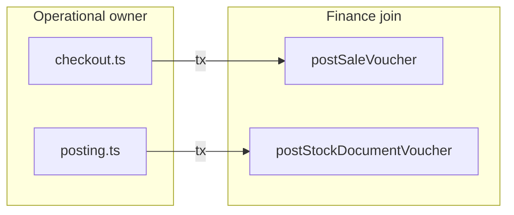

# Finance Operational Wiring

Status: Planned — architecture only (no wiring in operational modules in this document)  
Scope: Integration between POS checkout, stock document posting, and the finance posting kernel  
Related: [07_STOCK_DOCUMENT_POSTING.md](./07_STOCK_DOCUMENT_POSTING.md), [08_POS_CHECKOUT_ARCHITECTURE.md](./08_POS_CHECKOUT_ARCHITECTURE.md), [11_FINANCE_POSTING_ARCHITECTURE.md](./11_FINANCE_POSTING_ARCHITECTURE.md), [12_FINANCE_RECONCILIATION_AND_CLOSE_POLICY.md](./12_FINANCE_RECONCILIATION_AND_CLOSE_POLICY.md), [ARCHITECTURE_GUARDS.md](./ARCHITECTURE_GUARDS.md)

---

## 1. Purpose

Phase 7 delivered the **finance posting kernel** (`lib/finance/**`). This document defines **how operational orchestrators wire into finance** without violating domain ownership, transaction boundaries, or modular monolith rules.

### Goals

| Goal | Description |
|------|-------------|
| **Operational → finance integration** | Single, documented hook points in `checkout.ts` and `posting.ts` |
| **Same-transaction strict posting** | When finance is enabled, GL vouchers commit or roll back with the operational event |
| **Optional finance hook strategy** | Finance is an explicit, skippable step — not implicit side effects |
| **Feature-flag controlled rollout** | `FINANCE_POSTING_ENABLED` gates hooks without branching business logic in routes |
| **Preserve operational ownership** | Stock, sales, and document workflow remain in operational modules |

### Non-goals (this document / wiring phase)

| Non-goal | Notes |
|----------|-------|
| Reconciliation / close implementation | See [12_FINANCE_RECONCILIATION_AND_CLOSE_POLICY.md](./12_FINANCE_RECONCILIATION_AND_CLOSE_POLICY.md) |
| Finance UI, trial balance, dashboards | Adapters later |
| Async / deferred / queue posting | Forbidden in Phase 7 wiring ([11 §9.2](./11_FINANCE_POSTING_ARCHITECTURE.md)) |
| Inline GL in API routes or React pages | Hooks live in orchestrators only |

### Wiring overview



---

## 2. Core invariants

These extend [01_MODULAR_MONOLITH_BOUNDARIES.md](./01_MODULAR_MONOLITH_BOUNDARIES.md) and [11_FINANCE_POSTING_ARCHITECTURE.md §2](./11_FINANCE_POSTING_ARCHITECTURE.md).

| # | Invariant |
|---|-----------|
| 1 | **`checkout.ts` and `posting.ts` remain operational owners** — they open the outer transaction and order all steps |
| 2 | **Finance remains derived domain only** — records GL from committed operational snapshots; never authoritative for stock or sales |
| 3 | **Finance joins existing `tx` only** — `{ tx: Prisma.TransactionClient }` passed into `postSaleVoucher` / `postStockDocumentVoucher` |
| 4 | **No nested `prisma.$transaction`** in finance inner modules or hook helpers |
| 5 | **Finance hook optional via feature flag** — when disabled, orchestrators behave as today (no voucher calls) |
| 6 | **Finance must not mutate stock or sales** — no `issueStock`, `receiveStock`, `sale.update`, `stockDocument.update`, etc. from `lib/finance/**` |
| 7 | **Ledger totals owned by operational flow** — COGS/inventory values passed in; finance never recomputes from `SaleItem` alone ([§6.4](#64-ledger-result-ownership)) |
| 8 | **Feature flag via config helper only** — orchestrators call `isFinancePostingEnabled()`; never read `process.env` directly ([§4.1](#41-flag-definition)) |

---

## 3. Wiring points

Exactly **two** hook sites in v0 wiring. No other operational modules call finance posting in the initial wiring phase.

### 3.1 POS checkout → `postSaleVoucher()`

**Owner:** [`lib/pos/checkout.ts`](../lib/pos/checkout.ts)

```
checkout(input)
  → prisma.$transaction
      → validate / prepare (outside or inside tx per current design)
      → Sale / SaleItem / Payment / Receipt creates
      → issueStock({ tx, refType: POS_SALE, refId: sale.id, … })
      → [if FINANCE_POSTING_ENABLED] postSaleVoucher({ tx, sale, ledgerResult })
      → return CheckoutResult
```

| Rule | Detail |
|------|--------|
| **Hook timing** | After operational validation succeeds and **after** sale rows + ledger issue complete |
| **Before commit** | Finance runs **inside** the same outer `$transaction`, before it returns |
| **Payload** | Normalized sale DTO + optional `ledgerResult.cogsAmount` — not raw cart/React state |
| **Ref identity** | `refId = sale.id`, `refType = POS_SALE` — **never** `receiptNo` ([11 §7](./11_FINANCE_POSTING_ARCHITECTURE.md)) |
| **Import** | `import { postSaleVoucher } from "@/lib/finance/posting"` (or `@/lib/finance`) — **one call site**; see [§8.1](#81-finance-import-allowlist) |

### 3.2 Stock document POST → `postStockDocumentVoucher()`

**Owner:** [`lib/stock/posting.ts`](../lib/stock/posting.ts)

```
postDocument(input)
  → prisma.$transaction
      → assertCanPost(doc)
      → receiveStock / issueStock (ledger)
      → StockDocument.status = POSTED (+ timestamps)
      → [if FINANCE_POSTING_ENABLED] postStockDocumentVoucher({ tx, doc, ledgerResult })
      → return PostDocumentResult
```

| Rule | Detail |
|------|--------|
| **Hook timing** | After ledger mutations and **after** document status set to `POSTED` |
| **Before commit** | Finance runs inside the same outer `$transaction` |
| **Payload** | Document header snapshot + `ledgerResult` value totals — finance does not re-mutate ledger |
| **Ref identity** | `refId = doc.id`, `refNo = doc.refNo`, `refType = STOCK_DOC_POST` |
| **Import** | `import { postStockDocumentVoucher } from "@/lib/finance/posting"` — **one call site**; see [§8.1](#81-finance-import-allowlist) |

### Hook ordering summary

| Step | Checkout | Document POST |
|------|----------|---------------|
| 1 | Validation / prepare | Load doc + `assertCanPost` |
| 2 | Create Sale / items / payment / receipt | Ledger receive/issue |
| 3 | `issueStock` (TRACKED) | Set `status = POSTED` |
| 4 | **Finance hook (optional)** | **Finance hook (optional)** |
| 5 | Commit (implicit on tx success) | Commit |

Hooks occur **only after** operational steps succeed. Hooks execute **before** the outer transaction commits (still inside `run(tx)`).

---

## 4. Feature flag strategy

### 4.1 Flag definition

| Name | Default | Scope |
|------|---------|-------|
| `FINANCE_POSTING_ENABLED` | **`false`** during rollout | Server-side env — read **only** inside config helper |

**Centralization (required):**

| Rule | Detail |
|------|--------|
| Config module | `lib/finance/config.ts` (preferred) or `lib/shared/config.ts` |
| Orchestrator API | `isFinancePostingEnabled()` — **only** entry point for flag checks |
| **Never** in orchestrators | `process.env.FINANCE_POSTING_ENABLED` directly in `checkout.ts` or `posting.ts` |
| Tests | Mock `isFinancePostingEnabled()` or env at config boundary — not scattered in orchestrator tests |

```typescript
// lib/finance/config.ts — illustrative
export function isFinancePostingEnabled(): boolean {
  return process.env.FINANCE_POSTING_ENABLED === "true"
}
```

Routes and React **must not** read the env var — they invoke orchestrators; flag is evaluated inside operational/finance boundary.

### 4.2 When `false` (default)

| Behavior | Detail |
|----------|--------|
| Skip finance entirely | No import side effects; guard wraps single hook call |
| No voucher creation | `postSaleVoucher` / `postStockDocumentVoucher` **not invoked** |
| No operational rollback from finance absence | Checkout and document POST succeed as today |
| Tests | Existing operational tests pass unchanged when flag off |

### 4.3 When `true`

| Behavior | Detail |
|----------|--------|
| Same-transaction strict | Finance posting is part of the **same** `$transaction` as operational writes |
| Failure rolls back all | `FinancePostingError` (or Prisma error from finance) aborts outer tx — no partial sale without voucher or vice versa |
| Idempotency | Finance kernel handles `(refType, refId)` duplicate via existing voucher unique constraint + early return ([11 §9.3](./11_FINANCE_POSTING_ARCHITECTURE.md)) |

### 4.4 Wiring pattern (orchestrator)

```typescript
// Illustrative — inside run(tx), after operational steps
if (isFinancePostingEnabled()) {
  await postSaleVoucher({
    tx,
    sale: { id: sale.id, branchId: sale.branchId, total: sale.total, paymentMethod: prepared.paymentMethod },
    ledgerResult: { cogsAmount: computedCogsFromLedger },
  })
}
```

Operational modules **must not** implement duplicate-post guards — delegate to finance kernel only.

---

## 5. Transaction ownership

| Layer | Responsibility |
|-------|----------------|
| **`checkout.ts` / `posting.ts`** | Open `prisma.$transaction` (or accept `{ tx }` from caller — outer tx still owned by top-level orchestrator) |
| **`lib/finance/posting.ts`** | Accept `{ tx }`; **never** open independent workflow transaction |
| **Routes** | Call orchestrator only — **never** open tx for finance |



| Scenario | Outcome |
|----------|---------|
| Finance enabled + finance throws | **Entire** outer tx rolls back (sale + ledger + voucher none committed) |
| Finance disabled | Operational tx commits; no finance rows |
| Finance enabled + success | Single atomic commit: operational + GL |

**No partial commit states** — same-transaction strict; no “sale committed, voucher failed” when flag is on.

---

## 6. Payload normalization

Finance receives **business-normalized DTOs** defined in [`lib/finance/posting-types.ts`](../lib/finance/posting-types.ts). Orchestrators **assemble** payloads from committed in-tx rows — finance does not query UI, cart state, or React props.

### 6.1 POS sale payload (`PostSaleVoucherInput`)

| Field | Source (orchestrator) | Notes |
|-------|----------------------|-------|
| `tx` | Caller transaction | Required |
| `sale.id` | `Sale.id` after create | GL `refId` |
| `sale.branchId` | `Sale.branchId` | Period bootstrap scope |
| `sale.total` | `Sale.total` | Revenue/tender amount |
| `sale.paymentMethod` | `Payment.method` / prepared checkout | Tender account mapping |
| `ledgerResult.cogsAmount` | **Computed by orchestrator** from ledger issue costs (optional) | Not inferred inside finance from `SaleItem` alone |

**Orchestrator responsibility:** compute `cogsAmount` from ledger issue result or line costs **before** calling finance — e.g. sum of issued TRACKED line costs. Finance uses this for optional COGS/inventory GL lines ([`account-map.ts`](../lib/finance/account-map.ts)).

**Must not include:** `receiptNo`, cart JSON, page form state.

### 6.2 Stock document payload (`PostStockDocumentVoucherInput`)

| Field | Source (orchestrator) | Notes |
|-------|----------------------|-------|
| `tx` | Caller transaction | Required |
| `doc.id` | `StockDocument.id` | GL `refId` |
| `doc.refNo` | `StockDocument.refNo` | GL `refNo` (display/search) |
| `doc.branchId` | `StockDocument.branchId` | |
| `doc.docType` | `StockDocument.docType` | Drives account-map branch |
| `ledgerResult.inboundValue` | Sum of inbound move value from posting/ledger | PURCHASE / ADJUSTMENT increase |
| `ledgerResult.outboundValue` | Sum of outbound move value (optional) | ADJUSTMENT decrease |

**Orchestrator responsibility:** derive value totals from **ledger mapping result** (`mapped.inbound` / `mapped.outbound` + unit costs applied at receive/issue), not from re-querying stock tables inside finance.

**Must not include:** document UI draft state, unposted line edits.

### 6.3 Finance hook helper boundary (DTO shapers only)

Optional helper files keep orchestrators thin. They are **DTO shapers only** — not mini-orchestrators.

| File (planned) | Role |
|----------------|------|
| [`lib/pos/checkout-finance.ts`](../lib/pos/checkout-finance.ts) | Build `PostSaleVoucherInput`; compute `cogsAmount` from operational/ledger data already in scope |
| [`lib/stock/posting-finance.ts`](../lib/stock/posting-finance.ts) | Build `PostStockDocumentVoucherInput`; compute inbound/outbound value totals from posting/ledger results |

**May:**

- Build `PostSaleVoucherInput` / `PostStockDocumentVoucherInput`
- Compute simple totals from **already-available** operational rows or ledger/posting results (sums, unit cost × qty from mapped moves)
- Pure functions with no I/O

**Must not:**

- Open `prisma.$transaction` or accept responsibility for tx ownership
- Call Prisma finance writers (`voucher.create`, `journalEntry.create`, etc.)
- Import or call `account-map.ts`
- Call `issueStock()` / `receiveStock()`
- Mutate operational rows (`sale.update`, `stockDocument.update`, etc.)
- Call `postSaleVoucher` / `postStockDocumentVoucher` — **orchestrator** invokes posting after shaping DTO

```typescript
// checkout.ts — orchestrator owns hook call
if (isFinancePostingEnabled()) {
  const payload = buildPostSaleVoucherInput({ tx, sale, payment, ledgerTotals })
  await postSaleVoucher(payload)
}
```

### 6.4 Ledger result ownership

COGS and inventory value for GL **must derive from the operational/ledger path** — not from sales rows alone.

| Rule | Detail |
|------|--------|
| **Operational owns ledger results** | Checkout runs `issueStock`; posting runs `receiveStock` / `issueStock` — totals computed from those results or mapped moves |
| **Finance never recomputes COGS from `SaleItem`** | No summing `SaleItem.qty` × price inside `lib/finance/**` for inventory GL |
| **Finance never infers inventory value from sales** | Revenue from sale snapshot; COGS/inventory relief from `ledgerResult` payload only |
| **Checkout/posting pass normalized totals** | e.g. `cogsAmount`, `inboundValue`, `outboundValue` — pre-aggregated before `post*Voucher` |

Cross-ref: [10_REPORTING_AND_SUMMARY_KERNEL.md §2](./10_REPORTING_AND_SUMMARY_KERNEL.md) (inventory truth ≠ `SaleItem`), [11 §7.3](./11_FINANCE_POSTING_ARCHITECTURE.md) (COGS linkage via ledger payload).

---

## 7. Error handling policy

All finance failures surface as **`FinancePostingError`** ([`lib/finance/posting-errors.ts`](../lib/finance/posting-errors.ts)) or re-thrown Prisma errors that abort the caller transaction.

### 7.1 Error behavior matrix

| Code / condition | When | Operational effect (finance enabled) |
|------------------|------|--------------------------------------|
| `MISSING_TX` | Finance called without `tx` | Throw before any finance write — dev error |
| `UNBALANCED_ENTRY` | Debits ≠ credits | Outer tx rolls back |
| `PERIOD_CLOSED` | Non-OPEN `AccountingPeriod` | Outer tx rolls back |
| `DUPLICATE_VOUCHER_NO` | `voucherNo` unique collision | Outer tx rolls back; retry whole operation |
| `refType_refId` idempotent hit | Same event reposted | Finance returns `alreadyPosted: true` — **no error**; tx may still commit |
| `INCOMPLETE_VOUCHER` | Voucher without journal | Throw — data integrity; tx rolls back |
| `ACCOUNT_NOT_FOUND` | Missing GL seed | Throw — tx rolls back until chart seeded |
| `UNSUPPORTED_DOC_TYPE` | Doc type not in account-map | Throw — tx rolls back |

### 7.2 Duplicate handling

| Mechanism | Owner |
|-----------|-------|
| `(refType, refId)` unique on `Voucher` | Finance kernel — idempotent return |
| `voucherNo` unique | Finance kernel — `DUPLICATE_VOUCHER_NO` on race ([voucher.ts](../lib/finance/voucher.ts)) |
| Operational duplicate guards | **Forbidden** — no “already posted?” checks in checkout/posting |

### 7.3 Period closed

When `SOFT_CLOSED` or `HARD_CLOSED`, `ensureOpenPeriod` throws `PERIOD_CLOSED` — entire operational event rolls back when finance enabled. Operational modules **must not** catch and swallow this to force commit.

### 7.4 Rollback guarantee

| Finance flag | Partial state |
|--------------|---------------|
| **Off** | N/A — no finance rows |
| **On** | **None** — Prisma tx atomicity ensures all-or-nothing |

Routes map `FinancePostingError` to HTTP 4xx/5xx **after** tx failure — same pattern as `CheckoutError` / `PostingError`.

---

## 8. Operational boundaries

### 8.1 Finance import allowlist

`checkout.ts` and `posting.ts` (and optional `*-finance.ts` DTO helpers) may import **only**:

| Allowed import | From |
|----------------|------|
| `isFinancePostingEnabled()` | `lib/finance/config.ts` |
| `postSaleVoucher()` | `lib/finance/posting` or `@/lib/finance` |
| `postStockDocumentVoucher()` | `lib/finance/posting` or `@/lib/finance` |
| DTO builder (optional) | `lib/pos/checkout-finance.ts`, `lib/stock/posting-finance.ts` |
| Types only (optional) | `PostSaleVoucherInput`, `PostStockDocumentVoucherInput` from `posting-types` |

**Operational modules must not import:**

| Forbidden | Examples |
|-----------|----------|
| Account mapping | `account-map.ts`, `resolveAccountsForPosSale`, `DEFAULT_ACCOUNT_CODES` |
| Voucher/journal internals | `voucher.ts`, `journal.ts`, `createVoucherWithLines`, `createJournalForVoucher` |
| Finance validation | `validation.ts`, `assertBalanced`, `assertPeriodOpen` |
| Finance Prisma helpers | `resolvePeriodId`, `resolveAccountIds` (finance posting owns these internally) |
| Low-level posting | `postOperationalVoucher` from orchestrators — use `postSaleVoucher` / `postStockDocumentVoucher` only |

DTO helpers (`checkout-finance.ts`, `posting-finance.ts`) share the same import restrictions — they shape payloads only ([§6.3](#63-finance-hook-helper-boundary-dto-shapers-only)).

### 8.2 Allowed in orchestrators (when flag on)

| Action | Where |
|--------|-------|
| `if (isFinancePostingEnabled()) await postSaleVoucher(…)` | `checkout.ts` |
| `if (isFinancePostingEnabled()) await postStockDocumentVoucher(…)` | `posting.ts` |
| Build normalized payload from in-tx rows | Same modules or `*-finance.ts` helpers |

### 8.3 Not allowed

| Anti-pattern | Why |
|--------------|-----|
| Inline `voucher.create` / `journalEntry.create` in routes, pages, checkout, posting | Finance kernel only |
| Direct `account-map` imports in checkout/posting for GL codes | Mapping stays in finance |
| Finance-driven stock mutation | Ledger boundary |
| Finance calling `postDocument()` or `checkout()` | Wrong direction |
| Nested `$transaction` in finance hook wrapper | [11 §9.1](./11_FINANCE_POSTING_ARCHITECTURE.md) |
| `receiptNo` as finance `refId` | [11 §7](./11_FINANCE_POSTING_ARCHITECTURE.md) |
| Finance hooks in reporting kernel | Read-only ([10 §9](./10_REPORTING_AND_SUMMARY_KERNEL.md)) |
| `process.env.FINANCE_POSTING_ENABLED` in checkout/posting | Use `isFinancePostingEnabled()` only |
| Import `voucher.ts` / `journal.ts` / `account-map.ts` from operational modules | [§8.1](#81-finance-import-allowlist) |

---

## 9. Rollout strategy

### Phase A — Finance disabled (initial wiring deploy)

| Item | Action |
|------|--------|
| Env | `FINANCE_POSTING_ENABLED=false` (default) |
| Code | Hook `if` blocks merged; **no runtime finance calls** |
| Validation | All existing checkout/posting tests pass |
| Production | Operational-only behavior unchanged |

### Phase B — Finance enabled in development

| Item | Action |
|------|--------|
| Env | `FINANCE_POSTING_ENABLED=true` in dev |
| Prerequisite | Run `scripts/seed-finance-accounts.ts` (GL chart) |
| Validation | Integration tests: checkout + POST create vouchers; verify 1:1 voucher–journal |
| Review | Account-map outputs for sample PURCHASE and POS sale |

### Phase C — Staging / production

| Item | Action |
|------|--------|
| Env | Enable flag per environment after Phase B sign-off |
| Monitoring | Watch `DUPLICATE_VOUCHER_NO`, `PERIOD_CLOSED`, unbalanced errors |
| Reconciliation | Manual compare operational summaries vs GL ([12](./12_FINANCE_RECONCILIATION_AND_CLOSE_POLICY.md)) — **read-only**, not blocking commit |

**No async queue** at any phase — same-tx strict only.

---

## 10. Audit / guard rules

Extend [ARCHITECTURE_GUARDS.md](./ARCHITECTURE_GUARDS.md) and [11 §14](./11_FINANCE_POSTING_ARCHITECTURE.md). Run from repository root.

### 10.1 Voucher create outside finance

```bash
rg "voucher\.create" app/ lib/pos/ lib/stock/ lib/reporting/ components/ --glob "*.ts" --glob "!**/__tests__/**"
```

**Expected:** hits only under `lib/finance/**`.

### 10.2 Journal entry create outside finance

```bash
rg "journalEntry\.create" app/ lib/pos/ lib/stock/ lib/reporting/ components/ --glob "*.ts" --glob "!**/__tests__/**"
```

**Expected:** hits only under `lib/finance/**`.

### 10.3 Account-map usage outside finance

```bash
rg "from ['\"]@/lib/finance/account-map|resolveAccountsFor" lib/pos/ lib/stock/ app/ components/ --glob "*.ts"
```

**Expected:** no hits in checkout/posting/routes — orchestrators call `post*Voucher` only.

### 10.4 Nested `$transaction` in hook paths

```bash
rg "\.\$transaction\s*\(" lib/pos/checkout.ts lib/stock/posting.ts lib/finance/ --glob "*.ts"
```

**Expected:** hits only in `checkout.ts` / `posting.ts` outer orchestrator (if at all) — **not** in `lib/finance/**`.

### 10.5 Stock mutation inside finance

```bash
rg "issueStock\s*\(|receiveStock\s*\(" lib/finance/ --glob "*.ts"
```

**Expected:** no hits.

### 10.6 Finance imports in reporting

```bash
rg "postSaleVoucher|postStockDocumentVoucher|postOperationalVoucher" lib/reporting/ app/api/reports/ --glob "*.ts"
```

**Expected:** no hits until dedicated finance report adapters (future).

### 10.7 Finance import creep (orchestrators + DTO helpers)

```bash
rg "from ['\"]@/lib/finance/(account-map|voucher|journal|validation)|resolveAccountsFor|createVoucherWithLines|createJournalForVoucher|postOperationalVoucher" lib/pos/checkout.ts lib/pos/checkout-finance.ts lib/stock/posting.ts lib/stock/posting-finance.ts --glob "*.ts"
```

**Expected:** no hits.

### 10.8 Direct env read in orchestrators

```bash
rg "process\.env\.FINANCE_POSTING_ENABLED" lib/pos/checkout.ts lib/stock/posting.ts --glob "*.ts"
```

**Expected:** no hits — config helper only.

### 10.9 Expected wiring tests (implementation)

| Test | Assert |
|------|--------|
| Flag off | `postSaleVoucher` / `postStockDocumentVoucher` **not called**; operational success unchanged |
| Flag on | Finance hook called with **same** `tx` passed to orchestrator |
| Finance failure | Mock finance throw → outer tx rolls back (no committed sale/doc without voucher) |
| Import guard | Static scan or lint: checkout/posting do not import `account-map`, `voucher`, `journal` |
| COGS/value source | Payload `cogsAmount` / `inboundValue` built from ledger/posting totals — test asserts builder uses ledger result, not `SaleItem` qty sum for inventory value |

---

## 11. Acceptance criteria

Operational wiring **implementation** is complete when:

- [ ] **`checkout.ts`** calls `postSaleVoucher({ tx, … })` behind `isFinancePostingEnabled()` — after sale + ledger, before tx return
- [ ] **`posting.ts`** calls `postStockDocumentVoucher({ tx, … })` behind same helper — after ledger + `POSTED`, before tx return
- [ ] **Config centralized** — no direct `process.env.FINANCE_POSTING_ENABLED` in orchestrators ([§4.1](#41-flag-definition))
- [ ] **DTO helpers only** — `checkout-finance.ts` / `posting-finance.ts` shape payloads; no finance writers ([§6.3](#63-finance-hook-helper-boundary-dto-shapers-only))
- [ ] **Ledger totals from operational path** — COGS/value not recomputed from `SaleItem` in finance ([§6.4](#64-ledger-result-ownership))
- [ ] **Import allowlist** — orchestrators import only `isFinancePostingEnabled`, `post*Voucher`, optional DTO helpers ([§8.1](#81-finance-import-allowlist))
- [ ] **Operational ownership preserved** — orchestrators still own outer `$transaction`
- [ ] **Finance optional and isolated** — flag off = zero finance calls; flag on = same-tx strict
- [ ] **No direct finance Prisma writes** in checkout/posting/routes — grep §10 pass
- [ ] **Normalized payloads only** — match `PostSaleVoucherInput` / `PostStockDocumentVoucherInput`
- [ ] **No `receiptNo` as GL refId** — `sale.id` / `doc.id` only
- [ ] **Deterministic rollback** — finance failure rolls back entire tx when enabled
- [ ] **Tests** — flag-off (no finance call), flag-on (hook + tx), finance failure rollback, import guard, ledger-sourced COGS/value ([§10.9](#109-expected-wiring-tests-implementation))
- [ ] **`npm run build`** and **`npm test`** pass
- [ ] Cross-links from [11_FINANCE_POSTING_ARCHITECTURE.md §5](./11_FINANCE_POSTING_ARCHITECTURE.md) updated or reference this doc

**This document does not require wiring code to be "accepted"** — review and explicit approval precede implementation.

---

## Related docs

- [08_POS_CHECKOUT_ARCHITECTURE.md §11.1](./08_POS_CHECKOUT_ARCHITECTURE.md) — original checkout finance hook sketch
- [07_STOCK_DOCUMENT_POSTING.md §9.2](./07_STOCK_DOCUMENT_POSTING.md) — original document POST finance hook sketch
- [11_FINANCE_POSTING_ARCHITECTURE.md](./11_FINANCE_POSTING_ARCHITECTURE.md) — finance kernel, account-map, immutability
- [12_FINANCE_RECONCILIATION_AND_CLOSE_POLICY.md](./12_FINANCE_RECONCILIATION_AND_CLOSE_POLICY.md) — post-wiring reconciliation (deferred)

---

**Implementation of operational wiring requires explicit approval after this document is reviewed.**
