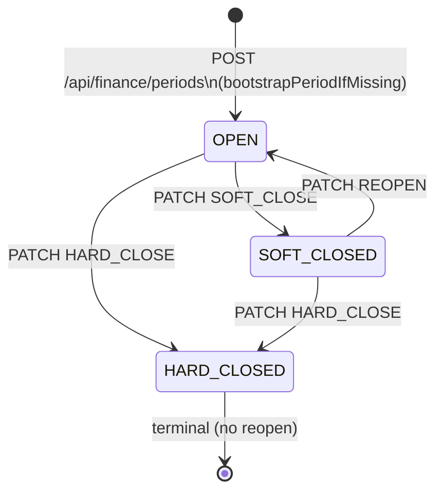
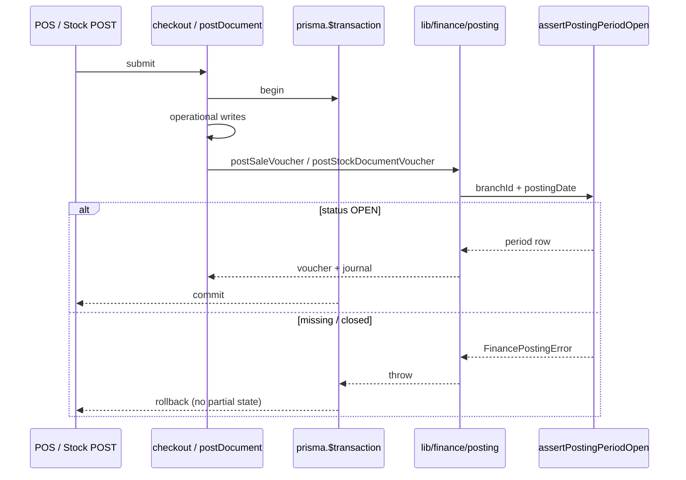
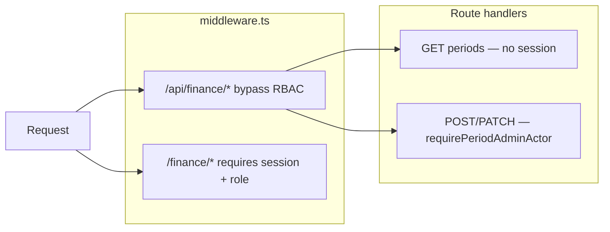

# Finance Periods (Phase 15)

Status: **Done** — period lifecycle, posting enforcement, admin API/UI, auth, middleware bypass  
Scope: `AccountingPeriod` lifecycle, posting lock, admin operations, middleware/API boundaries  
Related: [11_FINANCE_POSTING_ARCHITECTURE.md](./11_FINANCE_POSTING_ARCHITECTURE.md), [12_FINANCE_RECONCILIATION_AND_CLOSE_POLICY.md](./12_FINANCE_RECONCILIATION_AND_CLOSE_POLICY.md), [13_FINANCE_OPERATIONAL_WIRING.md](./13_FINANCE_OPERATIONAL_WIRING.md), [05_AUTH_PERMISSIONS.md](./05_AUTH_PERMISSIONS.md)

---

## 1. Purpose

Accounting periods gate when finance vouchers may be posted. Each branch has one row per `periodKey` (`YYYY-MM`). Posting orchestrators (POS checkout, stock document post) join the caller's outer transaction and call finance posting; finance refuses writes when the period is not `OPEN`.

Period **creation** and **close/reopen** are admin workflows — not side effects of posting.

---

## 2. Lifecycle



| Status | Meaning | Posting |
|--------|---------|---------|
| `OPEN` | Normal operations | **Allowed** |
| `SOFT_CLOSED` | Month closed for routine posting | **Blocked** (`PERIOD_CLOSED`) |
| `HARD_CLOSED` | Final close; no reopen | **Blocked** (`PERIOD_CLOSED`) |

### Transitions

| Action | From | To | Idempotent when |
|--------|------|-----|-----------------|
| Create / open | missing | `OPEN` | Row already exists (returns existing row, no status change) |
| `SOFT_CLOSE` | `OPEN`, `SOFT_CLOSED` | `SOFT_CLOSED` | Already `SOFT_CLOSED` |
| `REOPEN` | `SOFT_CLOSED`, `OPEN` | `OPEN` | Already `OPEN` |
| `HARD_CLOSE` | any except terminal | `HARD_CLOSED` | Already `HARD_CLOSED` |

`REOPEN` from `HARD_CLOSED` throws `PERIOD_ALREADY_HARD_CLOSED` (409).

Implementation: [`lib/finance/period-setup.ts`](../lib/finance/period-setup.ts), [`lib/finance/period-close.ts`](../lib/finance/period-close.ts).

---

## 3. Posting enforcement

**Rule:** Posting is allowed only when `AccountingPeriod.status === OPEN`.

Enforcement path:

1. Operational orchestrator starts outer `prisma.$transaction`.
2. Operational writes (sale, stock ledger, etc.) run inside the tx.
3. If `FINANCE_POSTING_ENABLED=true`, finance hook calls `postOperationalVoucher` → `assertPostingPeriodOpen`.
4. If period is missing → `PERIOD_NOT_OPENED`.
5. If period is `SOFT_CLOSED` or `HARD_CLOSED` → `PERIOD_CLOSED`.
6. On any finance failure, the **entire outer tx rolls back** — no partial sale without voucher.



### Operational rules (non-negotiable)

| Rule | Detail |
|------|--------|
| Posting only when `OPEN` | `assertPostingPeriodOpen` in [`lib/finance/posting-period.ts`](../lib/finance/posting-period.ts) |
| `SOFT_CLOSED` / `HARD_CLOSED` block posting | Same check; no override path in posting kernel today |
| No auto-bootstrap during posting | `posting.ts` does **not** call `bootstrapPeriodIfMissing` |
| Admin creates periods | `POST /api/finance/periods` → `bootstrapPeriodIfMissing` |
| Finance joins operational tx only | Callers pass `{ tx }`; finance never opens `$transaction` |
| No nested `prisma.$transaction` | Finance kernel and posting hooks use caller's tx exclusively |

Feature flag: `FINANCE_POSTING_ENABLED=true` (server env). When false, operational flows commit without finance hooks.

---

## 4. Admin flow

### UI

| Route | Component | Roles (page) |
|-------|-----------|--------------|
| `/finance/periods` | `PeriodAdminPage` | `HO_FINANCE`, `HO_ADMIN` (via middleware RBAC) |

Fetchers in [`lib/finance-ui/period-fetchers.ts`](../lib/finance-ui/period-fetchers.ts) call `/api/finance/periods`.

### API

| Method | Path | Auth | Purpose |
|--------|------|------|---------|
| `GET` | `/api/finance/periods` | None (public list/filter) | List periods |
| `POST` | `/api/finance/periods` | Period admin | Create/open period (`bootstrapPeriodIfMissing`) |
| `PATCH` | `/api/finance/periods` | Period admin | `SOFT_CLOSE`, `HARD_CLOSE`, `REOPEN` |

Body (POST/PATCH): `{ branchId, periodKey }` plus `action` on PATCH.

Route handler: [`app/api/finance/periods/route.ts`](../app/api/finance/periods/route.ts).

---

## 5. Middleware vs route auth

Two layers — do not conflate them.



| Layer | Responsibility |
|-------|----------------|
| **Middleware** | Session + area RBAC for **pages**; API bypass for `/api/finance` and `/api/pos` so handlers return JSON (not HTML redirect) |
| **Route handlers** | JSON auth/errors for mutating finance APIs via `requirePeriodAdminActor` in [`lib/auth/period-admin.ts`](../lib/auth/period-admin.ts) |

API bypass is **not** public access. It only skips middleware redirects. Mutations still require `HO_FINANCE` or `HO_ADMIN` session.

Bypass list: [`lib/permissions/route-access.ts`](../lib/permissions/route-access.ts) → `API_BYPASS_PATHS`.

---

## 6. Auth boundary

| Concern | Location | Not in |
|---------|----------|--------|
| Period admin role check | `lib/auth/period-admin.ts` | `lib/finance/*` |
| Session read | `lib/auth/` | finance kernel |
| Page RBAC | `lib/permissions/` + middleware | route handlers (pages) |

Allowed period admins: `HO_FINANCE`, `HO_ADMIN` (mapped to `ClosePolicyRole`).

Errors: `PeriodAdminAuthError` → JSON `{ error, code }` with 401/403.

---

## 7. Rollback expectations

All operational + finance work shares one transaction:

- POS checkout failure after finance error → no `Sale`, no `Voucher`.
- Stock document post failure → no ledger commit, no voucher.
- Period close does not delete vouchers; it only blocks **new** posting.

Smoke scripts assert count invariants after blocked checkout (see §9).

---

## 8. Idempotency

| Operation | Idempotency key | Behavior |
|-----------|-----------------|----------|
| Period create | `(branchId, periodKey)` unique | Existing row returned unchanged |
| Voucher post | `(refType, refId)` on `Voucher` | Returns existing journal if already posted |
| SOFT/HARD close | current status | No-op if already in target closed state |
| REOPEN | current status | No-op if already `OPEN` |

---

## 9. Smoke scripts

Run with dev server up and `FINANCE_POSTING_ENABLED=true`:

```bash
# API lifecycle + auth + posting block (HTTP)
FINANCE_POSTING_ENABLED=true npx tsx scripts/smoke-finance-period.ts

# Kernel + HTTP JSON check + rollback counts (direct + HTTP)
FINANCE_POSTING_ENABLED=true npx tsx scripts/smoke-finance-integration.ts
```

Optional: `SMOKE_BASE_URL=http://localhost:3000` (default).

Smoke scripts reset a **closed** current-month period to `OPEN` via direct Prisma update so lifecycle tests can rerun on dev DBs with existing vouchers. This is dev-only; production admin must use PATCH REOPEN / create flows.

### Manual browser checklist

1. Set session cookies (`sessionId`, `role=HO_FINANCE`, `staffId`, `branchId`).
2. Open `http://localhost:3000/finance/periods`.
3. Create period → table shows `OPEN`.
4. Soft close → status updates; POS checkout fails with period closed.
5. Reopen → posting works again.
6. Hard close → posting blocked; reopen disabled.
7. DevTools Network: `/api/finance/periods` returns JSON (not HTML redirect).

---

## 10. Module map

| Module | Role |
|--------|------|
| `lib/finance/period-setup.ts` | `bootstrapPeriodIfMissing` — admin create only |
| `lib/finance/period-close.ts` | `closeAccountingPeriod`, `reopenAccountingPeriod` |
| `lib/finance/posting-period.ts` | `assertPostingPeriodOpen` — posting gate |
| `lib/finance/period-list.ts` | Read-only list DTOs |
| `lib/finance/posting.ts` | Voucher/journal writes (uses assert, never bootstrap) |
| `lib/auth/period-admin.ts` | Route-level admin auth |
| `app/api/finance/periods/route.ts` | HTTP adapter |
| `components/finance/PeriodAdminPage.tsx` | Admin UI |

---

## 11. Error codes (posting / admin)

| Code | HTTP | When |
|------|------|------|
| `PERIOD_NOT_OPENED` | 400 | Posting with no period row |
| `PERIOD_CLOSED` | 400 | Posting when SOFT/HARD closed |
| `PERIOD_NOT_FOUND` | 404 | Close/reopen on missing period |
| `PERIOD_ALREADY_HARD_CLOSED` | 409 | Reopen or invalid transition |
| `UNAUTHENTICATED` | 401 | POST/PATCH without session |
| `FORBIDDEN` | 403 | POST/PATCH with non-admin role |

POS checkout maps `FinancePostingError` to JSON at [`app/api/pos/checkout/route.ts`](../app/api/pos/checkout/route.ts).

---

## 12. Environment

| Variable | Required | Purpose |
|----------|----------|---------|
| `DATABASE_URL` | Yes | Prisma |
| `FINANCE_POSTING_ENABLED` | For GL posting | Must be `"true"` on server for checkout/stock to post vouchers |

Set in `.env.local` for local dev. Restart dev server after changing.

---

## 13. Out of scope (future)

- Override posting into `SOFT_CLOSED` with audit reason (`canPostToPeriod` in close-policy exists but not wired to posting kernel)
- Period close audit trail / reason capture on PATCH
- Automated period rollover / scheduled close
- Real login replacing cookie stub
