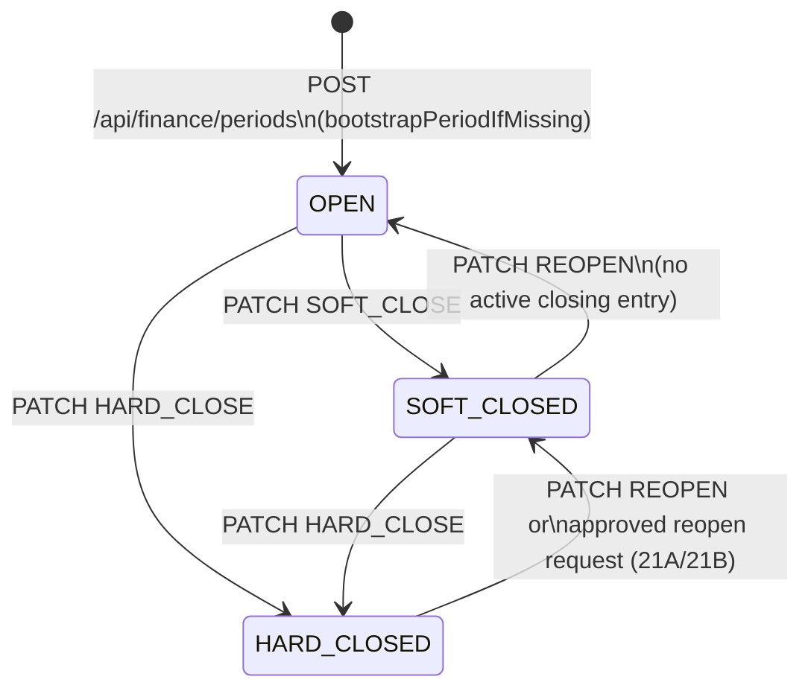
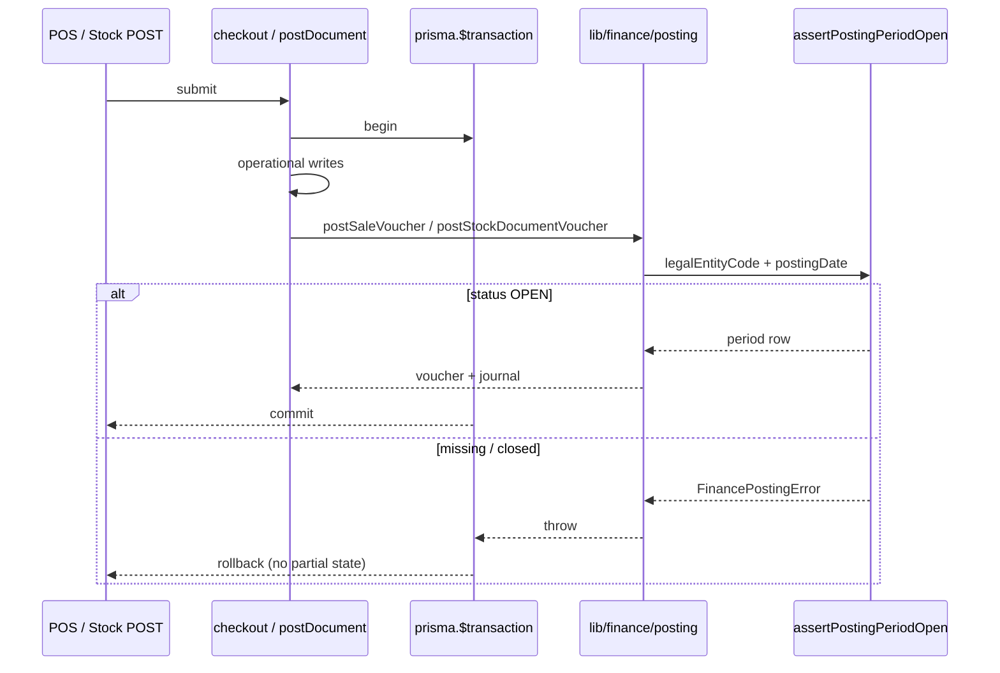
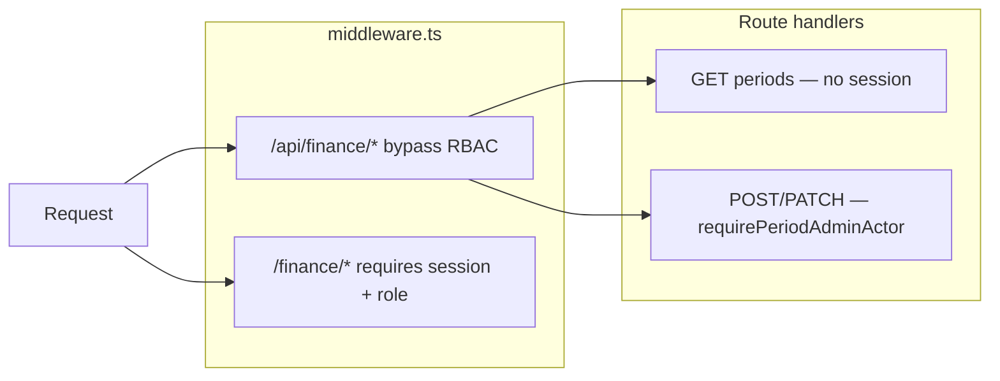
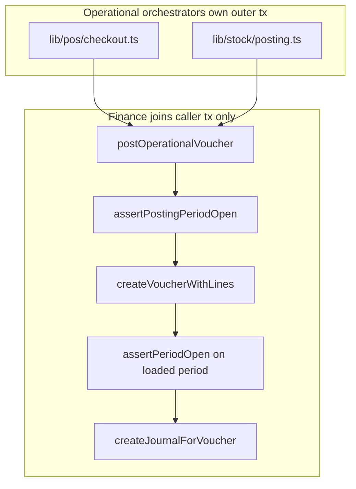
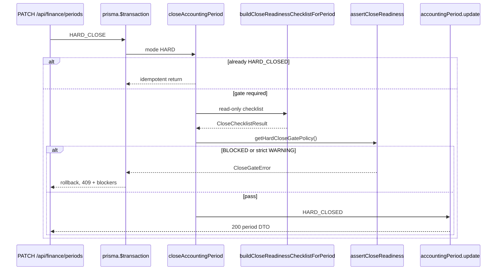

# Finance Periods (Phase 15)

Status: **Done** — period lifecycle, posting enforcement, admin API/UI, auth, middleware bypass; Phase 19B posting-lock audit  
Scope: `AccountingPeriod` lifecycle, posting lock, admin operations, middleware/API boundaries  
Related: [11_FINANCE_POSTING_ARCHITECTURE.md](./11_FINANCE_POSTING_ARCHITECTURE.md), [12_FINANCE_RECONCILIATION_AND_CLOSE_POLICY.md](./12_FINANCE_RECONCILIATION_AND_CLOSE_POLICY.md), [13_FINANCE_OPERATIONAL_WIRING.md](./13_FINANCE_OPERATIONAL_WIRING.md), [21_FINANCE_CLOSE_WORKFLOW.md](./21_FINANCE_CLOSE_WORKFLOW.md), [22_FINANCE_CLOSE_GATE.md](./22_FINANCE_CLOSE_GATE.md), [23_FINANCE_CLOSE_EVIDENCE.md](./23_FINANCE_CLOSE_EVIDENCE.md), [35_FINANCE_CORE_16H_CLOSING_ENTRY.md](./35_FINANCE_CORE_16H_CLOSING_ENTRY.md), [05_AUTH_PERMISSIONS.md](./05_AUTH_PERMISSIONS.md)

---

## 1. Purpose

Accounting periods gate when finance vouchers may be posted. Each legal entity has one row per `periodKey` (`YYYY-MM`). Posting orchestrators (POS checkout, stock document post) join the caller's outer transaction and call finance posting; finance refuses writes when the period is not `OPEN`.

Period **creation** and **close/reopen** are admin workflows — not side effects of posting.

---

## 2. Lifecycle



| Status | Meaning | Posting |
|--------|---------|---------|
| `OPEN` | Normal operations | **Allowed** |
| `SOFT_CLOSED` | Month closed for routine posting | **Blocked** (`PERIOD_CLOSED`) |
| `HARD_CLOSED` | Final close; controlled reopen via 21A/21B | **Blocked** (`PERIOD_CLOSED`) |

### Transitions

| Action | From | To | Idempotent when |
|--------|------|-----|-----------------|
| Create / open | missing | `OPEN` | Row already exists (returns existing row, no status change) |
| `SOFT_CLOSE` | `OPEN`, `SOFT_CLOSED` | `SOFT_CLOSED` | Already `SOFT_CLOSED` |
| `REOPEN` | `SOFT_CLOSED` | `OPEN` | Already `OPEN`; blocked if active closing entry (16H) |
| `REOPEN` | `HARD_CLOSED` | `SOFT_CLOSED` | Direct `HO_ADMIN` (21A) or approved request (21B); never `OPEN` |
| `HARD_CLOSE` | any except terminal | `HARD_CLOSED` | Already `HARD_CLOSED` |

`HARD_CLOSE` from `OPEN` or `SOFT_CLOSED` runs the **close gate** (Phase 20C) before status update — see [22_FINANCE_CLOSE_GATE.md](./22_FINANCE_CLOSE_GATE.md). Gate may **BLOCK** when P&amp;L activity exists but no closing entry is posted (16H) — see [35_FINANCE_CORE_16H_CLOSING_ENTRY.md](./35_FINANCE_CORE_16H_CLOSING_ENTRY.md). `SOFT_CLOSE` is **ungated**.

Direct `PATCH REOPEN` from `HARD_CLOSED` to `OPEN` is rejected (`PERIOD_ALREADY_HARD_CLOSED` or `REOPEN_APPROVAL_REQUIRED` under 21B). `SOFT_CLOSED` → `OPEN` requires no active period closing entry — reverse the closing entry via manual journal reversal (16B) first.

Implementation: [`lib/finance/period-setup.ts`](../lib/finance/period-setup.ts), [`lib/finance/period-close.ts`](../lib/finance/period-close.ts).

---

## 3. Posting enforcement

**Rule:** Posting is allowed only when `AccountingPeriod.status === OPEN`.

Enforcement path:

1. Operational orchestrator starts outer `prisma.$transaction`.
2. Operational writes (sale, stock ledger, etc.) run inside the tx.
3. If `FINANCE_POSTING_ENABLED=true`, finance hook calls `postOperationalVoucher` → `assertPostingPeriodOpen`.
4. If period is missing → `PERIOD_NOT_OPENED`.
5. If period is `SOFT_CLOSED` or `HARD_CLOSED` → `PERIOD_CLOSED`.
6. On any finance failure, the **entire outer tx rolls back** — no partial sale without voucher.



### Operational rules (non-negotiable)

| Rule | Detail |
|------|--------|
| Posting only when `OPEN` | `assertPostingPeriodOpen` in [`lib/finance/posting-period.ts`](../lib/finance/posting-period.ts) |
| `SOFT_CLOSED` / `HARD_CLOSED` block posting | Same check; no override path in posting kernel today |
| No auto-bootstrap during posting | `posting.ts` does **not** call `bootstrapPeriodIfMissing` |
| Admin creates periods | `POST /api/finance/periods` → `bootstrapPeriodIfMissing` |
| Finance joins operational tx only | Callers pass `{ tx }`; finance never opens `$transaction` |
| No nested `prisma.$transaction` | Finance kernel and posting hooks use caller's tx exclusively |

Feature flag: `FINANCE_POSTING_ENABLED=true` (server env). When false, operational flows commit without finance hooks.

---

## 4. Admin flow

### UI

| Route | Component | Roles (page) |
|-------|-----------|--------------|
| `/finance/periods` | `PeriodAdminPage` | `HO_FINANCE`, `HO_ADMIN` (via middleware RBAC) |
| `/finance/periods/[id]/close-readiness` | `CloseReadinessPage` | Same — read-only close checklist (Phase 20B) |
| `/finance/periods/[id]/closing-entry` | `ClosingEntryPage` | Preview/post period closing entry (16H) — link from close readiness |
| `/finance/periods/[id]/close-evidence` | `CloseEvidencePage` | Immutable HARD-close evidence (Phase 20D) — `HARD_CLOSED` only; browser CSV export + audit print (Phase 20E) |

Fetchers in [`lib/finance-ui/period-fetchers.ts`](../lib/finance-ui/period-fetchers.ts) call `/api/finance/periods`.

### API

| Method | Path | Auth | Purpose |
|--------|------|------|---------|
| `GET` | `/api/finance/periods` | None (public list/filter) | List periods |
| `POST` | `/api/finance/periods` | Period admin | Create/open period (`bootstrapPeriodIfMissing`) |
| `PATCH` | `/api/finance/periods` | Period admin | `SOFT_CLOSE`, `HARD_CLOSE`, `REOPEN` |
| `GET` | `/api/finance/periods/[id]/close-readiness` | None (public JSON) | Read-only close checklist for period (Phase 20B) |
| `GET` | `/api/finance/periods/[id]/closing-entry/preview` | None (public JSON) | Closing entry simulation + `canPost` (16H) |
| `POST` | `/api/finance/periods/[id]/closing-entry` | Period admin | Post period closing entry (16H) |
| `GET` | `/api/finance/periods/[id]/close-evidence` | None (public JSON) | Immutable HARD-close evidence (Phase 20D) |

Body (POST/PATCH): `{ branchId, periodKey }` plus `action` on PATCH.

Route handler: [`app/api/finance/periods/route.ts`](../app/api/finance/periods/route.ts).

---

## 5. Middleware vs route auth

Two layers — do not conflate them.



| Layer | Responsibility |
|-------|----------------|
| **Middleware** | Session + area RBAC for **pages**; API bypass for `/api/finance` and `/api/pos` so handlers return JSON (not HTML redirect) |
| **Route handlers** | JSON auth/errors for mutating finance APIs via `requirePeriodAdminActor` in [`lib/auth/period-admin.ts`](../lib/auth/period-admin.ts) |

API bypass is **not** public access. It only skips middleware redirects. Mutations still require `HO_FINANCE` or `HO_ADMIN` session.

Bypass list: [`lib/permissions/route-access.ts`](../lib/permissions/route-access.ts) → `API_BYPASS_PATHS`.

---

## 6. Auth boundary

| Concern | Location | Not in |
|---------|----------|--------|
| Period admin role check | `lib/auth/period-admin.ts` | `lib/finance/*` |
| Session read | `lib/auth/` | finance kernel |
| Page RBAC | `lib/permissions/` + middleware | route handlers (pages) |

Allowed period admins: `HO_FINANCE`, `HO_ADMIN` (mapped to `ClosePolicyRole`).

Errors: `PeriodAdminAuthError` → JSON `{ error, code }` with 401/403.

---

## 7. Rollback expectations

All operational + finance work shares one transaction:

- POS checkout failure after finance error → no `Sale`, no `Voucher`.
- Stock document post failure → no ledger commit, no voucher.
- Period close does not delete vouchers; it only blocks **new** posting.

Smoke scripts assert count invariants after blocked checkout (see §9).

---

## 8. Idempotency

| Operation | Idempotency key | Behavior |
|-----------|-----------------|----------|
| Period create | `(branchId, periodKey)` unique | Existing row returned unchanged |
| Voucher post | `(refType, refId)` on `Voucher` | Returns existing journal if already posted |
| SOFT/HARD close | current status | No-op if already in target closed state |
| REOPEN | current status | No-op if already `OPEN` |

---

## 9. Smoke scripts

Run with dev server up and `FINANCE_POSTING_ENABLED=true`:

```bash
# API lifecycle + auth + posting block (HTTP)
FINANCE_POSTING_ENABLED=true npx tsx scripts/smoke-finance-period.ts

# Kernel + HTTP JSON check + rollback counts (direct + HTTP)
FINANCE_POSTING_ENABLED=true npx tsx scripts/smoke-finance-integration.ts
```

Optional: `SMOKE_BASE_URL=http://localhost:3000` (default).

Smoke scripts reset a **closed** current-month period to `OPEN` via direct Prisma update so lifecycle tests can rerun on dev DBs with existing vouchers. This is dev-only; production admin must use PATCH REOPEN / create flows.

### Manual browser checklist

1. Set session cookies (`sessionId`, `role=HO_FINANCE`, `staffId`, `branchId`).
2. Open `http://localhost:3000/finance/periods`.
3. Create period → table shows `OPEN`.
4. Soft close → status updates; POS checkout fails with period closed.
5. Reopen → posting works again.
6. Hard close → posting blocked; reopen disabled.
7. DevTools Network: `/api/finance/periods` returns JSON (not HTML redirect).

---

## 10. Module map

| Module | Role |
|--------|------|
| `lib/finance/period-setup.ts` | `bootstrapPeriodIfMissing` — admin create only |
| `lib/finance/period-close.ts` | `closeAccountingPeriod`, `reopenAccountingPeriod` — HARD gate (20C) |
| `lib/finance/close-gate-policy.ts` | Centralized close gate policy (20C) |
| `lib/finance/close-gate.ts` | `assertCloseReadiness`, gate helpers (20C) |
| `lib/finance/close-gate-errors.ts` | `CloseGateError`, structured payloads (20C) |
| `lib/finance/close-readiness.ts` | Read-only checklist build for gate + GET API (20B/20C) |
| `lib/finance/closing-entry.ts` | Pure closing line builder (16H) |
| `lib/finance/closing-entry-post.ts` | Preview + post closing entry (16H) |
| `lib/finance/closing-entry-status.ts` | Active closing entry lookup (16H) |
| `lib/finance/close-evidence.ts` | Immutable evidence create (HARD close) + read (20D) |
| `lib/finance/close-evidence-build.ts` | Compact payload builder (20D) |
| `lib/finance/posting-period.ts` | `assertPostingPeriodOpen` — posting gate |
| `lib/finance/period-list.ts` | Read-only list DTOs |
| `lib/finance/posting.ts` | Voucher/journal orchestration (uses assert, never bootstrap) |
| `lib/finance/voucher.ts` | Voucher writes; defense-in-depth `assertPeriodOpen` on loaded period |
| `lib/auth/period-admin.ts` | Route-level admin auth |
| `app/api/finance/periods/route.ts` | HTTP adapter |
| `components/finance/PeriodAdminPage.tsx` | Admin UI |

---

## 11. Error codes (posting / admin)

| Code | HTTP | When |
|------|------|------|
| `PERIOD_NOT_OPENED` | 400 | Posting with no period row |
| `PERIOD_CLOSED` | 400 | Posting when SOFT/HARD closed |
| `PERIOD_NOT_FOUND` | 404 | Close/reopen on missing period |
| `PERIOD_ALREADY_HARD_CLOSED` | 409 | Invalid reopen transition |
| `REOPEN_APPROVAL_REQUIRED` | 409 | HARD reopen without approved request (21B) |
| `CLOSING_ENTRY_REOPEN_BLOCKED` | 409 | SOFT→OPEN reopen while active closing entry exists (16H) |
| `UNBALANCED_CLOSING_ENTRY` | 400 | Closing entry simulation not balanced (16H) |
| `CLOSE_SNAPSHOT_REQUIRED` | 409 | HARD close blocked — missing/invalid snapshot evidence |
| `CLOSE_BLOCKED` | 409 | HARD close blocked — reconciliation/posting blockers |
| `CLOSE_EVIDENCE_REQUIRED` | 409 | HARD close blocked — audit evidence unavailable |
| `CLOSE_READINESS_FAILED` | 409 | HARD close blocked — WARNING items under strict policy |
| `CLOSE_EVIDENCE_NOT_FOUND` | 404 | GET close-evidence when period has no HARD-close evidence row |
| `UNAUTHENTICATED` | 401 | POST/PATCH without session |
| `FORBIDDEN` | 403 | POST/PATCH with non-admin role |

POS checkout maps `FinancePostingError` to JSON at [`app/api/pos/checkout/route.ts`](../app/api/pos/checkout/route.ts). Stock document POST uses shared [`financeErrorResponse`](../app/api/finance/shared/finance-api-errors.ts) at [`app/api/stock-document/[id]/post/route.ts`](../app/api/stock-document/[id]/post/route.ts).

---

## 12. Environment

| Variable | Required | Purpose |
|----------|----------|---------|
| `DATABASE_URL` | Yes | Prisma |
| `FINANCE_POSTING_ENABLED` | For GL posting | Must be `"true"` on server for checkout/stock to post vouchers |

Set in `.env.local` for local dev. Restart dev server after changing.

---

## 13. Phase 19B — Posting lock enforcement audit

Status: **Done** — CI-style architecture audits, voucher defense-in-depth, consistent API errors

Phase 19B does **not** change posting business rules from Phase 15. It adds **provable guarantees** that the lock cannot be bypassed by accident and documents the enforcement layers.

### Enforcement layers



| Layer | Module | Role |
|-------|--------|------|
| **Primary gate** | [`lib/finance/posting-period.ts`](../lib/finance/posting-period.ts) | `assertPostingPeriodOpen(tx, postingDate, legalEntityCode)` — authoritative check before any voucher write in `postOperationalVoucher` |
| **Defense in depth** | [`lib/finance/voucher.ts`](../lib/finance/voucher.ts) | `assertPeriodOpen(period.status)` on the period row already loaded by `periodId` — blocks direct calls to `createVoucherWithLines` with a closed period |
| **Low-level writers** | `voucher.ts`, [`journal.ts`](../lib/finance/journal.ts) | Only modules that call `voucher.create` / `journalEntry.create`; not exported from [`lib/finance/index.ts`](../lib/finance/index.ts) barrel |

There is **one** DB lookup for period status on the live path (`assertPostingPeriodOpen`). The voucher-layer check reuses the row from `findUnique({ id: periodId })` — no second period query.

### No nested transactions

Operational orchestrators (`checkout`, `postDocument`) open the **outer** `prisma.$transaction`. Finance posting receives `{ tx }` and must not open another transaction. This keeps rollback atomic: a `PERIOD_CLOSED` error rolls back the sale/stock write together with the failed voucher attempt.

See also: `npm run audit:tx` (nested-transaction audit).

### Caller allowlist philosophy

GL posting is intentionally narrow:

- **Only** [`lib/finance/posting.ts`](../lib/finance/posting.ts) orchestrates voucher + journal creation in production.
- Operational modules call `postSaleVoucher` / `postStockDocumentVoucher` — not `createVoucherWithLines` or `createJournalForVoucher` directly.
- Low-level writers stay module-internal; the public barrel exposes posting facades, not GL primitives.

This reduces the chance of a future path that skips `assertPostingPeriodOpen`.

### Architecture audit (`npm run audit:posting-lock`)

Script: [`scripts/audit/posting-lock-audit.ts`](../scripts/audit/posting-lock-audit.ts)

| Rule ID | Guarantee |
|---------|-----------|
| `GL_WRITER_SINGLETON` | `voucher.create` and `journalEntry.create` only in `lib/finance/voucher.ts` and `lib/finance/journal.ts` |
| `VOUCHER_JOURNAL_CALLER_ALLOWLIST` | `createVoucherWithLines` / `createJournalForVoucher` invoked only from `posting.ts`, writer definitions, or tests |
| `POSTING_GATE_REQUIRED` | `posting.ts` calls `assertPostingPeriodOpen` before `createVoucherWithLines` |
| `RECON_NO_POSTING` | Reconciliation modules do not create vouchers/journals or mutate operational sales/stock |

Tests: [`__tests__/scripts/audit/posting-lock-audit.test.ts`](../__tests__/scripts/audit/posting-lock-audit.test.ts)

### Reconciliation stays read-only

Reconciliation (Phase 16–18) **observes** posted state; it does not post, close periods, or bypass the lock:

- No `postOperationalVoucher`, `voucher.create`, or `journalEntry.create` in reconciliation modules.
- Snapshots persist audit JSON only — not GL rows.
- `RECON_NO_POSTING` audit rule enforces this at CI time.

Operational source (sales, stock ledger, documents) remains source of truth; reconciliation compares operational totals to derived GL without writing either side.

### API error consistency

Both operational POST routes return structured finance errors (not opaque 500s):

| Route | Handler |
|-------|---------|
| `POST /api/pos/checkout` | Maps `FinancePostingError` → 400 + `{ error, code }` |
| `POST /api/stock-document/[id]/post` | `financeErrorResponse` (400 for `PERIOD_CLOSED`, 404 for `PERIOD_NOT_FOUND`, etc.) |

Rollback behavior is unchanged — only the HTTP mapping improved for stock POST.

---

## 14. Phase 20B — Close readiness review

Status: **Done** — read-only checklist before manual close

Finance admins use **Review** on the period table to open `/finance/periods/[id]/close-readiness`. The page loads `GET /api/finance/periods/[id]/close-readiness`, which evaluates frozen snapshot evidence, posting lock state, and audit export readiness via `buildCloseChecklist` / `evaluateCloseBlockerRules`.

| Concern | Behavior |
|---------|----------|
| Close action | PATCH on `/api/finance/periods` from period admin — readiness page has no Close button |
| Blockers | Missing snapshot, scope mismatch, MISSING_GL / MISSING_SOURCE issues, etc. — see [21_FINANCE_CLOSE_WORKFLOW.md](./21_FINANCE_CLOSE_WORKFLOW.md) |
| Evidence links | Deep links to reconciliation dashboard, snapshot detail, compare, frozen trace, evidence export anchors |
| Posting lock | Unchanged — checklist observes period status; does not bypass `assertPostingPeriodOpen` |

Full workflow, rule registry, and manual verification: [21_FINANCE_CLOSE_WORKFLOW.md](./21_FINANCE_CLOSE_WORKFLOW.md).

---

## 15. Phase 20C — Close gate enforcement

Status: **Done** — HARD close gated in domain; SOFT close ungated; no force-close override

Phase 20C wires Phase 20B checklist evaluation into [`closeAccountingPeriod`](../lib/finance/period-close.ts) for `mode: "HARD"` only.



| Concern | Behavior |
|---------|----------|
| Enforcement boundary | **Only** `closeAccountingPeriod()` — API has no alternate HARD close path |
| SOFT close | **Ungated** — no checklist, no `assertCloseReadiness` |
| Default policy | BLOCKED rejects; WARNING allowed ([`close-gate-policy.ts`](../lib/finance/close-gate-policy.ts)) |
| Rollback | Gate throw before `update` — failed HARD close leaves period unchanged |
| Side effects | Gate path: no snapshot creation, posting, or live reconciliation; **successful** HARD close creates immutable close evidence (20D) |
| UI | `HardCloseConfirmDialog` previews readiness; server enforces regardless |
| Override | **None** in v1 — no force-close flag |

Full policy, error payloads, test map, and future override notes: [22_FINANCE_CLOSE_GATE.md](./22_FINANCE_CLOSE_GATE.md).

---

## 16. Phase 20D — Close evidence snapshot

Status: **Done** — immutable HARD-close audit record; read-only GET + review UI

After successful HARD close (gate passed), [`closeAccountingPeriod`](../lib/finance/period-close.ts) writes one `AccountingPeriodCloseEvidence` row in the same transaction. Actor fields (`closedByStaffId`, `closedByName`, `closedByRole`) are snapshots — no Staff FK. Payload embeds compact checklist summaries, frozen reconciliation metrics, financial totals, and snapshot trace refs — not full `issuesPayload` or voucher detail.

| Concern | Behavior |
|---------|----------|
| Create | Only on successful HARD close; not on SOFT, blocked HARD, or idempotent repeat |
| Read | `GET /api/finance/periods/[id]/close-evidence`; UI at `/finance/periods/[id]/close-evidence` |
| Immutability | No update/delete APIs or domain helpers |
| Period table | **Close evidence** link when `status === HARD_CLOSED` |
| Export / print | Browser CSV pack + audit print on close evidence page — stored evidence only ([24 §5–6](./24_FINANCE_CLOSE_EVIDENCE_EXPORT.md)) |

Full architecture, payload philosophy, security rules, and test map: [23_FINANCE_CLOSE_EVIDENCE.md](./23_FINANCE_CLOSE_EVIDENCE.md). Export and print: [24_FINANCE_CLOSE_EVIDENCE_EXPORT.md](./24_FINANCE_CLOSE_EVIDENCE_EXPORT.md).

---

## 17. Phase 20E — Close evidence export / print

Status: **Done** — browser CSV pack and audit print from stored evidence; no export API route

| Concern | Behavior |
|---------|----------|
| Source | Stored `CloseEvidenceDetail` from initial page GET only |
| Export | `buildCloseEvidenceExport` → five browser CSV downloads |
| Print | Same in-memory evidence; `PrintAuditButton` + print-only audit header |
| API | **None** — intentionally no `GET .../close-evidence/export` in Phase 20E |

Full scope, guardrails, and verification: [24_FINANCE_CLOSE_EVIDENCE_EXPORT.md](./24_FINANCE_CLOSE_EVIDENCE_EXPORT.md).

---

## 18. Phase 21A — Reopen control

Status: **Done** — audited reopen paths, append-only close evidence history, reopen evidence

| Transition | Role | Reason | Posting after |
|------------|------|--------|---------------|
| `HARD_CLOSED` → `SOFT_CLOSED` | `HO_ADMIN` | Required | Blocked (`SOFT_CLOSED`) |
| `SOFT_CLOSED` → `OPEN` | `HO_FINANCE` / `HO_ADMIN` | Required | Allowed via existing kernel |
| `HARD_CLOSED` → `OPEN` | — | — | **Rejected** |

Each successful HARD close appends a new `AccountingPeriodCloseEvidence` row; prior rows are never modified. Reopen writes only `AccountingPeriodReopenEvidence`.

API: `PATCH` REOPEN with `reason`; `GET` close-evidence (latest), `.../history`, `.../[evidenceId]`; `GET` reopen-evidence. UI: reopen confirm dialogs, reopen history, close history.

Full policy, lifecycle example, and test map: [25_FINANCE_REOPEN_CONTROL.md](./25_FINANCE_REOPEN_CONTROL.md). HARD reopen approval: [26_FINANCE_REOPEN_APPROVAL.md](./26_FINANCE_REOPEN_APPROVAL.md). Close evidence history: [23](./23_FINANCE_CLOSE_EVIDENCE.md). Gate: [22](./22_FINANCE_CLOSE_GATE.md). Export: [24](./24_FINANCE_CLOSE_EVIDENCE_EXPORT.md).

---

## 19. Phase 22A — Period audit timeline

Status: **Done** — read-only chronological audit view per period

| Surface | Path |
|---------|------|
| API | `GET /api/finance/periods/[id]/timeline` |
| UI | `/finance/periods/[id]/timeline` |

Combines period opened/soft-closed (when observable), HARD close + close evidence rows, reopen request workflow events, and reopen evidence. No schema changes; no mutation APIs.

Full catalog and limitations: [27_FINANCE_PERIOD_AUDIT_TIMELINE.md](./27_FINANCE_PERIOD_AUDIT_TIMELINE.md). Reopen approval workflow: [26_FINANCE_REOPEN_APPROVAL.md](./26_FINANCE_REOPEN_APPROVAL.md).

---

## 20. Phase 22B — Period audit export

Status: **Done** — composed export bundle, browser CSV pack, audit print on timeline page

| Surface | Path |
|---------|------|
| API | `GET /api/finance/periods/[id]/audit-export` → `{ export }` |
| UI | `/finance/periods/[id]/timeline` — Download audit CSV pack, Print audit report |

Composes 22A timeline with close evidence, reopen evidence, and reopen request **summary** indexes. Full close evidence payload export remains [24](./24_FINANCE_CLOSE_EVIDENCE_EXPORT.md) on the close evidence page.

Full export/print contract: [28_FINANCE_PERIOD_AUDIT_EXPORT.md](./28_FINANCE_PERIOD_AUDIT_EXPORT.md).

---

## 21. Phase 16H — Period closing entry

Status: **Done** — preview + post P&amp;L closing journal to retained earnings (`301`) while period is `OPEN`

| Surface | Path |
|---------|------|
| Preview API | `GET /api/finance/periods/[id]/closing-entry/preview` |
| Post API | `POST /api/finance/periods/[id]/closing-entry` |
| UI | `/finance/periods/[id]/closing-entry` |

Closing entry is a **prerequisite for HARD close** when the period has revenue or expense activity (`closing-entry-missing` = BLOCKED on close checklist). Reopen `SOFT_CLOSED` → `OPEN` is blocked until the active closing entry is reversed (16B).

Full architecture, line rules, and test map: [35_FINANCE_CORE_16H_CLOSING_ENTRY.md](./35_FINANCE_CORE_16H_CLOSING_ENTRY.md).

---

## 22. Out of scope (future)

- Override posting into `SOFT_CLOSED` with audit reason (`canPostToPeriod` in close-policy exists but not wired to posting kernel)
- Optional PATCH close reason text (actor snapshot exists in 20D evidence)
- Automated period rollover / scheduled close
- Force-close / admin override bypass for close gate (policy hook exists for strict WARNING; no silent bypass)
- Real login replacing cookie stub
