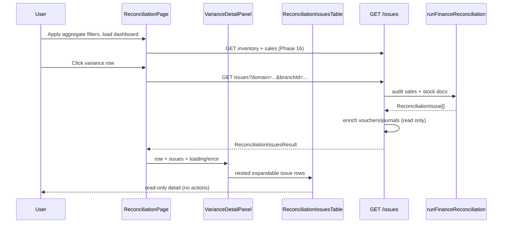

# Reconciliation Drill-Down (Phase 17)

Status: **Done** — transaction-level issues API + dashboard drill-down  
Scope: Read-only per-document reconciliation visibility  
Related: [16_FINANCE_RECONCILIATION.md](./16_FINANCE_RECONCILIATION.md), [12_FINANCE_RECONCILIATION_AND_CLOSE_POLICY.md](./12_FINANCE_RECONCILIATION_AND_CLOSE_POLICY.md), [15_FINANCE_PERIODS.md](./15_FINANCE_PERIODS.md)

---

## 1. Purpose

Phase 17 exposes **transaction/document-level** reconciliation issues that were previously kernel-only (`runFinanceReconciliation`). The Phase 16 aggregate dashboard drills down into per-sale and per-stock-document audit rows with voucher and journal linkage.

**Still read-only.** No GL write-back, no auto-adjust, no reconciliation posting.

**Kernel unchanged:** `lib/finance/reconciliation.ts` (`runFinanceReconciliation`, `auditSale`, `auditStockDocument`) is not redesigned. The API adapter calls the existing kernel and adds read-only enrichment queries only.

---

## 2. Issues API

### `GET /api/finance/reconciliation/issues`

| File | Role |
|------|------|
| [`app/api/finance/reconciliation/issues/route.ts`](../app/api/finance/reconciliation/issues/route.ts) | HTTP adapter (GET only) |
| [`app/api/finance/shared/reconciliation-issues-response.ts`](../app/api/finance/shared/reconciliation-issues-response.ts) | Kernel call + voucher/journal/document enrichment |
| [`app/api/finance/shared/parse-reconciliation-issues-filter.ts`](../app/api/finance/shared/parse-reconciliation-issues-filter.ts) | Query parsing |

| Method | Allowed |
|--------|---------|
| GET | Yes |
| POST / PATCH / PUT / DELETE | **No** |

### Query filters

| Param | Values | Purpose |
|-------|--------|---------|
| `branchId` | string | Branch scope (optional) |
| `from` | `YYYY-MM-DD` | Sale/doc window start (with `to`) |
| `to` | `YYYY-MM-DD` | Sale/doc window end |
| `sourceType` | `SALE`, `STOCK_DOCUMENT` | Operational source filter |
| `status` | `MATCHED`, `VARIANCE`, `MISSING_SOURCE`, `MISSING_GL` | UI status filter (derived in adapter) |
| `domain` | `inventory`, `revenue`, `tender`, `all` | Aggregate dashboard drill-down scope |
| `issueType` | Kernel issue types (see below) | Direct type filter |

### Response shape

```json
{
  "filter": { "branchId": "...", "domain": "revenue" },
  "checkedSales": 12,
  "checkedStockDocuments": 3,
  "issueCount": 2,
  "issues": [
    {
      "id": "SALE:sale-1:MISSING_VOUCHER",
      "sourceType": "SALE",
      "sourceId": "sale-1",
      "documentRef": "sale-1",
      "issueType": "MISSING_VOUCHER",
      "severity": "ERROR",
      "status": "MISSING_GL",
      "message": "Completed sale has no posted finance voucher",
      "expectedAmount": null,
      "actualAmount": null,
      "difference": null,
      "vouchers": [],
      "journalEntries": [],
      "sourceCreatedAt": "2026-05-01T00:00:00.000Z",
      "sourcePostedAt": null
    }
  ]
}
```

### Kernel issue types (unchanged)

| `issueType` | Meaning |
|-------------|---------|
| `MISSING_VOUCHER` | Operational document posted, no finance voucher |
| `DUPLICATE_VOUCHER` | Multiple vouchers for one ref |
| `TOTAL_MISMATCH` | Sale total ≠ revenue credit |
| `MISSING_COGS_LINES` | Ledger COGS ≠ journal COGS debit |
| `INVENTORY_VALUE_MISMATCH` | Stock ledger value ≠ inventory journal lines |

---

## 3. UI drill-down flow



1. User loads the aggregate dashboard at `/finance/reconciliation` (Phase 16).
2. User **clicks a variance row** in `ReconciliationDashboardTable`.
3. `ReconciliationPage` opens **`VarianceDetailPanel`** and calls `fetchReconciliationIssues` with applied scope + row `domain`.
4. **`ReconciliationIssuesTable`** renders nested issues (expandable rows, voucher/journal refs, timestamps when available).
5. User may **Copy reference** or **Export issues CSV** — both are client-side, read-only exports (no server mutation).

### UI components

| Component | Responsibility |
|-----------|----------------|
| [`ReconciliationPage.tsx`](../components/finance/ReconciliationPage.tsx) | Aggregate fetch; issues fetch on row select |
| [`VarianceDetailPanel.tsx`](../components/finance/VarianceDetailPanel.tsx) | Aggregate row detail + issues section + issues CSV |
| [`ReconciliationIssuesTable.tsx`](../components/finance/ReconciliationIssuesTable.tsx) | Expandable read-only issue list |

Client fetcher: [`fetchReconciliationIssues`](../lib/finance-ui/fetchers.ts)  
Helpers: [`lib/finance-ui/reconciliation-issues.ts`](../lib/finance-ui/reconciliation-issues.ts)

---

## 4. Status derivation (UI layer)

Top-level dashboard statuses (Phase 16) are unchanged. Issue rows map kernel output in `lib/finance-ui/reconciliation-issues.ts`:

| Kernel signal | UI `status` |
|---------------|-------------|
| `MISSING_VOUCHER` | `MISSING_GL` |
| `DUPLICATE_VOUCHER` | `VARIANCE` |
| Amount mismatch (non-zero diff) | `VARIANCE` |
| Expected present, actual ≈ 0 | `MISSING_GL` |
| Expected ≈ 0, actual present | `MISSING_SOURCE` |
| Zero difference | `MATCHED` |

Domain filter for drill-down:

| `domain` | Issues shown |
|----------|--------------|
| `inventory` | Stock documents, inventory mismatches, COGS-related sale issues |
| `revenue` | Sale revenue/total mismatches, missing/duplicate vouchers |
| `tender` | All sale issues (proxy — no tender-specific kernel type yet) |

---

## 5. Read-only guarantees

| Guarantee | Enforcement |
|-----------|-------------|
| **No posting** | Issues route has no POST handler; does not import `lib/finance/posting.ts` |
| **No fix/reconcile actions** | UI has copy + CSV export only — no Fix, Reconcile, Approve, or Post buttons |
| **No voucher/journal mutation** | Adapter uses `findMany` on vouchers/sales/stock documents only |
| **No stock/sale/accounting period mutation** | Kernel audit is read-only; reconciliation modules do not call stock or POS writers |
| **No posting lock bypass** | Issues API does not call `assertPostingPeriodOpen` or period close flows |
| **Kernel unchanged** | `runFinanceReconciliation` behavior and issue types are as implemented in Phase 7c wiring |
| **CSV export is read-only** | Aggregate CSV (Phase 16) and issues CSV (Phase 17) build blobs in the browser — no write APIs |

Operational posting remains source-of-truth. Reconciliation explains gaps; corrections happen through operational/finance posting workflows, not through this UI.

---

## 6. Manual verification

1. Open `/finance/reconciliation` with finance role cookies.
2. Apply filters and load aggregate rows.
3. Click a variance reference — detail panel opens.
4. Confirm **Transaction issues** loads (Network: `GET .../reconciliation/issues?domain=...`).
5. Expand an issue — voucher/journal IDs visible.
6. Confirm no Fix / Reconcile / Post buttons.
7. Export issues CSV — file downloads locally only.

---

## 7. Related docs

- Aggregate dashboard: [16_FINANCE_RECONCILIATION.md](./16_FINANCE_RECONCILIATION.md)
- Policy and invariants: [12_FINANCE_RECONCILIATION_AND_CLOSE_POLICY.md](./12_FINANCE_RECONCILIATION_AND_CLOSE_POLICY.md)
