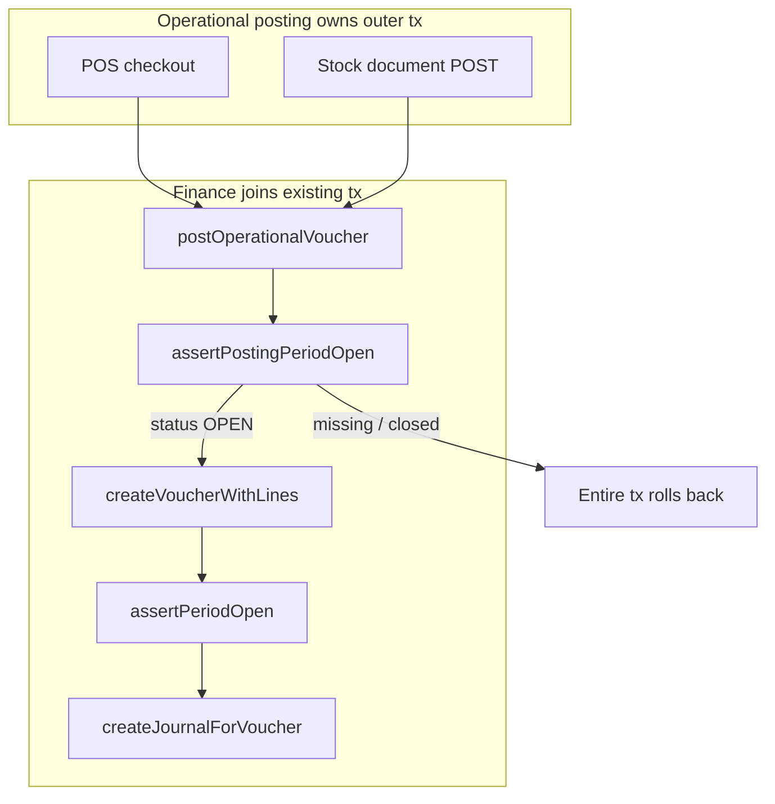
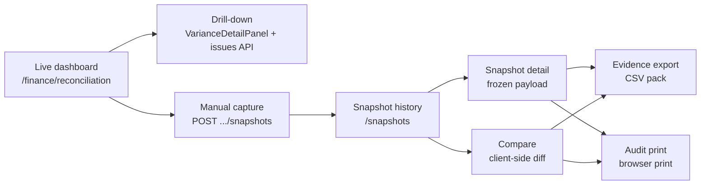
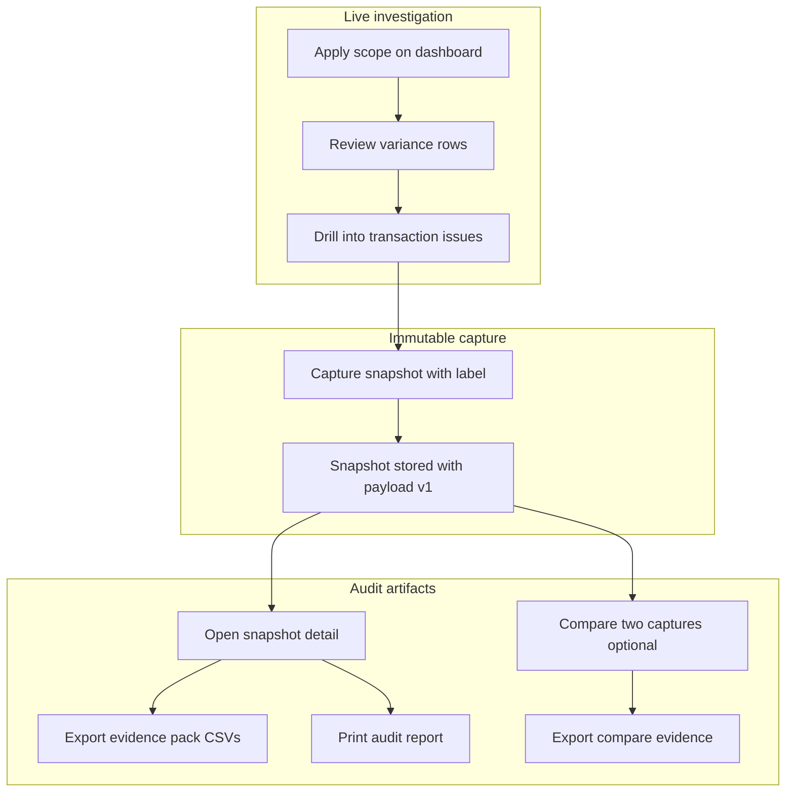

# Phase 19 — Finance Reconciliation Stabilization

Status: **Done** — snapshot UX polish, posting-lock audit, evidence export and audit print  
Stable tag: **`phase19c-stable`** (includes 19A + 19B + 19C)  
Scope: Stabilization layer on Phases 15–18 — UI polish, enforcement audits, audit evidence  
Related: [15_FINANCE_PERIODS.md](./15_FINANCE_PERIODS.md), [16_FINANCE_RECONCILIATION.md](./16_FINANCE_RECONCILIATION.md), [17_RECONCILIATION_DRILLDOWN.md](./17_RECONCILIATION_DRILLDOWN.md), [18_RECONCILIATION_SNAPSHOTS.md](./18_RECONCILIATION_SNAPSHOTS.md)

This document is a **summary and stabilization index**. Detailed behavior remains in the phase-specific docs above — Phase 19 does not replace them.

---

## 1. Purpose

Phases 15–18 delivered finance periods, live reconciliation, drill-down, and frozen snapshots. Phase 19 **stabilizes** that surface for month-end audit and close readiness:

| Sub-phase | Focus |
|-----------|--------|
| **19A** | Snapshot browsing UX — history, detail, compare |
| **19B** | Posting lock enforcement audit — provable CI guarantees |
| **19C** | Evidence export and audit print — immutable audit artifacts |

Phase 19 adds **no new reconciliation math**, **no posting behavior changes**, and **no schema changes**.

---

## 2. Final status

| Sub-phase | Status | Stable tag | Detail doc |
|-----------|--------|------------|------------|
| 19A Snapshot UI polish | Done | `phase19a-stable` | [18 §8](./18_RECONCILIATION_SNAPSHOTS.md#8-phase-19a--snapshot-ui-polish) |
| 19B Posting lock audit | Done | `phase19b-stable` | [15 §13](./15_FINANCE_PERIODS.md#13-phase-19b--posting-lock-enforcement-audit) |
| 19C Evidence export / print | Done | `phase19c-stable` | [18 §9](./18_RECONCILIATION_SNAPSHOTS.md#9-phase-19c--evidence-export-and-audit-print) |

At `phase19c-stable`: **499 tests passing**, `npm run build` clean, `master` tagged.

---

## 3. Architecture rules preserved

Phase 19 work respects all modular monolith invariants:

| Rule | Phase 19 compliance |
|------|---------------------|
| `schema.prisma` source of truth; `prisma db push` only | No schema changes in 19A–19C |
| No nested `prisma.$transaction` | Unchanged; 19B audits enforce pattern |
| Reconciliation read-only | 19A/C UI only; 19B `RECON_NO_POSTING` audit rule |
| Immutable snapshots | 19A compare/detail from payload; 19C export/print from frozen data |
| No posting lock bypass | 19B posting-lock audit (`npm run audit:posting-lock`) |
| Operational source of truth | Reconciliation still observes; no GL write-back |
| Operational orchestrators own outer tx; finance joins only | Documented and audited in 19B |

---

## 4. Phase 19A — Snapshot UI polish

**UI-only.** No capture, payload, kernel, or API contract changes from Phase 18.

### Delivered

- **History** ([`ReconciliationSnapshotsPage.tsx`](../components/finance/ReconciliationSnapshotsPage.tsx)): branch filter, summary chips, compare selection (max 2), skeleton loading.
- **Detail** ([`ReconciliationSnapshotDetailView.tsx`](../components/finance/ReconciliationSnapshotDetailView.tsx)): collapsible sections, sticky summary, wired dashboard filters, domain issue filter on row click.
- **Compare** ([`ReconciliationSnapshotCompareView.tsx`](../components/finance/ReconciliationSnapshotCompareView.tsx)): client-side diff route `/finance/reconciliation/snapshots/compare?left=&right=`, metric deltas, change filters.
- **Shared UI** ([`reconciliation-snapshot-ui.tsx`](../components/finance/reconciliation-snapshot-ui.tsx)): collapsible sections, badges, skeletons, delta chips.
- **Performance**: bundled `computeSnapshotCompareResult`; client-side issue pagination (`SNAPSHOT_UI_ISSUES_PAGE_SIZE = 50`).

### Routes

| Route | Purpose |
|-------|---------|
| `/finance/reconciliation/snapshots` | History list |
| `/finance/reconciliation/snapshots/[id]` | Frozen detail |
| `/finance/reconciliation/snapshots/compare` | Client-side compare |

---

## 5. Phase 19B — Posting lock enforcement audit

**Audit and documentation.** Posting business rules unchanged from Phase 15.

### Delivered

- **`npm run audit:posting-lock`** — four CI rules in [`scripts/audit/posting-lock-audit.ts`](../scripts/audit/posting-lock-audit.ts):

| Rule ID | Guarantee |
|---------|-----------|
| `GL_WRITER_SINGLETON` | `voucher.create` / `journalEntry.create` only in finance writer modules |
| `VOUCHER_JOURNAL_CALLER_ALLOWLIST` | Low-level writers called only from `posting.ts` or tests |
| `POSTING_GATE_REQUIRED` | `assertPostingPeriodOpen` before voucher creation |
| `RECON_NO_POSTING` | Reconciliation modules do not post or mutate operational state |

- **Tests**: [`__tests__/scripts/audit/posting-lock-audit.test.ts`](../__tests__/scripts/audit/posting-lock-audit.test.ts), voucher period-close tests, structured API error mapping on checkout/stock POST.
- **Docs**: [15 §13](./15_FINANCE_PERIODS.md#13-phase-19b--posting-lock-enforcement-audit) — two-layer enforcement flow, caller allowlist philosophy, reconciliation read-only note.

### Posting lock flow

---

## 6. Phase 19C — Evidence export and audit print

**Read-only browser artifacts.** No server export routes, no PDF service, no live reconciliation fetch during export/print.

### Delivered

- **Shared helpers** ([`lib/finance-ui/`](../lib/finance-ui/)):
  - [`reconciliation-export.ts`](../lib/finance-ui/reconciliation-export.ts) — evidence CSV builders, sequential download
  - [`csv.ts`](../lib/finance-ui/csv.ts) — escaping, stable sort
  - [`export-formatters.ts`](../lib/finance-ui/export-formatters.ts) — ISO timestamps, metadata rows, slugs

- **Snapshot detail**: Export evidence pack (4 CSVs) + individual files + **Print audit report** (full frozen payload).
- **Compare**: Export compare evidence (4 CSVs) + print layout with full diffs.
- **Print CSS** ([`app/globals.css`](../app/globals.css)): `.no-print`, `.print-only`, page-break utilities, expand collapsible sections in print.

Evidence and print always use **full frozen payload** (detail) or **in-memory compare result** (compare) — not UI pagination or filters.

---

## 7. End-to-end reconciliation flow

Phase 19 completes the audit investigation path from live dashboard through frozen evidence:

| Stage | Phase | Data source |
|-------|-------|-------------|
| Dashboard | 16 | Live aggregate APIs |
| Drill-down | 17 | Live issues API |
| Capture | 18 | Live kernel → frozen JSON |
| History / detail / compare | 18 + 19A | Stored payload only |
| Evidence / print | 19C | Frozen payload or compare result in memory |

---

## 8. Read-only / immutable guarantees

| Surface | Guarantee |
|---------|-----------|
| Live reconciliation | GET-only aggregate and issues APIs; no Fix/Reconcile/Post UI |
| Snapshot capture | Only POST mutation; no PATCH/DELETE |
| Snapshot detail/compare | Payload-only; no live `fetchReconciliationDashboard` or issues refetch |
| Evidence CSV | Client-side `downloadCsv`; no server write |
| Audit print | `window.print()` + CSS; no PDF server |
| Snapshot immutability | Capture-time JSON is authoritative; export/print never re-run kernel |

Reconciliation **observes** posted operational and GL state. It does not correct variances or post adjusting entries.

---

## 9. Posting lock guarantees

Posting lock (Phase 15) is **enforced** and **audited** (Phase 19B):

- Only `AccountingPeriod.status === OPEN` allows voucher creation.
- Operational failure on `PERIOD_CLOSED` rolls back the entire sale/stock transaction.
- Reconciliation and snapshots cannot bypass the lock — they do not call posting orchestrators.
- CI audit `RECON_NO_POSTING` prevents accidental voucher creation in reconciliation modules.

See [15 §13](./15_FINANCE_PERIODS.md#13-phase-19b--posting-lock-enforcement-audit) for full enforcement diagram and rule table.

---

## 10. Audit evidence workflow

Typical month-end audit path after Phase 19C:

**Evidence pack contents (snapshot detail):**

| File | Contents |
|------|----------|
| `{slug}-metadata.csv` | Snapshot id, scope, capture time, export timestamp |
| `{slug}-summary.csv` | Header metrics, inventory/sales totals at capture |
| `{slug}-dashboard.csv` | All frozen dashboard rows (sorted by id) |
| `{slug}-issues.csv` | All frozen transaction issues |

**Compare evidence** adds metadata, summary deltas, dashboard changes, and issue changes CSVs (changed rows only).

---

## 11. Tests and verification

| Check | Command / artifact |
|-------|-------------------|
| Full test suite | `npm test` — 499 tests at `phase19c-stable` |
| Production build | `npm run build` |
| Posting lock audit | `npm run audit:posting-lock` |
| Nested tx audit | `npm run audit:tx` |
| Export helpers | [`__tests__/lib/finance-ui/reconciliation-export.test.ts`](../__tests__/lib/finance-ui/reconciliation-export.test.ts) |
| Snapshot UI | Component tests for detail, compare, history |
| Posting lock | [`__tests__/scripts/audit/posting-lock-audit.test.ts`](../__tests__/scripts/audit/posting-lock-audit.test.ts) |

Manual smoke: see [16 §6](./16_FINANCE_RECONCILIATION.md#6-manual-verification), [18 §7](./18_RECONCILIATION_SNAPSHOTS.md#7-manual-verification), and Phase 19C print/export steps in [18 §9](./18_RECONCILIATION_SNAPSHOTS.md#9-phase-19c--evidence-export-and-audit-print).

---

## 12. Stable tags

| Tag | Includes |
|-----|----------|
| `phase19a-stable` | Snapshot UI polish (19A) |
| `phase19b-stable` | 19A + posting-lock audit (19B) |
| **`phase19c-stable`** | **19A + 19B + 19C — recommended baseline before Phase 20** |

Prior finance baseline: Phase 18 snapshots (`phase18`-era commits). Use `phase19c-stable` for reconciliation stabilization work.

---

## 13. Remaining future phases

Phase 19 completes **reconciliation stabilization**. Planned follow-on (not started):

| Phase | Focus |
|-------|--------|
| **20A** | Transaction traceability — lineage navigation (issue → voucher → journal → evidence) |
| Later | Operational UI pages (sale/stock detail deep links), scheduled snapshots, GL line drill-down |

All future work should preserve Phase 19 guarantees: read-only reconciliation, immutable snapshots, posting lock, operational source of truth.

---

## 14. Related docs

| Doc | Role |
|-----|------|
| [16_FINANCE_RECONCILIATION.md](./16_FINANCE_RECONCILIATION.md) | Live dashboard |
| [17_RECONCILIATION_DRILLDOWN.md](./17_RECONCILIATION_DRILLDOWN.md) | Transaction issues drill-down |
| [18_RECONCILIATION_SNAPSHOTS.md](./18_RECONCILIATION_SNAPSHOTS.md) | Snapshots, 19A/19C detail |
| [15_FINANCE_PERIODS.md](./15_FINANCE_PERIODS.md) | Period lifecycle, 19B posting-lock audit |
| [12_FINANCE_RECONCILIATION_AND_CLOSE_POLICY.md](./12_FINANCE_RECONCILIATION_AND_CLOSE_POLICY.md) | Policy |
| [ARCHITECTURE_GUARDS.md](./ARCHITECTURE_GUARDS.md) | CI audit rules |
