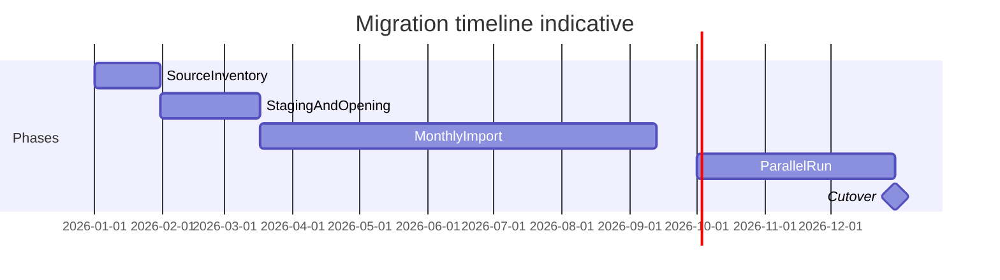
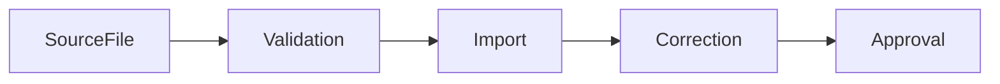

# 2026 Migration and Parallel Run Plan

Status: **Planning** — formal migration roadmap; no import scripts in this document  
Scope: Legacy Excel/DBF → asa-con-v0 gradual cutover, Jan 2026 start, Oct–Dec 2026 parallel-run target  
Related: [STOCK_GO_LIVE_READINESS.md](./STOCK_GO_LIVE_READINESS.md), [31_FINANCE_CORE_16A_COA_IMPORT.md](./31_FINANCE_CORE_16A_COA_IMPORT.md), [15_FINANCE_PERIODS.md](./15_FINANCE_PERIODS.md), [RECEIPT_SETUP.md](./RECEIPT_SETUP.md), [30_MASTER_DATABASE.md](./30_MASTER_DATABASE.md), [POS_COMPLETION_ROADMAP.md](./POS_COMPLETION_ROADMAP.md), [10_REPORTING_AND_SUMMARY_KERNEL.md](./10_REPORTING_AND_SUMMARY_KERNEL.md), [32_PRISMA_DB_BASELINE.md](./32_PRISMA_DB_BASELINE.md)

---

## 1. Context

| Factor | Detail |
|--------|--------|
| Legacy system | Still the **current operating system** — authoritative during migration |
| Legacy data | Stored in `.xls` / `.xlsx` files; Delphi 6 `.dbf` source/export files where available |
| asa-con-v0 start | **2026-01-01** — operational starting point for the new system |
| Migration style | **Gradual**, not big-bang |
| Manual correction | **Expected and accepted** — part of normal migration workflow |
| Catch-up target | **Oct–Dec 2026** (indicative; not a fixed deadline) |
| Final cutover | Only after parallel run is **proven stable** |

---

## 2. Core principle

| Rule | Meaning |
|------|---------|
| Legacy = operational source | Authoritative for sales, stock, and finance reporting during migration |
| asa-con-v0 = validated system under construction | Runs side-by-side until proven; not sole authority until cutover |
| No direct DB correction | Unless explicitly documented and reviewed |
| Auditable corrections | Prefer domain documents over hidden row edits |

**Old system** = current operational source during migration.  
**asa-con-v0** = new validated operational system under construction.

Corrections should be represented as auditable documents where possible.

---

## 3. Migration phases

### Phase A — Source File Inventory

Collect all legacy source files and record metadata before any import.

| Task | Detail |
|------|--------|
| Collect files | All `.xls`, `.xlsx`, and `.dbf` files, including Delphi 6 DBF export/source files where available |
| Classify by domain | See domain table below |
| Record metadata | Source, period covered, owner, known data quality issues, **trust level** (A–D) |

**Domain classification**

| Domain | Examples |
|--------|----------|
| Product / SKU / barcode | Product master, barcode lists, reference codes |
| Opening stock | Beginning balances, count sheets |
| Stock movements | Transfers, adjustments, issues, receipts |
| POS / sales | Daily sales, receipts, Z-read summaries |
| Payments | Cash, card, transfer, petty cash |
| Finance / accounting | GL balances, vouchers, COA exports |
| Staff / branch / location | Branch master, staff lists, location codes |
| Supplier / purchase | Purchase orders, supplier master (if applicable) |

#### Legacy Data Source Priority

When multiple sources exist for the same data, use this trust priority (highest → lowest):

1. Native Delphi 6 DBF files (highest trust)
2. System-generated DBF exports
3. System-generated XLS/XLSX exports
4. User-maintained spreadsheets
5. Reconstructed/manual spreadsheets (lowest trust)

**Rules**

- When multiple sources disagree, the highest-trust source wins unless documented otherwise.
- Any exception must be recorded in the correction log.
- Original source files must be retained for audit purposes.

#### Source Trust Levels

| Trust Level | Source Type | Description |
|-------------|-------------|-------------|
| A | Original DBF | Native operational database records |
| B | System-generated export | Export produced directly by legacy software |
| C | User-maintained spreadsheet | Spreadsheet updated manually by staff |
| D | Reconstructed data | Data recreated from paper records or manual investigation |

**Guidance**

- Reconciliation decisions should favor higher trust levels.
- Lower-trust data may be used only when higher-trust sources are unavailable.
- Any override must be documented.

Inventory metadata (Phase A) should record trust level per file. Phase B staging validation should flag cross-source conflicts using this policy.

---

### Phase B — Staging Layer

Do not import directly into production tables.

| Task | Detail |
|------|--------|
| Staging structure | Define or create staging import structure first (format TBD in future import specs) |
| Normalize | Columns, dates, product codes, branch codes, payment types |
| Validate | Detect duplicates, missing product mappings, invalid quantities, invalid dates, unmatched references |
| Report | Produce import validation reports **before** applying data |
| Preview pattern | Follow COA preview/apply model — see [31_FINANCE_CORE_16A_COA_IMPORT.md](./31_FINANCE_CORE_16A_COA_IMPORT.md) |
| Migration Ledger | **One ledger entry per import batch** — opened at validation, updated through correction and approval (see [Migration Ledger](#migration-ledger)) |

---

### Phase C — Opening Balance at 2026-01-01

Treat **2026-01-01** as the clean start point.

| Task | Detail |
|------|--------|
| Opening stock | Prepare opening stock by branch/location — see [STOCK_GO_LIVE_READINESS.md](./STOCK_GO_LIVE_READINESS.md) |
| Opening finance | Prepare opening finance balances if needed |
| Product baseline | Prepare product/reference stock baseline |
| History scope | Do **not** import unnecessary older operational history unless required for audit |

---

### Phase D — Monthly Historical Import

Import data month by month from **Jan 2026** through the current month.

| Month | Status |
|-------|--------|
| Jan 2026 | Pending |
| Feb 2026 | Pending |
| Mar 2026 | Pending |
| … | Continue until current month |

**Per-month validation checkpoints**

| Checkpoint | Requirement |
|------------|-------------|
| Sales total | Matches legacy |
| Payment total | Matches legacy |
| Stock movement | Explainable |
| Negative stock | Reviewed |
| Product mapping gaps | Listed |
| Corrections | Documented |

Each completed month should have a signed-off checkpoint note.

#### Monthly Reconciliation Gate

A month is considered **completed** only when **all** of the following are true:

- Sales totals match legacy records
- Payment totals match legacy records
- Stock variances are explained
- Product mapping gaps are reviewed
- Required corrections are documented
- Reviewer sign-off is completed

**Sign-off template**

| Field | Value |
|-------|-------|
| Month | e.g. `2026-03` |
| Reviewer | Name / role |
| Review Date | ISO date |
| Status | `PASS` or `FAIL` |
| Notes | Variances, corrections, blockers |

**Gate rule:** Historical import may continue to the next month **only after** sign-off is recorded (PASS, or FAIL with documented remediation plan and re-review).

Monthly sign-off notes should list **Migration Ledger Batch ID(s)** for that month (see [Migration Ledger](#migration-ledger)).

---

### Phase E — Manual Correction

Manual correction is part of the migration, **not a failure**.

| Requirement | Detail |
|-------------|--------|
| Traceability | Every correction must be traceable |
| Preferred documents | Stock adjustment, product mapping correction, payment correction, finance adjustment, ReferenceStock correction |
| Avoid | Hidden edits directly in database rows |
| Required fields | Reason, actor, date, source evidence |

---

### Phase F — Catch-up and Parallel Run

When imported data catches up with current operation, start parallel run.

| Rule | Detail |
|------|--------|
| Authority | Legacy system remains **official** at first |
| Side-by-side | asa-con-v0 runs in parallel |
| Compare daily or weekly | POS totals, payment totals, stock movement, staff workflow, receipt/print output, finance posting behavior |
| Expected window | **Oct–Dec 2026** (indicative) |
| Stock detail | Align with [STOCK_GO_LIVE_READINESS.md §8](./STOCK_GO_LIVE_READINESS.md) — daily for first 1–2 weeks, then weekly until stable |

---

### Phase G — Cutover

Cutover to 100% asa-con-v0 only when **all** of the following are true:

| # | Criterion |
|---|-----------|
| 1 | POS flow is stable |
| 2 | Stock documents are stable |
| 3 | Finance posting and period lock rules work correctly |
| 4 | Receipt/print flows verified with **real hardware** — see [RECEIPT_SETUP.md](./RECEIPT_SETUP.md) |
| 5 | Staff can operate without heavy developer support |
| 6 | Month-end review is accepted |
| 7 | Rollback plan exists |
| 8 | Owner approves final switch |

**Rollback plan (minimum)**

- Revert operational authority to legacy system
- Freeze asa-con-v0 posting for new transactions
- Document last-good parallel-run comparison date
- Record rollback contact and procedure

#### Cutover Freeze Window

Before final cutover:

- Freeze new migration imports
- Freeze historical data corrections
- Complete final reconciliation review
- Generate final migration report
- Generate final variance report
- Obtain owner approval
- Record official cutover date
- Record rollback contact and procedure

**Purpose:** Prevent last-minute changes from affecting final cutover validation.

Freeze window begins after parallel-run stability is demonstrated and ends only after owner approval and recorded cutover date.

---

## Migration Ledger

Maintain a migration ledger entry for **every import batch** (opening balance load, monthly historical batch, domain-specific staging apply, etc.).

**Required fields**

| Field | Description |
|-------|-------------|
| Batch ID | Unique identifier per import batch (e.g. `MIG-2026-03-001`) |
| Import Date | Date batch was applied to asa-con-v0 |
| Source Files | File names/paths from read-only archive (Phase A inventory) |
| Source Trust Level | Highest applicable A–D level for the batch (Phase A) |
| Covered Period | Date/month range the batch represents |
| Imported By | Person or role who ran the import |
| Validation Result | `PASS` / `FAIL` / `PASS_WITH_WARNINGS` + link to validation report |
| Corrections Applied | References to correction documents or correction-log entries (Phase E) |
| Reviewer | Person who reviewed the batch |
| Approval Date | Date batch was approved for production use |
| Notes | Variances, exceptions, trust-level overrides, blockers |

**Purpose** — complete audit trail per batch:

- Every batch must be traceable: **Source File → Validation → Import → Correction → Approval**
- Phase D monthly sign-off may reference one or more ledger Batch IDs for that month
- Phase G final migration report aggregates all ledger entries
- [Data Preservation Policy](#data-preservation-policy) requires ledger records be retained with source files and validation reports

**Format:** Spreadsheet, markdown log, or structured folder under a future `data/migration-ledger/` path — format TBD at first import; this document defines required fields only.

---

## 4. Risk register

| Risk | Impact | Mitigation |
|------|--------|------------|
| Bad legacy Excel data | High | Staging validation reports; trust-level policy; manual review before apply |
| Product code mismatch | High | Product mapping table; Phase B gap detection; documented mapping corrections |
| Duplicate documents | Medium | Staging dedup checks; import validation reports |
| Missing opening stock | High | Phase C opening baseline; [STOCK_GO_LIVE_READINESS](./STOCK_GO_LIVE_READINESS.md) dry run and verification |
| Staff training delay | Medium | Staff training checklist; parallel run before cutover |
| Parallel totals do not match | High | Daily/weekly comparison reports; reconciliation dashboard; no cutover until explained |
| Direct DB edits creating audit gaps | High | Core principle — domain documents only; correction log |
| Hardware print issues | Medium | [RECEIPT_SETUP](./RECEIPT_SETUP.md) verification with real hardware before cutover |
| Migration takes longer than expected | Medium | Phased timeline; monthly gates; Oct–Dec parallel run is indicative not fixed |
| Conflicting source files | High | Trust-level policy (Phase A); reconciliation review; documented overrides in correction log |
| Loss of original source files | High | Read-only archive; backup retention; [Data Preservation Policy](#data-preservation-policy) |

---

## 5. Deliverables checklist

- [ ] Source file inventory
- [ ] Import template/staging format
- [ ] Product mapping table
- [ ] Opening stock baseline
- [ ] Opening finance baseline
- [ ] Monthly import reports
- [ ] Migration ledger (per-batch audit trail)
- [ ] Correction log
- [ ] Parallel-run comparison report
- [ ] Staff training checklist
- [ ] Cutover approval note

---

## Data Preservation Policy

- Original DBF files must never be modified.
- Original XLS/XLSX files must never be overwritten.
- Imported datasets must be reproducible from source files.
- Migration logs and validation reports should be retained.
- Correction records must remain auditable.
- Migration ledger entries must be retained alongside validation reports.

Cross-references: Phase A (source retention), Phase E (correction log), [Migration Ledger](#migration-ledger), Phase G (final reports archive).

---

## 6. Architecture rules (asa-con-v0 constraints)

During migration and parallel run, asa-con-v0 must respect existing architecture:

| Rule | Reference |
|------|-----------|
| `schema.prisma` remains source of truth | [04_PRISMA_KERNEL.md](./04_PRISMA_KERNEL.md) |
| Use `npx prisma db push` for current project workflow unless explicitly changed | [32_PRISMA_DB_BASELINE.md](./32_PRISMA_DB_BASELINE.md) |
| Do not bypass accounting period locks | [15_FINANCE_PERIODS.md](./15_FINANCE_PERIODS.md) |
| Posting must respect `AccountingPeriod.status === OPEN` | [15_FINANCE_PERIODS.md](./15_FINANCE_PERIODS.md) |
| Reconciliation remains read-only | [16_FINANCE_RECONCILIATION.md](./16_FINANCE_RECONCILIATION.md) |
| Stock correction should use stock documents where possible | [29_STOCK_DOCUMENT_WORKFLOW.md](./29_STOCK_DOCUMENT_WORKFLOW.md) |
| Print/screen reports use the same query/sort/grouping logic | [10_REPORTING_AND_SUMMARY_KERNEL.md](./10_REPORTING_AND_SUMMARY_KERNEL.md) |
| Do not create separate print-only calculation logic | [10_REPORTING_AND_SUMMARY_KERNEL.md](./10_REPORTING_AND_SUMMARY_KERNEL.md) |

---

## 7. Explicit non-goals (for this document)

| Non-goal | Reason |
|----------|--------|
| Import scripts | Defined in future domain-specific specs/scripts |
| Schema changes | Migration uses existing v0 schema |
| Production data writes | This document is planning only |
| Big-bang cutover | Gradual import and parallel run are required |

Future import specs will be separate docs/scripts per domain.
