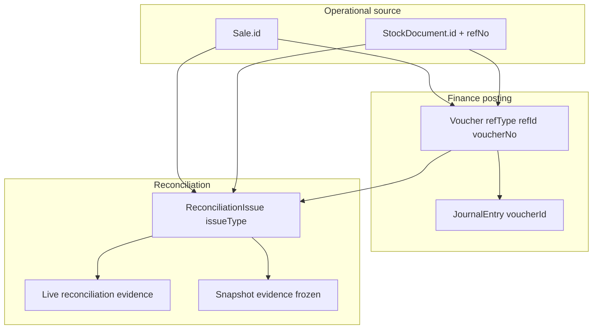
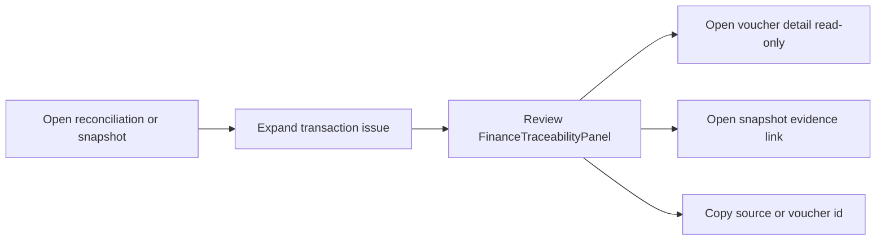

# Finance Traceability (Phase 20A)

Status: **Done** — read-only finance lineage navigation from reconciliation issues and frozen snapshots  
Scope: Presentation layer only — no reconciliation math, posting, or schema changes  
Related: [16_FINANCE_RECONCILIATION.md](./16_FINANCE_RECONCILIATION.md), [17_RECONCILIATION_DRILLDOWN.md](./17_RECONCILIATION_DRILLDOWN.md), [18_RECONCILIATION_SNAPSHOTS.md](./18_RECONCILIATION_SNAPSHOTS.md), [19_FINANCE_RECONCILIATION_STABILIZATION.md](./19_FINANCE_RECONCILIATION_STABILIZATION.md), [21_FINANCE_CLOSE_WORKFLOW.md](./21_FINANCE_CLOSE_WORKFLOW.md)

Phase 20A adds **audit investigation navigation** across operational sources, finance vouchers, journals, reconciliation issues, and snapshot evidence. Lineage data already existed on issue rows; Phase 20A derives and displays it read-only in the UI.

---

## 1. Purpose

| Goal | Description |
|------|-------------|
| Lineage visibility | Show operational → voucher → journal → issue → evidence in deterministic order |
| Voucher read surface | Read-only `GET /api/finance/vouchers/[id]` and `/finance/vouchers/[id]` detail page |
| Live drill-down trace | Expand reconciliation issues on the live dashboard |
| Frozen snapshot trace | Derive trace from snapshot payload refs only — no live voucher fetch |
| Compare trace | View trace on snapshot issue diffs (client-side diff) |
| Audit workflow | Copy refs, navigate to voucher detail, link to snapshot evidence |

**Non-goals:** posting, auto-fix, reconciliation recalculation, schema changes, operational detail pages for POS/stock documents.

---

## 2. Lineage model

### UI step order (deterministic)

1. **Operational** — POS sale or stock document (`sourceType`, `sourceId`, `documentRef`)
2. **Voucher(s)** — sorted by `voucherNo` (or id)
3. **Journal(s)** — sorted by journal id; linked to parent voucher
4. **Issue** — reconciliation issue type and id
5. **Evidence** — live reconciliation context or frozen snapshot id (when context provided)

Missing refs render as absent steps — **no inference** and no live reconciliation on snapshot pages.

---

## 3. Identity keys (reuse only)

| Layer | Key fields | Source |
|-------|------------|--------|
| Operational | `Sale.id`, `StockDocument.id`, `StockDocument.refNo` | `prisma/schema.prisma` |
| Finance voucher | `(refType, refId)` unique, `voucherNo`, `id` | `lib/finance/posting-types.ts` |
| Finance journal | `JournalEntry.id`, `JournalEntry.voucherId` | schema |
| Reconciliation issue | `id = {sourceType}:{sourceId}:{issueType}` | `lib/finance/reconciliation.ts` |
| Issue row (live) | `vouchers[]`, `journalEntries[]` enriched at read time | `lib/finance/reconciliation-issue-rows.ts` |
| Snapshot issue (frozen) | Same shape copied into `issuesPayload.issues` | Phase 18 capture |

Finance `refType` values: `POS_SALE`, `STOCK_DOC_POST`.

---

## 4. Helper layer

Pure functions in [`lib/finance-ui/traceability.ts`](../lib/finance-ui/traceability.ts):

| Export | Role |
|--------|------|
| `buildOperationalTrace`, `buildVoucherTrace`, `buildJournalTrace` | Per-step builders |
| `buildFinanceTrace`, `buildSnapshotIssueTrace` | Full ordered trace |
| `resolveIssueFinanceTrace` | Live vs snapshot entry point |
| `resolveSnapshotDiffIssueTrace` | Compare diff side selection |
| `sortTraceSteps`, `formatTraceLabel`, `formatFinanceRefType` | Deterministic ordering and labels |

Link helpers: [`lib/finance-ui/trace-links.ts`](../lib/finance-ui/trace-links.ts) — voucher detail path, snapshot detail path, label formatters.

Tests: [`__tests__/lib/finance-ui/traceability.test.ts`](../__tests__/lib/finance-ui/traceability.test.ts).

---

## 5. UI surfaces

| Surface | Component / route | Trace mode |
|---------|-------------------|------------|
| Live issues drill-down | [`ReconciliationIssuesTable`](../components/finance/ReconciliationIssuesTable.tsx) + [`FinanceTraceabilityPanel`](../components/finance/FinanceTraceabilityPanel.tsx) | Live evidence step |
| Voucher detail | `/finance/vouchers/[id]`, [`VoucherDetailView`](../components/finance/VoucherDetailView.tsx) | Read-only lines + journal |
| Snapshot detail issues | Same issues table with `snapshotTrace` prop | Frozen refs + snapshot evidence link |
| Snapshot compare | [`ReconciliationSnapshotCompareView`](../components/finance/ReconciliationSnapshotCompareView.tsx) — **View trace** on issue diffs | Frozen refs from left or right snapshot |

Shared badges: [`traceability-badges.tsx`](../components/finance/traceability-badges.tsx), [`traceability-ui.tsx`](../components/finance/traceability-ui.tsx).

### Voucher read API

| Endpoint | Kernel | Purpose |
|----------|--------|---------|
| `GET /api/finance/vouchers/[id]` | [`getVoucherDetailById`](../lib/finance/voucher-read.ts) | Voucher lines + journal header (read-only) |

No posting endpoints. Finance UI boundary rules allow `voucher-read` but block posting module imports.

---

## 6. Live vs frozen trace

| Context | Evidence step | Data source | Disclaimer |
|---------|---------------|-------------|--------------|
| Live dashboard issues | Live reconciliation evidence | Issue row from `GET /issues` + helpers | Standard read-only footer |
| Snapshot detail / compare | Snapshot evidence → link to snapshot id | Frozen `issuesPayload.issues` only | `FROZEN_TRACE_DISCLAIMER` in panel |

Frozen trace **never** calls live voucher or issues APIs on snapshot pages. Voucher detail links remain available when a voucher id was captured in the frozen payload.

Performance (Phase 20A step 6):

- Trace derived only when issue row or compare trace is **expanded**
- `FinanceTraceabilityPanel` and issue rows memoized
- Stable `snapshotTraceContext` on snapshot detail view

---

## 7. Read-only guarantees

| Rule | Phase 20A enforcement |
|------|----------------------|
| No posting / auto-fix | Links and copy only; no Post/Reconcile buttons in trace UI |
| No reconciliation recalc | Helpers consume existing DTOs only |
| Immutable snapshots | Snapshot trace from frozen `vouchers` / `journalEntries` arrays |
| No schema change | Voucher read uses existing models |
| Operational source of truth | Operational step is display anchor; finance joins existing refs |
| No posting lock bypass | Trace UI is navigation only |

Architecture audits: finance UI boundary grep, finance API posting import rules (allows `voucher-read`, blocks `lib/finance/voucher` posting module).

---

## 8. Audit investigation workflow

Typical paths:

1. **Live variance** — `/finance/reconciliation` → click aggregate row → expand issue → trace panel → voucher detail if posted.
2. **Frozen month-end** — `/finance/reconciliation/snapshots/[id]` → expand issue → frozen trace → snapshot evidence step links back to same snapshot.
3. **Snapshot compare** — `/finance/reconciliation/snapshots/compare` → issue changes → **View trace** on added/removed/changed issues.

Operational POS/stock documents: display + **Copy ID** only until operational detail routes exist.

---

## 9. Phase 20A delivery summary

| Step | Deliverable |
|------|-------------|
| 20A-1 | Traceability audit (no code) |
| 20A-2 | `lib/finance-ui/traceability.ts` helpers |
| 20A-3 | Voucher read API + trace links in issues table |
| 20A-4 | `FinanceTraceabilityPanel` timeline |
| 20A-5 | Snapshot detail + compare frozen trace |
| 20A-6 | Lazy mount + memoization cleanup |
| 20A-7 | `traceability.test.ts` + component tests |
| 20A-8 | This document |

At completion: **532 tests passing**, `npm run build` clean.

---

## 10. Remaining gaps (future phases)

| Gap | Notes |
|-----|-------|
| Operational detail pages | Deep links for Sale / StockDocument UI |
| Stock ledger in trace | `StockTransaction` rows not on issue DTO today |
| GL line drill-down | Journal account-level investigation |
| Cross-branch multi-voucher tools | Out of 20A scope |
| Trace PDF export | Out of scope; CSV/print remain on snapshot evidence (19C) |

---

## 11. Related docs

- Live dashboard: [16_FINANCE_RECONCILIATION.md](./16_FINANCE_RECONCILIATION.md)
- Transaction issues API: [17_RECONCILIATION_DRILLDOWN.md](./17_RECONCILIATION_DRILLDOWN.md)
- Frozen snapshots: [18_RECONCILIATION_SNAPSHOTS.md](./18_RECONCILIATION_SNAPSHOTS.md)
- Stabilization baseline: [19_FINANCE_RECONCILIATION_STABILIZATION.md](./19_FINANCE_RECONCILIATION_STABILIZATION.md)
- Close readiness checklist: [21_FINANCE_CLOSE_WORKFLOW.md](./21_FINANCE_CLOSE_WORKFLOW.md)
