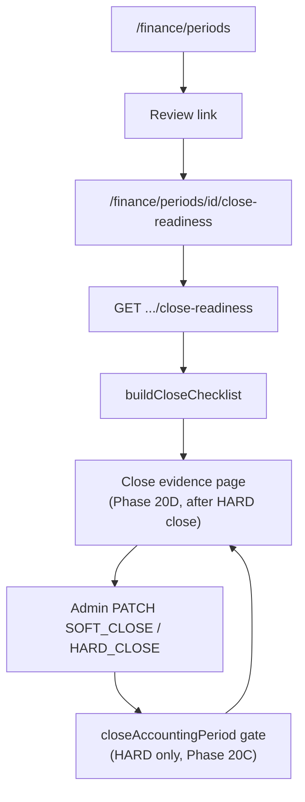

# Finance Close Workflow (Phase 20B)

Status: **Done** — read-only close readiness checklist, blocker rules, evidence navigation; Phase 20C enforces gate on HARD close  
Scope: Workflow and orchestration — checklist is read-only; HARD close enforcement lives in `closeAccountingPeriod`  
Related: [15_FINANCE_PERIODS.md](./15_FINANCE_PERIODS.md), [16_FINANCE_RECONCILIATION.md](./16_FINANCE_RECONCILIATION.md), [18_RECONCILIATION_SNAPSHOTS.md](./18_RECONCILIATION_SNAPSHOTS.md), [20_FINANCE_TRACEABILITY.md](./20_FINANCE_TRACEABILITY.md), [22_FINANCE_CLOSE_GATE.md](./22_FINANCE_CLOSE_GATE.md), [23_FINANCE_CLOSE_EVIDENCE.md](./23_FINANCE_CLOSE_EVIDENCE.md)

Phase 20B adds a **period close readiness review** surface for finance admins. Phase 20C **enforces** the same checklist on HARD close — see [22_FINANCE_CLOSE_GATE.md](./22_FINANCE_CLOSE_GATE.md). The readiness page remains read-only; enforcement is server-side in the domain layer.

---

## 1. Purpose

| Goal | Description |
|------|-------------|
| Close checklist | Deterministic BLOCKED / WARNING / PASS items grouped by reconciliation, snapshot, posting lock, audit evidence |
| Readiness status | Aggregate `READY`, `WARNING`, or `BLOCKED` from checklist severities |
| Evidence navigation | Deep links from checklist items to snapshot detail, trace, compare, live dashboard, evidence export |
| Admin review entry | **Review** link on period admin table → `/finance/periods/[id]/close-readiness` |
| Centralized rules | `CLOSE_BLOCKER_RULES` registry with thresholds — single source for tests and UI |

**Non-goals:** automated period close, posting into closed periods, reconciliation recalculation, snapshot capture from checklist, GL write-back, evidence export audit log.

---

## 2. Workflow (manual close review)

Typical month-end path:

1. **Ensure period exists** — `OPEN` on `/finance/periods`.
2. **Reconcile live** — `/finance/reconciliation` with branch + period filters.
3. **Capture snapshot** — manual capture on reconciliation dashboard ([Phase 18](./18_RECONCILIATION_SNAPSHOTS.md)).
4. **Review readiness** — **Review** on period row → checklist loads latest + prior snapshot for that branch/period.
5. **Resolve blockers** — investigate via linked snapshot trace, compare, or live dashboard; fix operational/posting issues outside this workflow.
6. **Export evidence (optional)** — browser CSV pack / audit print on snapshot detail ([18 §9](./18_RECONCILIATION_SNAPSHOTS.md#9-phase-19c--evidence-export-and-audit-print)).
7. **Close period manually** — return to `/finance/periods` → SOFT_CLOSE (ungated) then HARD_CLOSE when satisfied. HARD close runs the gate in `closeAccountingPeriod` — BLOCKED items reject with HTTP 409; WARNING allowed by default.
8. **Review close evidence (optional)** — on `HARD_CLOSED` periods, open **Close evidence** for the immutable audit record captured at close ([23](./23_FINANCE_CLOSE_EVIDENCE.md)).

The checklist page **never** triggers PATCH close. Close remains the period admin API ([15 §4](./15_FINANCE_PERIODS.md#4-admin-flow)). Phase 20C adds a confirmation dialog before HARD close that previews the same checklist data.

---

## 3. Readiness status model

| Status | Meaning |
|--------|---------|
| `BLOCKED` | One or more checklist items with severity `BLOCKED` |
| `WARNING` | No blockers; one or more `WARNING` items |
| `READY` | No blockers or warnings (all items `PASS` or `INFO`) |

Resolution: [`resolveCloseReadinessStatus`](../lib/finance/close-checklist.ts) — worst severity wins.

**Practical note:** When a snapshot exists, status is usually **`WARNING`** (not `READY`) because `audit-evidence-export-not-recorded` always fires — client-side export cannot be verified server-side.

---

## 4. Checklist groups and blocker rules

Registry: [`lib/finance/close-blocker-rules.ts`](../lib/finance/close-blocker-rules.ts)  
Evaluation: [`evaluateCloseBlockerRules`](../lib/finance/close-checklist.ts)  
Thresholds: `CLOSE_BLOCKER_THRESHOLDS.staleSnapshotDays = 7`

### Severity summary

| Severity | Examples |
|----------|----------|
| **BLOCKED** | Missing GL/source issues, no snapshot, scope mismatch, missing inventory/revenue dashboard rows, snapshot captured after hard close |
| **WARNING** | Soft-closed period, stale snapshot (>7d), compare drift, aggregate/issue variances, evidence export not recorded |
| **INFO** | Hard-closed period (informational) |
| **PASS** | Open posting, snapshot present, clean reconciliation, evidence export available |

### Rule IDs (ordered)

| ID | Group | Severity |
|----|-------|----------|
| `reconciliation-missing-gl-issues` | reconciliation | BLOCKED |
| `reconciliation-missing-source-issues` | reconciliation | BLOCKED |
| `reconciliation-no-snapshot` | reconciliation | BLOCKED |
| `snapshot-missing` | snapshot_evidence | BLOCKED |
| `snapshot-branch-mismatch` | snapshot_evidence | BLOCKED |
| `snapshot-period-mismatch` | snapshot_evidence | BLOCKED |
| `snapshot-missing-inventory-domain` | snapshot_evidence | BLOCKED |
| `snapshot-missing-revenue-domain` | snapshot_evidence | BLOCKED |
| `period-hard-closed-snapshot-after-close` | posting_lock | BLOCKED |
| `posting-lock-soft-closed` | posting_lock | WARNING |
| `snapshot-stale` | snapshot_evidence | WARNING |
| `snapshot-compare-drift` | snapshot_evidence | WARNING |
| `reconciliation-dashboard-variance` | reconciliation | WARNING |
| `reconciliation-issue-variance` | reconciliation | WARNING |
| `audit-evidence-unavailable` | audit_evidence | WARNING |
| `audit-evidence-export-not-recorded` | audit_evidence | WARNING |
| `posting-lock-hard-closed` | posting_lock | INFO |
| `posting-lock-open` | posting_lock | PASS |
| `snapshot-present` | snapshot_evidence | PASS |
| `reconciliation-clean` | reconciliation | PASS |
| `audit-evidence-export-ready` | audit_evidence | PASS |

Evidence inputs come from the **latest frozen snapshot** for `(branchId, periodKey)` plus optional **prior** snapshot for compare drift. No live reconciliation API calls during checklist build.

---

## 5. API and domain modules

### HTTP

| Method | Path | Auth | Response |
|--------|------|------|----------|
| `GET` | `/api/finance/periods/[id]/close-readiness` | None (middleware bypass) | `{ readiness: CloseChecklistResult & { priorSnapshotRef } }` |

Route: [`app/api/finance/periods/[id]/close-readiness/route.ts`](../app/api/finance/periods/[id]/close-readiness/route.ts)

Errors: `PERIOD_NOT_FOUND` (404) via `financeErrorResponse`.

### Domain (read-only)

| Module | Role |
|--------|------|
| [`lib/finance/close-readiness.ts`](../lib/finance/close-readiness.ts) | `getCloseReadinessByPeriodId` — load period, `findSnapshotsForPeriod`, `buildCloseChecklist` |
| [`lib/finance/close-checklist.ts`](../lib/finance/close-checklist.ts) | Pure helpers + `buildCloseChecklist`, `evaluateCloseBlockerRules` |
| [`lib/finance/close-checklist-types.ts`](../lib/finance/close-checklist-types.ts) | DTOs: `CloseReadinessStatus`, `CloseChecklistItem`, `CloseChecklistResult` |
| [`lib/finance/close-blocker-rules.ts`](../lib/finance/close-blocker-rules.ts) | `CLOSE_BLOCKER_RULES`, thresholds, `getCloseBlockerRule` |
| [`lib/finance/reconciliation-snapshot.ts`](../lib/finance/reconciliation-snapshot.ts) | `findSnapshotsForPeriod` — latest + prior headers for scope |

Public barrel exports: [`lib/finance/index.ts`](../lib/finance/index.ts).

---

## 6. UI

| Route | Component | Entry |
|-------|-----------|-------|
| `/finance/periods/[id]/close-readiness` | [`CloseReadinessPage`](../components/finance/CloseReadinessPage.tsx) | Period table **Review** link |
| — | [`CloseChecklistPanel`](../components/finance/CloseChecklistPanel.tsx) | Grouped checklist with per-item actions |
| — | [`CloseReadinessEvidenceActions`](../components/finance/CloseReadinessEvidenceActions.tsx) | Quick links (snapshot, trace, compare, live recon) |
| — | [`CloseReadinessStatusBadge`](../components/finance/CloseReadinessStatusBadge.tsx) | READY / WARNING / BLOCKED badge |

Fetchers: [`fetchCloseReadiness`](../lib/finance-ui/period-fetchers.ts)  
Link builders: [`lib/finance-ui/close-readiness-links.ts`](../lib/finance-ui/close-readiness-links.ts)

### Evidence deep links

| Target | Builder / anchor |
|--------|------------------|
| Live reconciliation | `/finance/reconciliation?branchId=&periodKey=` |
| Snapshot history | `/finance/reconciliation/snapshots?branchId=` |
| Snapshot detail | `/finance/reconciliation/snapshots/[id]` |
| Frozen trace | `.../snapshots/[id]#snapshot-issues` |
| Evidence export | `.../snapshots/[id]#snapshot-evidence-export` |
| Snapshot compare | `/finance/reconciliation/snapshots/compare?left=&right=` |

Per-item links: [`resolveChecklistItemLinks`](../lib/finance-ui/close-readiness-links.ts) maps rule id + group to navigation targets.

---

## 7. Architecture guarantees

| Guarantee | Detail |
|-----------|--------|
| Read-only | Checklist reads period + snapshot headers/payload only |
| No posting | No voucher/journal creation; no operational mutation |
| No snapshot mutation | Does not capture, update, or delete snapshots |
| No close automation | Readiness page has no Close button; PATCH close stays on period admin |
| HARD close gate (20C) | `closeAccountingPeriod(mode: HARD)` calls same checklist builder + `assertCloseReadiness` |
| SOFT ungated (20C) | SOFT close skips checklist and gate entirely |
| No lock bypass | Posting lock unchanged ([15 §13](./15_FINANCE_PERIODS.md#13-phase-19b--posting-lock-enforcement-audit)) |
| Operational source of truth | Checklist observes frozen snapshot payload — does not recalc reconciliation |
| Immutable snapshots | Uses captured payload as-is at review time |

Reconciliation modules remain read-only ([16 §5](./16_FINANCE_RECONCILIATION.md#5-read-only-guarantees)). Traceability links reuse Phase 20A helpers ([20_FINANCE_TRACEABILITY.md](./20_FINANCE_TRACEABILITY.md)).

---

## 8. Manual verification

1. Open `/finance/periods` as `HO_FINANCE` or `HO_ADMIN`.
2. Click **Review** on a period with no snapshot → status `BLOCKED`; items link to capture snapshot / live reconciliation.
3. Capture a snapshot for that branch/period on `/finance/reconciliation`.
4. Refresh close readiness → snapshot-present PASS; likely `WARNING` (export-not-recorded, possible variances).
5. Use checklist **Open snapshot**, **Investigate trace**, **Export evidence**, **Compare** links — confirm correct routes and anchors.
6. Network tab: only `GET /api/finance/periods/[id]/close-readiness` on the review page (no POST).
7. Soft-close period on admin page → checklist shows soft-closed WARNING; posting still blocked via existing kernel.
8. Confirm no Close / Hard close button on readiness page.
9. Attempt HARD close with BLOCKED readiness → API returns 409 with `blockers`; period stays `OPEN` or `SOFT_CLOSED`.
10. Resolve blockers, HARD close with WARNING-only readiness → succeeds under default policy.

---

## 9. Tests

| File | Coverage |
|------|----------|
| [`__tests__/lib/finance/close-checklist.test.ts`](../__tests__/lib/finance/close-checklist.test.ts) | Helpers, `buildCloseChecklist`, status rollup |
| [`__tests__/lib/finance/close-readiness.test.ts`](../__tests__/lib/finance/close-readiness.test.ts) | `getCloseReadinessByPeriodId` orchestration |
| [`__tests__/lib/finance/close-blocker-rules.test.ts`](../__tests__/lib/finance/close-blocker-rules.test.ts) | Rule registry + `evaluateCloseBlockerRules` |
| [`__tests__/app/api/finance/close-readiness-route.test.ts`](../__tests__/app/api/finance/close-readiness-route.test.ts) | GET route boundary |
| [`__tests__/lib/finance-ui/close-readiness-links.test.ts`](../__tests__/lib/finance-ui/close-readiness-links.test.ts) | Deep-link URL builders |

Phase 20C close gate tests — see [22 §10](./22_FINANCE_CLOSE_GATE.md#10-test-map):

| File | Coverage |
|------|----------|
| [`__tests__/lib/finance/close-gate.test.ts`](../__tests__/lib/finance/close-gate.test.ts) | Gate helpers, error codes, payloads |
| [`__tests__/lib/finance/close-gate-policy.test.ts`](../__tests__/lib/finance/close-gate-policy.test.ts) | Centralized policy |
| [`__tests__/lib/finance/close-gate-enforcement.test.ts`](../__tests__/lib/finance/close-gate-enforcement.test.ts) | Rollback, no side effects, no bypass |
| [`__tests__/lib/finance/period-close.test.ts`](../__tests__/lib/finance/period-close.test.ts) | Domain integration |
| [`__tests__/app/api/finance/periods-route.test.ts`](../__tests__/app/api/finance/periods-route.test.ts) | PATCH 409 payloads |
| [`__tests__/app/api/finance/finance-api-errors.test.ts`](../__tests__/app/api/finance/finance-api-errors.test.ts) | Error mapping |

At Phase 20C completion: **608 tests passing**, `npm run build` clean.

---

## 10. Phase 20B delivery summary

| Step | Deliverable |
|------|-------------|
| 20B-1 | Close workflow audit (no code) |
| 20B-2 | `close-checklist-types.ts`, `close-checklist.ts` pure helpers |
| 20B-3 | `GET .../close-readiness`, `getCloseReadinessByPeriodId`, `findSnapshotsForPeriod` |
| 20B-4 | Close readiness page + checklist panel (no Close button) |
| 20B-5 | Evidence links — snapshot, compare, trace, reconciliation deep links |
| 20B-6 | `close-blocker-rules.ts`, centralized rule registry |
| 20B-7 | Checklist + API + link tests |
| 20B-8 | This document |

---

## 11. Phase 20C — Close gate (enforcement)

Status: **Done** — see [22_FINANCE_CLOSE_GATE.md](./22_FINANCE_CLOSE_GATE.md)

| Concern | Phase 20B (advisory) | Phase 20C (enforced) |
|---------|----------------------|----------------------|
| Checklist | Read-only GET + review page | Same builder used at HARD close |
| SOFT close | Manual PATCH | **Ungated** — no checklist |
| HARD close | Manual PATCH | **Gated** — BLOCKED rejects; WARNING allowed by default |
| Errors | N/A on close | `CloseGateError` → HTTP 409 + blockers |
| Override | N/A | **None** — no force-close |

The readiness review page and GET API are unchanged in purpose. Enforcement adds server-side rejection when admins PATCH HARD_CLOSE with unresolved BLOCKED items.

---

## 12. Remaining gaps (future phases)

| Gap | Notes |
|-----|-------|
| Evidence export audit log | Server cannot verify client-side CSV download today |
| Scheduled snapshot capture | Still manual ([18](./18_RECONCILIATION_SNAPSHOTS.md)) |
| Override posting into SOFT_CLOSED | Policy hook exists in close-policy; not wired to posting kernel ([15 §16](./15_FINANCE_PERIODS.md#16-out-of-scope-future)) |
| Close reason / audit trail | Optional reviewer notes on PATCH; actor + checklist snapshot captured in 20D evidence |
| Strict WARNING policy in production | `STRICT_CLOSE_GATE_POLICY` + `warningExemptRuleIds` ready; wire via `getHardCloseGatePolicy()` with audit |
| Admin override with audit | Explicit override workflow — never silent bypass of gate |

All future close automation must preserve read-only reconciliation, immutable snapshots, posting-lock invariants, and single enforcement boundary in `closeAccountingPeriod`.

---

## 13. Phase 20D — Close evidence (post-close audit)

Status: **Done** — see [23_FINANCE_CLOSE_EVIDENCE.md](./23_FINANCE_CLOSE_EVIDENCE.md)

| Concern | Phase 20B (pre-close) | Phase 20D (post-close) |
|---------|----------------------|------------------------|
| Data | Live checklist from frozen snapshots | Immutable row written at successful HARD close |
| API | `GET .../close-readiness` | `GET .../close-evidence` |
| UI | Review before close | Close evidence after `HARD_CLOSED` |
| Rebuild | Checklist rebuilt on each GET | **Never** — displays stored payload only |

---

## 14. Related docs

- Period lifecycle, gate sequence, error codes: [15_FINANCE_PERIODS.md](./15_FINANCE_PERIODS.md)
- Close gate policy, rollback, test map: [22_FINANCE_CLOSE_GATE.md](./22_FINANCE_CLOSE_GATE.md)
- Close evidence snapshot: [23_FINANCE_CLOSE_EVIDENCE.md](./23_FINANCE_CLOSE_EVIDENCE.md)
- Reconciliation dashboard: [16_FINANCE_RECONCILIATION.md](./16_FINANCE_RECONCILIATION.md)
- Frozen snapshots: [18_RECONCILIATION_SNAPSHOTS.md](./18_RECONCILIATION_SNAPSHOTS.md)
- Lineage navigation: [20_FINANCE_TRACEABILITY.md](./20_FINANCE_TRACEABILITY.md)
