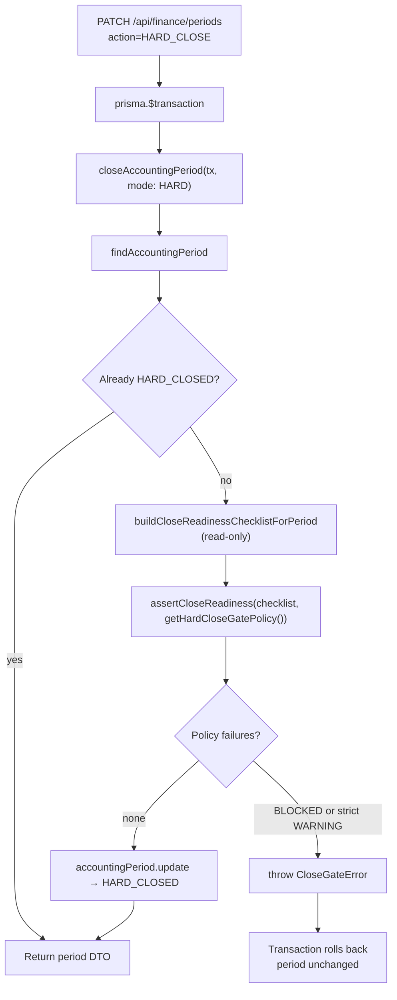
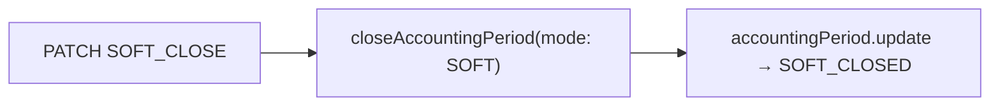

# Finance Close Gate (Phase 20C)

Status: **Done** — enforced HARD close gating with centralized policy, structured errors, and no-bypass guarantees  
Scope: Domain enforcement only — no posting math, reconciliation recalc, snapshot mutation, auto-fix, or force-close override  
Related: [15_FINANCE_PERIODS.md](./15_FINANCE_PERIODS.md), [21_FINANCE_CLOSE_WORKFLOW.md](./21_FINANCE_CLOSE_WORKFLOW.md), [18_RECONCILIATION_SNAPSHOTS.md](./18_RECONCILIATION_SNAPSHOTS.md)

Phase 20C upgrades Phase 20B **advisory** close readiness into **enforced** close gating. HARD close (`PATCH HARD_CLOSE` → `closeAccountingPeriod(..., mode: "HARD")`) evaluates the same frozen-snapshot checklist and rejects the transition when policy says blockers must be resolved. SOFT close remains review-only and **ungated**.

---

## 1. Purpose

| Goal | Description |
|------|-------------|
| Enforce HARD close | Block period transition when checklist has policy-failing items |
| Centralized policy | Single module for BLOCKED/WARNING rejection rules — no env sprawl in v1 |
| Structured errors | `CloseGateError` with `code`, `readinessStatus`, `blockers[]` → HTTP 409 |
| Transaction rollback | Failed gate throws before `accountingPeriod.update` — period row unchanged |
| No side effects | Gate reads frozen evidence only; never creates snapshots, exports evidence, posts vouchers, or reruns reconciliation |
| No bypass | All HARD close paths go through `closeAccountingPeriod()` |

**Non-goals:** force-close override, auto snapshot capture, auto evidence export, reconciliation recalculation, posting into closed periods, nested `prisma.$transaction`.

---

## 2. Close gate flow



SOFT close branch (ungated):



No readiness lookup or `assertCloseReadiness` on the SOFT path.

---

## 3. Enforcement boundary

**Single writer:** [`lib/finance/period-close.ts`](../lib/finance/period-close.ts) → `closeAccountingPeriod()`.

| Mode | Gate | Readiness build | Update |
|------|------|-----------------|--------|
| `SOFT` | **None** | Not called | `SOFT_CLOSED` when transitioning from `OPEN` |
| `HARD` | **Yes** (unless already `HARD_CLOSED`) | `buildCloseReadinessChecklistForPeriod` | `HARD_CLOSED` only after gate passes |
| `HARD` idempotent | Skipped | Not called | No-op return existing row |

HTTP adapter: [`app/api/finance/periods/route.ts`](../app/api/finance/periods/route.ts) — `HARD_CLOSE` and `SOFT_CLOSE` both delegate to `closeAccountingPeriod` inside one outer transaction. There is no alternate status-update path around the domain function.

---

## 4. Centralized close gate policy

Module: [`lib/finance/close-gate-policy.ts`](../lib/finance/close-gate-policy.ts)

| Symbol | Role |
|--------|------|
| `DEFAULT_CLOSE_GATE_POLICY` | v1 default: `rejectBlocked: true`, `rejectWarnings: false` |
| `HARD_CLOSE_GATE_POLICY` | Alias of default — applied at HARD close boundary |
| `STRICT_CLOSE_GATE_POLICY` | `rejectWarnings: true` — tests / future admin workflows |
| `getHardCloseGatePolicy()` | Entry point used by `closeAccountingPeriod` |
| `normalizeCloseGatePolicy()` | Undefined policy → hard-close default |
| `closeGateAppliesToCloseMode()` | `HARD` → true, `SOFT` → false |

### v1 policy rules

| Checklist severity | Default policy | Strict policy |
|--------------------|----------------|---------------|
| `BLOCKED` | **Rejects** HARD close | **Rejects** HARD close |
| `WARNING` | **Allowed** | **Rejects** (unless rule id in `warningExemptRuleIds`) |
| `PASS` / `INFO` | Allowed | Allowed |

Policy is **code-only** in v1 — no environment variables. Change behavior in `close-gate-policy.ts` only; do not scatter booleans in UI, API, or domain helpers.

Helpers: [`lib/finance/close-gate.ts`](../lib/finance/close-gate.ts) — `selectCloseGateFailures`, `assertCloseReadiness`, `buildCloseBlockerError`, `resolveCloseGateErrorCode`.

---

## 5. Structured errors and HTTP mapping

Class: [`CloseGateError`](../lib/finance/close-gate-errors.ts)

| Field | Type | Purpose |
|-------|------|---------|
| `message` | string | Human-readable summary |
| `code` | `CloseGateErrorCode` | Machine code for UI/API |
| `readinessStatus` | `READY` \| `WARNING` \| `BLOCKED` | Aggregate checklist status |
| `blockers` | `CloseGateBlocker[]` | Failing items (id, group, severity, title, detail, refs) |

### Error codes

| Code | Typical trigger |
|------|-----------------|
| `CLOSE_SNAPSHOT_REQUIRED` | Missing snapshot / reconciliation-no-snapshot / scope mismatch rules |
| `CLOSE_EVIDENCE_REQUIRED` | `audit-evidence-unavailable` (BLOCKED) |
| `CLOSE_BLOCKED` | Other BLOCKED severity items (e.g. missing GL issues) |
| `CLOSE_READINESS_FAILED` | WARNING items when strict policy or explicit WARNING rejection |

Payload builder: `toCloseGateErrorPayload(err)` → API-safe JSON.

HTTP mapping: [`app/api/finance/shared/finance-api-errors.ts`](../app/api/finance/shared/finance-api-errors.ts) — `CloseGateError` → **409** with full payload:

```json
{
  "error": "Period close blocked: 1 blocker must be resolved",
  "code": "CLOSE_SNAPSHOT_REQUIRED",
  "readinessStatus": "BLOCKED",
  "blockers": [{ "id": "snapshot-missing", "group": "snapshot_evidence", "severity": "BLOCKED", ... }]
}
```

On gate failure the PATCH handler does **not** reload the period DTO — the transaction aborts and the period row is unchanged.

---

## 6. Rollback behavior

`closeAccountingPeriod` runs inside the caller's `prisma.$transaction`. Gate evaluation happens **before** `accountingPeriod.update`:

1. Load period row.
2. Build checklist (read-only queries).
3. `assertCloseReadiness` — throws `CloseGateError` if policy failures exist.
4. Update only if step 3 passes.

Because the throw occurs before the update, a blocked HARD close leaves `status` and `closedAt` unchanged (typically still `OPEN` or `SOFT_CLOSED`). The outer transaction rolls back any work done in the same tx (though the gate path performs no writes).

---

## 7. No side effects (read-only gate)

The close gate path must **never**:

| Forbidden action | Guarantee |
|------------------|-----------|
| Snapshot creation | No `createManualSnapshot`, no `reconciliationSnapshot.create` |
| Evidence export | No server-side evidence pack generation during close |
| Live reconciliation | No `runFinanceReconciliation` — checklist uses `findSnapshotsForPeriod` + frozen payload |
| Posting | No `postOperationalVoucher` / voucher or journal writes |
| Snapshot mutation | No update/delete of existing snapshot rows |
| Nested transactions | Finance joins caller tx; close route opens one outer `$transaction` |

Checklist build reuses Phase 20B logic: [`buildCloseReadinessChecklistForPeriod`](../lib/finance/close-readiness.ts) → `findSnapshotsForPeriod` → `buildCloseChecklist`. Same inputs as the read-only GET close-readiness API — no duplicated live reconciliation.

---

## 8. UI confirmation (Phase 20C Steps 4–5)

Before PATCH HARD_CLOSE, period admin UI fetches close readiness and surfaces blockers:

| Component | Role |
|-----------|------|
| [`HardCloseConfirmDialog`](../components/finance/HardCloseConfirmDialog.tsx) | Fetches readiness; disables confirm when BLOCKED; WARNING requires acknowledgment checkbox |
| [`CloseGateBlockerList`](../components/finance/CloseGateBlockerList.tsx) | Blocker cards with group, rule id, severity, action links |
| [`resolveCloseGateBlockerLinks`](../lib/finance-ui/close-readiness-links.ts) | Deep links to reconciliation, snapshot, trace, evidence surfaces |

UI mirrors server policy for UX only — **enforcement is always server-side** in `closeAccountingPeriod`. There is no client-side force-close or override flag.

---

## 9. No force-close override

v1 has **no** bypass for:

- Admin override with reason
- `forceClose: true` query/body flag
- Direct Prisma status update from API routes
- Skipping `assertCloseReadiness` on HARD path (except idempotent already-`HARD_CLOSED`)

Future override workflows must go through explicit policy injection and audit — not ad-hoc route flags.

---

## 10. Test map

| File | Coverage |
|------|----------|
| [`__tests__/lib/finance/close-gate.test.ts`](../__tests__/lib/finance/close-gate.test.ts) | Helpers, error codes, ordering, default BLOCKED-only rejection, WARNING allowance, payload shape |
| [`__tests__/lib/finance/close-gate-policy.test.ts`](../__tests__/lib/finance/close-gate-policy.test.ts) | Default/strict policy, exemptions, `closeGateAppliesToCloseMode` |
| [`__tests__/lib/finance/close-gate-enforcement.test.ts`](../__tests__/lib/finance/close-gate-enforcement.test.ts) | Rollback, no side effects, idempotent HARD, ungated SOFT, read-only snapshot access |
| [`__tests__/lib/finance/period-close.test.ts`](../__tests__/lib/finance/period-close.test.ts) | Integration with mocked checklist, centralized policy, gate enforcement |
| [`__tests__/app/api/finance/periods-route.test.ts`](../__tests__/app/api/finance/periods-route.test.ts) | PATCH 409 payloads, no-bypass routing, full CloseGateError JSON |
| [`__tests__/app/api/finance/finance-api-errors.test.ts`](../__tests__/app/api/finance/finance-api-errors.test.ts) | All `CloseGateErrorCode` → HTTP 409 mapping |
| [`__tests__/lib/finance-ui/close-readiness-links.test.ts`](../__tests__/lib/finance-ui/close-readiness-links.test.ts) | Blocker deep-link resolution for failure surfaces |

At Phase 20C completion: **608 tests passing**, `npm run build` clean.

---

## 11. Phase 20C delivery summary

| Step | Deliverable |
|------|-------------|
| 20C-1 | Close gate audit (no code) |
| 20C-2 | `close-gate-errors.ts`, `close-gate.ts` types and helpers |
| 20C-3 | Enforce gate in `closeAccountingPeriod`, API 409 mapping |
| 20C-4 | Hard close confirmation dialog UX |
| 20C-5 | Close blocker surfaces with action links |
| 20C-6 | `close-gate-policy.ts` — centralized policy |
| 20C-7 | Enforcement + no-bypass test suite |
| 20C-8 | This document |

---

## 12. Future override / audit workflow (not implemented)

| Capability | Notes |
|------------|-------|
| Strict WARNING policy in production | Wire `STRICT_CLOSE_GATE_POLICY` or per-branch config through `getHardCloseGatePolicy()` |
| Rule-level WARNING exemptions | `warningExemptRuleIds` already supported in policy type |
| Close reason capture | PATCH body `{ reason }` + audit log row on successful close |
| HO_ADMIN override with audit | Explicit override policy object + immutable audit trail — never silent bypass |
| Evidence export audit log | Server-side record when export completes — would downgrade `audit-evidence-export-not-recorded` |
| Scheduled / automated HARD close | Must still call `closeAccountingPeriod`; no direct status writes |

All future work must preserve: single enforcement boundary, transaction rollback on failure, read-only gate inputs, and no nested transactions.

---

## 13. Related docs

- Period lifecycle and posting lock: [15_FINANCE_PERIODS.md](./15_FINANCE_PERIODS.md)
- Close readiness checklist (Phase 20B): [21_FINANCE_CLOSE_WORKFLOW.md](./21_FINANCE_CLOSE_WORKFLOW.md)
- Frozen snapshots: [18_RECONCILIATION_SNAPSHOTS.md](./18_RECONCILIATION_SNAPSHOTS.md)
- Posting lock audit: [15 §13](./15_FINANCE_PERIODS.md#13-phase-19b--posting-lock-enforcement-audit)
