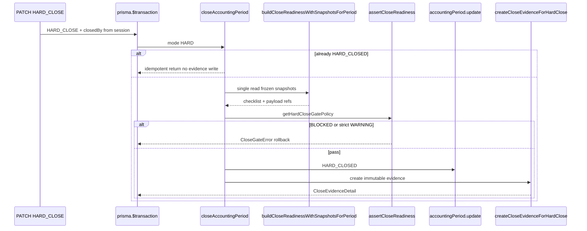

# Finance Close Evidence (Phase 20D)

Status: **Done** — immutable HARD-close evidence persisted at successful close; read-only GET API and review UI  
Scope: Audit artifact only — no posting, reconciliation recalc, snapshot mutation, or checklist rebuild  
Related: [15_FINANCE_PERIODS.md](./15_FINANCE_PERIODS.md), [21_FINANCE_CLOSE_WORKFLOW.md](./21_FINANCE_CLOSE_WORKFLOW.md), [22_FINANCE_CLOSE_GATE.md](./22_FINANCE_CLOSE_GATE.md), [24_FINANCE_CLOSE_EVIDENCE_EXPORT.md](./24_FINANCE_CLOSE_EVIDENCE_EXPORT.md), [25_FINANCE_REOPEN_CONTROL.md](./25_FINANCE_REOPEN_CONTROL.md), [26_FINANCE_REOPEN_APPROVAL.md](./26_FINANCE_REOPEN_APPROVAL.md), [27_FINANCE_PERIOD_AUDIT_TIMELINE.md](./27_FINANCE_PERIOD_AUDIT_TIMELINE.md), [18_RECONCILIATION_SNAPSHOTS.md](./18_RECONCILIATION_SNAPSHOTS.md), [20_FINANCE_TRACEABILITY.md](./20_FINANCE_TRACEABILITY.md)

Phase 20D records **what was true at HARD close time** after Phase 20C gate approval. Close readiness ([20B](./21_FINANCE_CLOSE_WORKFLOW.md)) is pre-close advisory; the close gate ([20C](./22_FINANCE_CLOSE_GATE.md)) enforces transition; close evidence ([20D](./23_FINANCE_CLOSE_EVIDENCE.md)) is the immutable post-close audit record.

---

## 1. Purpose

| Goal | Description |
|------|-------------|
| Immutable HARD close evidence | One **new** `AccountingPeriodCloseEvidence` row per successful HARD close (append-only history) |
| Audit artifact | Captures gate policy, checklist summaries, frozen reconciliation metrics, financial totals, and trace refs at close time |
| Idempotent HARD close | Period already `HARD_CLOSED` — no additional evidence row |
| Survives operational change | Embedded JSON payload; live reconciliation and future rule changes do not alter stored evidence |

**Non-goals:** SOFT close evidence, evidence update/delete, auto snapshot capture on close, live reconciliation during read, rebuilding checklist on GET, Staff or `ReconciliationSnapshot` FK relations.

---

## 2. Architecture

### HARD close flow (gate + evidence)



### Relationship to close gate (20C)

| Layer | Role |
|-------|------|
| Close gate | **Blocks** HARD close when policy-failing checklist items exist; runs **before** period update |
| Close evidence | **Records** checklist outcome and frozen inputs **after** gate passes and period is `HARD_CLOSED` |
| Failed HARD close | Gate throws → transaction rolls back → **no** evidence row |
| SOFT close | Ungated — **no** evidence row |

Evidence creation is an allowed side effect of successful HARD close only. It does not bypass, replace, or weaken the gate.

### Relationship to reconciliation snapshots (18)

| Artifact | When | Content |
|----------|------|---------|
| `ReconciliationSnapshot` | Manual capture on dashboard | Full frozen payload (`dashboardRows`, `issuesPayload`, aggregate results) |
| `AccountingPeriodCloseEvidence` | Successful HARD close | Compact decision snapshot + string refs to snapshot ids |

Evidence **references** snapshot ids (`reconciliationSnapshotId`, `priorSnapshotId`) but does **not** duplicate full `issuesPayload` or voucher arrays. Investigators open frozen snapshot UI for drill-down ([18](./18_RECONCILIATION_SNAPSHOTS.md), [20A](./20_FINANCE_TRACEABILITY.md)).

### Relationship to traceability (20A)

| Concern | Close evidence | Traceability UI |
|---------|----------------|-----------------|
| Data source | Stored `payload.traceabilityRefs` + header snapshot ids | Live issues API or frozen snapshot payload |
| Voucher/issue detail | Not embedded — link to snapshot pages | `FinanceTraceabilityPanel` on snapshot/issues |
| Compare drift | `compareDriftDetected` flag + compare links | Snapshot compare route |

---

## 3. Data model

Model: `AccountingPeriodCloseEvidence` in [`prisma/schema.prisma`](../prisma/schema.prisma)

| Field | Type | Purpose |
|-------|------|---------|
| `id` | UUID | Primary key |
| `periodId` | string | Period scope; multiple rows allowed (index `periodId`, `closedAt` desc) |
| `branchId`, `periodKey` | string | Scope headers for list/filter |
| `closeMode` | string | `"HARD"` in v1 |
| `closedAt` | DateTime | HARD close timestamp (aligned with period `closedAt`) |
| `closedByStaffId` | string | Actor id at close time (snapshot) |
| `closedByName` | string | Display name at close time (snapshot) |
| `closedByRole` | string | `HO_FINANCE` or `HO_ADMIN` at close time (snapshot) |
| `readinessStatus` | string | `READY` \| `WARNING` \| `BLOCKED` at close |
| `gatePolicyKey` | string | e.g. `default` |
| `reconciliationSnapshotId` | string? | Latest frozen snapshot used for review (no FK) |
| `priorSnapshotId` | string? | Prior snapshot for compare context (no FK) |
| `payloadVersion` | int | Currently `1` |
| `payload` | Json | Immutable compact bundle — see below |
| `createdAt` | DateTime | Row insert time |

**No Staff FK** — `closedBy*` fields are point-in-time copies. Staff renames or deletes do not change historical evidence.

**No `ReconciliationSnapshot` FK** — snapshot ids are audit references only.

### Actor snapshot fields

Resolved at PATCH HARD_CLOSE in [`app/api/finance/periods/route.ts`](../app/api/finance/periods/route.ts):

1. `requirePeriodAdminActor(session)` — role from session (not client body)
2. `resolvePeriodAdminStaffId(prisma, session staff key)` — internal staff id
3. `prisma.staff.findUnique` — name lookup once at close
4. Passed to `closeAccountingPeriod` as `closedBy: { staffId, name, role }`

Client-supplied actor fields are **never** trusted.

### Compact payload philosophy (`CloseEvidencePayloadV1`)

Types: [`lib/finance/close-evidence-types.ts`](../lib/finance/close-evidence-types.ts)  
Builder: [`lib/finance/close-evidence-build.ts`](../lib/finance/close-evidence-build.ts)

| Section | Stored | Not stored |
|---------|--------|------------|
| `period` | id, branch, periodKey, status before/after, opened/closed timestamps | — |
| `close` | mode, closedAt, actor snapshot fields | — |
| `gate` | policyKey, rejectBlocked, rejectWarnings | — |
| `checklist` | status, blocker/warning counts, item summaries (`id`, `group`, `severity`, `title` only) | Full `detail`, live rebuild |
| `reconciliationSummary` | `CloseChecklistMetrics` (counts, totals, domain flags, compare drift) | Live reconciliation API results |
| `financialTotals` | Four aggregate strings from frozen snapshot capture | Full `inventoryResult` / `salesResult` JSON |
| `traceabilityRefs` | Snapshot ids, snapshot header refs, issue **counts** | `issuesPayload.issues[]`, voucher/journal arrays |

Apply schema via `npx prisma db push` (source of truth: `schema.prisma`; no `db pull`).

---

## 4. API

| Method | Path | Auth | Purpose |
|--------|------|------|---------|
| `GET` | `/api/finance/periods/[id]/close-evidence` | Same as close-readiness (middleware bypass; JSON errors) | Read immutable evidence for period |

Route: [`app/api/finance/periods/[id]/close-evidence/route.ts`](../app/api/finance/periods/[id]/close-evidence/route.ts)

Response:

```json
{
  "evidence": {
    "id": "...",
    "periodId": "...",
    "closedByName": "Finance Admin",
    "readinessStatus": "WARNING",
    "payload": { "payloadVersion": 1, "...": "..." }
  }
}
```

Errors:

| Code | HTTP | When |
|------|------|------|
| `CLOSE_EVIDENCE_NOT_FOUND` | 404 | No evidence row (period never hard-closed or missing id) |

**No POST/PATCH/DELETE** on this resource. Creation occurs only inside `closeAccountingPeriod` on successful HARD close.

Domain read: `getCloseEvidenceByPeriodId` — exported from [`lib/finance/index.ts`](../lib/finance/index.ts).  
Create: `createCloseEvidenceForHardClose` — **internal** to [`period-close.ts`](../lib/finance/period-close.ts) / [`close-evidence.ts`](../lib/finance/close-evidence.ts); not exported for routes.

---

## 5. UI

| Route | Component | Purpose |
|-------|-----------|---------|
| `/finance/periods/[id]/close-evidence` | [`CloseEvidencePage`](../components/finance/CloseEvidencePage.tsx) | Read-only review of stored evidence |
| `/finance/periods` | [`PeriodTable`](../components/finance/PeriodTable.tsx) | **Review** (all periods) + **Close evidence** when `HARD_CLOSED` |

Fetcher: [`fetchCloseEvidence`](../lib/finance-ui/period-fetchers.ts) in `lib/finance-ui/period-fetchers.ts`  
Helpers: [`lib/finance-ui/close-evidence.ts`](../lib/finance-ui/close-evidence.ts) — path builder, trace links to snapshot/compare/trace/export anchors

### Page sections

| Section | Source |
|---------|--------|
| Header | Period, branch, HARD closed at, closed by, readiness badge at close |
| Gate summary | `payload.gate` + `payload.checklist` summaries |
| Reconciliation summary | `payload.reconciliationSummary` + issue counts from `traceabilityRefs` |
| Financial totals | `payload.financialTotals` (four compact strings) |
| Traceability | Snapshot ids + links to existing reconciliation snapshot pages |

Read-only rules: no refresh/rebuild, no close/reopen, no snapshot capture, no mutation APIs. Initial load calls GET close-evidence only. Phase 20E adds **Print audit report** and **Export evidence pack** on the same loaded evidence — see [24_FINANCE_CLOSE_EVIDENCE_EXPORT.md](./24_FINANCE_CLOSE_EVIDENCE_EXPORT.md).

---

## 6. Security and immutability rules

| Rule | Enforcement |
|------|-------------|
| Create only on successful HARD close | `createCloseEvidenceForHardClose` after gate + `accountingPeriod.update` in same tx |
| No create on blocked HARD close | Gate throw before update — rollback, no row |
| No create on SOFT close | SOFT path skips evidence module |
| No duplicate on idempotent HARD close | Early return when already `HARD_CLOSED`; `periodId` unique on create |
| No update/delete | No domain helpers or API routes for mutation |
| No rebuild on read | GET returns stored row; does not call `buildCloseReadinessChecklistForPeriod` |
| No live reconciliation | Evidence build at close uses frozen snapshot payload only (same as gate) |
| No snapshot creation on close | `createManualSnapshot` not called from close path |
| No nested transactions | Evidence `create` joins caller outer `$transaction` |
| Actor from session only | API resolves staff id + name; not from request body |

---

## 7. Test map

| File | Coverage |
|------|----------|
| [`__tests__/lib/finance/close-evidence-build.test.ts`](../__tests__/lib/finance/close-evidence-build.test.ts) | Compact payload shape; no issues/voucher embed |
| [`__tests__/lib/finance/close-evidence.test.ts`](../__tests__/lib/finance/close-evidence.test.ts) | Create, idempotency, actor fields, GET by period |
| [`__tests__/lib/finance/close-gate-enforcement.test.ts`](../__tests__/lib/finance/close-gate-enforcement.test.ts) | Evidence on success; none on blocked HARD / SOFT; no duplicate |
| [`__tests__/lib/finance/period-close.test.ts`](../__tests__/lib/finance/period-close.test.ts) | HARD close + evidence integration; gate before write |
| [`__tests__/app/api/finance/close-evidence-route.test.ts`](../__tests__/app/api/finance/close-evidence-route.test.ts) | GET 200/404; no mutation calls |
| [`__tests__/app/api/finance/finance-api-errors.test.ts`](../__tests__/app/api/finance/finance-api-errors.test.ts) | `CLOSE_EVIDENCE_NOT_FOUND` → 404 |
| [`__tests__/lib/finance-ui/period-fetchers.test.ts`](../__tests__/lib/finance-ui/period-fetchers.test.ts) | `fetchCloseEvidence` |
| [`__tests__/lib/finance-ui/close-evidence.test.ts`](../__tests__/lib/finance-ui/close-evidence.test.ts) | Path + trace link builders |
| [`__tests__/components/finance/close-evidence-view.test.tsx`](../__tests__/components/finance/close-evidence-view.test.tsx) | Section rendering; no mutation controls |
| [`__tests__/components/finance/close-evidence-page.test.tsx`](../__tests__/components/finance/close-evidence-page.test.tsx) | Loading state |
| [`__tests__/components/finance/period-table.test.tsx`](../__tests__/components/finance/period-table.test.tsx) | Close evidence link only for `HARD_CLOSED` |

At Phase 20D completion: **634 tests passing**, `npm run build` clean.

---

## 8. Module map

| Module | Role |
|--------|------|
| [`lib/finance/close-evidence.ts`](../lib/finance/close-evidence.ts) | `createCloseEvidenceForHardClose`, `getCloseEvidenceByPeriodId`, `resolveCloseActorSnapshot` |
| [`lib/finance/close-evidence-build.ts`](../lib/finance/close-evidence-build.ts) | Pure `buildCloseEvidencePayload` |
| [`lib/finance/close-evidence-types.ts`](../lib/finance/close-evidence-types.ts) | Payload v1 + `CloseEvidenceDetail` DTOs |
| [`lib/finance/period-close.ts`](../lib/finance/period-close.ts) | Orchestrates gate + period update + evidence create |
| [`lib/finance/close-readiness.ts`](../lib/finance/close-readiness.ts) | `buildCloseReadinessWithSnapshotsForPeriod` — single snapshot read for gate + evidence |
| [`app/api/finance/periods/[id]/close-evidence/route.ts`](../app/api/finance/periods/[id]/close-evidence/route.ts) | GET adapter |
| [`components/finance/CloseEvidencePage.tsx`](../components/finance/CloseEvidencePage.tsx) | Read-only UI + print/export (20E) |
| [`components/finance/close-evidence-ui.tsx`](../components/finance/close-evidence-ui.tsx) | Print header, action bar, export download (20E) |
| [`lib/finance-ui/close-evidence-export.ts`](../lib/finance-ui/close-evidence-export.ts) | Pure CSV builders from `CloseEvidenceDetail` (20E) |
| [`lib/finance-ui/close-evidence.ts`](../lib/finance-ui/close-evidence.ts) | UI path + trace links |

---

## 9. Phase 20D delivery summary

| Step | Deliverable |
|------|-------------|
| 20D-1 | Architecture review |
| 20D-2 | Schema + types + `buildCloseEvidencePayload` |
| 20D-3 | Domain persistence + HARD close wiring + PATCH actor |
| 20D-4 | `GET .../close-evidence` API |
| 20D-5 | Close evidence UI + `PeriodTable` link |
| 20D-6 | This document |
| 20E | Export/print — see [24_FINANCE_CLOSE_EVIDENCE_EXPORT.md](./24_FINANCE_CLOSE_EVIDENCE_EXPORT.md) |

---

## 10. Related docs

- Period lifecycle: [15_FINANCE_PERIODS.md](./15_FINANCE_PERIODS.md)
- Close readiness (pre-close): [21_FINANCE_CLOSE_WORKFLOW.md](./21_FINANCE_CLOSE_WORKFLOW.md)
- Close gate (enforcement): [22_FINANCE_CLOSE_GATE.md](./22_FINANCE_CLOSE_GATE.md)
- Close evidence export/print (20E): [24_FINANCE_CLOSE_EVIDENCE_EXPORT.md](./24_FINANCE_CLOSE_EVIDENCE_EXPORT.md)
- Frozen snapshots: [18_RECONCILIATION_SNAPSHOTS.md](./18_RECONCILIATION_SNAPSHOTS.md)
- Lineage navigation: [20_FINANCE_TRACEABILITY.md](./20_FINANCE_TRACEABILITY.md)
- Close policy (audit fields): [12 §7.5](./12_FINANCE_RECONCILIATION_AND_CLOSE_POLICY.md)
