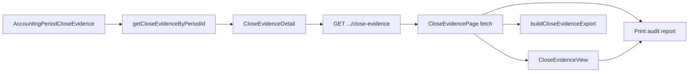

# Finance Close Evidence Export / Print (Phase 20E)

Status: **Done** — browser CSV export and audit print for immutable HARD-close evidence  
Scope: Read-only export and print after HARD close — no API route, no schema changes  
Related: [15_FINANCE_PERIODS.md](./15_FINANCE_PERIODS.md), [21_FINANCE_CLOSE_WORKFLOW.md](./21_FINANCE_CLOSE_WORKFLOW.md), [22_FINANCE_CLOSE_GATE.md](./22_FINANCE_CLOSE_GATE.md), [23_FINANCE_CLOSE_EVIDENCE.md](./23_FINANCE_CLOSE_EVIDENCE.md), [18_RECONCILIATION_SNAPSHOTS.md](./18_RECONCILIATION_SNAPSHOTS.md) §9 (snapshot evidence export pattern)

Phase 20E adds **export and print** for the immutable `AccountingPeriodCloseEvidence` record introduced in Phase 20D. Pre-close checklist review remains Phase 20B; gate enforcement Phase 20C; evidence persistence Phase 20D.

---

## 1. Purpose

| Goal | Description |
|------|-------------|
| Close evidence CSV pack | Browser download of metadata, checklist, reconciliation summary, financial totals, and traceability CSVs from stored evidence |
| Audit print | Print-friendly layout of the same frozen data shown on screen |
| Single payload | Export and print consume the same `CloseEvidenceDetail` already loaded by the close evidence page |
| Post-close audit | Available only after successful HARD close when evidence row exists |

**Non-goals:** close recalculation, posting changes, gate/readiness changes, snapshot creation, live reconciliation, server export API, PDF/ZIP generation.

---

## 2. Scope

| In scope | Out of scope |
|----------|--------------|
| Browser CSV pack via `buildCloseEvidenceExport` | `GET .../close-evidence/export` API route |
| Print audit report (`window.print`) on close evidence page | Server-side PDF or zip |
| Reuse Phase 19C CSV download utilities | Re-fetching or enriching from `ReconciliationSnapshot` rows |
| Print header + frozen disclaimer | Export audit log (server cannot verify client download) |
| `no-print` / `print-only` CSS on existing page | Separate print-only data calculation path |

Phase 20E is **read-only**. It does not change close logic, posting, gate, readiness, evidence creation, or Prisma schema.

---

## 3. Source of truth

All export and print data comes from the **stored** `AccountingPeriodCloseEvidence` row:

1. Page loads once via `fetchCloseEvidence` → `GET /api/finance/periods/[id]/close-evidence`
2. Domain read: `getCloseEvidenceByPeriodId` → `CloseEvidenceDetail` (includes parsed `payload: CloseEvidencePayloadV1`)
3. UI, CSV export, and print all use that in-memory `CloseEvidenceDetail` — no second read path, no alternate DTO

Export helpers read only `evidence` and `evidence.payload`. They do **not** call `buildCloseEvidencePayload`, `buildCloseReadinessChecklistForPeriod`, or live reconciliation APIs.

---

## 4. Architecture

### Shared read path

| Layer | Module | Role |
|-------|--------|------|
| Domain read | [`lib/finance/close-evidence.ts`](../lib/finance/close-evidence.ts) | `getCloseEvidenceByPeriodId` — sole DB reader |
| API | [`app/api/finance/periods/[id]/close-evidence/route.ts`](../app/api/finance/periods/[id]/close-evidence/route.ts) | Returns `{ evidence: CloseEvidenceDetail }` |
| Client fetch | [`lib/finance-ui/period-fetchers.ts`](../lib/finance-ui/period-fetchers.ts) | `fetchCloseEvidence` |
| CSV serialization | [`lib/finance-ui/close-evidence-export.ts`](../lib/finance-ui/close-evidence-export.ts) | Pure `buildCloseEvidenceExport(evidence)` |
| UI controls | [`components/finance/close-evidence-ui.tsx`](../components/finance/close-evidence-ui.tsx) | Print header, action bar, export download |
| Page | [`components/finance/CloseEvidencePage.tsx`](../components/finance/CloseEvidencePage.tsx) | `CloseEvidenceReview` — header + actions + view |

### Relationship to Phase 19C (snapshot export)

| Concern | Snapshot evidence (19C) | Close evidence (20E) |
|---------|-------------------------|----------------------|
| Source | `ReconciliationSnapshot` frozen payload | `AccountingPeriodCloseEvidence` stored row |
| When | Any captured snapshot | After HARD close only |
| CSV helper | `buildSnapshotEvidenceExport` | `buildCloseEvidenceExport` |
| Download | `downloadEvidenceCsvFiles` (shared) | Same utility |
| Print | `PrintAuditButton` (shared) | Same button |

Close evidence trace links still point to snapshot detail/export anchors for drill-down; Phase 20E export covers the **close evidence record itself**, not a replacement for snapshot CSV packs.

---

## 5. Export behavior

Entry point: `buildCloseEvidenceExport(evidence: CloseEvidenceDetail)` in [`lib/finance-ui/close-evidence-export.ts`](../lib/finance-ui/close-evidence-export.ts).

Browser flow: **Export evidence pack** → `runCloseEvidenceExportDownload(evidence)` → `downloadEvidenceCsvFiles(buildCloseEvidenceExport(evidence))` with 200 ms spacing between files (same as snapshot export).

Slug: `close-evidence-{branchId}-{periodKey}` (sanitized).

### CSV files

| File | Content source |
|------|----------------|
| `{slug}-metadata.csv` | Evidence headers, period/gate/checklist summary, `exportedAt` |
| `{slug}-checklist.csv` | `payload.checklist.items` (id, group, severity, title) |
| `{slug}-reconciliation-summary.csv` | `payload.reconciliationSummary` + `traceabilityRefs.issueSummary` |
| `{slug}-financial-totals.csv` | `payload.financialTotals` (four compact amounts) |
| `{slug}-traceability.csv` | Snapshot id refs, compare drift, latest/prior snapshot ref fields |

All rows are derived from stored fields only — identical scope to on-screen sections, not full `issuesPayload` or voucher arrays.

---

## 6. Print behavior

Route: `/finance/periods/[id]/close-evidence`  
Wrapper: `close-evidence-audit-print` on page shell and `CloseEvidenceReview`.

| Component | Visibility | Purpose |
|-----------|--------------|---------|
| `CloseEvidenceAuditPrintHeader` | `.print-only` | Evidence id, period scope, closed-at/by, readiness, printed-at, frozen disclaimer |
| `CloseEvidenceActionBar` | `.no-print` | Print + export buttons |
| Page chrome (nav, title) | `.no-print` | Hidden in print |
| Back link, trace navigation links | `.no-print` | Hidden in print |
| Trace snapshot ids | `.print-only` | Plain text refs in print output |
| `CloseEvidenceView` sections | Screen + print | Same gate, checklist, reconciliation, financial, trace summary data |

Print uses `PrintAuditButton` from [`reconciliation-snapshot-ui.tsx`](../components/finance/reconciliation-snapshot-ui.tsx) → `window.print()`. Print CSS reuses existing utilities in [`app/globals.css`](../app/globals.css): `.no-print`, `.print-only`, `.print-break-inside-avoid`.

**No refresh on print/export** — controls operate on evidence already loaded by the initial GET.

---

## 7. Guardrails

Export helpers and UI must **not** import or call:

| Forbidden | Reason |
|-----------|--------|
| `close-evidence-build` | Payload built only at HARD close |
| `period-close` | Close orchestration |
| `close-readiness`, `close-gate` | Live checklist / gate paths |
| Reconciliation kernel modules | No live reconciliation |
| Snapshot loaders | No `ReconciliationSnapshot` fetch for enrichment |
| Prisma | Export is pure presentation from in-memory DTO |

Allowed imports for export: `close-evidence-types` (type only), `lib/finance-ui/csv`, `lib/finance-ui/export-formatters`. UI may import `reconciliation-export` for `downloadEvidenceCsvFiles` only (I/O helper, not reconciliation math).

---

## 8. UI entry

| Surface | Behavior |
|---------|----------|
| Period table | **Close evidence** link when `status === HARD_CLOSED` (unchanged from 20D) |
| Close evidence page | **Print audit report** + **Export evidence pack** in action bar after evidence loads |

No export or print on close-readiness page (pre-close advisory only).

---

## 9. Test map

| File | Coverage |
|------|----------|
| [`__tests__/lib/finance-ui/close-evidence-export.test.ts`](../__tests__/lib/finance-ui/close-evidence-export.test.ts) | CSV sections, stable filenames, no source mutation, minimal fixture |
| [`__tests__/components/finance/close-evidence-ui.test.tsx`](../__tests__/components/finance/close-evidence-ui.test.tsx) | Print header, action bar, `runCloseEvidenceExportDownload` wiring |
| [`__tests__/components/finance/close-evidence-view.test.tsx`](../__tests__/components/finance/close-evidence-view.test.tsx) | `CloseEvidenceReview` print/export controls, `no-print`/`print-only`, existing sections |
| [`__tests__/components/finance/close-evidence-page.test.tsx`](../__tests__/components/finance/close-evidence-page.test.tsx) | Loading state; no refresh/rebuild controls |

Phase 20D tests ([`close-evidence.test.ts`](../__tests__/lib/finance/close-evidence.test.ts), API route tests, etc.) remain unchanged — 20E adds presentation only.

---

## 10. Manual verification

1. Open `/finance/periods` as `HO_FINANCE` or `HO_ADMIN`.
2. On a `HARD_CLOSED` period, click **Close evidence**.
3. Confirm page loads gate, checklist, reconciliation, financial, and trace sections (single GET in Network tab).
4. Click **Export evidence pack** — five CSV files download with `close-evidence-{branch}-{period}-*` names.
5. Open CSV metadata — `exportType` is `accounting_period_close_evidence`; counts match on-screen values.
6. Click **Print audit report** — preview shows audit header, disclaimer, and evidence sections; action bar and trace links hidden.
7. Confirm no calls to close-readiness, reconciliation, or snapshot APIs on export/print.

---

## 11. Phase 20E delivery summary

| Step | Deliverable |
|------|-------------|
| 20E-1 | Architecture review |
| 20E-2 | `close-evidence-export.ts` + unit tests |
| 20E-3 | Print UI + export controls on close evidence page |
| 20E-4 | This document |

---

## 12. Related docs

- Close evidence (20D): [23_FINANCE_CLOSE_EVIDENCE.md](./23_FINANCE_CLOSE_EVIDENCE.md)
- Period lifecycle and admin UI: [15_FINANCE_PERIODS.md](./15_FINANCE_PERIODS.md)
- Close workflow: [21_FINANCE_CLOSE_WORKFLOW.md](./21_FINANCE_CLOSE_WORKFLOW.md)
- Close gate: [22_FINANCE_CLOSE_GATE.md](./22_FINANCE_CLOSE_GATE.md)
- Snapshot evidence export (19C): [18 §9](./18_RECONCILIATION_SNAPSHOTS.md#9-phase-19c--evidence-export-and-audit-print)
