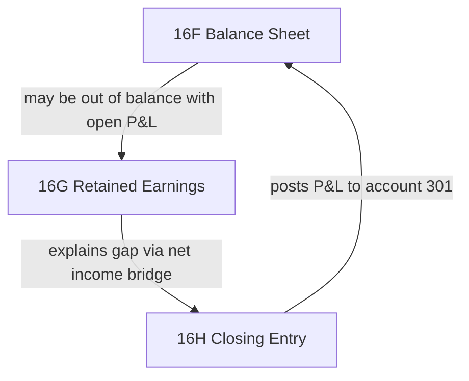
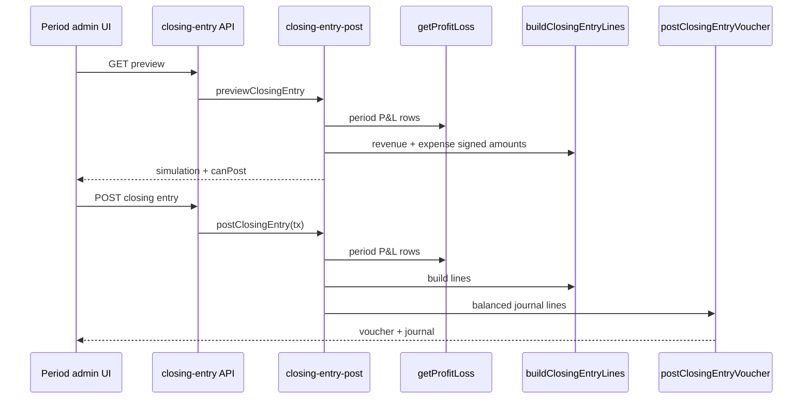

# Finance Core 16H — Period Closing Entry

**Status:** Done  
**Scope:** Post period-end closing journal (P&amp;L → retained earnings account `301`) while the accounting period is `OPEN`. Integrated with close readiness gate and reopen policy.

Related: [34_FINANCE_CORE_16G_RETAINED_EARNINGS.md](./34_FINANCE_CORE_16G_RETAINED_EARNINGS.md), [15_FINANCE_PERIODS.md](./15_FINANCE_PERIODS.md), [22_FINANCE_CLOSE_GATE.md](./22_FINANCE_CLOSE_GATE.md), [32_FINANCE_CORE_16B_MANUAL_JOURNAL.md](./32_FINANCE_CORE_16B_MANUAL_JOURNAL.md)

---

## Purpose

Close revenue and expense accounts for one accounting period and transfer net income (or net loss) to retained earnings. This is the **posting** counterpart to:

- **16G** — read-only bridge explaining economic equity before close
- **16F** — balance sheet that may be out of balance until closing entry is posted

After a successful closing entry, the balance sheet for that period should balance when P&amp;L activity was the sole cause of imbalance.

### Finance Core chain (16F → 16G → 16H)

| Phase | Role |
|-------|------|
| **16F** | Posted snapshot — assets, liabilities, equity |
| **16G** | Read-only bridge — posted RE (301) + current net income |
| **16H** | **Posting** — close revenue/expense; transfer net income to 301 |

---

## Architecture

| Layer | Module |
|-------|--------|
| Line builder (pure) | `lib/finance/closing-entry.ts` — `buildClosingEntryLines` |
| Types | `lib/finance/closing-entry-types.ts` |
| Preview / post | `lib/finance/closing-entry-post.ts` — `previewClosingEntry`, `postClosingEntry` |
| Active entry lookup | `lib/finance/closing-entry-status.ts` — `getActiveClosingEntry`, `listClosingEntriesForPeriod` |
| Posting kernel | `lib/finance/posting.ts` — `postClosingEntryVoucher` |
| P&amp;L source | `lib/finance/reports/profit-loss.ts` — `getProfitLoss` |
| Close checklist | `lib/finance/close-readiness.ts`, `lib/finance/close-checklist.ts`, `lib/finance/close-blocker-rules.ts` |
| Reopen guard | `lib/finance/period-close.ts` |
| UI fetchers | `lib/finance-ui/closing-entry.ts` |
| API | `GET .../closing-entry/preview`, `POST .../closing-entry` |
| UI | `/finance/periods/[id]/closing-entry` — `ClosingEntryPage` |

**Persistence:** No separate `ClosingEntry` model. Posted entries are `Voucher` rows with `refType = PERIOD_CLOSING_ENTRY`, linked journal, and idempotent `(refType, refId)`.

**Retained earnings account:** Code **`301` only** (same as 16G). Configurable mapping remains deferred.

---

## Closing entry flow

### Line construction

For each non-zero revenue account: debit to zero out credit-normal balance (`CLOSE_REVENUE`).

For each non-zero expense account: credit to zero out debit-normal balance (`CLOSE_EXPENSE`).

Net income line to account `301`:

| Net income | RE line | Reason |
|------------|---------|--------|
| Profit | Credit `301` | `TRANSFER_NET_INCOME_TO_RE` |
| Loss | Debit `301` | `TRANSFER_NET_LOSS_TO_RE` |
| Zero | No RE line | — |

`isRequired = false` when no revenue or expense activity in the period — post returns `{ posted: false, reason: "NOT_REQUIRED" }`.

Posting date: last day of `periodKey` (`YYYY-MM`), noon UTC.

Voucher ref: `refType = PERIOD_CLOSING_ENTRY`, `refNo = CE-{periodKey}`, unique `refId` per attempt (`allocateClosingEntryRefId`).

---

## Posting rules

| Rule | Detail |
|------|--------|
| Period must be `OPEN` | `PERIOD_CLOSED` if SOFT/HARD closed |
| One active entry per period | Idempotent return if active (non-reversed) entry exists |
| Balanced simulation | `UNBALANCED_CLOSING_ENTRY` if debits ≠ credits |
| Posting gate | `assertPostingPeriodOpen` via standard voucher path |
| Caller transaction | `postClosingEntry` accepts `Prisma.TransactionClient`; API route owns outer `$transaction` |
| No nested finance `$transaction` | Finance kernel does not open its own transaction |

Auth: `POST` requires period admin (`HO_FINANCE` or `HO_ADMIN`). Preview `GET` is public JSON (same pattern as close-readiness GET).

---

## Close gate integration (Phase 20C)

Close readiness checklist evaluates closing entry state via `loadClosingEntryChecklistContext`:

| Checklist item | Severity | When |
|----------------|----------|------|
| `closing-entry-not-required` | PASS | No P&amp;L activity |
| `closing-entry-missing` | **BLOCKED** | P&amp;L activity but no active closing entry |
| `closing-entry-stale` | WARNING | Active entry net income ≠ current period net income |
| `closing-entry-present` | PASS | Active entry matches (or stale warning also present) |

`closing-entry-missing` blocks **HARD close** under default gate policy.

Entry from close readiness UI: **Closing entry** link → `/finance/periods/[id]/closing-entry`.

---

## Reopen integration (Phase 21A)

| Transition | Closing entry rule |
|------------|-------------------|
| `HARD_CLOSED` → `SOFT_CLOSED` | Allowed (21A / 21B); closing entry may remain |
| `SOFT_CLOSED` → `OPEN` | **Blocked** while active closing entry exists — reverse via manual journal reversal (16B) first |

Error: `CLOSING_ENTRY_REOPEN_BLOCKED` (409).

---

## Routes

| Method | Path | Auth | Purpose |
|--------|------|------|---------|
| `GET` | `/api/finance/periods/[id]/closing-entry/preview` | None | Simulation + `canPost` + active entry status |
| `POST` | `/api/finance/periods/[id]/closing-entry` | Period admin | Post closing entry |

| UI route | Component |
|----------|-----------|
| `/finance/periods/[id]/closing-entry` | `ClosingEntryPage` |

---

## Error codes

| Code | HTTP | When |
|------|------|------|
| `PERIOD_NOT_FOUND` | 404 | Unknown period id |
| `PERIOD_CLOSED` | 400 | Post when period not `OPEN` |
| `VALIDATION_ERROR` | 400 | Branch/periodKey scope mismatch |
| `UNBALANCED_CLOSING_ENTRY` | 400 | Simulation not balanced |
| `CLOSING_ENTRY_REOPEN_BLOCKED` | 409 | SOFT→OPEN reopen with active closing entry |
| `UNAUTHENTICATED` / `FORBIDDEN` | 401 / 403 | POST without period admin |

---

## Related phases

| Phase | Scope |
|-------|-------|
| 16E | Profit &amp; loss — source rows for closing simulation |
| 16G | Retained earnings bridge — read-only preview of economic equity |
| **16H** | **Period closing entry posting** |
| 16I | Statement of changes in equity (done — see 36_FINANCE_CORE_16I_CHANGES_IN_EQUITY.md) |
| 20B–20C | Close readiness + gate — closing-entry checklist items |
| 21A–21B | Reopen — closing-entry reversal guard |

---

## Tests

| File | Coverage |
|------|----------|
| `__tests__/lib/finance/closing-entry-lines.test.ts` | Pure line builder, revenue/expense/RE lines, not required |
| `__tests__/lib/finance/closing-entry-status.test.ts` | Active entry detection, net income extraction |
| `__tests__/lib/finance/closing-entry-posting.test.ts` | Post, idempotency, NOT_REQUIRED, period closed |
| `__tests__/lib/finance/closing-entry-reopen.test.ts` | Reopen blocked with active entry |
| `__tests__/lib/finance/close-checklist-closing-entry.test.ts` | Checklist item severity |
| `__tests__/app/api/finance/closing-entry-route.test.ts` | Preview GET + POST API |

---

## Out of scope (16H)

- Configurable retained earnings account mapping (deferred; v1 uses `301`)
- Automated closing entry on HARD close (admin posts explicitly while `OPEN`)
- Opening balance rollover into next period (migration / manual journal)
- Cash Flow statement (future phase — 16J)
