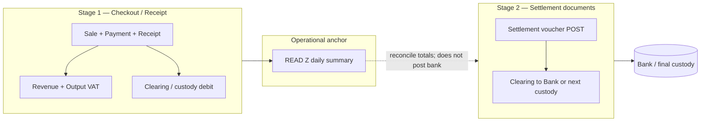
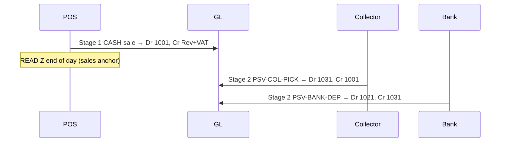
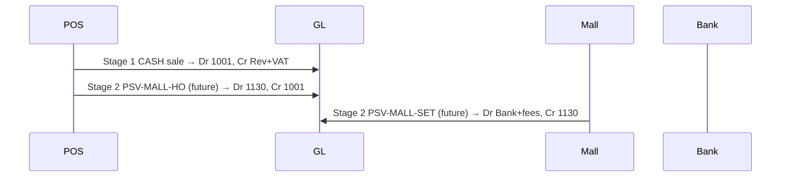

# POS Two-Stage Payment Settlement

Status: **Implemented through P2.4 / P3** — Stage 1 checkout/refund, reconciliation bridges, Collector Pickup Stage 2, and Bank Deposit Settlement (post API, status APIs, minimal finance UI)  
Scope: POS tender → clearing/custody GL, settlement documents, READ Z anchor, reconciliation  
Type: Architecture + implementation record (synced with pushed code)  
Related: [08_POS_CHECKOUT_ARCHITECTURE.md](./08_POS_CHECKOUT_ARCHITECTURE.md), [11_FINANCE_POSTING_ARCHITECTURE.md](./11_FINANCE_POSTING_ARCHITECTURE.md), [12_FINANCE_RECONCILIATION_AND_CLOSE_POLICY.md](./12_FINANCE_RECONCILIATION_AND_CLOSE_POLICY.md), [13_FINANCE_OPERATIONAL_WIRING.md](./13_FINANCE_OPERATIONAL_WIRING.md), [FINANCE_TRANSACTION_UNIVERSE.md](./FINANCE_TRANSACTION_UNIVERSE.md), [RECEIPT_SETUP.md](./RECEIPT_SETUP.md), [POS_COMPLETION_ROADMAP.md](./POS_COMPLETION_ROADMAP.md)

---

## 1. Problem statement

Legacy POS checkout posted a **single-stage** sale journal:

- Debit tender for the **full gross total**
- Credit revenue for the **full gross total** (no VAT split)

That conflated three distinct economic events:

| Event | When | GL character |
|-------|------|--------------|
| **Sale recognition** | Receipt issued at checkout | Revenue + output VAT |
| **Custody / clearing** | Money held at shop, mall, acquirer, or in transit | Asset reclassification only |
| **Bank settlement** | Cash deposited, card batch settled, transfer matched | Clearing → Bank (+ fees) |

Money can sit in **Cash in Drawer**, **Mall receivable**, **Card clearing**, or **Bank transfer clearing** for days before it reaches the bank. READ Z closes the **sales day**; it must not be treated as proof that cash is in the bank.

**Current state (P1–P2.4 / P3):** Stage 1 checkout and refund now post **net revenue + output VAT** on the credit side and **method-specific clearing/custody debits/credits** on the tender side. Collector Pickup Stage 2 (`PSV-COL-PICK`) and Bank Deposit Stage 2 (`PSV-BANK-DEP`) are implemented for HO finance posting from persisted `CollectorReport` rows.

---

## 2. Two-stage accounting model



### Stage 1 — Checkout (immediate, same transaction as sale)

**Trigger:** `lib/pos/checkout.ts` → `postSaleVoucher()` when `FINANCE_POSTING_ENABLED`.

**Recognizes:**

- Net sales revenue (`4000`)
- Output VAT (`4602` or Sale snapshot `outputVatAccountCode`)
- COGS / inventory (unchanged — from stock ledger)

**Does not recognize:**

- Bank receipt
- Card acquirer settlement
- Mall remittance to HO

**Debits a payment-specific clearing or custody account** — never Bank (`1021`) for standard shop POS.

### Stage 2 — Settlement (separate posted documents)

**Trigger:** Explicit finance/POS settlement workflow — **not** automatic on READ Z.

**Moves balances** between clearing/custody accounts and Bank (or the next custody hop). **Never credits revenue or VAT.**

**Implemented:** `PSV-COL-PICK` (Collector Pickup), `PSV-BANK-DEP` (Bank Deposit).

---

## 3. Chart of accounts — legacy Trial Balance alignment

Account codes live in `lib/finance/account-map.ts` (`DEFAULT_ACCOUNT_CODES`). Seed script `scripts/seed-finance-accounts.ts` seeds confirmed legacy codes.

### Confirmed legacy CoA mappings

| Code | Constant | Thai name | Stage | Role |
|------|----------|-----------|-------|------|
| `1001` | `CASH` | เงินสดในเครื่องเก็บเงิน | 1 / 2 | Cash in drawer — shop custody after CASH sales |
| `1031` | `CASH_IN_TRANSIT_COLLECTOR` | เงินสดระหว่างทาง | 2 | Cash in transit after collector pickup |
| `1021` | `BANK` | เงินฝากธนาคาร | 2 | Bank — **never debited in Stage 1** |
| `4000` | `REVENUE` | Sales revenue (net) | 1 | Net of VAT |
| `4602` | `OUTPUT_VAT` | ภาษีมูลค่าเพิ่มค้างจ่าย | 1 | Output VAT payable |

**Note:** `1140` is **not** used. It duplicated legacy account `1031` and was removed from the production mapping.

### Placeholder clearing accounts (pending CoA verification)

| Code | Constant | Status |
|------|----------|--------|
| `1110` | `CARD_CLEARING` | Placeholder — verify against production legacy CoA |
| `1120` | `BANK_TRANSFER_CLEARING` | Placeholder — verify against production legacy CoA |
| `1190` | `POS_OTHER_CLEARING` | Placeholder — verify against production legacy CoA |

### Proposed (not yet implemented)

| Code | Name | Stage | Role |
|------|------|-------|------|
| `1130` | Cash Held by Mall / Mall Receivable | 2 | Mall custody after handover |
| `5xxx` | Card / bank fee expense | 2 | Settlement fees only |

**Invariant:** Stage 2 journals use **only** clearing/custody/bank/fee accounts — never `4000` or VAT accounts.

---

## 4. Stage 1 — Payment method → tender account (implemented)

Map `PaymentMethod` to Stage 1 **debit** (sale) or **credit** (refund) account via `resolveTenderAccountCodeForPosPayment`.

| Payment method | Stage 1 debit account | Notes |
|----------------|----------------------|--------|
| `CASH` | `1001` Cash in Drawer | Fixed-rent shops: stays here until collector pickup |
| `CARD` | `1110` Card Clearing | Placeholder — pending CoA verification |
| `QR`, `TRANSFER`, `BANK_TRANSFER` | `1120` Bank Transfer Clearing | Placeholder — pending CoA verification |
| `OTHER` | `1190` POS Other Clearing | Placeholder — pending CoA verification |
| `MALL_CASH` *(future)* | `1001` initially | Same as CASH until mall handover document |

### Stage 1 journal template (per receipt)

For gross total `G`, VAT from effective-dated policy or Sale snapshot:

```
Dr  tenderAccount(G)          — clearing/custody (gross)
    Cr  4000  net              — sales revenue
    Cr  4602  vat              — output VAT (or snapshot outputVatAccountCode)
[+ existing COGS / inventory lines from stock ledger]
```

**Ref identity:** `refType = POS_SALE`, `refId = sale.id` — not `receiptNo`.

### VAT policy (P1.25 — implemented)

VAT is **no longer hardcoded** in `lib/finance/pos-sale-vat.ts`.

| Concern | Implementation |
|---------|----------------|
| Policy lookup | `lib/finance/tax-policy/` — effective-dated by `legalEntityCode`, `taxCode`, document date |
| Default policy | AS / `VAT_OUTPUT_STANDARD` / **700 bps** (7%) / **inclusive** / `outputVatAccountCode` **4602** |
| Sale snapshot at checkout | `netAmount`, `vatAmount`, `vatRateBps`, `taxCode`, `outputVatAccountCode` |
| Posted sale vouchers | Use the **Sale snapshot**, not live re-lookup at post time |

### Refund accounting policy (P1.25R — implemented)

**Decision:** Keep the system accounting-correct first. Refunds are separate linked transactions that reverse the original receipt economics using the **original Sale VAT snapshot**. Do not delete or mutate the original receipt.

| Rule | Policy |
|------|--------|
| Receipt | Immutable sales evidence — never edited or deleted because of a refund |
| Refund document | Separate transaction (`Refund` row + refund receipt) linked to the original receipt / sale |
| UI | May show one gross refund amount to the cashier |
| GL | Must split the refund into net revenue reversal and output VAT reversal (Stage 1 mirror) |
| VAT source | Use original `Sale` snapshot — **not** refund-date tax policy |
| Missing snapshot | Posting fails with `MISSING_VAT_SNAPSHOT` (legacy rows must be backfilled or handled outside standard POS refund) |

**Full refund example** (original sale 107.00 @ 7%, CASH):

Sale:
```
Dr 1001 107.00
    Cr 4000 100.00
    Cr 4602   7.00
```

Refund 107.00:
```
Dr 4000 100.00
Dr 4602   7.00
    Cr 1001 107.00
```

**Partial refund:** refund gross `G_r` → net/VAT derived from sale’s snapshotted `vatRateBps` with same rounding as checkout. Still no Bank debit/credit in Stage 1.

### Code ownership

| Piece | Location |
|-------|----------|
| Payment method → tender account | `lib/finance/account-map.ts` → `resolveTenderAccountCodeForPosPayment` |
| VAT split + snapshot at checkout | `lib/finance/pos-sale-vat.ts`, `lib/finance/tax-policy/`, `lib/pos/resolve-pos-sale-vat.ts` |
| Refund VAT from sale snapshot | `lib/pos/refund-finance.ts` |
| Posting hooks | `lib/finance/posting.ts` → `postSaleVoucher` / `postRefundVoucher` |
| Orchestration | `lib/pos/checkout.ts`, `lib/pos/refund.ts` |

---

## 5. Stage 2 — Settlement document family

POS Settlement Vouchers (PSV) follow the existing posting kernel pattern ([FINANCE_TRANSACTION_UNIVERSE.md](./FINANCE_TRANSACTION_UNIVERSE.md)).

### Document types

| Code | Business name | Status | refType |
|------|---------------|--------|---------|
| `PSV-COL-PICK` | Collector pickup | **Implemented (P2–P2.3B)** | `POS_SETTLEMENT_COLLECTOR_PICKUP` |
| `PSV-BANK-DEP` | Bank deposit | **Implemented (P2.4 / P3)** | `POS_SETTLEMENT_BANK_DEPOSIT` |
| `PSV-CARD-SET` | Card settlement | Future | `POS_SETTLEMENT_CARD` |
| `PSV-TRF-MATCH` | Bank transfer match | Future | `POS_SETTLEMENT_TRANSFER_MATCH` |
| `PSV-MALL-HO` | Cash handover to mall | Future (P4) | `POS_SETTLEMENT_MALL_HANDOVER` |
| `PSV-MALL-SET` | Mall settlement | Future (P4) | `POS_SETTLEMENT_MALL_SETTLEMENT` |

### Collector Pickup — implemented (P2)

| Field | Value |
|-------|-------|
| Business code | `PSV-COL-PICK` |
| GL `refType` | `POS_SETTLEMENT_COLLECTOR_PICKUP` |
| Source | `CollectorReport.id` |
| `refNo` | `CollectorReport.collectNo` |
| Mode | `COLLECT` reports only (`Z` / invalid payload → `INVALID_SOURCE`) |

**Posting journal:**
```
Dr  1031  เงินสดระหว่างทาง  (Cash in Transit)
    Cr  1001  เงินสดในเครื่องเก็บเงิน  (Cash in Drawer)
```

**Invariants:**

- Stage 2 never touches revenue or VAT.
- Collector pickup never debits bank (`1021`).
- Bank deposit from `1031` → `1021` is **implemented** (`PSV-BANK-DEP`).
- One posted settlement per `CollectorReport.id`; duplicate returns `DUPLICATE_SOURCE` (409).
- AS / ASAS entity only (`DEFAULT_DOCUMENT_ENTITY_CODE`).
- Respects `assertPostingPeriodOpen` like other finance documents.

**Domain:** `lib/finance/pos-settlement/post-collector-pickup.ts`, `execute-collector-pickup-post.ts`

### Bank Deposit — implemented (P2.4 / P3)

| Field | Value |
|-------|-------|
| Business code | `PSV-BANK-DEP` |
| GL `refType` | `POS_SETTLEMENT_BANK_DEPOSIT` |
| Source | `CollectorReport.id` with posted `PSV-COL-PICK` |
| `refNo` | `CollectorReport.collectNo` |
| Prerequisite | Collector pickup settlement must be posted (`COLLECTOR_PICKUP_NOT_POSTED` → 409) |

**Posting journal:**
```
Dr  1021  เงินฝากธนาคาร  (Bank)
    Cr  1031  เงินสดระหว่างทาง  (Cash in Transit)
```

**Invariants:**

- Stage 2 never touches revenue or VAT.
- Bank deposit never debits or credits cash drawer (`1001`).
- One posted bank deposit per `CollectorReport.id`; duplicate returns `DUPLICATE_SOURCE` (409).
- AS / ASAS entity only (`DEFAULT_DOCUMENT_ENTITY_CODE`).
- Respects `assertPostingPeriodOpen` like other finance documents.

**Domain:** `lib/finance/pos-settlement/post-bank-deposit.ts`, `execute-bank-deposit-post.ts`

### Future Stage 2 GL patterns

**Bank deposit** *(implemented — P2.4 / P3)*

```
Dr  1021  Bank
    Cr  1031  Cash in transit — collector
```

**Cash handover to mall** *(future)*

```
Dr  1130  Mall cash receivable
    Cr  1001  Cash in drawer
```

**Card settlement** *(future)*

```
Dr  1021  Bank (net)
Dr  5xxx  Card fee expense
    Cr  1110  Card clearing
```

**Bank transfer match** *(future)*

```
Dr  1021  Bank
    Cr  1120  Bank transfer clearing
```

### P2.1 — Finance post API (implemented)

```
POST /api/finance/pos-settlement/collector-pickup/post
```

| Item | Detail |
|------|--------|
| Body | `{ "collectorReportId": "<uuid>" }` |
| Auth | `HO_FINANCE` / `HO_ADMIN` via `requireFinanceVoucherScope()` |
| Entity | AS session only; AD → 403 |
| Success | Posted voucher id/no, collectNo, amount |
| Errors | `DUPLICATE_SOURCE` (409), `PERIOD_CLOSED` (409), `VALIDATION_ERROR`, `INVALID_SOURCE`, `COLLECTOR_REPORT_NOT_FOUND` |

### P2.2 — Collector Pickup reconciliation library (implemented)

`lib/finance/pos-settlement/collector-pickup-reconciliation.ts`

- `getCollectorPickupSettlementStatus(db, collectorReportId)`
- `listCollectorPickupSettlementStatuses(db, { branchId?, from?, to? })`

Compares `CollectorReport` expected cash amount (from persisted report JSON) against linked voucher journal lines on accounts **1031** (debit) and **1001** (credit) only.

**Status values:**

| Status | Meaning |
|--------|---------|
| `NOT_POSTED` | Eligible COLLECT report with no settlement voucher |
| `POSTED` | Settlement voucher posted; amounts match |
| `VARIANCE` | Voucher exists but 1031/1001 amounts ≠ expected |
| `INVALID_SOURCE` | Not a COLLECT report or invalid payload |

**Limitation:** Reversed/cancelled vouchers are not specially handled — any linked posted voucher counts.

### P2.3A — Status APIs (implemented)

```
GET /api/finance/pos-settlement/collector-pickup/status?collectorReportId=<uuid>
GET /api/finance/pos-settlement/collector-pickup/status-list?from=YYYY-MM-DD&to=YYYY-MM-DD&branchId=<optional>
```

| Item | Detail |
|------|--------|
| Auth | Same as post API — `HO_FINANCE` / `HO_ADMIN`, AS session only |
| `INVALID_SOURCE` | Returns **200** with status in body (not thrown) |
| `status-list` | Date-range query on `CollectorReport.createdAt`; no pagination cap yet |

### P2.3B — Minimal finance UI (implemented)

| Item | Detail |
|------|--------|
| Page | `/finance/pos-settlement/collector-pickup` |
| Menu | Finance → Daily Work → **Collector Pickup Settlement** |
| Access | `HO_FINANCE` / `HO_ADMIN` only; shop staff / `HO_OPERATIONS` → `/unauthorized` |
| Entity | AD session shows blocked message; APIs enforce AS-only posting |

**UI behavior:**

1. Date range filter (required) + optional branch filter.
2. Loads `status-list` API on Apply.
3. Table columns: `collectNo`, branch code/name, mode, `expectedAmount`, status badge, variance, `voucherNo` (if posted), action hint.
4. `NOT_POSTED` → **Post Settlement** button → `POST .../post` → refresh list.
5. `POSTED` → shows `voucherNo`; no post button.
6. `VARIANCE` / `INVALID_SOURCE` → warning hint; **no post button** (variance posting not enabled in UI).
7. Duplicate-source / closed-period / validation errors displayed inline.

**Components:** `components/finance/CollectorPickupSettlementPage.tsx`, `CollectorPickupSettlementTable.tsx`  
**Client helpers:** `lib/finance-ui/collector-pickup-settlement.ts`

**Not in scope:** Full PSV DRAFT → SUBMITTED → CONFIRMED → POSTED workflow; direct post only.

### P2.4 — Bank Deposit post API (implemented)

```
POST /api/finance/pos-settlement/bank-deposit/post
```

| Item | Detail |
|------|--------|
| Body | `{ "collectorReportId": "<uuid>" }` |
| Auth | `HO_FINANCE` / `HO_ADMIN` via `requireFinanceVoucherScope()` |
| Entity | AS session only; AD → 403 |
| Prerequisite | Posted `PSV-COL-PICK` for same `collectorReportId` |
| Success | Posted voucher id/no, collectNo, amount |
| Errors | `DUPLICATE_SOURCE` (409), `COLLECTOR_PICKUP_NOT_POSTED` (409), `PERIOD_CLOSED` (409), `VALIDATION_ERROR`, `INVALID_SOURCE`, `COLLECTOR_REPORT_NOT_FOUND` |

### P2.4 — Bank Deposit reconciliation library (implemented)

`lib/finance/pos-settlement/bank-deposit-reconciliation.ts`

- `getBankDepositSettlementStatus(db, collectorReportId)`
- `listBankDepositSettlementStatuses(db, { branchId?, from?, to? })`

Compares posted collector pickup in-transit amount against linked bank deposit voucher journal lines on accounts **1021** (debit) and **1031** (credit) only.

**Status values:**

| Status | Meaning |
|--------|---------|
| `NOT_ELIGIBLE` | Valid COLLECT report but collector pickup not posted |
| `NOT_POSTED` | Pickup posted; no bank deposit voucher |
| `POSTED` | Bank deposit posted; amounts match |
| `VARIANCE` | Voucher exists but 1021/1031 amounts ≠ expected |
| `INVALID_SOURCE` | Not a COLLECT report or invalid payload |

### P2.4A — Bank Deposit status APIs (implemented)

```
GET /api/finance/pos-settlement/bank-deposit/status?collectorReportId=<uuid>
GET /api/finance/pos-settlement/bank-deposit/status-list?from=YYYY-MM-DD&to=YYYY-MM-DD&branchId=<optional>
```

| Item | Detail |
|------|--------|
| Auth | Same as post API — `HO_FINANCE` / `HO_ADMIN`, AS session only |
| `INVALID_SOURCE` | Returns **200** with status in body (not thrown) |
| `status-list` | Date-range query on `CollectorReport.createdAt`; no pagination cap yet |

### P2.4B — Bank Deposit minimal finance UI (implemented)

| Item | Detail |
|------|--------|
| Page | `/finance/pos-settlement/bank-deposit` |
| Menu | Finance → Daily Work → **Bank Deposit Settlement** |
| Access | `HO_FINANCE` / `HO_ADMIN` only; shop staff / `HO_OPERATIONS` → `/unauthorized` |
| Entity | AD session shows blocked message; APIs enforce AS-only posting |

**UI behavior:**

1. Date range filter (required) + optional branch filter.
2. Loads `status-list` API on Apply.
3. Table columns: `collectNo`, branch code/name, mode, `inTransitAmount`, status badge, variance, pickup `voucherNo`, deposit `voucherNo`, action hint.
4. `NOT_POSTED` → **Post Deposit** button → `POST .../post` → refresh list.
5. `POSTED` → shows deposit `voucherNo`; no post button.
6. `NOT_ELIGIBLE` / `VARIANCE` / `INVALID_SOURCE` → warning hint; **no post button**.
7. Duplicate-source / closed-period / pickup-not-posted / validation errors displayed inline.

**Components:** `components/finance/BankDepositSettlementPage.tsx`, `BankDepositSettlementTable.tsx`  
**Client helpers:** `lib/finance-ui/bank-deposit-settlement.ts`

**Not in scope:** Full PSV DRAFT → SUBMITTED → CONFIRMED → POSTED workflow; direct post only.

### Module placement

| Layer | Path | Responsibility |
|-------|------|----------------|
| Domain | `lib/finance/pos-settlement/` | Validation, line builders, POST, reconciliation, types |
| API | `app/api/finance/pos-settlement/collector-pickup/*`, `.../bank-deposit/*` | Parse, auth, call domain |
| UI | `app/(main)/finance/pos-settlement/collector-pickup/`, `.../bank-deposit/` | HO finance review + post |
| POS integration | `lib/pos/persist-collector-report.ts` | Persist CollectorReport (unchanged — no auto-post) |

Settlement business logic **must not** live in React pages or API routes ([01_MODULAR_MONOLITH_BOUNDARIES.md](./01_MODULAR_MONOLITH_BOUNDARIES.md)).

---

## 6. READ Z — daily anchor (not bank settlement)

READ Z is the **operational close-of-day** for POS sales and payments. It aggregates payment buckets (CASH, CREDIT CARD, BANK TRANSFER), product group summary, and net sales after refunds.

### Role in two-stage accounting

| READ Z does | READ Z does not |
|-------------|-----------------|
| Summarize Stage 1 operational totals for a Bangkok calendar day | Post Stage 2 settlement journals |
| Provide reconciliation anchor: Σ receipt tenders ≈ Σ Stage 1 clearing debits (by method) | Imply cash is in the bank |
| Close the shop sales day (staff workflow: print → clock out) | Replace Collector pickup or bank deposit documents |
| Support HO cumulative review (`read-z-review` API) | Move mall cash or card clearing balances |

**Rule:** Printing READ Z remains **read-only** with respect to GL.

---

## 7. Shop operating models

### Fixed-rent shops (cash stays in drawer)



Cash remains **`1001`** from checkout until collector pickup. READ Z does not move it.

### Mall / revenue-share shops (cash handover) — future



---

## 8. Reconciliation model (P1.5 / P1.6 — implemented)

`lib/finance/reconciliation.ts` → `reconcileSalesAndTender()` bridges operational POS data to GL.

### Sales economics bridge (P1.5)

Compares:

| Side | Source |
|------|--------|
| Operational | Gross sales **minus** gross refunds |
| GL | Net revenue (`4000`) **+** output VAT (`4602` or per-sale snapshot codes aggregated) |

Label: *"POS gross sales (net of refunds) vs GL net revenue + output VAT"*

### Tender bridge (P1.5)

Compares:

| Side | Source |
|------|--------|
| Operational | Tender in (sale payments) **minus** tender out (refund payments) |
| GL | Net debit effect on Stage 1 clearing/custody accounts: `1001`, `1110`, `1120`, `1190` |

Label: *"POS tender net vs Stage 1 clearing/custody GL"*

Per-method tender rows are built via `buildPosTenderReconciliationRows` (`lib/finance/pos-sales-reconciliation.ts`).

### Refund reconciliation (P1.6)

`reconcileRefunds()` compares refund gross to GL net revenue + output VAT reversal, and refund tender credits per clearing account using the shared tender map.

### Collector pickup bridge (P2.2)

| Bridge | Operational source | GL account | Stage |
|--------|-------------------|------------|-------|
| Collector report vs in-transit | `CollectorReport` cash total (COLLECT mode) | `1031` debit after `PSV-COL-PICK` | 2 |

Variance policy: **explain first** — operational fix (missing sale/refund) or settlement document — never silent GL write-back.

---

## 9. Implementation status summary

| Area | Status |
|------|--------|
| Stage 1 VAT split + tender map (`1001`/`1110`/`1120`/`1190`) | **Done (P1)** |
| Effective-dated VAT policy + Sale snapshot | **Done (P1.25)** |
| Refund uses original Sale VAT snapshot | **Done (P1.25R)** |
| Sales/tender reconciliation bridge | **Done (P1.5)** |
| Refund reconciliation tender coverage | **Done (P1.6)** |
| Collector Pickup posting domain | **Done (P2)** |
| Finance post API | **Done (P2.1)** |
| Collector Pickup reconciliation library | **Done (P2.2)** |
| Status APIs | **Done (P2.3A)** |
| Minimal finance UI | **Done (P2.3B)** |
| Bank deposit posting domain | **Done (P2.4 / P3)** |
| Bank deposit post API | **Done (P2.4)** |
| Bank deposit reconciliation library | **Done (P2.4)** |
| Bank deposit status APIs | **Done (P2.4A)** |
| Bank deposit minimal finance UI | **Done (P2.4B)** |
| Card / transfer settlement | Not started |
| Mall handover + settlement | Not started |
| READ Z day-close record + aging report | Not started |
| Full PSV DRAFT/CONFIRM workflow | Not started |

---

## 10. Phased implementation

| Phase | Deliverable | Status |
|-------|-------------|--------|
| **P1** | COA codes; Stage 1 VAT split + tender map in `account-map.ts` | **Done** |
| **P1.25** | Effective-dated VAT policy + Sale VAT snapshot at checkout | **Done** |
| **P1.25R** | Refund accounting using original Sale VAT snapshot | **Done** |
| **P1.5** | Sales/tender reconciliation: gross ↔ GL net+VAT; Stage 1 clearing incl. `1190` | **Done** |
| **P1.6** | Refund reconciliation: gross ↔ GL reversal; tender credits via shared map | **Done** |
| **P1.6F** | Refund test fixtures with VAT snapshot; `MISSING_VAT_SNAPSHOT` negative test | **Done** |
| **P2** | PSV-COL-PICK: Dr `1031` / Cr `1001` from persisted `CollectorReport`; idempotent `refId` | **Done** |
| **P2.1** | `POST /api/finance/pos-settlement/collector-pickup/post` | **Done** |
| **P2.2** | Collector Pickup reconciliation library + status values | **Done** |
| **P2.3A** | Status + status-list finance APIs | **Done** |
| **P2.3B** | Minimal finance UI at `/finance/pos-settlement/collector-pickup` | **Done** |
| **P2.4 / P3** | **Bank Deposit Settlement** — Dr `1021` Bank, Cr `1031` Cash in Transit | **Done** |
| **P3** | PSV-CARD-SET, PSV-TRF-MATCH (finance UI) | **Next recommended** |
| **P4** | Mall handover + settlement (PSV-MALL-*) + branch custody mode | Planned |
| **P5** | READ Z day-close record + reconciliation aging report | Planned |

Each Stage 1 phase keeps **same-transaction** posting in checkout ([13_FINANCE_OPERATIONAL_WIRING.md](./13_FINANCE_OPERATIONAL_WIRING.md)). Stage 2 always uses its own `$transaction` at settlement POST.

---

## 11. Invariants (locked)

1. **Stage 1 owns revenue and VAT** — only checkout/refund hooks credit `4000` / VAT accounts.
2. **Stage 2 never touches revenue or VAT** — clearing and bank movement only.
3. **Bank (`1021`) is never debited in Stage 1** for standard POS checkout.
4. **READ Z is not a settlement event** — it anchors sales reconciliation, not bank confirmation.
5. **One posted voucher per operational source** — idempotent settlement POST (`DUPLICATE_SOURCE` on repeat).
6. **Entity isolation** — all journals carry session `legalEntityCode`; POS settlement is AS/ASAS only.
7. **Operational truth for tender** — `Payment.method` and amounts remain authoritative; GL is derived.
8. **Refund reverses sale snapshot economics** — original receipt immutable; refund is separate; GL splits gross into net + VAT using sale snapshot, not refund-date policy.
9. **Collector pickup never debits bank** — `1031` ← `1001` only; bank deposit is a separate document (`PSV-BANK-DEP`).

---

## 12. Remaining limitations

| # | Limitation |
|---|------------|
| 1 | No full PSV DRAFT → CONFIRM workflow — direct post only for collector pickup |
| 2 | No row drill-down from UI to voucher/journal detail |
| 3 | `VARIANCE` rows cannot be posted from UI |
| 4 | Reversed/cancelled vouchers not specially handled in collector settlement reconciliation |
| 5 | `status-list` uses small date-range queries with no pagination cap |
| 6 | Card/transfer/other clearing accounts `1110`/`1120`/`1190` need verification against production legacy CoA |
| 7 | Bank deposit settlement `1031` → `1021` implemented (direct post only) |
| 8 | Mall cash handover/settlement not implemented |
| 9 | Card settlement and transfer match not implemented |
| 10 | Auto-post collector pickup on persist vs finance confirm — **finance posts separately** (collector slip is operational) |

---

## 13. Open decisions

| # | Question | Current direction |
|---|----------|-------------------|
| 1 | Exact output VAT account per entity (AS vs AD) | AS default `4602`; AD policies TBD in tax-policy seed |
| 2 | PSV document numbering | `PSV-YYnnnn` per [99_ASA_HANDBOOK.md](./99_ASA_HANDBOOK.md) |
| 3 | Card settlement frequency | Manual PSV-CARD-SET from statement (no acquirer API in v0) |
| 4 | Partial mall settlement | Multiple PSV-MALL-SET with open-item tracking (Phase 4+) |
| 5 | Production CoA for `1110`/`1120`/`1190` | Map during COA import; placeholders until verified |

---

## 14. References in code

| Concern | Location |
|---------|----------|
| Checkout orchestration | `lib/pos/checkout.ts` |
| Stage 1 posting | `lib/finance/posting.ts` → `postSaleVoucher` / `postRefundVoucher` |
| Account mapping | `lib/finance/account-map.ts` |
| VAT policy | `lib/finance/tax-policy/`, `lib/finance/pos-sale-vat.ts` |
| Refund VAT economics | `lib/pos/refund-finance.ts` |
| Sales/tender reconciliation | `lib/finance/reconciliation.ts`, `lib/finance/pos-sales-reconciliation.ts` |
| Collector pickup POST | `lib/finance/pos-settlement/post-collector-pickup.ts` |
| Collector pickup reconciliation | `lib/finance/pos-settlement/collector-pickup-reconciliation.ts` |
| Bank deposit POST | `lib/finance/pos-settlement/post-bank-deposit.ts` |
| Bank deposit reconciliation | `lib/finance/pos-settlement/bank-deposit-reconciliation.ts` |
| Post API | `app/api/finance/pos-settlement/collector-pickup/post/route.ts`, `.../bank-deposit/post/route.ts` |
| Status APIs | `app/api/finance/pos-settlement/collector-pickup/status/route.ts`, `.../status-list/route.ts`, `.../bank-deposit/status/route.ts`, `.../status-list/route.ts` |
| Finance UI | `app/(main)/finance/pos-settlement/collector-pickup/page.tsx`, `.../bank-deposit/page.tsx`, `components/finance/CollectorPickupSettlement*.tsx`, `BankDepositSettlement*.tsx` |
| READ Z aggregation | `lib/pos/aggregatePosReadReport.ts`, `lib/pos/readReportPayment.ts` |
| Collector persist | `lib/pos/persist-collector-report.ts` |
| CoA seed | `scripts/seed-finance-accounts.ts` |
