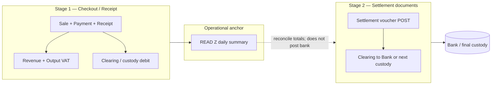
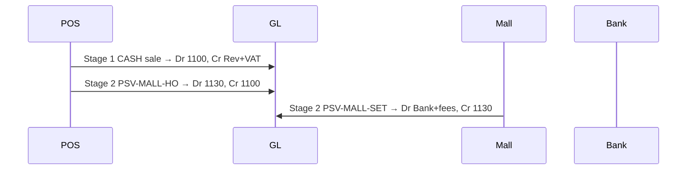

# POS Two-Stage Payment Settlement

Status: **Design direction** — architecture for Stage 1 (checkout) and Stage 2 (settlement)  
Scope: POS tender → clearing/custody GL, settlement documents, READ Z anchor, reconciliation  
Type: Design-direction document (not an implementation spec)  
Related: [08_POS_CHECKOUT_ARCHITECTURE.md](./08_POS_CHECKOUT_ARCHITECTURE.md), [11_FINANCE_POSTING_ARCHITECTURE.md](./11_FINANCE_POSTING_ARCHITECTURE.md), [12_FINANCE_RECONCILIATION_AND_CLOSE_POLICY.md](./12_FINANCE_RECONCILIATION_AND_CLOSE_POLICY.md), [13_FINANCE_OPERATIONAL_WIRING.md](./13_FINANCE_OPERATIONAL_WIRING.md), [FINANCE_TRANSACTION_UNIVERSE.md](./FINANCE_TRANSACTION_UNIVERSE.md), [RECEIPT_SETUP.md](./RECEIPT_SETUP.md), [POS_COMPLETION_ROADMAP.md](./POS_COMPLETION_ROADMAP.md)

---

## 1. Problem statement

Today, POS checkout posts a **single-stage** sale journal:

- Debit tender: `1100` (CASH) or `1110` (CARD_CLEARING) for the **full gross total**
- Credit revenue: `4000` for the **full gross total**
- Optional COGS / inventory lines from stock ledger

This conflates three distinct economic events:

| Event | When | GL character |
|-------|------|--------------|
| **Sale recognition** | Receipt issued at checkout | Revenue + output VAT |
| **Custody / clearing** | Money held at shop, mall, acquirer, or in transit | Asset reclassification only |
| **Bank settlement** | Cash deposited, card batch settled, transfer matched | Clearing → Bank (+ fees) |

Money can sit in **Cash in Drawer**, **Mall receivable**, **Card clearing**, or **Bank transfer clearing** for days before it reaches the bank. READ Z closes the **sales day**; it must not be treated as proof that cash is in the bank.

---

## 2. Two-stage accounting model



### Stage 1 — Checkout (immediate, same transaction as today)

**Trigger:** `lib/pos/checkout.ts` → `postSaleVoucher()` when `FINANCE_POSTING_ENABLED`.

**Recognizes:**

- Net sales revenue
- Output VAT (when VAT-inclusive pricing applies — see [RECEIPT_SETUP.md](./RECEIPT_SETUP.md))
- COGS / inventory (unchanged — from stock ledger)

**Does not recognize:**

- Bank receipt
- Card acquirer settlement
- Mall remittance to HO

**Debits a payment-specific clearing or custody account** — never Bank (except if a future explicit “direct-to-bank” mode is configured; out of scope for standard shop POS).

### Stage 2 — Settlement (separate posted documents)

**Trigger:** Explicit finance/POS settlement workflow — **not** automatic on READ Z.

**Moves balances** between clearing/custody accounts and Bank (or the next custody hop). **Never credits revenue or VAT.**

**Examples:**

| Settlement type | Debit | Credit |
|-----------------|-------|--------|
| Cash handover to mall | Mall cash receivable | Cash in drawer |
| Mall settlement | Bank; card/bank fees (expense) | Mall cash receivable |
| Collector pickup | Cash in transit — collector | Cash in drawer |
| Bank deposit | Bank | Cash in transit — collector |
| Card settlement | Bank; card fee expense | Card clearing |
| Bank transfer match | Bank | Bank transfer clearing |

---

## 3. Chart of accounts (proposed clearing layer)

Extend COA beyond today’s `DEFAULT_ACCOUNT_CODES` in `lib/finance/account-map.ts`. Codes are **placeholders** until COA import confirms legacy mapping.

| Code | Name | Type | Stage | Role |
|------|------|------|-------|------|
| `1100` | Cash in Drawer — Shop | ASSET | 1 / 2 | Shop cash custody after CASH sales |
| `1110` | Card Clearing / Merchant Receivable | ASSET | 1 / 2 | Card/QR acquirer unsettled balance |
| `1120` | Bank Transfer Clearing | ASSET | 1 / 2 | QR / PromptPay / transfer awaiting bank match |
| `1130` | Cash Held by Mall / Mall Receivable | ASSET | 2 | Mall custody after handover |
| `1140` | Cash in Transit — Collector | ASSET | 2 | HO collector en route to deposit |
| `1xxx` | Bank (per entity/account) | ASSET | 2 | Final destination |
| `4000` | Sales revenue (net) | REVENUE | 1 | Net of VAT |
| `460x` | Output VAT payable | LIABILITY | 1 | VAT on gross (entity-specific code TBD) |
| `5xxx` | Card / bank fee expense | EXPENSE | 2 | Settlement fees only |

**Invariant:** Stage 2 journals use **only** accounts from `{1100, 1110, 1120, 1130, 1140, bank, fee expense}` — never `4000` or VAT accounts.

---

## 4. Stage 1 — Payment method → tender account

Map `PaymentMethod` (and future branch flags) to Stage 1 **debit** account.

| Payment method | Stage 1 debit account | Notes |
|----------------|----------------------|--------|
| `CASH` | `1100` Cash in Drawer | Fixed-rent shops: stays here until collector pickup |
| `CARD` | `1110` Card Clearing | Until acquirer settlement document |
| `QR`, `TRANSFER`, `BANK_TRANSFER`, `OTHER` | `1120` Bank Transfer Clearing | READ Z bucket: BANK TRANSFER |
| `MALL_CASH` *(future)* | `1100` initially | Same as CASH until mall handover document |

### Stage 1 journal template (per receipt)

For gross total `G` (VAT-inclusive), VAT rate `r` (default 7% display per RECEIPT_SETUP):

```
net   = round(G / (1 + r), 2)
vat   = G - net

Dr  tenderAccount(G)          — clearing/custody
    Cr  4000  net              — sales revenue
    Cr  460x  vat              — output VAT
[+ existing COGS / inventory lines from stock ledger]
```

**Ref identity (unchanged):** `refType = POS_SALE`, `refId = sale.id` — not `receiptNo`.

### Refund accounting policy (locked)

**Decision:** Keep the system accounting-correct first. Refunds are separate linked transactions that reverse the original receipt economics using the **original Sale VAT snapshot**. Do not delete or mutate the original receipt.

| Rule | Policy |
|------|--------|
| Receipt | Immutable sales evidence — never edited or deleted because of a refund |
| Refund document | Separate transaction (`Refund` row + refund receipt) linked to the original receipt / sale |
| UI | May show one gross refund amount to the cashier |
| GL | Must split the refund into net revenue reversal and output VAT reversal (Stage 1 mirror) |
| VAT source | Use original `Sale` snapshot — **not** refund-date tax policy when snapshot exists |
| Presentation | Ledger / report grouping may improve later; underlying journals stay as below |

**Sale snapshot fields used at refund posting (P1.25):**

- `vatRateBps` — rate applied to refund gross to derive proportional net + VAT
- `taxCode`
- `outputVatAccountCode`
- `netAmount` / `vatAmount` on the original sale define the checkout split; partial refunds derive net/VAT from refund gross × original rate (same rounding as checkout)

**Do not** call `resolveEffectiveTaxPolicy` at refund date when the linked sale has a VAT snapshot. Finance posting fails with `MISSING_VAT_SNAPSHOT` if snapshot is absent (legacy rows must be backfilled or handled outside standard POS refund).

**Full refund example** (original sale 107.00 @ 7%, CASH):

Sale:
```
Dr 1100 107.00
    Cr 4000 100.00
    Cr 4602   7.00
```

Refund 107.00 (same economics reversed; tender credit uses original payment method clearing account):
```
Dr 4000 100.00
Dr 4602   7.00
    Cr 1100 107.00
```

**Partial refund:** refund gross `G_r` → `net_r = round(G_r / (1 + rate), 2)`, `vat_r = G_r - net_r` using the sale’s snapshotted `vatRateBps`. Still no Bank debit/credit in Stage 1.

**Code (today):**

| Piece | Location |
|-------|----------|
| Refund orchestration | `lib/pos/refund.ts` |
| VAT economics from sale snapshot | `lib/pos/refund-finance.ts` → `buildPostRefundVoucherInput` |
| Stage 1 journal lines | `lib/finance/account-map.ts` → `resolveAccountsForPosRefund` |
| Posting hook | `lib/finance/posting.ts` → `postRefundVoucher` |

### Code ownership

| Piece | Owner |
|-------|--------|
| Payment method → tender account | `lib/finance/account-map.ts` → `resolveTenderAccountCodeForPosPayment` |
| VAT split + snapshot at checkout | `lib/finance/pos-sale-vat.ts`, `lib/finance/tax-policy/`, `lib/pos/resolve-pos-sale-vat.ts` |
| Refund VAT from sale snapshot | `lib/pos/refund-finance.ts` |
| Hook | `lib/finance/posting.ts` → `postSaleVoucher` / `postRefundVoucher` |
| Orchestration | `lib/pos/checkout.ts`, `lib/pos/refund.ts` (each in its own `$transaction`) |

---

## 5. Stage 2 — Settlement document family

Introduce **POS Settlement Vouchers (PSV)** as Layer-2 business documents on the existing posting kernel — same pattern as PAV/MJV ([FINANCE_TRANSACTION_UNIVERSE.md](./FINANCE_TRANSACTION_UNIVERSE.md)).

### Document types

| Code | Business name | Typical trigger | refType (proposed) |
|------|---------------|-----------------|---------------------|
| `PSV-MALL-HO` | Cash handover to mall | Shop submits mall bag / handover slip | `POS_SETTLEMENT_MALL_HANDOVER` |
| `PSV-MALL-SET` | Mall settlement | Finance records mall remittance + fees | `POS_SETTLEMENT_MALL_SETTLEMENT` |
| `PSV-COL-PICK` | Collector pickup | Collector report persisted + confirmed | `POS_SETTLEMENT_COLLECTOR_PICKUP` |
| `PSV-BANK-DEP` | Bank deposit | Deposit slip matched | `POS_SETTLEMENT_BANK_DEPOSIT` |
| `PSV-CARD-SET` | Card settlement | Acquirer batch / statement | `POS_SETTLEMENT_CARD` |
| `PSV-TRF-MATCH` | Bank transfer match | Bank feed matches QR/transfer clearing | `POS_SETTLEMENT_TRANSFER_MATCH` |

### Workflow shape (all types)

```
DRAFT → SUBMITTED → CONFIRMED → POSTED
```

- **POST** calls `postOperationalVoucher()` with settlement-specific lines only.
- **Idempotency:** one posted settlement per operational source (e.g. `refId = collectorReportId`).
- **Period lock:** respect `assertPostingPeriodOpen` like other finance documents.

### Standard GL patterns

**Cash handover to mall**

```
Dr  1130  Mall cash receivable
    Cr  1100  Cash in drawer
```

**Mall settlement**

```
Dr  1xxx  Bank (net received)
Dr  5xxx  Mall / card fees (if any)
    Cr  1130  Mall cash receivable
```

**Collector pickup** *(aligns with existing Collector thermal report)*

```
Dr  1140  Cash in transit — collector
    Cr  1100  Cash in drawer
```

**Bank deposit**

```
Dr  1xxx  Bank
    Cr  1140  Cash in transit — collector
```

**Card settlement**

```
Dr  1xxx  Bank (net)
Dr  5xxx  Card fee expense
    Cr  1110  Card clearing
```

**Bank transfer match**

```
Dr  1xxx  Bank
    Cr  1120  Bank transfer clearing
```

### Module placement

| Layer | Path | Responsibility |
|-------|------|----------------|
| Domain | `lib/finance/pos-settlement/` | Validation, line builders, POST, types |
| POS integration | `lib/pos/collector-settlement.ts` (or hook in `persist-collector-report.ts`) | Bridge CollectorReport → PSV-COL-PICK |
| UI | `app/finance/settlements/*` or extend `/finance` hub | HO finance entry, inquiry |
| API | `app/api/finance/pos-settlements/*` | Parse, auth, call domain |

Settlement documents **must not** live in React pages or API routes as business logic ([01_MODULAR_MONOLITH_BOUNDARIES.md](./01_MODULAR_MONOLITH_BOUNDARIES.md)).

---

## 6. READ Z — daily anchor (not bank settlement)

READ Z is the **operational close-of-day** for POS sales and payments. It already aggregates:

- Payment buckets: CASH, CREDIT CARD, BANK TRANSFER (`lib/pos/readReportPayment.ts`)
- Product group summary
- Net sales after refunds

### Role in two-stage accounting

| READ Z does | READ Z does not |
|-------------|-----------------|
| Summarize Stage 1 operational totals for a Bangkok calendar day | Post Stage 2 settlement journals |
| Provide reconciliation anchor: Σ receipt tenders ≈ Σ Stage 1 clearing debits (by method) | Imply cash is in the bank |
| Close the shop sales day (staff workflow: print → clock out) | Replace Collector pickup or bank deposit documents |
| Support HO cumulative review (`read-z-review` API) | Move mall cash or card clearing balances |

### Recommended READ Z extensions (future)

| Extension | Purpose |
|-----------|---------|
| `PosDayClose` record | `{ branchId, bangkokDateYmd, readZPrintedAt, saleCount, paymentTotalsJson }` — immutable day anchor |
| GL reconciliation line on READ Z slip (optional) | Show clearing account **movement** for the day vs operational totals — read-only |
| “Unsettled balance” footer | Sum of outstanding clearing per method from GL — informational |

**Rule:** Printing READ Z must remain **read-only** with respect to GL. Any correction goes through refunds (Stage 1) or settlement documents (Stage 2), not READ Z repost.

---

## 7. Shop operating models

### Fixed-rent shops (cash stays in drawer)


Cash remains **`1100`** from checkout until collector pickup. READ Z does not move it.

### Mall / revenue-share shops (cash handover)



Branch configuration (`Branch.cashCustodyMode`: `SHOP_DRAWER` | `MALL_HANDOVER`) selects whether mall handover is expected — not inferred from payment method alone.

---

## 8. Reconciliation model

Extend `lib/finance/reconciliation.ts` with **clearing-account bridges** ([12_FINANCE_RECONCILIATION_AND_CLOSE_POLICY.md](./12_FINANCE_RECONCILIATION_AND_CLOSE_POLICY.md)).

| Bridge | Operational source | GL account | Stage |
|--------|-------------------|------------|-------|
| Cash tender vs drawer | Σ CASH `Payment.amount` − refunds | `1100` movement | 1 |
| Card tender vs clearing | Σ CARD payments | `1110` movement | 1 |
| Transfer tender vs clearing | Σ QR/TRANSFER/BANK_TRANSFER | `1120` movement | 1 |
| Collector report vs in-transit | CollectorReport cash total | `1140` after PSV-COL-PICK | 2 |
| Unsettled clearing aging | — | `1110`, `1120`, `1130`, `1140` balances | 2 |

Variance policy: **explain first** — operational fix (missing sale/refund) or settlement document — never silent GL write-back.

---

## 9. Current codebase gap summary

| Area | Today | Target |
|------|-------|--------|
| `resolveAccountsForPosSale` | Gross → `1100`/`1110` + `4000` | Net + VAT + method-specific clearing |
| `PaymentMethod` enum | CASH, CARD, QR, TRANSFER, OTHER, BANK_TRANSFER | + `MALL_CASH` if needed; branch mode for mall |
| Collector report | Thermal + JSON persist only | + optional PSV-COL-PICK POST |
| READ Z | Sales/payment summary | + day-close anchor; explicit non-settlement semantics |
| Settlement docs | None | PSV family in `lib/finance/pos-settlement/` |
| Reconciliation | Card clearing bridge exists | Full clearing ladder + aging |

---

## 10. Phased implementation

| Phase | Deliverable | Depends on |
|-------|-------------|------------|
| **P1** | COA codes for clearing accounts; Stage 1 VAT split + tender map in `account-map.ts` | COA import confirms codes |
| **P1.25** | Effective-dated VAT policy + Sale VAT snapshot at checkout; refund uses sale snapshot | P1 |
| **P1.5** | Sales/tender reconciliation: gross ↔ GL net+VAT; Stage 1 clearing accounts incl. 1190; refunds netted | P1.25 |
| **P1.6** | Refund reconciliation: gross ↔ GL net+VAT reversal; tender credits on 1100/1110/1120/1190 via shared tender map | P1.5 |
| **P1.6F** | Refund test fixtures: mock sales include P1.25 VAT snapshot; `MISSING_VAT_SNAPSHOT` negative test preserved | P1.6 |
| **P2** | PSV domain skeleton + COL-PICK: Dr 1140 / Cr 1100 from persisted CollectorReport; idempotent refId | P1 |
| **P2.1** | Finance API `POST /api/finance/pos-settlement/collector-pickup/post` (HO_FINANCE / HO_ADMIN only) | P2 |
| **P3** | PSV-BANK-DEP, PSV-CARD-SET, PSV-TRF-MATCH (finance UI) | P1 |
| **P4** | Mall handover + settlement (PSV-MALL-*) + branch custody mode | Branch master data |
| **P5** | READ Z day-close record + reconciliation bridges + aging report | P1–P3 |

Each phase keeps **same-transaction** Stage 1 posting in checkout ([13_FINANCE_OPERATIONAL_WIRING.md](./13_FINANCE_OPERATIONAL_WIRING.md)). Stage 2 always uses its own `$transaction` at settlement POST.

---

## 11. Invariants (locked)

1. **Stage 1 owns revenue and VAT** — only checkout/refund hooks credit `4000` / VAT.
2. **Stage 2 never touches revenue or VAT** — clearing and bank movement only.
3. **Bank is never debited in Stage 1** for standard POS checkout.
4. **READ Z is not a settlement event** — it anchors sales reconciliation, not bank confirmation.
5. **One posted voucher per operational source** — idempotent settlement POST.
6. **Entity isolation** — all journals carry session `legalEntityCode`; clearing balances are entity-scoped.
7. **Operational truth for tender** — `Payment.method` and amounts remain authoritative; GL is derived ([12 §2](./12_FINANCE_RECONCILIATION_AND_CLOSE_POLICY.md)).
8. **Refund reverses sale snapshot economics** — original receipt is immutable; refund is a separate linked transaction; GL splits gross refund into net revenue + output VAT using the original sale’s `vatRateBps` / `outputVatAccountCode`, not refund-date VAT policy.

---

## 12. Open decisions

| # | Question | Default recommendation |
|---|----------|------------------------|
| 1 | Exact output VAT account code per entity (AS vs AD) | Map in COA import; use configurable `OUTPUT_VAT_ACCOUNT_CODE` |
| 2 | PSV document numbering | `PSV-YYnnnn` per [99_ASA_HANDBOOK.md](./99_ASA_HANDBOOK.md) |
| 3 | Auto-post collector pickup on persist vs separate finance confirm | **Separate CONFIRM** — collector slip is operational; finance confirms count |
| 4 | Card settlement frequency | Manual PSV-CARD-SET from statement (no acquirer API in v0) |
| 5 | Partial mall settlement | Allow multiple PSV-MALL-SET against one handover balance with open-item tracking (Phase 4+) |

---

## 13. References in code (today)

| Concern | Location |
|---------|----------|
| Checkout orchestration | `lib/pos/checkout.ts` |
| Stage 1 posting | `lib/finance/posting.ts` → `postSaleVoucher` |
| Account mapping | `lib/finance/account-map.ts` |
| READ Z aggregation | `lib/pos/aggregatePosReadReport.ts`, `lib/pos/readReportPayment.ts` |
| Collector persist | `lib/pos/persist-collector-report.ts` |
| Card clearing reconciliation | `lib/finance/reconciliation.ts` |
| Payment evidence (transfer) | `lib/pos/payment-evidence*` (operational; Stage 2 match is separate) |
