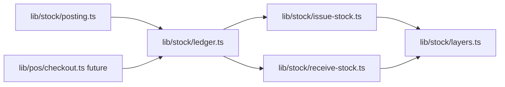

# Architecture Guards

Status: Active  
Scope: Centralized grep/audit rules that protect architecture boundaries across `asa-con-v0`  
Related: [01_MODULAR_MONOLITH_BOUNDARIES.md](./01_MODULAR_MONOLITH_BOUNDARIES.md), [06_STOCK_LEDGER_FOUNDATION.md](./06_STOCK_LEDGER_FOUNDATION.md), [07_STOCK_DOCUMENT_POSTING.md](./07_STOCK_DOCUMENT_POSTING.md)

> **Automated audits:** Run `npm run audit:all` (or see [ARCHITECTURE_AUDIT_COMMANDS.md](./ARCHITECTURE_AUDIT_COMMANDS.md) for per-domain commands). The npm scripts mirror the Jest boundary tests under `__tests__/`.

This document defines **who may write what**, **forbidden patterns**, and **audit commands**. It is the single reference for manual reviews and CI enforcement.

---

## 1. Stock mutation guards

Stock rows (`Stock`), FIFO layers (`StockLayer`), and ledger rows (`StockTransaction`) are the inventory source of truth. All mutations must flow through the Phase 3 ledger kernel.

### 1.1 Who may call Prisma stock writers

| Prisma API | Allowed modules only |
|------------|----------------------|
| `tx.stock.create` / `tx.stock.update` | `lib/stock/receive-stock.ts`, `lib/stock/issue-stock.ts` |
| `tx.stockLayer.create` / `tx.stockLayer.update` | `lib/stock/layers.ts`, `lib/stock/receive-stock.ts` (via `layers.ts`) |
| `tx.stockTransaction.create` | `lib/stock/receive-stock.ts`, `lib/stock/issue-stock.ts` |

**Indirect path (required):** all business flows call `ledger.issueStock()` or `ledger.receiveStock()` — never Prisma stock writers directly.

### 1.2 Allowed call graph



### 1.3 Exemptions (non-production)

| Path | Reason |
|------|--------|
| `scripts/**` (dev seed / one-off tooling) | Explicitly non-production |
| `__tests__/**` mock transaction clients | Test doubles only — no real DB writes |

### 1.4 Forbidden usage examples

```typescript
// FORBIDDEN — route inline stock write
// app/api/stock-document/[id]/post/route.ts
await prisma.stock.update({ where: { … }, data: { qty: … } })

// FORBIDDEN — component
await fetch("/api/…") // OK for HTTP, but never Prisma in components anyway

// FORBIDDEN — finance module
await tx.stockTransaction.create({ … })

// FORBIDDEN — posting bypassing ledger
await tx.stockLayer.create({ … }) // in posting.ts — use receiveStock() instead

// FORBIDDEN — signed qty through wrong API
await issueStock({ items: [{ qty: 5, … }] }) // inbound must use receiveStock()
```

### 1.5 Audit pattern (stock Prisma writes)

```bash
rg "(\.stock\.(create|update|upsert|delete)|\.stockLayer\.(create|update|delete)|\.stockTransaction\.create)" app/ lib/ components/ scripts/ --glob "*.ts" --glob "!**/__tests__/**"
```

**Expected hits after Phase 3:** `lib/stock/issue-stock.ts`, `lib/stock/receive-stock.ts`, `lib/stock/layers.ts` only (plus `scripts/` if seeds exist).

---

## 2. Document status guards

`StockDocument.status` drives workflow gates. Scattered status writes cause double-POST, skipped validation, and audit gaps.

### 2.1 Rule

**Only `lib/stock/document/document-status.ts` may mutate `StockDocument.status` and workflow timestamps** (`submittedAt`, `confirmedAt`, `postedAt`, `cancelledAt`, `*ByStaffId`).

| Operation | Owner |
|-----------|--------|
| Status transitions (POST, CANCEL, future SEND/CONFIRM/…) | `document-status.ts` |
| POST orchestration + ledger | `lib/stock/posting.ts` — calls `applyPostedTransition()`; **no** direct `stockDocument.update` |
| DRAFT hard delete | `document-status.ts` — `deleteDraftDocument()` only when `status === DRAFT` |
| SUBMITTED+ void | `document-status.ts` — `applyCancelledTransition()` → `CANCELLED` (never delete) |

> **Note:** SAVE (Phase 23B) may update `StockDocument` header fields and lines while **keeping** `status: DRAFT` via `document-save.ts` — it must **not** change `status` or call `stockDocument.delete` outside `document-status.ts`.

**Terminal statuses:** `POSTED` and `CANCELLED` are immutable — no edit, cancel, delete, or re-POST.

### 2.2 Grep patterns to audit violations

**Broad — any document update (review manually):**

```bash
rg "stockDocument\.(update|updateMany)" app/ lib/ components/ --glob "*.ts" --glob "!**/__tests__/**"
```

**Targeted — status field writes:**

```bash
rg "stockDocument\.update" app/ lib/ --glob "*.ts" -A 8 | rg "status\s*:"
```

**Status assignment in create (allowed only for initial DRAFT on create):**

```bash
rg "stockDocument\.create" app/ lib/ --glob "*.ts" -A 8 | rg "status\s*:"
```

Initial create with `status: "DRAFT"` may live in save module; transitions away from DRAFT require `document-status.ts` (via workflow helpers in 23B+).

### 2.3 Forbidden direct updates

```typescript
// FORBIDDEN — route sets POSTED
await prisma.stockDocument.update({
  where: { id },
  data: { status: "POSTED", postedAt: new Date() },
})

// FORBIDDEN — workflow helper outside document-status.ts
export async function confirmDocument(id: string) {
  return prisma.stockDocument.update({ data: { status: "CONFIRMED" } })
}

// FORBIDDEN — UI/server action
"use server"
await prisma.stockDocument.update({ data: { status: "SUBMITTED" } })
```

**Correct pattern:**

```typescript
// app/api/stock-document/[id]/post/route.ts — thin delegate
const result = await postDocument({ documentId: id, postedByStaffId: staffId })
```

---

## 3. Ledger caller guards

High-level ledger entry points are **`issueStock()`** (outbound) and **`receiveStock()`** (inbound). Callers choose direction explicitly — no signed qty.

### 3.1 Allowed callers

| Caller | Phase | May call |
|--------|-------|----------|
| `lib/stock/posting.ts` | 4+ | `issueStock()`, `receiveStock()` |
| `lib/pos/checkout.ts` | 5+ | `issueStock()` only |
| `scripts/**` (dev seed) | any | both (non-production) |
| `lib/stock/ledger.ts` | 3 | defines exports — not a business caller |

**No other module** may import and invoke ledger functions.

### 3.2 Forbidden usage examples

```typescript
// FORBIDDEN — API route
import { issueStock } from "@/lib/stock"
await issueStock({ … })

// FORBIDDEN — finance
await receiveStock({ … })

// FORBIDDEN — posting using signed convention
await issueStock({ items: [{ qty: -5, … }] }) // use issueStock({ qty: 5 }) outbound magnitude

// FORBIDDEN — inbound through issueStock
await issueStock({ items: [{ qty: purchaseQty, … }] }) // use receiveStock()
```

### 3.3 Audit patterns

```bash
# All ledger invocations — review every hit
rg "issueStock\s*\(|receiveStock\s*\(" app/ lib/ components/ scripts/ --glob "*.ts" --glob "!**/__tests__/**"
```

**Expected business callers (steady state):**

- `lib/stock/posting.ts`
- `lib/pos/checkout.ts` (when added)
- `lib/stock/ledger.ts` (re-export / internal — not business invocation)
- `scripts/**` (optional)

**Internal-only (expected):** `lib/stock/ledger.ts` calling `applyIssueItem` / `applyReceiveItem` — not `issueStock`/`receiveStock` from child modules.

---

## 4. Transaction guards

### 4.1 Rules

| Rule | Detail |
|------|--------|
| No nested `$transaction` | If caller passes `tx`, callee must not open `prisma.$transaction` |
| Inner modules accept `tx` | `layers.ts`, `issue-stock.ts`, `receive-stock.ts`, ledger when joining |
| One business op = one outer tx | POST, checkout, batch finance post each open exactly one top-level transaction |

### 4.2 Allowed transaction owners

| Module | May open `prisma.$transaction`? |
|--------|----------------------------------|
| `lib/stock/ledger.ts` | **Yes** — when `input.tx` omitted (standalone ledger call) |
| `lib/stock/posting.ts` | **Yes** — POST orchestration (passes `tx` to ledger) |
| `lib/pos/checkout.ts` | **Yes** — future checkout bundle |
| `lib/stock/layers.ts` | **No** |
| `lib/stock/issue-stock.ts` | **No** |
| `lib/stock/receive-stock.ts` | **No** |
| `app/api/**/route.ts` | **No** — delegate to domain service |
| `components/**` | **No** |

**Preferred POST pattern:** `posting.ts` opens outer tx; calls `issueStock({ tx, … })` / `receiveStock({ tx, … })` so ledger does **not** open a nested transaction.

### 4.3 Forbidden usage examples

```typescript
// FORBIDDEN — nested transaction in layer
export async function consumeStockLayersFifo(tx, args) {
  return prisma.$transaction(async (inner) => { … })
}

// FORBIDDEN — route opens tx with inline Prisma
export async function POST(req) {
  return prisma.$transaction(async (tx) => {
    await tx.stock.update(…)
  })
}

// FORBIDDEN — ledger called without tx inside posting's existing tx
// (causes nested $transaction if posting already opened one and ledger omits tx)
await issueStock({ … }) // missing tx inside postDocument's transaction callback
```

### 4.4 Audit pattern

```bash
rg "\$transaction\s*\(" app/ lib/ components/ scripts/ --glob "*.ts" --glob "!**/__tests__/**"
```

Review each hit: only allowed owners above. Flag any `$transaction` inside `lib/stock/layers.ts`, `issue-stock.ts`, `receive-stock.ts`.

---

## 5. Framework boundary guards

Domain libraries must stay framework-agnostic for testability and clear layering.

### 5.1 Rules

| Rule | Scope |
|------|-------|
| No React in `lib/*` | No `react`, `useState`, `useEffect`, JSX |
| No `NextResponse` in `lib/stock/*` | HTTP belongs in `app/api/**` |
| No `app/` imports in domain libraries | `lib/**` must not import from `app/**` |
| No `components/` imports in `lib/**` | UI consumes lib — not reverse |

### 5.2 Allowed exceptions

| Path | Exception |
|------|-----------|
| `lib/**/*.test.ts` | May use test utilities |
| `next` types only | Avoid — prefer domain types in `lib/shared/types.ts` |

### 5.3 Forbidden usage examples

```typescript
// FORBIDDEN — lib/stock/posting.ts
import { NextResponse } from "next/server"
export function postDocument() { return NextResponse.json({ … }) }

// FORBIDDEN — lib/finance/voucher.ts
import { SomeHelper } from "@/app/api/finance/utils"

// FORBIDDEN — lib/stock/summary.ts
import { StockGrid } from "@/components/stock/StockGrid"
```

### 5.4 Audit patterns

```bash
# React in lib
rg "from ['\"]react['\"]|useState|useEffect|useCallback|useMemo" lib/ --glob "*.ts" --glob "*.tsx"

# NextResponse in lib (especially stock)
rg "NextResponse|next/server|next/headers" lib/ --glob "*.ts"

# app imports inside lib
rg "from ['\"]@/app/|from ['\"]\.\./.*app/" lib/ --glob "*.ts"

# components imports inside lib
rg "from ['\"]@/components/" lib/ --glob "*.ts"
```

---

## 6. Decimal guards

Money and inventory value must not use raw IEEE floating point.

### 6.1 Rules

| Rule | Detail |
|------|--------|
| No raw JS float arithmetic for stock/finance values | Avoid `*` `/` `+` `-` on money, avg cost, layer value |
| Use Decimal helpers | `lib/stock/decimal.ts` (`toDec`, `inboundMovingAverage`); future `lib/finance/decimal.ts` |
| Prisma `Decimal` type | Persist and pass `Prisma.Decimal` — convert at boundaries |
| Display formatting | OK to call `.toNumber()` at UI boundary only — not mid-calculation |

### 6.2 Allowed

```typescript
import { toDec, inboundMovingAverage } from "@/lib/stock/decimal"
const unitCost = toDec(rawUnitCost)
const afterAvg = inboundMovingAverage(beforeQty, beforeAvg, qty, unitCost)
```

### 6.3 Forbidden usage examples

```typescript
// FORBIDDEN — stock average cost
const afterAvg = (beforeQty * beforeAvg + qty * unitCost) / afterQty

// FORBIDDEN — finance line amount
const lineTotal = quantity * unitPrice * 1.07

// FORBIDDEN — implicit float from Number()
const value = Number(stock.avgCost) * stock.qty // use Decimal helpers
```

### 6.4 Audit patterns (heuristic — review hits manually)

```bash
# Suspicious float math on cost/value fields (noisy — triage required)
rg "(avgCost|unitCost|beforeValue|afterValue|amount|total).*[\*\/\+\-]" lib/stock/ lib/finance/ --glob "*.ts"

# Direct Number() on decimal fields in domain code
rg "Number\s*\(\s*(.*(avgCost|unitCost|amount|value))" lib/stock/ lib/finance/ --glob "*.ts"
```

Prefer code review for new ledger/finance modules; tighten patterns when CI is added.

---

## 7. Future governance notes

### 7.1 CI grep checks (planned)

| Check | Fail condition |
|-------|----------------|
| Stock Prisma writes outside allowlist | Any hit outside `lib/stock/{issue-stock,receive-stock,layers}.ts` |
| `stockDocument.update` outside `document-status.ts` | Any hit |
| `stockDocument.delete` outside `document-status.ts` | Any hit |
| `issueStock` / `receiveStock` outside allowlist | Any hit outside posting, pos, ledger definition, scripts |
| `$transaction` in inner stock modules | Hit in layers / issue / receive |
| `NextResponse` in `lib/stock/**` | Any hit |
| `@/app/` import in `lib/**` | Any hit |

Run as **`npm run audit:architecture`** — see [ARCHITECTURE_AUDIT_COMMANDS.md](./ARCHITECTURE_AUDIT_COMMANDS.md).

### 7.2 Architecture audit scripts

```
scripts/audit/
├── architecture-audit.ts
├── finance-boundary-audit.ts
├── ui-boundary-audit.ts
├── no-nested-tx-audit.ts
└── lib/                  # shared scan helpers + rules.ts
```

Scripts should:

- Exclude `__tests__/**`, `generated/**`, `node_modules/**`
- Print file:line for each hit
- Exit non-zero on forbidden hits
- Allow documented exemptions via comment tag: `// architecture-guard: allow stock.seed`

### 7.3 Protected boundaries summary

| Boundary | Owner | Enforcement |
|----------|-------|-------------|
| Stock qty / layers / ledger rows | `lib/stock/*` ledger | §1, §3 |
| Document workflow status | `lib/stock/document/document-status.ts` | §2 |
| HTTP / React | `app/`, `components/` | §5 |
| Permissions | `lib/permissions/` | separate RBAC audits |
| Decimal math | `lib/stock/decimal.ts`, future finance helpers | §6 |

---

## 8. Suggested audit commands

Run from repository root (`asa-con-v0`). Requires [ripgrep](https://github.com/BurntSushi/ripgrep) (`rg`).

### 8.1 Quick full audit (copy-paste)

```bash
# 1. Stock Prisma writes
rg "(\.stock\.(create|update|upsert|delete)|\.stockLayer\.(create|update|delete)|\.stockTransaction\.create)" app/ lib/ components/ scripts/ --glob "*.ts" --glob "!**/__tests__/**"

# 2. Document updates (manual review for status changes)
rg "stockDocument\.(update|updateMany)" app/ lib/ --glob "*.ts" --glob "!**/__tests__/**"

# 3. Ledger callers
rg "issueStock\s*\(|receiveStock\s*\(" app/ lib/ components/ scripts/ --glob "*.ts" --glob "!**/__tests__/**"

# 4. Transactions
rg "\$transaction\s*\(" app/ lib/ components/ scripts/ --glob "*.ts" --glob "!**/__tests__/**"

# 5. NextResponse / next server in lib
rg "NextResponse|from ['\"]next/server['\"]|from ['\"]next/headers['\"]" lib/ --glob "*.ts"

# 6. app/ imports inside lib
rg "from ['\"]@/app/" lib/ --glob "*.ts"

# 7. React in lib
rg "from ['\"]react['\"]" lib/ --glob "*.{ts,tsx}"
```

### 8.2 PowerShell equivalent (Windows)

If `rg` is not installed, use `Select-String` on a narrowed path — or install ripgrep for consistent results. Prefer `rg` for cross-platform CI parity.

### 8.3 Pre-PR checklist

- [ ] Run §8.1 commands; no unexpected files
- [ ] New stock code only in `lib/stock/**`
- [ ] POST path uses `postDocument()` — no route-level ledger calls
- [ ] Ledger calls inside posting pass `tx`
- [ ] No `Number()` math on costs in domain layer
- [ ] No new imports from `app/` or `components/` into `lib/`

### 8.4 Expected baseline (Phase 3 complete, Phase 4 not started)

| Pattern | Expected files |
|---------|----------------|
| Stock Prisma writes | `lib/stock/issue-stock.ts`, `receive-stock.ts`, `layers.ts` |
| `$transaction` | `lib/stock/ledger.ts` |
| `issueStock` / `receiveStock` calls | `lib/stock/ledger.ts` (definition only) |
| `stockDocument.update` | none yet |
| `NextResponse` in `lib/stock/**` | none |

After Phase 4: add `lib/stock/posting.ts` to ledger caller and `$transaction` allowlists. After Phase 23B-0: `stockDocument.update` / `stockDocument.delete` appear **only** in `lib/stock/document/document-status.ts`.

---

## Related docs

- [01_MODULAR_MONOLITH_BOUNDARIES.md](./01_MODULAR_MONOLITH_BOUNDARIES.md)
- [06_STOCK_LEDGER_FOUNDATION.md](./06_STOCK_LEDGER_FOUNDATION.md)
- [07_STOCK_DOCUMENT_POSTING.md](./07_STOCK_DOCUMENT_POSTING.md)

---

**Changes to guarded boundaries require updating this document and the relevant phase architecture doc before implementation.**
