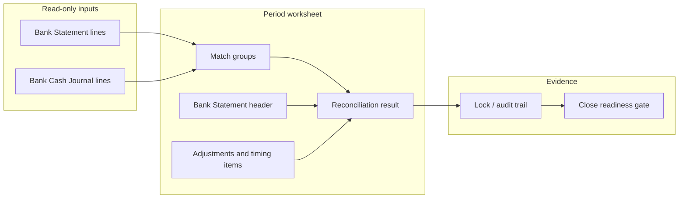

# Finance Bank / Cash Reconciliation Design (REC-3)

Status: **Design — pending approval**  
Source workbook: `D:\_asa-con\BCJ-202601.xls` (January 2026, ASA Distribution / ASAD)  
Related: [12_FINANCE_RECONCILIATION_AND_CLOSE_POLICY.md](./12_FINANCE_RECONCILIATION_AND_CLOSE_POLICY.md), [15_FINANCE_PERIODS.md](./15_FINANCE_PERIODS.md), [21_FINANCE_CLOSE_WORKFLOW.md](./21_FINANCE_CLOSE_WORKFLOW.md), [11_FINANCE_POSTING_ARCHITECTURE.md §13](./11_FINANCE_POSTING_ARCHITECTURE.md), Phase 23C implementation under `lib/finance/bank-reconciliation/`

---

## 1. Purpose

Bank/cash reconciliation closes the loop between **what the bank says** (statement) and **what the books say** (GL bank/cash accounts) for a given **legal entity** and **accounting period**.

| Goal | Description |
|------|-------------|
| Period evidence | Satisfy close-readiness checklist items (`bank-reconciliation-*`) with auditable worksheets |
| Operational clarity | Show bank movements alongside posted journal activity (BCJ-style journal) |
| Explain variance | Outstanding items, bank charges, interest, and manual adjustments — without silent GL fixes |
| Entity isolation | ASAS and ASAD reconciliations never share data, cookies, or worksheets |
| Future import | Design hooks for CSV/OCR statement import — **not implemented in REC-3** |

**Non-goals for REC-3**

- Changing accounting/posting logic or journal immutability rules
- Building OCR or auto-posting adjustment vouchers
- Mixing ASAS and ASAD in one worksheet, statement, or match group
- Replacing the existing operational-vs-GL reconciliation dashboard ([16_FINANCE_RECONCILIATION.md](./16_FINANCE_RECONCILIATION.md))

---

## 2. Current manual workflow (BCJ-202601.xls)

Finance maintains a monthly **Bank Cash Journal (BCJ)** workbook per bank GL sub-account. January 2026 (`BCJ-202601.xls`) covers **ASA Distribution (Thailand) Co., Ltd. (ASAD)** — Bangkok Bank current account.

### 2.1 Workbook structure

| Sheet | Role |
|-------|------|
| **Bank Journal** | Double-entry cash journal: bank column + offset GL splits |
| **Bank Reconciliation** | Classic bank rec statement tying statement balance to book balance |

Header fields (both sheets):

| Field | BCJ example | Notes |
|-------|-------------|-------|
| Company | บจ.อาสา ดิสทริบิวชั่น (ประเทศไทย) | ASAD |
| File name | `BCJ-202601` | `{BCJ}-{YYYYMM}` |
| GL sub-account name | บัญชีรายวันเงินฝากธนาคารกรุงเทพ - บัญชีกระแสรายวัน | Internal journal name |
| Internal GL code | `1021002` | Sub-account under bank (maps to ASA-CON `1021` family) |
| Bank branch | ถนนจันทน์ สะพาน 5 | |
| Bank account number | `2193020266` | Bangkok Bank current (`219-302026-6` on statement) |

### 2.2 Bank Journal — what Finance records

The journal is the **book-side running register**. Each bank movement produces one or more rows.

#### Column layout

| Column (TH) | English | Content |
|-------------|---------|---------|
| วันที่ | Date | Transaction date |
| รายละเอียด | Description | Business narrative (vendor, salary, tax, inter-co) |
| (entity) | Legal entity tag | `ASAD` on every row in this file |
| เลขที่ใบสำคัญ | Voucher ref | e.g. `PV001`, `RV001` |
| เลขที่เช็ค | Cheque / bank ref | `BBL02446419`, `BBLหักบัญชี`, `BBL02476363` |
| เดบิต (bank) | Bank debit | **Deposits** (money in) |
| เครดิต (bank) | Bank credit | **Withdrawals** (money out) |
| ยอดคงเหลือ | Running balance | `prior + debit − credit` (formula `+H{n-1}+F{n}-G{n}`) |
| ชื่อบัญชี / เลขที่บัญชี / เดบิต / เครดิต | Offset GL split | VLOOKUP to chart; completes double entry |

#### January 2026 movements (bank column)

| Date | Description (summary) | Cheque/ref | Withdrawal (Cr) | Deposit (Dr) | Running balance |
|------|----------------------|------------|-----------------|--------------|-----------------|
| 01/01 | B/F ยอดยกมา | — | — | — | **908,539.12** |
| 05/01 | Bonus / salary batch | BBLหักบัญชี | 166,270.00* | — | 742,269.12 |
| 05/01 | K.I.T. Trading | BBL02446419 | 8,848.90 | — | 733,420.22 |
| 15/01 | Freight Links (import duty/VAT/fees) | BBL02446420 | 74,017.00 | — | 659,403.22 |
| 15/01 | Revenue Dept (P.P.30, P.N.D.1/53) | BBL02446421 / BBL02444926 | 27,013.18 | — | 632,390.04 |
| 30/01 | January salary | BBLหักบัญชี | 214,362.00* | — | 418,028.04 |
| 30/01 | ASA Service inter-co deposit | BBL02476363 | — | 220,289.49 | **638,317.53** |

\*Journal totals include embedded bank charges (`6941`) on the same value dates; the **bank statement** shows separate `COM CHARGED` lines (20.00 and 30.00) while net salary/cheque amounts differ slightly from gross GL splits.

#### Summary / formula areas (Bank Journal)

| Row area | Formula / meaning | Jan 2026 value |
|----------|-------------------|----------------|
| Detail subtotals (row 30) | Sum of offset GL debits/credits | Dr 531,635.31 / Cr 34,606.22 |
| **ยอดรวม** (row 31) | Period bank debits/credits vs opening | Total Dr 1,128,828.61 / Total Cr **490,511.08** |
| Net period movement | `F31 − F30 − F9` (deposits) / `G31 − G30 − G9` (withdrawals) | Deposits **220,289.49** / Withdrawals **490,511.08** |
| **ยอดยกไป** (row 61) | Carry-forward ending balance | **638,317.53** |
| Book tie-out | `F9 − G9 + M61 − L61` | Matches running balance |

The journal is **derived from posted vouchers** (PV/RV). Split rows allocate one bank movement to multiple GL accounts (salary payable, WHT, AP, VAT, etc.).

### 2.3 Bank Reconciliation sheet — what Finance records

Classic two-sided reconciliation as of **31 January 2569 (2026)**:

```
ยอดคงเหลือตามใบแจ้งยอดธนาคาร     = 638,317.53
บวก  เงินฝากระหว่างทาง            = (blank → 0)
บวก  ค่าธรรมเนียมธนาคาร (timing)   = (blank → 0)
หัก   เช็คสั่งจ่ายที่ยังไม่ขึ้นเงิน  = (blank → 0)
หัก   ดอกเบี้ย (timing)             = (blank → 0)
─────────────────────────────────────────────
ยอดคงเหลือตามบัญชี                 = 638,317.53
Variance (vs Bank Journal ending)  = 0
```

| Concept | BCJ field | Jan 2026 |
|---------|-----------|----------|
| Bank ending balance | ยอดคงเหลือตามใบแจ้งยอดธนาคาร | **638,317.53** |
| Outstanding deposits | เงินฝากระหว่างทาง | 0 |
| Outstanding payments | เช็คที่ยังไม่ขึ้นเงิน | 0 |
| Bank charges (timing) | ค่าธรรมเนียมธนาคาร | 0 (already in journal) |
| Interest (timing) | ดอกเบี้ยเงินฝาก | 0 |
| GL / book ending balance | ยอดคงเหลือตามบัญชี (= SUM adjustments + statement) | **638,317.53** |
| Variance | `J27 − 'Bank Journal'!G61` | **0** |

January reconciled **cleanly** — no outstanding cheques or deposits in transit. Bank charges appeared on both the **statement** and the **journal** (accounts `6941`), so no timing adjustment was needed on the rec sheet.

### 2.4 Bangkok Bank statement (external source)

The scanned January 2026 statement aligns with the BCJ totals:

| Statement column | Maps to |
|------------------|---------|
| Date | Statement line date |
| Particulars | `SALARY`, `CHEQUE AUTOPOST`, `BILL PAYMENT`, `TR FR/TO C/A`, `COM CHARGED` |
| Chq.No. | Cheque number (`02446419`, etc.) |
| Withdrawal | Bank credit in BCJ |
| Deposit | Bank debit in BCJ |
| Balance | Running balance → must equal 638,317.53 |
| Via | Channel (`Auto`, `User Self Service`, branch) — metadata only |
| Handwritten notes | Business context (`ASAS` on inter-co deposit, vendor names) |

**Entity note:** The deposit annotated **"ASAS"** is an **inter-company receipt from ASA Service** recorded in **ASAD** books (`RV001`). It is not ASAS's own bank account — isolation must keep ASAS bank rec separate.

---

## 3. ASA-CON today (Phase 23C baseline)

Phase 23C already implements a **summary worksheet** per `(legalEntityCode, periodKey, glAccountId)`:

| Layer | Location |
|-------|----------|
| Schema | `BankReconciliation`, `CashReconciliation` ([`prisma/schema.prisma`](../prisma/schema.prisma)) |
| Compute | [`computeBankReconciliationAmounts`](../lib/finance/period-reconciliation-compute.ts) |
| API | `GET/POST /api/finance/bank-reconciliation`, `PATCH …/[id]` |
| Workflow | DRAFT → SUBMITTED → CONFIRMED → LOCKED |
| GL balance | Cumulative signed balance on bank GL through period end (read-only) |
| Close gate | [`close-checklist.ts`](../lib/finance/close-checklist.ts) — `bank-reconciliation-*` rules |
| UI (basic) | [`BankReconciliationPage.tsx`](../components/finance/BankReconciliationPage.tsx) — **summary fields only** |

### 3.1 Existing reconciliation formula

```
reconciledBalance = glBalance
                  + outstandingDeposits
                  − outstandingPayments
                  + interest
                  − bankCharges
                  + adjustments

variance = reconciledBalance − bankStatementBalance   // zero when reconciled
```

This matches the BCJ Bank Reconciliation sheet structure (statement ± timing items → book).

### 3.2 GL account mapping today

- `GlAccount.reconciliationRole = BANK | CASH` marks accounts eligible for period worksheets ([`period-reconciliation-accounts.ts`](../lib/finance/period-reconciliation-accounts.ts)).
- BCJ internal code `1021002` corresponds to ASA-CON bank family **`1021`** (เงินฝากธนาคาร) — see [M1 opening journal spec](./migration/M1_OPENING_JOURNAL_SPEC.md).
- No separate **Bank Account master** table exists yet; external account number / branch live only in Finance spreadsheets.

---

## 4. Proposed ASA-CON workflow (REC-3)

REC-3 extends Phase 23C from a **single summary row** into a **three-pane reconciliation workspace** while keeping posting logic unchanged.



### 4.1 Scope invariants

| Invariant | Rule |
|-----------|------|
| Legal entity | Every query, save, match, and export requires explicit `legalEntityCode` (`AS` / `AD`) — same pattern as MJV/PAV/REV ([finance request scope](../lib/finance/finance-request-scope.ts)) |
| Period | `periodKey` (`YYYY-MM`) required; statement and journal lines filtered to period date range |
| Uniqueness | One `BankReconciliation` worksheet per `(legalEntityCode, periodKey, glAccountId)` — unchanged |
| Posting | Reconciliation **never** creates or edits `JournalEntry` rows; adjustments stay on the worksheet unless user posts a separate MJV/PAV through existing flows |
| AS / AD | No cross-entity matching (inter-co items appear only on the receiving entity's statement, e.g. ASAD RV001 deposit from ASAS) |

### 4.2 End-to-end user flow

1. **Select context** — Legal entity (URL authority), period, bank GL account (from `reconciliationRole = BANK`).
2. **Open or create worksheet** — Upsert `BankReconciliation` draft; system loads **GL balance** automatically.
3. **Capture bank statement** — Enter header (statement date, opening/closing per bank) and lines (manual entry Phase 1; CSV import later).
4. **Review bank cash journal** — Read-only list of posted journal lines on the bank GL for the period (BCJ equivalent).
5. **Match** — Auto-suggest then manual confirm/unmatch between statement lines and journal lines (or voucher refs).
6. **Timing adjustments** — Enter outstanding deposits/payments, bank charges, interest, other adjustments on the worksheet (same fields as today).
7. **Review result** — `reconciledBalance`, `variance`; must be zero (or explained) before confirm.
8. **Workflow** — Submit → Confirm → Lock; feeds close-readiness checklist.
9. **Reopen** — Admin-only unlock back to DRAFT when period still OPEN (see §4.12).

---

## 5. Bank account master → GL mapping

Introduce a lightweight master (REC-3 schema addition — **design only until approved**):

```typescript
// Proposed — not yet in schema
BankAccount {
  id
  legalEntityCode          // AS or AD — required
  glAccountId              // FK → GlAccount (reconciliationRole BANK)
  bankCode                 // e.g. BBL
  bankName                 // ธนาคารกรุงเทพ
  branchName               // ถนนจันทน์ สะพาน 5
  externalAccountNumber    // 2193020266 (normalized, no dashes)
  displayName              // บัญชีกระแสรายวัน — BBL Chan
  currencyCode             // THB
  isActive
}
```

| BCJ field | Master field |
|-----------|--------------|
| เลขที่บัญชี `1021002` | `glAccountId` → code `1021002` or rolled-up `1021` |
| บัญชีเลขที่ `2193020266` | `externalAccountNumber` |
| สาขา | `branchName` |
| ชื่อบัญชี | `displayName` |

**Rules**

- One GL account may map to **one** bank account per legal entity (1:1 for REC-3).
- Worksheet continues to key on `glAccountId`; bank account master is metadata + statement identity.
- ASAS and ASAD each maintain separate masters — no shared bank account rows.

---

## 6. Bank Statement header

One header per worksheet (1:1 with `BankReconciliation`):

| Field | Source | Example (Jan 2026 AD) |
|-------|--------|-------------------------|
| `legalEntityCode` | Scope | `AD` |
| `periodKey` | Scope | `2026-01` |
| `glAccountId` | Selected bank GL | `1021` / `1021002` |
| `bankAccountId` | Master (optional FK) | BBL 2193020266 |
| `statementDate` | Bank statement | 2026-01-31 |
| `statementOpeningBalance` | Bank B/F | 908,539.12 |
| `statementClosingBalance` | Bank ending | 638,317.53 |
| `currencyCode` | Master | THB |
| `sourceType` | `MANUAL` \| `CSV` \| `OCR` (future) | `MANUAL` |
| `sourceReference` | File name / import batch id | `BCJ-202601` or upload id |
| `evidenceNote` | Free text | Statement scan ref |

**Validation**

- `statementClosingBalance` should equal last statement line running balance.
- Header `statementClosingBalance` feeds `bankStatementBalance` on the worksheet (same semantic as BCJ row 9).

---

## 7. Bank Statement lines

Child rows representing the **bank's view** (not yet in schema):

| Field | Type | Example |
|-------|------|---------|
| `lineNo` | int | 1…n |
| `transactionDate` | date | 2026-01-05 |
| `particulars` | text | `SALARY`, `CHEQUE AUTOPOST` |
| `chequeNumber` | text nullable | `02446419` |
| `withdrawalAmount` | decimal nullable | 166,250.00 |
| `depositAmount` | decimal nullable | |
| `runningBalance` | decimal | 742,289.12 |
| `channel` | text nullable | `Auto`, `Br0219` |
| `externalReference` | text nullable | Bank's internal ref |
| `note` | text nullable | Handwritten context |
| `matchStatus` | enum | `UNMATCHED` \| `MATCHED` \| `PARTIAL` \| `EXCLUDED` |
| `matchedJournalLineIds` | uuid[] | Set when matched |

**Derived checks (read-only)**

- Running balance integrity: `prev + deposit − withdrawal = runningBalance`.
- Period totals: sum withdrawals = 490,511.08, sum deposits = 220,289.49 for Jan 2026 AD example.

**Excluded lines**

- Lines marked `EXCLUDED` (e.g. duplicate import rows) do not participate in matching but remain in audit trail.

---

## 8. Bank Cash Journal view

Read-only projection of **posted GL activity** on the bank account — BCJ "Bank Journal" equivalent.

**Source query** (conceptual — no posting changes):

```sql
-- JournalEntryLine where glAccountId = bank GL
-- AND journalEntry.legalEntityCode = :entity
-- AND journalEntry.date IN period range
-- AND journalEntry.status = POSTED
```

| Column | Source |
|--------|--------|
| Date | `journalEntry.date` |
| Description | Line memo or voucher narrative |
| Voucher ref | `journalEntry.voucherType` + document no (PV001, RV001) |
| Cheque / bank ref | Payment voucher bank ref or manual journal ref |
| Bank debit (deposit) | Line debit on bank GL |
| Bank credit (withdrawal) | Line credit on bank GL |
| Running balance | Computed client-side or server-side |
| Offset accounts | Sibling lines on same journal entry (double-entry split) |

**Differences from BCJ spreadsheet**

- ASA-CON shows **posted** journals only; BCJ may include pre-post staging — REC-3 does not duplicate voucher editing.
- Split allocations (one bank movement → many GL lines) appear as **one bank-side line** with expandable offset detail (matching BCJ rows 10–13 style).

**Inter-company**

- ASAD journal shows ASAS-sourced deposit with RV reference; ASAS side reconciled separately on ASAS bank accounts.

---

## 9. Matching rules

Matching connects statement lines ↔ journal (or voucher) lines. **All matching is reconciliation-domain state** — it does not alter journals.

### 9.1 Auto-suggest priority (deterministic)

| Priority | Rule | Example |
|----------|------|---------|
| 1 | Exact amount + date + cheque number | Stmt `02446419` / 8,848.90 ↔ PV002 cheque line |
| 2 | Exact amount + date + normalized particulars | `SALARY` batch ↔ combined salary credits same day |
| 3 | Exact amount ± 1 day | Value-date drift |
| 4 | Sum of lines = statement amount within same week | Split salary + WHT + bank charge = one `SALARY` withdrawal |
| 5 | Voucher ref token in description | `PV003` in narrative |

**Normalization**

- Strip dashes/spaces from cheque numbers (`02446419`).
- Amount tolerance: **0.00** default (THB satang); configurable **0.01** for rounding only — never auto-match larger tolerances.

### 9.2 Match group model

```typescript
BankReconciliationMatch {
  id
  bankReconciliationId
  statementLineIds[]      // 1..n
  journalEntryLineIds[]   // 0..n (journal-side optional for timing-only items)
  matchType               // AUTO | MANUAL
  matchedAmount           // THB
  matchedAt
  matchedByStaffId
}
```

**Outcomes**

| Case | Handling |
|------|----------|
| 1:1 | One statement line ↔ one journal line |
| 1:n | One statement withdrawal ↔ multiple GL splits (BCJ salary + charge) |
| n:1 | Multiple statement lines ↔ one deposit |
| Timing-only | Statement line unmatched → outstanding deposit/payment fields on worksheet |
| Book-only | Journal line unmatched → investigate missing statement or post timing |

### 9.3 Manual match / unmatch

| Action | Rule |
|--------|------|
| Manual match | User selects statement line(s) and journal line(s); system validates same legal entity + period |
| Unmatch | Breaks match group; lines return to `UNMATCHED`; audit log retains history |
| Force match | Allowed with mandatory `note` when amounts differ (explained variance item → adjustments) |

Editable only in worksheet status `DRAFT`.

---

## 10. Adjustments (bank charge / interest / timing)

Worksheet-level fields ( **already in Phase 23C** ) map to BCJ reconciliation sections:

| Worksheet field | BCJ section | Jan 2026 AD |
|-----------------|-------------|-------------|
| `outstandingDeposits` | เงินฝากระหว่างทาง | 0 |
| `outstandingPayments` | เช็คที่ยังไม่ขึ้นเงิน | 0 |
| `bankCharges` | ค่าธรรมเนียม (timing) | 0 — charges already posted to `6941` |
| `interest` | ดอกเบี้ย | 0 |
| `adjustments` | Other explained differences | 0 |
| `note` / `evidenceNote` | ผู้จัดทำ / supporting refs | |

**Bank charge / interest policy**

- If the **statement** shows `COM CHARGED` and the **journal** already posted to `6941` on the same date → match lines; **do not** double-count in `bankCharges`.
- If charge appears on statement **only** (not yet posted) → leave journal unmatched; user enters amount in `bankCharges` on worksheet and posts separate MJV later through existing finance flows.
- REC-3 **does not auto-post** bank charge journals.

---

## 11. Reconciliation result

Displayed summary (extends existing `BankReconciliationRow`):

| Field | Meaning |
|-------|---------|
| `glBalance` | Book balance per GL through period end |
| `bankStatementBalance` | From statement header closing balance |
| `outstandingDeposits` | Unmatched statement deposits not yet in book |
| `outstandingPayments` | Unmatched book payments not yet on statement |
| `bankCharges` / `interest` / `adjustments` | Timing/explanation buckets |
| `reconciledBalance` | Computed book-side adjusted balance |
| `variance` | Must be **0.00** to confirm (or documented override — future) |

**Match statistics** (UI-only aggregates):

- Count matched / unmatched statement lines
- Count unmatched journal lines
- Largest unmatched amounts

**January 2026 AD reference result**

| Measure | Value |
|---------|-------|
| Statement closing | 638,317.53 |
| GL balance | 638,317.53 |
| Outstanding items | 0 |
| Variance | 0 |

---

## 12. Lock / reopen / audit

### 12.1 Workflow (existing)

| Status | Editable | Meaning |
|--------|----------|---------|
| `DRAFT` | Yes | Statement lines, matches, adjustment fields |
| `SUBMITTED` | No | Awaiting review |
| `CONFIRMED` | No | Reviewer accepted |
| `LOCKED` | No | Period evidence frozen |

Actions: `submitBankReconciliation`, `confirmBankReconciliation`, `lockBankReconciliation` ([`bank-reconciliation-workflow.ts`](../lib/finance/bank-reconciliation/bank-reconciliation-workflow.ts)).

### 12.2 Audit trail (REC-3 additions)

| Event | Captured data |
|-------|---------------|
| Worksheet save | actor, timestamp, field diff |
| Statement line CRUD | actor, before/after |
| Auto-match run | rule id, suggestions count |
| Manual match / unmatch | match group id, line ids, actor |
| Status transitions | existing workflow timestamps |
| Reopen | actor, reason, prior lock metadata |

Store in `BankReconciliationAuditEvent` table or append-only JSON log — **design choice at implementation**.

### 12.3 Reopen

- **Not implemented** in Phase 23C workflow module today.
- REC-3 design: admin `reopenBankReconciliation` transitions `LOCKED | CONFIRMED | SUBMITTED → DRAFT` only when:
  - Accounting period status is `OPEN`
  - Actor has finance admin permission
  - Mandatory reopen reason recorded
- Reopen does **not** delete statement lines or match history; new edits version forward.

---

## 13. Future CSV / OCR import (design hooks only)

### 13.1 CSV import (Phase REC-3b — not REC-3)

| Aspect | Design |
|--------|--------|
| Scope | Same `legalEntityCode` + `periodKey` + `bankAccountId` |
| Template | Bangkok Bank export mapping: Date, Particulars, Chq.No., Withdrawal, Deposit, Balance, Via |
| Idempotency | Hash `(date, amount, cheque, runningBalance)` to skip duplicates on re-import |
| Flow | Upload → preview → create `BankStatementLine` rows → auto-match run |
| Storage | Original file in Document Vault ([Digital Document Vault vision](./architecture/DIGITAL_DOCUMENT_VAULVT_VISION.md)) |

### 13.2 OCR (explicitly out of scope)

- Statement scan → structured lines via OCR is **future** (REC-4+).
- REC-3 only reserves `sourceType = OCR` enum value and `sourceReference` field.
- **Do not implement OCR** in REC-3.

---

## 14. Cash reconciliation (companion scope)

Petty cash / shop cash uses parallel `CashReconciliation` worksheet:

| Field | Meaning |
|-------|---------|
| `expectedCash` | GL cash balance |
| `actualCountedCash` | Physical count |
| `variance` | Count − expected |

REC-3 UI may share filter bar and workflow chrome with bank rec but **does not** mix bank statement lines into cash worksheets. Branch is **required** for cash (`branchId` NOT NULL on schema).

---

## 15. API surface (proposed REC-3 additions)

Existing endpoints remain; new routes are **design targets**:

| Method | Path | Purpose |
|--------|------|---------|
| GET | `/api/finance/bank-reconciliation/[id]/statement-lines` | List statement lines |
| POST | `/api/finance/bank-reconciliation/[id]/statement-lines` | Bulk upsert lines (DRAFT) |
| GET | `/api/finance/bank-reconciliation/[id]/journal-lines` | Bank cash journal view |
| POST | `/api/finance/bank-reconciliation/[id]/match` | Manual match |
| DELETE | `/api/finance/bank-reconciliation/[id]/match/[matchId]` | Unmatch |
| POST | `/api/finance/bank-reconciliation/[id]/auto-match` | Run suggest rules |
| POST | `/api/finance/bank-reconciliation/[id]/reopen` | Admin reopen |

All routes use `requireFinanceVoucherScope(req)` with explicit entity.

---

## 16. UI (after design approval)

Do **not** ship REC-3 UI until this document is approved.

Planned screens:

| Screen | Content |
|--------|---------|
| `/finance/reconciliation/bank?legalEntityCode=AD&periodKey=2026-01` | Worksheet list + summary (extend existing page) |
| Worksheet workspace | Three panes: Statement lines \| Journal lines \| Match detail |
| Adjustment drawer | Outstanding items + charges + notes |
| Workflow bar | Save draft / Submit / Confirm / Lock |

Apply `useFinanceLegalEntityScope` — URL is tab authority; no AS/AD cookie leakage.

---

## 17. What NOT to build yet

| Item | Reason |
|------|--------|
| OCR / image parsing | Explicitly deferred |
| Auto-posting bank charge MJV | Posting logic frozen; user posts via existing MJV/PAV |
| Multi-bank netting across entities | Violates AS/AD isolation |
| Editing posted journal lines from rec UI | Journal immutability |
| Real-time bank feed / API | No bank integration scope |
| Replacing BCJ Excel export | Optional future export only |
| Tender/POS settlement reconciliation | Separate module ([40_POS_TWO_STAGE_PAYMENT_SETTLEMENT.md](./40_POS_TWO_STAGE_PAYMENT_SETTLEMENT.md)) |
| Full UI before approval | This design gate |
| Schema migration | Separate approved migration after design sign-off |

---

## 18. Implementation phases (recommended)

| Phase | Deliverable | Depends on |
|-------|-------------|------------|
| **23C** (done) | Summary worksheet, GL balance, workflow, close checklist | — |
| **REC-3a** | `BankAccount` master, statement header + lines schema, journal view API | Design approval |
| **REC-3b** | Matching engine + manual match/unmatch + audit events | REC-3a |
| **REC-3c** | Approved UI workspace + entity-scoped routing | REC-3b |
| **REC-3d** | CSV import template (Bangkok Bank) | REC-3c |
| **REC-4+** | OCR, auto-post suggestions (still no silent post) | Separate design |

---

## 19. Acceptance criteria (January 2026 AD seed scenario)

Using BCJ-202601.xls and the Bangkok Bank statement as fixtures:

1. Create AD worksheet for `2026-01` on bank GL `1021` / `1021002`.
2. Enter statement header closing **638,317.53** and opening **908,539.12**.
3. Enter 9 statement lines matching bank PDF totals (withdrawals 490,511.08; deposits 220,289.49).
4. Load journal view — posted lines reconcile to same ending GL balance.
5. Auto-match pairs cheques `02446419`, `02446420`, `02446421`, salary batches, inter-co deposit `220,289.49`.
6. Worksheet variance = **0**; outstanding fields = **0**.
7. Submit → Confirm → Lock; close-readiness `bank-reconciliation-complete` passes.
8. ASAS session cannot read or mutate AD worksheet (entity isolation test).

---

## 20. References

| Artifact | Path |
|----------|------|
| Source workbook | `D:\_asa-con\BCJ-202601.xls` |
| Phase 23C kernel | [`lib/finance/bank-reconciliation/`](../lib/finance/bank-reconciliation/) |
| Compute formula | [`lib/finance/period-reconciliation-compute.ts`](../lib/finance/period-reconciliation-compute.ts) |
| Close checklist | [`lib/finance/close-checklist.ts`](../lib/finance/close-checklist.ts) |
| Opening bank balance | [`docs/migration/M1_OPENING_JOURNAL_SPEC.md`](./migration/M1_OPENING_JOURNAL_SPEC.md) — `1021` = 908,539.12 |
