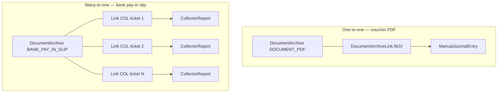
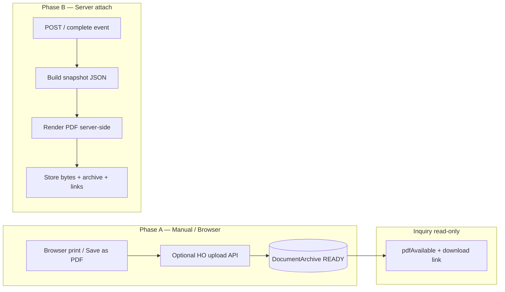

# Finance Document Archive / Document Vault — Design

Status: **Design only — approval gate before schema expansion and inquiry wiring**  
Scope: Central PDF archive registry for all document universes surfaced in Finance / Stock / POS audit hubs  
Type: Architecture design — **no production code changes in this document task**

Related:

- [FINANCE_DOCUMENT_AUDIT_MATRIX.md](./FINANCE_DOCUMENT_AUDIT_MATRIX.md) — current inquiry print/PDF behaviour by type
- [FINANCE_PRESENTATION_CONTRACT.md](./FINANCE_PRESENTATION_CONTRACT.md) — screen / print / archived PDF must share one presentation model
- [PHASE17_DOCUMENT_ARCHIVE_SNAPSHOT_ENGINE.md](./PHASE17_DOCUMENT_ARCHIVE_SNAPSHOT_ENGINE.md) — receipt pilot and shared `lib/document-archive/` kernel
- [architecture/DIGITAL_DOCUMENT_VAULVT_VISION.md](./architecture/DIGITAL_DOCUMENT_VAULVT_VISION.md) — long-term digital package vision (PDF + attachments + snapshot JSON)
- [FINANCE_MJV_PRINT_ARCHITECTURE.md](./FINANCE_MJV_PRINT_ARCHITECTURE.md) — MJV POST-time PDF attach (legacy per-table pattern)
- Code (partial): `lib/document-archive/`, `prisma` `DocumentArchive` model (`RECEIPT` only today)

---

## 1. Problem statement

ASA-CON audit hubs (Finance Document Inquiry, Stock Document Inquiry, POS REC/REF Lookup) now support **read-only detail** and **browser print** via `?autoprint=1`. The **PDF column** intentionally shows:

| `pdfAvailable` | UI meaning |
|--------------|------------|
| `true` | Active archived PDF exists and is readable |
| `false` | Archive is **required** for this document class but missing / not readable |
| `null` | Archive **not supported or not required yet** — neutral dot (no red missing indicator) |

Today archive behaviour is **fragmented**:

| Pattern | Examples | Issue |
|---------|----------|-------|
| Per-table `pdfPath` | `ManualJournalEntry`, `Receipt` | Duplicated storage fields; inquiry mappers must know each table |
| Partial central row | `DocumentArchive` (`RECEIPT` only) + optional `Receipt.documentArchiveId` | Good direction but not generalized |
| No archive field | PAV, REV, PCV, Stock ops, REF | Inquiry correctly returns `pdfAvailable: null` |
| Live reprint only | PAV/REV/PCV/Stock inquiry print | Browser print does not create an immutable audit artifact |

**Goal:** One **Document Vault** registry that answers “does this source document have the required archived file(s)?” — via **archived files** (`DocumentArchive`) and **links** (`DocumentArchiveLink`) — without adding `pdfPath` to every operational table.

**Business correction (approved):**

| Code | Meaning | Vault scope |
|------|---------|-------------|
| **PAV** | Payment Approval Voucher — outbound payment operational document | `documentKind=PAV`, `archiveKind=DOCUMENT_PDF` (1:1) |
| **PAY** | Payment / outbound payment document (voucher PDF only if printable) | `documentKind=PAY`, `archiveKind=DOCUMENT_PDF` — **not** bank pay-in slip |
| **COL** | Collector pickup / collection ticket; bank pay-in / deposit evidence flow | `documentKind=COL`; pay-in slip = `archiveKind=BANK_PAY_IN_SLIP` with **many COL → one archive** |

Bank pay-in slip images/PDFs belong to **COL**, not PAY. One slip may cover multiple COL tickets → vault must support **one archive file linked to many source documents**.

> **Inquiry label note:** Finance Document Inquiry filter **PAY** currently labels posted **bank deposit** vouchers (`POS_SETTLEMENT_BANK_DEPOSIT`). That is **not** vault `documentKind` PAY (outbound payment). Pay-in slip archive is modeled under **COL**. Inquiry code alignment is a separate product decision — see §13.

---

## 2. Design principles

1. **Central registry first** — `DocumentArchive` stores the **file**; `DocumentArchiveLink` stores **which source documents** the file applies to.
2. **Many-to-one links** — One archived bank pay-in slip (`archiveKind=BANK_PAY_IN_SLIP`) may link to many `documentKind=COL` rows. One-to-one remains the default for voucher PDFs.
3. **Separate kind axes** — `documentKind` = source document type; `archiveKind` = archived file purpose/type (see §5).
4. **Immutable posted documents** — Archive attach for POSTED / completed documents must not mutate accounting, stock ledger, or numbering.
5. **Presentation contract** — Archived PDF bytes should eventually match the approved print layout ([FINANCE_PRESENTATION_CONTRACT.md](./FINANCE_PRESENTATION_CONTRACT.md)); browser-print phase is an interim human step.
6. **Inquiry is read-only** — Vault APIs and inquiry UI never post, repair, renumber, or regenerate source documents.
7. **Optional denormalized fast path** — Source tables may keep a cached `pdfPath` / `documentArchiveId` for hot paths (checkout reprint, MJE compatibility). **Vault link + archive row remain authoritative** for `pdfAvailable` once wired.
8. **Phase in manually before automating** — Phase A: browser print/save PDF + optional upload. Phase B: server-generated PDF on completion events.

---

## 3. Current state (checkpoint)

| Area | Status |
|------|--------|
| Finance Document Inquiry UX | Complete |
| Stock Document Inquiry UX | Complete |
| POS REC/REF Lookup UX | Complete |
| PAV / REV / PCV print readiness | `?autoprint=1` on operational editor |
| Stock Document print readiness | `?autoprint=1` on `/finance/stock-documents/{id}` |
| MJV / OPB archived PDF | `ManualJournalEntry.pdfPath` + `GET /api/finance/manual-journal-entries/{id}/pdf` |
| REC archived PDF (partial) | `Receipt.pdfPath`; `DocumentArchive` schema exists but attach pipeline not fully wired in inquiry |
| REF / PAV / REV / PCV / Stock archive | **Reserved** — `pdfAvailable: null` |
| Schema | `DocumentArchive` table exists with `RECEIPT` type only; **no expansion in this design task** |

Legacy modules to converge (later):

- `lib/finance/manual-journal-entry/manual-journal-entry-pdf*.ts`
- `lib/document-archive/*` (receipt pilot)
- Per-table `pdfPath` on `ManualJournalEntry`, `Receipt`

---

## 4. Central registry model

### 4.1 Entity names

| Name | Usage |
|------|-------|
| **DocumentArchive** | The archived **file** (bytes + storage metadata) |
| **DocumentArchiveLink** | Join row: one archive ↔ one source document |
| **Document Vault** | Product / audit term for the combined system |

One `DocumentArchive` row = one stored file (PDF, JPEG, PNG, etc.). Links express which business documents that file supports. Default pattern is **1 archive : 1 document**; **bank pay-in slip** is **1 archive : N COL documents**.

Future: attachments, snapshot JSON, multiple files per package ([DIGITAL_DOCUMENT_VAULVT_VISION.md](./architecture/DIGITAL_DOCUMENT_VAULVT_VISION.md)).

### 4.2 `DocumentArchive` — the file

Represents the archived artifact itself.

| Field | Type | Required | Notes |
|-------|------|----------|-------|
| `id` | UUID | Yes | Primary key |
| `archiveKind` | enum | Yes | File purpose — see §5.2 (`DOCUMENT_PDF`, `BANK_PAY_IN_SLIP`, …) |
| `archiveNo` | string? | No | Human reference (`PAYIN-202606-001`, batch id) |
| `referenceNo` | string? | No | External bank reference / slip number if distinct from `archiveNo` |
| `legalEntityCode` | enum `AS` \| `AD` | Yes | Audit scope |
| `branchId` | string? | No | Originating branch when applicable |
| `branchCode` | string? | No | Denormalized for inquiry / path display |
| `storagePath` | string | Yes when ACTIVE | Portable key (local relative path or blob pathname) |
| `storageUrl` | string? | No | Blob URL cache |
| `fileName` | string? | No | Suggested download name |
| `mimeType` | string | Yes | `application/pdf`, `image/jpeg`, `image/png`, … |
| `sizeBytes` | int? | No | Filled after store |
| `checksumSha256` | string? | No | Integrity check when practical |
| `archivedAt` | datetime? | No | When bytes became readable |
| `archivedByStaffId` | string? | No | Upload actor or `SYSTEM_POST` |
| `status` | enum | Yes | `ACTIVE` \| `SUPERSEDED` \| `VOID` (+ `PENDING` / `FAILED` during attach) |
| `snapshotJson` | json? | No | Frozen presentation payload (MJV / receipt parity) |
| `snapshotVersion` | int? | No | Presentation schema version when `snapshotJson` present |
| `errorMessage` | text? | No | Last attach failure |
| `createdAt` / `updatedAt` | datetime | Yes | Audit |

**Not on `DocumentArchive`:** `documentKind`, `documentId` — those live on **links**.

### 4.3 `DocumentArchiveLink` — source document attachment

| Field | Type | Required | Notes |
|-------|------|----------|-------|
| `id` | UUID | Yes | Primary key |
| `archiveId` | UUID | Yes | FK → `DocumentArchive.id` |
| `documentKind` | enum | Yes | Source document type — see §5.1 |
| `documentId` | string | Yes | Primary key of source row |
| `documentNo` | string | Yes | Human-facing number at link time |
| `linkType` | string? | No | Role when needed: `PRIMARY`, `EVIDENCE`, `COVERED_BY_PAYIN`, … |
| `createdAt` | datetime | Yes | When link was created |

**Uniqueness (active links):** at most one **active** link per `(documentKind, documentId, archiveKind)` unless product approves multiples (e.g. partial deposits — see §13).

### 4.4 Link patterns (examples)

| Scenario | `DocumentArchive` | `DocumentArchiveLink` |
|----------|-------------------|------------------------|
| **MJV PDF** | 1 × `archiveKind=DOCUMENT_PDF` | 1 link: `documentKind=MJV`, `documentId=ManualJournalEntry.id` |
| **REC receipt slip** | 1 × `archiveKind=RECEIPT_SLIP` or `DOCUMENT_PDF` | 1 link: `documentKind=REC`, `documentId=Receipt.id` |
| **PAV posted voucher** | 1 × `archiveKind=DOCUMENT_PDF` | 1 link: `documentKind=PAV`, `documentId=PaymentVoucher.id` |
| **PAY outbound voucher** | 1 × `archiveKind=DOCUMENT_PDF` | 1 link: `documentKind=PAY`, `documentId=…` — **voucher PDF only** |
| **Stock document** | 1 × `archiveKind=DOCUMENT_PDF` | 1 link: `documentKind=CNT|ADJ|…`, `documentId=StockDocument.id` |
| **Bank pay-in slip** | 1 × `archiveKind=BANK_PAY_IN_SLIP` | **N links:** each `documentKind=COL`, `documentId=CollectorReport.id` (or canonical COL id) |



### 4.5 Uniqueness and lifecycle rules

| Rule | Detail |
|------|--------|
| **Archive file** | One `ACTIVE` archive per logical file identity (`archiveNo` + `archiveKind` + `branchId` policy TBD) |
| **1:1 document PDF** | At most one active link with `archiveKind=DOCUMENT_PDF` (or type-specific slip kind) per `(documentKind, documentId)` |
| **COL pay-in slip** | Many active links may share the same `archiveId` for `archiveKind=BANK_PAY_IN_SLIP` |
| **SUPERSEDED** | Prior archive `status=SUPERSEDED`; links repointed or marked inactive per migration policy |
| **VOID** | Archive voided; links no longer satisfy `pdfAvailable` / `archiveAvailable` |

**Do not add `pdfPath` to every document table.** New consumers write `DocumentArchive` + `DocumentArchiveLink` only. Legacy `ManualJournalEntry.pdfPath` and `Receipt.pdfPath` remain **compatibility denormalizations** until backfill + cutover.

### 4.6 Archive status enum

| Status | Meaning |
|--------|---------|
| `PENDING` | Attach in progress; bytes not yet readable |
| `ACTIVE` | Readable file at `storagePath` (replaces legacy `READY` in new code) |
| `FAILED` | Attach failed (`errorMessage` set) |
| `SUPERSEDED` | Replaced by a newer archive revision |
| `VOID` | Invalidated (source voided or archive withdrawn) |

**Existence checks use `ACTIVE` + readable bytes.** Legacy `READY` maps to `ACTIVE` during migration.

---

## 5. Taxonomy — `documentKind` vs `archiveKind`

Two enums serve different purposes:

- **`documentKind`** — identifies the **source business document** (inquiry / audit row).
- **`archiveKind`** — identifies the **archived file type / purpose**.

### 5.1 `documentKind` — source documents

| `documentKind` | Business meaning | Typical source | Link pattern |
|----------------|------------------|----------------|--------------|
| `OPB` | Opening Balance | `ManualJournalEntry` (OPENING_BALANCE) | 1:1 `DOCUMENT_PDF` |
| `MJV` | Manual Journal family | `ManualJournalEntry` (non-OPB) | 1:1 `DOCUMENT_PDF` |
| `PAY` | Outbound payment document | TBD operational row — **not** bank pay-in slip | 1:1 `DOCUMENT_PDF` if printable voucher exists |
| `PAV` | Payment Approval Voucher | `PaymentVoucher` | 1:1 `DOCUMENT_PDF` |
| `REV` | Revenue Voucher | `RevenueVoucher` | 1:1 `DOCUMENT_PDF` |
| `PCV` | Petty Cash Voucher | `PettyCashVoucher` | 1:1 `DOCUMENT_PDF` |
| `CNT` | Stock Count | `StockDocument` (derived phase) | 1:1 `DOCUMENT_PDF` |
| `ADJ` | Stock Adjustment | `StockDocument` | 1:1 `DOCUMENT_PDF` |
| `ORD` | Shop Order Request | `StockDocument` | 1:1 `DOCUMENT_PDF` |
| `DEY` | Delivery to Shop | `StockDocument` | 1:1 `DOCUMENT_PDF` |
| `ORS` | Supplier Send / HO outbound | `StockDocument` | 1:1 `DOCUMENT_PDF` |
| `ORI` | Shop Receive / HO receive | `StockDocument` | 1:1 `DOCUMENT_PDF` |
| `REC` | POS sale receipt | `Receipt` / `Sale` | 1:1 `RECEIPT_SLIP` or `DOCUMENT_PDF` |
| `REF` | POS refund receipt | `Refund` | 1:1 `REFUND_SLIP` or `DOCUMENT_PDF` |
| `COL` | Collector pickup / collection ticket | `CollectorReport` (or canonical COL id) | **N:1** `BANK_PAY_IN_SLIP`; optional 1:1 `DOCUMENT_PDF` for COL ticket itself |
| `READ_X` | READ X report | TBD | `READ_REPORT` — future |
| `READ_Z` | READ Z close report | TBD | `READ_REPORT` — future |

**PAY vs PAV vs COL (approved):**

| Topic | Decision |
|-------|----------|
| **PAV** | Outbound payment approval voucher — standard 1:1 voucher PDF archive |
| **PAY** | Outbound payment document — archive **only** its own voucher PDF (`DOCUMENT_PDF`). **Bank pay-in slip is out of scope for PAY.** |
| **COL** | Collector / collection flow — COL tickets link to shared **`BANK_PAY_IN_SLIP`** archives. Existing `PosPayInEvidence` blob is evidence input, not the vault model terminus. |

**Inquiry filter mismatch:** Finance Document Inquiry uses code **PAY** for posted **bank deposit** vouchers (`POS_SETTLEMENT_BANK_DEPOSIT`). Per business decision, that flow’s **pay-in slip** archives under **COL**, not vault `documentKind=PAY`. Whether bank-deposit **voucher** PDF gets its own `documentKind` or stays inquiry-only is an open question (§13).

### 5.2 `archiveKind` — file types

| `archiveKind` | Purpose | Typical `mimeType` | Linked `documentKind` |
|---------------|---------|-------------------|------------------------|
| `DOCUMENT_PDF` | A4 / finance voucher PDF | `application/pdf` | OPB, MJV, PAY, PAV, REV, PCV, Stock phases |
| `BANK_PAY_IN_SLIP` | Bank pay-in / deposit slip scan | `application/pdf`, `image/jpeg`, `image/png` | **COL** (many links per archive) |
| `RECEIPT_SLIP` | POS sale thermal / receipt PDF | `application/pdf` | REC |
| `REFUND_SLIP` | POS refund thermal / receipt PDF | `application/pdf` | REF |
| `READ_REPORT` | READ X / Z exported report | `application/pdf` | READ_X, READ_Z |
| *(future)* | Cheque images, tax invoices, signatures | various | per policy |

Phase 1 vault rollout may still **prefer PDF** for voucher types; **COL pay-in slip explicitly allows PDF/JPEG/PNG** (see §13).

### 5.3 Stock documents

`documentKind` stores the derived inquiry phase code (`CNT`…`ORI`), not raw Prisma `DocType`. `linkType` or operational metadata may hold `StockDocument.docType` + `status` for forensics.

### 5.4 READ reports *(future)*

Until approved: `pdfAvailable: null` / `archiveAvailable: null` in any future lookup.

---

## 6. `pdfAvailable` / `archiveAvailable` derivation

Resolver lives in `lib/document-archive/` (facade for inquiry hubs).

### 6.1 Standard one-document archives

For kinds that use 1:1 `DOCUMENT_PDF` (or type-specific slip kind):

```text
resolveDocumentVaultPdfAvailable(documentKind, documentId, archiveKind?):

  if documentKind not in ARCHIVE_SUPPORTED_KINDS:
    return null

  if source document not in ARCHIVE_REQUIRED_STATUS:
    return null

  kind = archiveKind ?? defaultArchiveKindFor(documentKind)  // usually DOCUMENT_PDF

  link = findActiveLink(documentKind, documentId, kind)
    where linked DocumentArchive.status == ACTIVE and isReadable(archive)

  if link exists:
    return true

  if archive required for this document class:
    return false

  return null
```

| Result | Inquiry PDF / archive column | Filter `pdfState=missing` |
|--------|------------------------------|---------------------------|
| `true` | Exists dot; link to download API | Excluded from missing |
| `false` | Red missing dot | Included in missing |
| `null` | Neutral `—` | Excluded |

### 6.2 COL — bank pay-in slip (many-to-one)

COL rows use a **separate check** for deposit evidence (column may be labeled `archiveAvailable` or reuse `pdfAvailable` with tooltip):

```text
resolveColBankPayInArchiveAvailable(documentKind=COL, documentId):

  if COL archive policy not approved:
    return null

  link = findActiveLink(COL, documentId, BANK_PAY_IN_SLIP)
    where DocumentArchive.status == ACTIVE and isReadable(archive)

  if link exists:
    return true   // COL ticket covered by at least one pay-in slip

  if pay-in slip required for this COL state:
    return false

  return null
```

- **Multiple COL tickets** may share the same `archiveId` via separate `DocumentArchiveLink` rows.
- Download from a COL row resolves through its link → shared `DocumentArchive`.
- Uploading one pay-in slip creates **one** `DocumentArchive` + **many** links in a single transaction.

### 6.3 Archive requirement matrix

| `documentKind` | Archive required when | Default `archiveKind` | `pdfAvailable` before requirement |
|----------------|----------------------|------------------------|-----------------------------------|
| OPB / MJV | `status = POSTED` | `DOCUMENT_PDF` | `false` if posted but no active link |
| PAV / REV / PCV | `status = POSTED` | `DOCUMENT_PDF` | `false` if posted but no link |
| PAY | Posted outbound payment doc (policy TBD) | `DOCUMENT_PDF` only | `null` until policy approved — **not pay-in slip** |
| COL | Policy TBD (collector close / bank deposit / finance confirm) | `BANK_PAY_IN_SLIP` | `null` until policy approved |
| Stock CNT–ORI | `POSTED` and/or `CONFIRMED` (TBD) | `DOCUMENT_PDF` | `null` until policy approved |
| REC | Checkout complete | `RECEIPT_SLIP` | `false` if required but missing |
| REF | Refund posted | `REFUND_SLIP` | `null` until approved |
| READ_X / READ_Z | If approved | `READ_REPORT` | `null` until approved |

**Current implementation:** Most types hardcode `null`. MJV/OPB use legacy `ManualJournalEntry.pdfPath`. REC uses `Receipt.pdfPath`. Migration replaces ad-hoc checks with link-based resolver + legacy fallback.

---

## 7. Archive workflow phases



### Phase A — Manual (current checkpoint)

- User prints via `?autoprint=1` from inquiry or editor.
- **No vault write** — audit trail is operational only.
- HO may upload PDF through future `POST` API (explicit consent).

### Phase B — Upload archive

- Posted document → inquiry shows `pdfAvailable: false` until upload.
- `POST /api/document-archive` creates `DocumentArchive` + one or more `DocumentArchiveLink` rows.
- **COL pay-in upload:** single file + array of `{ documentKind: COL, documentId, documentNo }` link targets.
- Validates: sources exist, actor permitted, checksum recorded.
- Sets archive `ACTIVE`.

### Phase C — Server-generated PDF (MJV pattern generalized)

- On POST hook: build `snapshotJson` from presentation model → render PDF → store → archive `ACTIVE` + link row.
- Idempotent: skip if active archive exists.
- Repair script for `FAILED` / layout migrations (mirror `repair-manual-journal-archived-pdfs.ts`).

**Explicit:** Phase C is **not** in scope for initial vault rollout after schema approval. MJV keeps existing attach until unified renderer exists.

---

## 8. API shape (proposed)

Base path: `/api/document-archive` with domain-specific aliases for backward compatibility.

| Method | Path | Purpose |
|--------|------|---------|
| `GET` | `/api/document-archive/status?kind={documentKind}&documentId={id}&archiveKind=` | Returns `{ pdfAvailable, archiveKind, status, archivedAt, fileName, mimeType, sizeBytes }` |
| `GET` | `/api/document-archive/{archiveId}/file` | Stream bytes when archive `ACTIVE` |
| `GET` | `/api/document-archive/by-document/{kind}/{documentId}/file?archiveKind=` | Resolve link → stream file |
| `POST` | `/api/document-archive` | Create archive + link(s). Body: file + `{ archiveKind, links: [{ documentKind, documentId, documentNo, linkType? }] }` |
| `POST` | `/api/document-archive/{archiveId}/links` | Add COL links to existing pay-in slip archive |
| `POST` | `/api/document-archive/{archiveId}/retry` | Re-attempt failed attach |
| `POST` | `/api/document-archive/{archiveId}/supersede` | *(Future)* Replace with approval |

**COL pay-in example (conceptual):**

```json
{
  "archiveKind": "BANK_PAY_IN_SLIP",
  "archiveNo": "PAYIN-202606-15-BATCH-1",
  "legalEntityCode": "AS",
  "branchId": "branch-sh001",
  "links": [
    { "documentKind": "COL", "documentId": "col-1", "documentNo": "COL-SH001-202606-0001" },
    { "documentKind": "COL", "documentId": "col-2", "documentNo": "COL-SH001-202606-0002" }
  ]
}
```

**Backward-compatible aliases (migration):**

| Existing | Maps to |
|----------|---------|
| `GET /api/finance/manual-journal-entries/{id}/pdf` | link lookup `MJV`/`OPB` + `DOCUMENT_PDF` |
| `GET /api/pos/receipts/{receiptId}/pdf` | link lookup `REC` + `RECEIPT_SLIP` |

Inquiry APIs embed `pdfAvailable` from the link resolver — not table-specific `pdfPath` fields.

---

## 9. Security and permissions

| Actor | Capability |
|-------|------------|
| `HO_FINANCE` / `HO_ADMIN` | Full vault status, download, upload, retry for finance + stock + POS audit types |
| Shop staff (`SH_*`) | **Not** exposed in Phase 1 vault UI; POS reprint stays on shop routes. If branch upload is ever added: **own branch only** |
| Inquiry hubs | Read-only — download link only when archive exists; no upload from inquiry list without explicit action |
| Posted immutability | Upload / supersede must reject non-POSTED sources (except policy-approved exceptions) |
| Storage | Same backend resolution as today (`filesystem` vs Vercel Blob); path traversal guards in `lib/document-archive/storage/` |

Audit log (future): `archivedByStaffId`, `archivedAt` on every `READY` transition.

---

## 10. Migration plan

| Step | Action | Schema? |
|------|--------|---------|
| **0** | Approve this design (incl. PAY/COL split + link table) | No |
| **1** | Evolve `DocumentArchive` + add `DocumentArchiveLink`; enums for `documentKind` + `archiveKind` | **Yes** — first approved migration |
| **2** | Implement link-based `resolveDocumentVaultPdfAvailable` + APIs | No new tables |
| **3** | **Finance vouchers:** MJV/OPB backfill — 1 archive + 1 link each | Optional backfill script |
| **4** | PAV / REV / PCV posted → `DOCUMENT_PDF` link required | |
| **5** | **Stock inquiry** → `DOCUMENT_PDF` when policy approved | |
| **6** | **REC** → receipt slip archive + link | |
| **7** | **REF** → refund slip archive + link | |
| **8** | **COL** → `BANK_PAY_IN_SLIP` many-to-one links; migrate from `PosPayInEvidence` blobs | |
| **9** | Deprecate per-table `pdfPath` reads in inquiry | |
| **10** | READ_X / READ_Z — only if approved | |

**Explicitly not in migration:** Using vault `documentKind=PAY` for bank pay-in slips. Pay-in evidence is **COL + `BANK_PAY_IN_SLIP`** only.

**No migration step changes posting, numbering, period lock, stock costing, or ledger logic.**

---

## 11. Inquiry integration (read-only)

After vault wiring:

| Hub | Change |
|-----|--------|
| Finance Document Inquiry | `pdfAvailable` from vault; PDF dot links to `/api/document-archive/.../pdf` |
| Stock Document Inquiry | Same |
| POS REC/REF Lookup | REC: vault; REF: when kind supported |

Print links (`?autoprint=1`) **remain browser print** — they do not write vault rows unless user completes Phase B upload.

---

## 12. Out of scope (this design and initial implementation)

- **No schema change** until this document is approved
- **No automatic server PDF generation** for PAV/REV/PCV/Stock in initial vault rollout
- **No changes** to posting, accounting, stock workflow, numbering, costing, or period lock
- **No** shop operational editor behaviour change (`/shop/stock-documents`, POS checkout)
- **No** attachment types beyond defined `archiveKind` values in initial rollout (cheque images, etc. — future)
- **No** bank pay-in slip archive on `documentKind=PAY` — **COL only**
- **No** full Document Trace / Attachments hub UI
- **No** versioning / supersede UI until explicitly approved

---

## 13. Open questions (resolve before schema migration)

| # | Question | Options / notes |
|---|----------|-----------------|
| 1 | **Canonical `documentId` for REC** | `Receipt.id` vs `Sale.id` |
| 2 | **COL canonical `documentId` and `documentNo`** | `CollectorReport.id` vs voucher `refId` vs COL ticket number format |
| 3 | **COL pay-in slip required when** | Collector close vs bank deposit confirmation vs finance confirmation |
| 4 | **One COL → multiple pay-in slips** | Partial deposit batches — allow multiple active `BANK_PAY_IN_SLIP` links per COL? |
| 5 | **Pay-in slip file types** | PDF only vs PDF + JPEG + PNG (`mimeType` on archive) |
| 6 | **Inquiry filter PAY vs vault PAY** | Rename inquiry **PAY** (bank deposit voucher) vs keep label; vault **PAY** = outbound payment only |
| 7 | **Bank deposit voucher PDF** | Separate `documentKind` for posted `POS_SETTLEMENT_BANK_DEPOSIT` voucher vs inquiry-only |
| 8 | **PAY vs PAV overlap** | Whether `documentKind=PAY` is distinct from `PAV` in practice or reserved for a future doc family |
| 9 | **Stock archive trigger** | `POSTED` only vs `CONFIRMED` + `POSTED` |
| 10 | **Unposted MJV PDF column** | `false` (missing) vs `null` (not required until posted) |
| 11 | **Status enum migration** | Map legacy `READY` → `ACTIVE` |
| 12 | **Unique constraint with supersede** | In-place update vs new archive + `SUPERSEDED` |
| 13 | **Checksum requirement** | Mandatory `sha256` on upload vs best-effort |
| 14 | **REF thermal vs A4 PDF** | `REFUND_SLIP` format |
| 15 | **READ Z scope** | Vault PDF vs data export link only |
| 16 | **MJV backfill** | Big-bang vs lazy on first inquiry |
| 17 | **Denormalized `pdfPath` retirement** | Timeline for `ManualJournalEntry` / `Receipt` |
| 18 | **Blob vs filesystem** | Single `DOCUMENT_ARCHIVE_STORAGE` env |

---

## 14. Approval checklist

- [ ] `DocumentArchive` + `DocumentArchiveLink` split approved
- [ ] `documentKind` and `archiveKind` taxonomies approved (incl. PAY ≠ pay-in slip; COL many-to-one)
- [ ] `pdfAvailable` / COL `BANK_PAY_IN_SLIP` rules approved
- [ ] Phase A / B / C workflow order approved
- [ ] API shape (multi-link upload) approved
- [ ] Migration order approved
- [ ] Open questions §13 resolved or deferred with owners

---

## 15. Code map (target state)

| Concern | Location |
|---------|----------|
| `documentKind` / `archiveKind` enums | `lib/document-archive/kinds.ts` *(proposed)* |
| Link resolver | `lib/document-archive/resolve-pdf-available.ts` *(proposed)* |
| COL many-to-one attach | `lib/document-archive/attach-bank-pay-in-slip.ts` *(proposed)* |
| Storage | `lib/document-archive/storage/*` (existing) |
| Attach orchestrators | `lib/document-archive/attach-*.ts` per kind |
| Inquiry facades | `lib/finance/inquiry/`, `lib/stock/inquiry/`, `lib/pos-ui/` |
| APIs | `app/api/document-archive/**` *(proposed)* |
