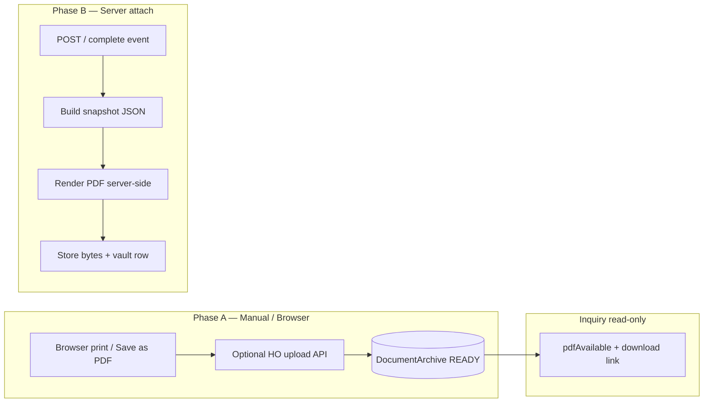

# Finance Document Archive / Document Vault — Design

Status: **Design only — approval gate before schema expansion and inquiry wiring**  
Scope: Central PDF archive registry for all document universes surfaced in Finance / Stock / POS audit hubs  
Type: Architecture design — **no production code changes in this document task**

Related:

- [FINANCE_DOCUMENT_AUDIT_MATRIX.md](./FINANCE_DOCUMENT_AUDIT_MATRIX.md) — current inquiry print/PDF behaviour by type
- [FINANCE_PRESENTATION_CONTRACT.md](./FINANCE_PRESENTATION_CONTRACT.md) — screen / print / archived PDF must share one presentation model
- [PHASE17_DOCUMENT_ARCHIVE_SNAPSHOT_ENGINE.md](./PHASE17_DOCUMENT_ARCHIVE_SNAPSHOT_ENGINE.md) — receipt pilot and shared `lib/document-archive/` kernel
- [architecture/DIGITAL_DOCUMENT_VAULVT_VISION.md](./architecture/DIGITAL_DOCUMENT_VAULVT_VISION.md) — long-term digital package vision (PDF + attachments + snapshot JSON)
- [FINANCE_MJV_PRINT_ARCHITECTURE.md](./FINANCE_MJV_PRINT_ARCHITECTURE.md) — MJV POST-time PDF attach (legacy per-table pattern)
- Code (partial): `lib/document-archive/`, `prisma` `DocumentArchive` model (`RECEIPT` only today)

---

## 1. Problem statement

ASA-CON audit hubs (Finance Document Inquiry, Stock Document Inquiry, POS REC/REF Lookup) now support **read-only detail** and **browser print** via `?autoprint=1`. The **PDF column** intentionally shows:

| `pdfAvailable` | UI meaning |
|--------------|------------|
| `true` | Active archived PDF exists and is readable |
| `false` | Archive is **required** for this document class but missing / not readable |
| `null` | Archive **not supported or not required yet** — neutral dot (no red missing indicator) |

Today archive behaviour is **fragmented**:

| Pattern | Examples | Issue |
|---------|----------|-------|
| Per-table `pdfPath` | `ManualJournalEntry`, `Receipt` | Duplicated storage fields; inquiry mappers must know each table |
| Partial central row | `DocumentArchive` (`RECEIPT` only) + optional `Receipt.documentArchiveId` | Good direction but not generalized |
| No archive field | PAV, REV, PCV, Stock ops, REF | Inquiry correctly returns `pdfAvailable: null` |
| Live reprint only | PAV/REV/PCV/Stock inquiry print | Browser print does not create an immutable audit artifact |

**Goal:** One **Document Vault** registry that answers “does this document have an official archived PDF?” for every audit document kind, without adding `pdfPath` to every operational table.

---

## 2. Design principles

1. **Central registry first** — `DocumentArchive` (vault row) is the system of record for archived PDF metadata and storage location.
2. **Polymorphic key** — `(documentKind, documentId)` uniquely identifies the source business document across universes.
3. **Immutable posted documents** — Archive attach for POSTED / completed documents must not mutate accounting, stock ledger, or numbering.
4. **Presentation contract** — Archived PDF bytes should eventually match the approved print layout ([FINANCE_PRESENTATION_CONTRACT.md](./FINANCE_PRESENTATION_CONTRACT.md)); browser-print phase is an interim human step.
5. **Inquiry is read-only** — Vault APIs and inquiry UI never post, repair, renumber, or regenerate source documents.
6. **Optional denormalized fast path** — Source tables may keep a cached `pdfPath` / `documentArchiveId` for hot paths (checkout reprint, MJE compatibility). **Vault row remains authoritative** for `pdfAvailable` once wired.
7. **Phase in manually before automating** — Phase A: browser print/save PDF + optional upload. Phase B: server-generated PDF on completion events.

---

## 3. Current state (checkpoint)

| Area | Status |
|------|--------|
| Finance Document Inquiry UX | Complete |
| Stock Document Inquiry UX | Complete |
| POS REC/REF Lookup UX | Complete |
| PAV / REV / PCV print readiness | `?autoprint=1` on operational editor |
| Stock Document print readiness | `?autoprint=1` on `/finance/stock-documents/{id}` |
| MJV / OPB archived PDF | `ManualJournalEntry.pdfPath` + `GET /api/finance/manual-journal-entries/{id}/pdf` |
| REC archived PDF (partial) | `Receipt.pdfPath`; `DocumentArchive` schema exists but attach pipeline not fully wired in inquiry |
| REF / PAV / REV / PCV / Stock archive | **Reserved** — `pdfAvailable: null` |
| Schema | `DocumentArchive` table exists with `RECEIPT` type only; **no expansion in this design task** |

Legacy modules to converge (later):

- `lib/finance/manual-journal-entry/manual-journal-entry-pdf*.ts`
- `lib/document-archive/*` (receipt pilot)
- Per-table `pdfPath` on `ManualJournalEntry`, `Receipt`

---

## 4. Central registry model

### 4.1 Entity name

| Name | Usage |
|------|-------|
| **DocumentArchive** | Prisma model / DB table (existing name — extend, do not duplicate) |
| **Document Vault** | Product / audit term in UI and docs |

One vault row = one **archived artifact package** for a source document. Phase 1 scope: **one primary PDF per document**. Future: attachments, snapshot JSON, multiple files per package ([DIGITAL_DOCUMENT_VAULVT_VISION.md](./architecture/DIGITAL_DOCUMENT_VAULVT_VISION.md)).

### 4.2 Proposed fields (evolution of existing `DocumentArchive`)

| Field | Type | Required | Notes |
|-------|------|----------|-------|
| `id` | UUID | Yes | Primary key |
| `legalEntityCode` | enum `AS` \| `AD` | Yes | Audit scope; replaces nullable `legalEntityId` over time |
| `branchId` | string? | No | Source branch when applicable (POS, stock, shop vouchers) |
| `branchCode` | string? | No | Denormalized for inquiry display / path building |
| `documentKind` | enum | Yes | Inquiry-facing code — see §5 |
| `documentId` | string | Yes | Primary key of source row (`ManualJournalEntry.id`, `PaymentVoucher.id`, `StockDocument.id`, `Sale.id`, etc.) |
| `documentNo` | string | Yes | Human-facing number at archive time (`MJV-260001`, `REC-SH001-…`, `ORD-SH001-…`) |
| `sourceType` | string? | No | Optional Prisma model name / ref type for debugging (`ManualJournalEntry`, `PaymentVoucher`, `STOCK_DOC_POST` voucher ref) |
| `archiveType` | enum | Yes | Phase 1: `PDF` only |
| `storagePath` | string | Yes when READY | Portable key — same contract as today `pdfPath` (local relative path or blob pathname) |
| `storageUrl` | string? | No | Blob public/signed URL cache (`pdfBlobUrl` equivalent) |
| `fileName` | string? | No | Suggested download name (`PAV-260001.pdf`) |
| `mimeType` | string | Yes | Default `application/pdf` |
| `sizeBytes` | int? | No | Filled after store |
| `checksumSha256` | string? | No | Integrity check when practical |
| `archivedAt` | datetime? | No | When bytes became readable (`generatedAt` equivalent) |
| `archivedByStaffId` | string? | No | Upload actor or system (`SYSTEM_POST`) |
| `status` | enum | Yes | See §4.4 |
| `snapshotJson` | json? | No | Frozen presentation payload (future / MJV parity) |
| `snapshotVersion` | int | Yes | Presentation schema version |
| `errorMessage` | text? | No | Last attach failure |
| `createdAt` / `updatedAt` | datetime | Yes | Audit |

**Do not add `pdfPath` to every document table.** New consumers should write vault rows only. Existing `ManualJournalEntry.pdfPath` and `Receipt.pdfPath` are **compatibility denormalizations** until backfill + cutover.

### 4.3 Uniqueness rules

| Rule | Detail |
|------|--------|
| **Active uniqueness** | At most **one** row with `status = ACTIVE` (or `READY` during migration) per `(documentKind, documentId)` |
| **DB constraint** | `@@unique([documentKind, documentId, status])` **or** partial unique index on active status — **design choice at implementation** |
| **Superseded versions** | **Out of scope for Phase 1.** If versioning is approved later: set prior row `status = SUPERSEDED`, insert new row with same keys + higher `archiveRevision` |
| **VOID** | When source document is voided/cancelled before archive: vault row `status = VOID`; inquiry treats as `pdfAvailable: null` or `false` per policy |

Recommended Phase 1 approach (simplest):

- Keep `@@unique([documentKind, documentId])` as today.
- **Re-archive** = explicit supersede workflow (Phase 2+) that replaces storage path in-place or marks old row `SUPERSEDED` and inserts successor — **requires product approval**.

### 4.4 Archive status enum (proposed normalization)

Align existing `PENDING | READY | FAILED` with audit lifecycle:

| Status | Meaning |
|--------|---------|
| `PENDING` | Archive required; generation/upload not complete |
| `READY` | Active archived PDF readable at `storagePath` |
| `FAILED` | Attach attempted and failed (`errorMessage` set) |
| `SUPERSEDED` | *(Future)* Replaced by newer archive revision |
| `VOID` | *(Future)* Source document voided; archive not valid for audit |

**`pdfAvailable` mapping uses `READY` + readable bytes as “exists”.**

---

## 5. Document universe — `documentKind` taxonomy

Inquiry codes map 1:1 to vault `documentKind` where possible.

### 5.1 Finance vouchers (Finance Document Inquiry)

| `documentKind` | Inquiry label | Source document | `documentId` | Archive phase |
|----------------|---------------|-----------------|--------------|---------------|
| `OPB` | Opening Balance | `ManualJournalEntry` (OPENING_BALANCE) | `ManualJournalEntry.id` | **Legacy live** — backfill to vault |
| `MJV` | Manual Journal family | `ManualJournalEntry` (non-OPB) | `ManualJournalEntry.id` | **Legacy live** — backfill to vault |
| `PAY` | Bank Deposit | Posted voucher ref (`PosPayInEvidence` / settlement) | TBD — likely settlement evidence id or voucher `refId` | Phase 3 — policy TBD |
| `PAV` | Payment Voucher | `PaymentVoucher` | `PaymentVoucher.id` | Phase 2 — posted only |
| `REV` | Revenue Voucher | `RevenueVoucher` | `RevenueVoucher.id` | Phase 2 — posted only |
| `PCV` | Petty Cash Voucher | `PettyCashVoucher` | `PettyCashVoucher.id` | Phase 2 — posted only |

`PAY` may remain `pdfAvailable: null` until bank-deposit presentation is defined (voucher-only inquiry today).

### 5.2 Stock documents (Stock Document Inquiry)

| `documentKind` | Phase label | Source | `documentId` | Archive phase |
|----------------|-------------|--------|--------------|---------------|
| `CNT` | Stock Count | `StockDocument` | `StockDocument.id` | Phase 2 — if posted/confirmed policy approved |
| `ADJ` | Stock Adjustment | `StockDocument` | `StockDocument.id` | Phase 2 |
| `ORD` | Shop Order Request | `StockDocument` | `StockDocument.id` | Phase 2 |
| `DEY` | Delivery to Shop | `StockDocument` | `StockDocument.id` | Phase 2 |
| `ORS` | Supplier Send / HO outbound | `StockDocument` | `StockDocument.id` | Phase 2 |
| `ORI` | Shop Receive / HO receive | `StockDocument` | `StockDocument.id` | Phase 2 |

`documentKind` stores the **derived inquiry phase code** (`CNT`…`ORI`), not raw `DocType`. `sourceType` can hold `StockDocument.docType` + `status` for forensics.

### 5.3 POS documents

| `documentKind` | Source | `documentId` | Notes |
|----------------|--------|--------------|-------|
| `REC` | `Sale` / `Receipt` | `Receipt.id` or `Sale.id` — **pick one and document**; recommend `Receipt.id` | Partial schema + `Receipt.pdfPath` today |
| `REF` | `Refund` | `Refund.id` | No archive today |

### 5.4 READ reports *(future — design slot only)*

| `documentKind` | Source | Archive trigger (if approved) |
|----------------|--------|-------------------------------|
| `READ_X` | READ X session / report id | End of shift review — **not approved** |
| `READ_Z` | READ Z close record | After Z close — **not approved** |

Until approved: `pdfAvailable: null` in any future lookup.

---

## 6. `pdfAvailable` derivation

Single function in `lib/document-archive/` (or `lib/finance/inquiry/` facade):

```text
resolveDocumentVaultPdfAvailable(input):
  if documentKind not in ARCHIVE_SUPPORTED_KINDS:
    return null

  if source document not in ARCHIVE_REQUIRED_STATUS:
    return null   // e.g. DRAFT MJV — optional: return false if policy requires archive only when posted

  archive = findActiveArchive(documentKind, documentId)

  if archive.status == READY and isReadable(archive):
    return true

  if archive.status == PENDING or archive missing:
    return false

  if archive.status == FAILED:
    return false   // show missing + optional retry affordance outside inquiry

  return null
```

| Result | Inquiry PDF column | Filter `pdfState=missing` |
|--------|-------------------|---------------------------|
| `true` | Green / exists dot; link to download API | Excluded from missing |
| `false` | Red missing dot | Included in missing |
| `null` | Neutral `—` | Excluded |

**Current implementation:** Most types hardcode `null`. MJV/OPB use `ManualJournalEntry.pdfPath` directly. REC uses `Receipt.pdfPath` when joined. This design replaces those ad-hoc checks with vault lookup + legacy fallback during migration.

### 6.1 Archive requirement matrix

| Document | Archive required when | `pdfAvailable` before requirement met |
|----------|----------------------|----------------------------------------|
| OPB / MJV | `status = POSTED` | `false` if posted but no archive |
| PAV / REV / PCV | `status = POSTED` | `false` if posted but no archive |
| PAY | Policy TBD (likely posted settlement) | `null` until policy approved |
| Stock CNT–ORI | **Product decision:** `POSTED` and/or `CONFIRMED` | `null` until policy approved |
| REC | Checkout complete / receipt issued | `false` if required but missing |
| REF | Refund posted / receipt printed | `null` until REF archive approved |
| READ_X / READ_Z | If ever approved | `null` until approved |

---

## 7. Archive workflow phases



### Phase A — Manual (current checkpoint)

- User prints via `?autoprint=1` from inquiry or editor.
- **No vault write** — audit trail is operational only.
- HO may upload PDF through future `POST` API (explicit consent).

### Phase B — Upload archive (first vault write path for PAV/REV/PCV/Stock)

- Posted document → inquiry shows `pdfAvailable: false` until upload.
- `POST /api/document-archive/{kind}/{id}` accepts `multipart/pdf` or storage reference.
- Validates: document exists, posted, actor permitted, checksum recorded.
- Sets vault `READY`, optional denormalized pointer on source row.

### Phase C — Server-generated PDF (MJV pattern generalized)

- On POST hook: build `snapshotJson` from presentation model → render PDF → store → vault `READY`.
- Idempotent: skip if active archive exists.
- Repair script for `FAILED` / layout migrations (mirror `repair-manual-journal-archived-pdfs.ts`).

**Explicit:** Phase C is **not** in scope for initial vault rollout after schema approval. MJV keeps existing attach until unified renderer exists.

---

## 8. API shape (proposed)

Base path: `/api/document-archive` (finance) with domain-specific aliases for backward compatibility.

| Method | Path | Purpose |
|--------|------|---------|
| `GET` | `/api/document-archive/status?kind={kind}&documentId={id}` | Returns `{ pdfAvailable, status, archivedAt, fileName, sizeBytes }` |
| `GET` | `/api/document-archive/{kind}/{documentId}/pdf` | Stream PDF bytes when `READY` |
| `POST` | `/api/document-archive/{kind}/{documentId}/pdf` | Upload / attach PDF (Phase B) — `HO_FINANCE` / `HO_ADMIN` |
| `POST` | `/api/document-archive/{kind}/{documentId}/retry` | Re-attempt server attach after `FAILED` |
| `POST` | `/api/document-archive/{kind}/{documentId}/supersede` | *(Future)* Replace archive with approval |

**Backward-compatible aliases (migration):**

| Existing | Maps to |
|----------|---------|
| `GET /api/finance/manual-journal-entries/{id}/pdf` | `kind=MJV` or `OPB` + `documentId` |
| `GET /api/pos/receipts/{receiptId}/pdf` | `kind=REC` |

Inquiry list/detail APIs continue to embed `pdfAvailable` and optional `archiveDownloadPath` — they **call vault resolver**, not table-specific fields.

---

## 9. Security and permissions

| Actor | Capability |
|-------|------------|
| `HO_FINANCE` / `HO_ADMIN` | Full vault status, download, upload, retry for finance + stock + POS audit types |
| Shop staff (`SH_*`) | **Not** exposed in Phase 1 vault UI; POS reprint stays on shop routes. If branch upload is ever added: **own branch only** |
| Inquiry hubs | Read-only — download link only when archive exists; no upload from inquiry list without explicit action |
| Posted immutability | Upload / supersede must reject non-POSTED sources (except policy-approved exceptions) |
| Storage | Same backend resolution as today (`filesystem` vs Vercel Blob); path traversal guards in `lib/document-archive/storage/` |

Audit log (future): `archivedByStaffId`, `archivedAt` on every `READY` transition.

---

## 10. Migration plan

| Step | Action | Schema? |
|------|--------|---------|
| **0** | Approve this design | No |
| **1** | Extend `DocumentArchiveType` / `documentKind` enum + fields in §4.2 | **Yes** — first approved migration |
| **2** | Implement `resolveDocumentVaultPdfAvailable` + status/download APIs | No new tables |
| **3** | **Finance vouchers first:** wire MJV/OPB via vault resolver with **fallback** to `ManualJournalEntry.pdfPath` | Backfill script optional |
| **4** | PAV / REV / PCV posted → `pdfAvailable: false` until upload or server attach | |
| **5** | **Stock inquiry** → same resolver; `pdfAvailable: null` until stock archive policy approved, then `false` when missing | |
| **6** | **REC** → complete receipt attach pipeline; unify `Receipt.pdfPath` with vault row | |
| **7** | **REF** → add `REF` kind + attach on refund complete | |
| **8** | Deprecate direct inquiry reads of per-table `pdfPath` | |
| **9** | READ_X / READ_Z — only if product approves | |

**No migration step changes posting, numbering, period lock, stock costing, or ledger logic.**

---

## 11. Inquiry integration (read-only)

After vault wiring:

| Hub | Change |
|-----|--------|
| Finance Document Inquiry | `pdfAvailable` from vault; PDF dot links to `/api/document-archive/.../pdf` |
| Stock Document Inquiry | Same |
| POS REC/REF Lookup | REC: vault; REF: when kind supported |

Print links (`?autoprint=1`) **remain browser print** — they do not write vault rows unless user completes Phase B upload.

---

## 12. Out of scope (this design and initial implementation)

- **No schema change** until this document is approved
- **No automatic server PDF generation** for PAV/REV/PCV/Stock in initial vault rollout
- **No changes** to posting, accounting, stock workflow, numbering, costing, or period lock
- **No** shop operational editor behaviour change (`/shop/stock-documents`, POS checkout)
- **No** attachment types beyond primary PDF (images, signatures) — future vault packages
- **No** full Document Trace / Attachments hub UI
- **No** versioning / supersede UI until explicitly approved

---

## 13. Open questions (resolve before schema migration)

| # | Question | Options / notes |
|---|----------|-----------------|
| 1 | **Canonical `documentId` for REC** | `Receipt.id` vs `Sale.id` — affects voucher `refId` join |
| 2 | **PAY archive requirement** | Voucher-only audit vs pay-in evidence image as primary artifact |
| 3 | **Stock archive trigger** | `POSTED` only vs `CONFIRMED` + `POSTED` vs all submitted shop docs |
| 4 | **Unposted MJV PDF column** | Show `false` (missing) vs `null` (not required until posted) — today: `false` for unposted drafts |
| 5 | **Status enum migration** | Rename `READY`→`ACTIVE` or keep `READY` for code compatibility |
| 6 | **Unique constraint with supersede** | In-place update vs new row + `SUPERSEDED` |
| 7 | **Checksum requirement** | Mandatory `sha256` on upload vs best-effort |
| 8 | **REF thermal vs A4 PDF** | Single PDF archive vs separate thermal width artifact |
| 9 | **READ Z scope** | Z report as vault PDF vs link to existing READ Z data export only |
| 10 | **MJV backfill** | Big-bang backfill `ManualJournalEntry` → vault vs lazy on first inquiry |
| 11 | **Denormalized `pdfPath` retirement** | Timeline to drop `ManualJournalEntry.pdfPath` / `Receipt.pdfPath` |
| 12 | **Blob vs filesystem** | Single `DOCUMENT_ARCHIVE_STORAGE` env for all kinds |

---

## 14. Approval checklist

- [ ] Central `DocumentArchive` registry approved as sole long-term archive index
- [ ] `documentKind` taxonomy covers finance, stock, POS, and READ slots
- [ ] `pdfAvailable` tri-state rules approved per document class
- [ ] Phase A / B / C workflow order approved
- [ ] API base path and permission model approved
- [ ] Migration order (finance → stock → REC/REF) approved
- [ ] Open questions §13 resolved or deferred with explicit owners

---

## 15. Code map (target state)

| Concern | Location |
|---------|----------|
| Vault types / kinds | `lib/document-archive/kinds.ts` *(proposed)* |
| `pdfAvailable` resolver | `lib/document-archive/resolve-pdf-available.ts` *(proposed)* |
| Storage | `lib/document-archive/storage/*` (existing) |
| Attach orchestrators | `lib/document-archive/attach-*.ts` per kind |
| Inquiry facades | `lib/finance/inquiry/`, `lib/stock/inquiry/`, `lib/pos-ui/` — call resolver only |
| APIs | `app/api/document-archive/**` *(proposed)* |
