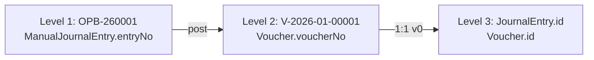

# Finance Document Identity Standard

Status: **Design (pre-implementation)**  
Scope: Presentation identity for finance operational documents — UI, PDF, reports, traceability  
Authority: This doc defines **display identity**. Numbering format remains in [99_ASA_HANDBOOK.md](./99_ASA_HANDBOOK.md). Posting linkage remains in [11_FINANCE_POSTING_ARCHITECTURE.md](./11_FINANCE_POSTING_ARCHITECTURE.md).

Primary finance direction: [FINANCE_TRANSACTION_UNIVERSE.md](./FINANCE_TRANSACTION_UNIVERSE.md). Unresolved document-code and Level 3 vocabulary conflicts: [Appendix D — Vocabulary Decisions Pending](./FINANCE_TRANSACTION_UNIVERSE.md#appendix-d--vocabulary-decisions-pending) (no decision made yet).

Related: [39_FINANCE_CORE_17B_OPENING_BALANCE.md](./39_FINANCE_CORE_17B_OPENING_BALANCE.md), [32_FINANCE_CORE_16B_MANUAL_JOURNAL.md](./32_FINANCE_CORE_16B_MANUAL_JOURNAL.md), [20_FINANCE_TRACEABILITY.md](./20_FINANCE_TRACEABILITY.md)

---

## 1. Problem Statement

The same finance document currently appears under multiple identities depending on which screen the user opens. A posted Opening Balance may be recognized as `OPB-260001` on the OPB editor, as `V-2026-01-00001` on Journal Inquiry, as a UUID on traceability drill-downs, or as a voucher number in General Ledger — with no consistent header tying the surfaces together.

This causes:

- **User confusion** — staff cannot tell whether `V-2026-01-00001` and `OPB-260001` refer to the same event
- **Inconsistent UI/PDF** — different pages use different primary labels and header layouts
- **Weak audit readability** — reports and traceability emphasize accounting references instead of operational document numbers
- **Broken recognition** — a user viewing `OPB-260001` on one screen may not immediately recognize the same document on another

The underlying data model already links operational documents to vouchers (`refNo = entryNo` at post time). The problem is **presentation**, not accounting or posting logic.

### Current state vs target (pre-implementation review)

| Surface | Current primary identity | Target |
|---------|-------------------------|--------|
| OPB/MAJ editor (POSTED) | Single workflow audit line (`OPB-260001 • Entry Date: … • Created: … • Posted: …`) | Canonical 3-row header (see §5) |
| Journal Inquiry | `voucherNo` in header | Level 1 document no + canonical header |
| Voucher Detail | `<h2>Voucher {voucherNo}</h2>` | Level 1 document no + canonical header; voucher in Accounting Information |
| General Ledger | `entryNo` column = `voucherNo` | `entryNo` column = Level 1 (`refNo` / sourceRef) |
| Traceability | `Journal · {voucherNo}` | Level 1 document no when operational doc exists |
| PDF snapshot | Workflow audit line (matches recent POSTED UI, not 3-row standard) | Same canonical header as POSTED UI |

### Identity lineage



---

## 2. Identity Hierarchy

Three levels. Each level has one role. Levels must not compete for the same UI slot.

### Level 1 — Business Document (Primary Reference)

| Attribute | Value |
|-----------|-------|
| **Role** | User-facing document identity |
| **Field** | `ManualJournalEntry.entryNo` (and future operational document numbers) |
| **Format** | `<CODE>-<YY><NNNN>` per [99_ASA_HANDBOOK.md](./99_ASA_HANDBOOK.md) |
| **Examples** | `OPB-260001`, `MAJ-260001`, `RV-260001`, `PV-260001`, `JV-260001` |

Used in: page headers, list primary columns, PDF titles, search, audit references, traceability labels (first identifier).

### Level 2 — Accounting Voucher (Secondary Reference)

| Attribute | Value |
|-----------|-------|
| **Role** | Accounting posting reference |
| **Field** | `Voucher.voucherNo` |
| **Format** | `V-{periodKey}-{seq}` (e.g. `V-2026-01-00001`) |
| **Linkage** | `Voucher.refNo` stores Level 1 at post time |

Used in: Accounting Information section only — never as page title or list primary column for operational documents.

### Level 3 — Technical References

| Attribute | Value |
|-----------|-------|
| **Role** | Internal system identity |
| **Fields** | `JournalEntry.id`, `Voucher.id`, `ManualJournalEntry.id` |
| **Usage** | API, support, copy-to-clipboard, debug — never primary UI label |

### Vocabulary alignment

From [11_FINANCE_POSTING_ARCHITECTURE.md §6.3](./11_FINANCE_POSTING_ARCHITECTURE.md):

- `refNo` on voucher = operational document number (Level 1 string at post time)
- `voucherNo` ≠ `refNo` — different purposes, different display slots

---

## 3. Document Number Authority

The primary document identity is **always** the operational document number.

Examples:

- `OPB-260001`
- `MAJ-260001`
- `RV-260001`
- `PV-260001`
- `JV-260001`

Users, reports, search screens, traceability links, PDF snapshots, and audit references **must use the primary document number as the first identifier**.

Voucher numbers are **accounting references only**.

Voucher numbers **must never replace** the primary document number in:

- Page titles
- Document headers
- List primary columns
- PDF titles
- Traceability labels

When both identifiers appear on the same surface, Level 1 always comes first and is visually dominant. Level 2 appears only in a labeled Accounting Information block (or equivalent secondary section).

---

## 4. One Document = One Header

The same document must display the **same document identity and canonical header** across all surfaces:

| Surface | Header requirement |
|---------|-------------------|
| Editor (read-only / POSTED) | Canonical 3-row header |
| Posting Verification | Same canonical header above verification content |
| Journal Inquiry | Same canonical header when linked to operational finance doc |
| Voucher Detail | Same canonical header when `refNo` (Level 1) is present |
| PDF Snapshot | Identical header to POSTED editor view |
| Traceability Screens | Level 1 as primary label; canonical header where full doc context is shown |

Page-specific content may differ (lines table, verification checks, reversal links, voucher lines), but the **document header must remain consistent**.

A user looking at `OPB-260001` must immediately recognize the document regardless of the surface.

### Header consistency rules

1. **Same document number** — Row 2 always starts with the Level 1 number
2. **Same entity and type** — Row 1 entity + document type title do not change per surface
3. **Same entry date and period** — Row 2 dates derived from the operational document, not the voucher post timestamp
4. **Same description** — Row 3 text matches operational document description
5. **Status reflects workflow state** — Row 2 status matches document status on that surface (`POSTED`, `CONFIRMED`, etc.)
6. **Accounting block is additive** — Voucher no, journal link, and technical IDs sit below or beside the canonical header, never inside Row 2 in place of the document number

---

## 5. Canonical Header Standard

The normative header for POSTED terminal document views, read-only editor views, and PDF snapshots.

### Normative example (POSTED Opening Balance)

```
Row 1:  ASAD • OPENING BALANCE
Row 2:  OPB-260001 • Entry Date: 01.01.2026 • Period: 2026-01 • Status: POSTED
Row 3:  Description: OPENING BALANCE 2026
```

### Row definitions

| Row | Content | Rules |
|-----|---------|-------|
| **Row 1** | `{Entity} • {Document Type Title}` | Entity = legal entity short code (e.g. `ASAD`). **Not** part of document number. Type title = UPPERCASE (e.g. `OPENING BALANCE`, `MANUAL JOURNAL VOUCHER`). |
| **Row 2** | `{DocumentNo} • Entry Date: {date} • Period: {period} • Status: {status}` | DocumentNo = Level 1. Entry Date = `DD.MM.YYYY` from document entry date. Period = `YYYY-MM`. Status = workflow status label. |
| **Row 3** | `Description: {text}` | Omit entire row when description is empty. |

**Separator:** bullet ` • ` between segments (Finance Visual Standard v1).

**Date format:** `DD.MM.YYYY` for display dates in Rows 2–3.

### Accounting Information section (below canonical header)

Separate block — not part of Rows 1–3:

| Field | Example | Level |
|-------|---------|-------|
| Voucher | `V-2026-01-00001` | 2 |
| Voucher date | `01.01.2026` | 2 |
| Posted at | `14.06.2026 15:00` | 2 |
| Journal | Link: "View posted GL journal" | 3 (link target) |

PDF footer may repeat voucher and journal metadata here; it must not replace Row 2.

### Supplementary workflow audit (optional, not Row 2)

On draft or in-progress views, an **additional** line may show workflow timestamps:

```
Created: 14.06.2026 • Submitted: 14.06.2026 • Confirmed: 14.06.2026 • Posted: 14.06.2026
```

Rules:

- This is a **fourth optional row** or footer — it does **not** replace Row 2
- Row 2 always retains `Period` and `Status`
- Workflow timestamps never substitute for Level 1 document number
- POSTED terminal views use the 3-row canonical header; workflow audit line is optional below it

### Draft vs POSTED layout

| Status | Header | Body |
|--------|--------|------|
| DRAFT / editable | Form inputs permitted | Editable lines |
| POSTED / terminal | Canonical 3-row header | Read-only lines table; no disabled form fields for Branch, Entry date, Description |

---

## 6. Application Scope

This standard applies to all surfaces that present a finance operational document:

| Surface | Route / component | Alignment |
|---------|-------------------|-----------|
| Opening Balance editor | `/finance/opening-balance/[id]` | POSTED = canonical header |
| Manual Journal editor | `/finance/manual-journal-entries/[id]` | POSTED = canonical header |
| Posting Verification | OPB verification panel | Same header above verification |
| Journal Inquiry | `/finance/journal-entries/[id]` | Level 1 + canonical header when `refNo` present |
| Voucher Detail | Voucher trace view | Level 1 + canonical header; voucher in Accounting Information |
| PDF Snapshot | Manual journal entry PDF | Mirror POSTED editor header |
| Hub / list pages | OPB hub, MAJ list | Primary column = Level 1 |
| General Ledger | GL transaction list | Display column = Level 1 (`refNo` / sourceRef) |
| Traceability | Reconciliation / trace panels | Level 1 as first identifier |

---

## 7. Display Rules

1. **Primary reference always visible** — Level 1 in header Row 2 and list primary column
2. **Voucher number never replaces document number** — see §3 Document Number Authority
3. **Voucher belongs in Accounting Information** — labeled "Voucher" or "Accounting voucher"
4. **Journal link text** — "View posted GL journal" (action label), not "View V-…"
5. **Entity separation** — entity in Row 1 only; never prefix document number (`OPB-260001` not `ASAD-OPB-260001`)
6. **One header per document** — see §4 One Document = One Header
7. **PDF = UI source of truth** — snapshot renders same header as POSTED page (A4 portrait, compact)
8. **Traceability labels** — `{DocumentNo}` or `{Type} · {DocumentNo}`; not bare `voucherNo` when Level 1 exists
9. **Search and reports** — index and display Level 1 first; voucher no as secondary filter only

---

## 8. Future Finance Documents

Numbering format is defined in [99_ASA_HANDBOOK.md](./99_ASA_HANDBOOK.md). This section defines identity display rules only.

### Implemented (Manual Journal Entry family)

| Code | Type | Row 1 title |
|------|------|-------------|
| OPB | Opening Balance | `OPENING BALANCE` |
| MAJ | Manual Journal | `MANUAL JOURNAL VOUCHER` |
| ADJ | Adjustment | `ADJUSTMENT JOURNAL` |
| REJ | Reclass | `RECLASS JOURNAL` |
| ACJ | Accrual | `ACCRUAL JOURNAL` |
| AUJ | Auditor Adjustment | `AUDITOR ADJUSTMENT JOURNAL` |

### Planned (register in handbook before implementation)

| Code | Planned name | Level 1 example |
|------|--------------|-----------------|
| RV | Receipt Voucher | `RV-260001` |
| PV | Payment Voucher | `PV-260001` |
| JV | Journal Voucher | `JV-260001` |

All future types follow the same rules: one Level 1 number per operational document, canonical 3-row header, Level 2 voucher in Accounting Information only.

---

## 9. Examples — Correct vs Incorrect

### A. POSTED OPB page

**Correct**

```
ASAD • OPENING BALANCE
OPB-260001 • Entry Date: 01.01.2026 • Period: 2026-01 • Status: POSTED
Description: OPENING BALANCE 2026

[Lines table]

Accounting Information
  Voucher: V-2026-01-00001
  View posted GL journal
```

**Incorrect**

- Page title: `V-2026-01-00001`
- Disabled form inputs for Branch, Entry date, Description instead of document header
- Header missing `OPB-260001` or missing Period / Status

### B. Journal Inquiry (OPB posting)

**Correct**

```
ASAD • OPENING BALANCE
OPB-260001 • Entry Date: 01.01.2026 • Period: 2026-01 • Status: POSTED
Description: OPENING BALANCE 2026

Voucher: V-2026-01-00001
```

**Incorrect**

```
Journal header
  Voucher: V-2026-01-00001        ← only prominent identity
  Type: OPENING_BALANCE_JOURNAL
```

### C. PDF snapshot

**Correct** — identical Rows 1–3 as POSTED UI, lines table, totals, Accounting Information footer with voucher no.

**Incorrect**

- PDF title or first line: `V-2026-01-00001`
- Workflow-only audit line without Period / Status / entity row
- Different header layout than POSTED UI

### D. General Ledger transaction

**Correct:** `entryNo` column = `OPB-260001`  
**Incorrect:** `entryNo` column = `V-2026-01-00001`

### E. List / hub

**Correct:** Link text `OPB-260001`  
**Incorrect:** Link text `V-2026-01-00001`

### F. Traceability

**Correct:** `Opening Balance · OPB-260001`  
**Incorrect:** `Journal · V-2026-01-00001` as primary step label

---

## 10. Implementation Review — Conflicts Found

Pre-implementation audit of current codebase and docs against this standard. **No code was changed.** These conflicts must be resolved in a future UI/PDF implementation pass.

### 10.1 Voucher No treated as primary identity

| Location | Conflict |
|----------|----------|
| `components/finance/JournalEntryInquiryView.tsx` | Header `<dt>Voucher</dt>` shows `journal.voucherNo` as first field; Level 1 (`refNo`) not in header |
| `components/finance/VoucherDetailView.tsx` | `<h2>Voucher {voucherNo}</h2>` — page title is Level 2 |
| `lib/finance/reports/general-ledger.ts` | `entryNo: line.journalEntry.voucher.voucherNo` — report column uses Level 2 |
| `lib/finance-ui/traceability.ts` | Journal steps labeled `Journal · {voucherNo}` |
| `lib/finance/journal-list.ts` | List rows keyed/displayed by `voucherNo` |

### 10.2 Voucher No competes with Document No

| Location | Conflict |
|----------|----------|
| `components/finance/JournalEntryInquiryView.tsx` | Voucher prominent; `refNo` available in data model but not shown in header |
| `components/finance/VoucherDetailView.tsx` | `refNo` shown as secondary "Document ref" field below voucher title |
| `components/finance/OpeningBalancePostingVerificationPanel.tsx` | Panel title "Posting verification" with no canonical header; `entryNo` only in small mono text beside journal link |
| `lib/finance/reports/general-ledger.ts` | `sourceRef` holds Level 1 but `entryNo` column shows Level 2 — two refs, wrong primary |

### 10.3 Multiple header standards exist

| Location | Header pattern | Standard violation |
|----------|---------------|-------------------|
| POSTED OPB/MAJ editor | Single workflow audit line via `buildFinanceDocumentAuditLine` | Missing Row 1 (entity • type), Row 2 Period/Status; uses Created/Submitted/Confirmed/Posted instead |
| OPB CONFIRMED editor | Same audit line pattern | Status should be `CONFIRMED` in Row 2, not workflow-only line |
| PDF (`manual-journal-entry-pdf-header.ts`) | Matches POSTED UI audit line | Not 3-row canonical; no Accounting Information block separation |
| Journal Inquiry | Ad-hoc "Journal header" dl grid | No canonical header |
| Voucher Detail | Voucher-centric h2 + dl grid | No canonical header |
| Posting Verification | Section title only | No shared document header |

### 10.4 Doc cross-reference conflicts

| Document | Note |
|----------|------|
| [99_ASA_HANDBOOK.md](./99_ASA_HANDBOOK.md) | Authoritative for numbering — **no conflict**; this standard references it |
| [11_FINANCE_POSTING_ARCHITECTURE.md](./11_FINANCE_POSTING_ARCHITECTURE.md) | Correctly separates `voucherNo` and `refNo` — **no conflict** at data layer |
| [37_FINANCE_CORE_16J_GENERAL_LEDGER.md](./37_FINANCE_CORE_16J_GENERAL_LEDGER.md) | Describes `sourceRef` as operational ref — implementation uses `voucherNo` for `entryNo` column (**conflict** with §3) |

---

## 11. Recommended Final Canonical Header

After review, the **single normative header** for all aligned surfaces is:

```
Row 1:  {EntityShort} • {DOCUMENT TYPE TITLE}
Row 2:  {DocumentNo} • Entry Date: {DD.MM.YYYY} • Period: {YYYY-MM} • Status: {STATUS}
Row 3:  Description: {description text}          ← omit when empty
```

**POSTED OPB reference:**

```
ASAD • OPENING BALANCE
OPB-260001 • Entry Date: 01.01.2026 • Period: 2026-01 • Status: POSTED
Description: OPENING BALANCE 2026
```

**POSTED MAJ reference:**

```
ASAD • MANUAL JOURNAL VOUCHER
MAJ-260001 • Entry Date: 14.06.2026 • Period: 2026-06 • Status: POSTED
Description: Year-end accrual adjustment
```

**Accounting Information** (all surfaces, below header):

```
Voucher: V-2026-01-00001
Posted: 14.06.2026 15:00
View posted GL journal
```

**Optional workflow audit** (below Accounting Information or in draft views only):

```
Created: 14.06.2026 • Submitted: 14.06.2026 • Confirmed: 14.06.2026 • Posted: 14.06.2026
```

This replaces the current workflow-only audit line as Row 2. The existing `buildFinanceDocumentAuditLine` helper may be reused for the **optional fourth row**, not for Row 2.

---

## 12. Non-goals

- No accounting logic changes
- No posting kernel changes
- No period or GL rule changes
- No numbering allocation changes (`entryNo`, `voucherNo` generation)
- No schema migrations
- No new document models
- **No implementation in this document** — UI/PDF alignment is a separate follow-up task

---

## Appendix — Quick reference

| Question | Answer |
|----------|--------|
| What is the primary identity? | Operational document number (`OPB-260001`, etc.) |
| Where does voucher no appear? | Accounting Information section only |
| Must PDF match UI? | Yes — same Rows 1–3 |
| Must Journal Inquiry match OPB editor? | Yes — same canonical header for same document |
| Can workflow dates replace Period/Status in Row 2? | No |
| Entity in document number? | No — Row 1 only |
