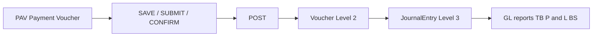
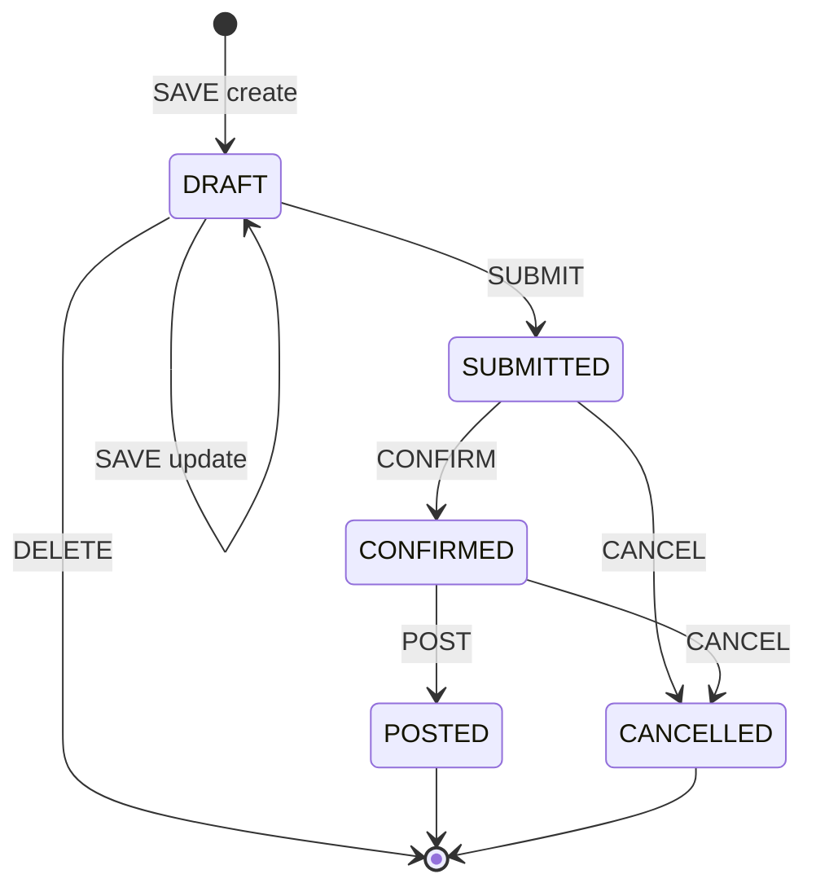

# Finance Payment Voucher (PAV) Document Design (Phase F1B)

Status: **Design complete (F1B)** — **F1C schema + core lib in progress**  
Scope: Payment Voucher (**PAV**) operational document — purpose, fields, workflow, validation, print  
Primary finance direction: [FINANCE_TRANSACTION_UNIVERSE.md](./FINANCE_TRANSACTION_UNIVERSE.md)  
Related:

- [FINANCE_MJV_PRINT_ARCHITECTURE.md](./FINANCE_MJV_PRINT_ARCHITECTURE.md) — F1A print foundation (PAV inherits)
- [FINANCE_DOCUMENT_IDENTITY_STANDARD.md](./FINANCE_DOCUMENT_IDENTITY_STANDARD.md) — Level 1 / Level 2 identity
- [11_FINANCE_POSTING_ARCHITECTURE.md](./11_FINANCE_POSTING_ARCHITECTURE.md) — posting invariants
- [15_FINANCE_PERIODS.md](./15_FINANCE_PERIODS.md) — period OPEN gate at POST
- [32_FINANCE_CORE_16B_MANUAL_JOURNAL.md](./32_FINANCE_CORE_16B_MANUAL_JOURNAL.md) — reference workflow (MJE family)

**Out of scope for initial F1C slice:** UI routes/components, print view-model, PDF snapshot on POST.

---

## 1. PAV purpose

**PAV** is the **Payment Voucher** document code — an operational finance document for **cash / bank / petty-cash outgoing payments**.

| Attribute | Value |
|-----------|-------|
| Business meaning | Disburse funds from a control account (bank, cash on hand, petty cash) to expense, asset, liability, or other GL accounts |
| Document layer | **Operational document** (same pattern as `ManualJournalEntry` for OPB/MJV) |
| Ledger layer | **`JournalEntry` + `JournalEntryLine`** — created **only at POST** |
| Level 1 identity | `PAV-YYnnnn` — registered in handbook |
| Level 2 identity | `Voucher.voucherNo` assigned at POST |
| Level 3 identity | `JournalEntry.id` (technical / traceability) |

PAV is a **payment voucher form** with header context (`payFromAccountId`, `payeeName`) and **full debit/credit journal lines** — like MJV line rules, but specialized for outbound payments. Users enter every GL line (WHT payable, bank fees, bank credit, etc.); the system does **not** auto-generate a balancing credit at POST.



**Invariant:** Never create `JournalEntry` before POST. Draft, submitted, and confirmed PAV documents have **no** posted GL impact.

---

## 2. PAV accounting meaning

Every posted Payment Voucher represents one balanced double-entry event:

| Side | Rule |
|------|------|
| **Lines** | User enters **both debit and credit** lines (one non-zero side per line) |
| **Pay-from control** | `payFromAccountId` is the default disbursement account; at least one stored **credit** line must use this account when it is set |
| **Balance** | Sum(debit) = Sum(credit) on stored lines before SUBMIT/POST |
| **Timing** | `JournalEntry` is written **only when status → POSTED** |

### Posting journal shape (conceptual)

```
Dr  Rent Expense              10,000
Cr  WHT Payable                  500
Cr  Bank / Cash (pay-from)     9,500
```

```
Dr  Accounts Payable          10,000
Dr  Bank Fee Expense              20
Cr  Bank (pay-from)           10,020
```

These patterns avoid separate Manual Journal entries for withholding tax and bank fees.

### Account eligibility

| Field / line | Allowed account types (design intent) |
|--------------|--------------------------------------|
| `payFromAccountId` | Asset control accounts designated for disbursement — typically cash, bank, petty cash (implementation validates against COA flags or account subtype) |
| Debit allocation lines | Any active, postable GL account appropriate to the payment purpose — not restricted to expense only |

Corrections after POST follow the existing finance policy: **compensating entries only** (reversal + replacement PAV or MJV) — no in-place edit of posted journals.

---

## 3. PAV header fields

Operational header fields for the Payment Voucher (PAV) document. Names below are **design vocabulary**; schema mapping notes reference existing v0 conventions (`legalEntityCode`, `entryNo`, `glAccountId`).

| Field | Required | Type / notes |
|-------|----------|--------------|
| `legalEntityId` | Yes | Legal entity scope. **Schema alignment:** map to `legalEntityCode` (FK to `LegalEntity.code`) — same as MJE |
| `branchId` | Optional | Branch dimension when payment is branch-specific. **Open question:** whether HO-only payments allow null vs default branch — see §12 |
| `voucherDate` | Yes | Payment / accounting date. **Schema alignment:** `entryDate` on operational model. Drives `AccountingPeriod` resolution at POST |
| `voucherNo` | Yes (allocated) | Level 1 document number, e.g. `PAV-260001`. **Schema alignment:** `entryNo` — allocated on first SAVE (DRAFT create), immutable thereafter |
| `payFromAccountId` | Yes | GL account money is paid **from** (bank / cash / petty cash). Header field — not repeated on every line |
| `payeeName` | Yes | External payee or beneficiary name (free text for print and audit) |
| `referenceNo` | Recommended | External reference — invoice no, contract ref, internal memo ref |
| `chequeNo` | Optional | Cheque number when payment method is cheque; omit for transfer / cash |
| `description` | Recommended | Header narrative — appears in canonical header Row 3 and print |
| `status` | System | `DRAFT` → `SUBMITTED` → `CONFIRMED` → `POSTED` (terminal). Also `CANCELLED` (terminal, no GL) |
| `totalAmount` | Derived | Sum of debit lines (= credit total when balanced). Stored denormalized for list/display; recomputed on SAVE |
| `confirmedBy` | System | Staff id at CONFIRM. **Schema alignment:** `confirmedByStaffId` + `confirmedAt` |
| `confirmedAt` | System | Timestamp at CONFIRM |
| `postedAt` | System | Timestamp at POST |
| `journalEntryId` | System | FK to posted `JournalEntry.id`. **Schema alignment:** `postedJournalEntryId`. Null until POSTED |

### Workflow audit fields (same pattern as MJE — not in user checklist but required for implementation)

| Field | Purpose |
|-------|---------|
| `createdByStaffId`, `createdAt` | Prepared by |
| `submittedByStaffId`, `submittedAt` | Checked / submitted |
| `postedByStaffId` | Posted by |
| `postedVoucherId` | Level 2 voucher FK after POST |
| `cancelledByStaffId`, `cancelledAt`, `cancelReason` | CANCEL path |

---

## 4. PAV line fields

PAV lines are **full journal lines** (same side rules as MJV). Each line has exactly one non-zero side.

| Field | Required | Type / notes |
|-------|----------|--------------|
| `accountId` | Yes | GL account. **Schema alignment:** `glAccountId` |
| `description` | Optional | Line memo. **Schema alignment:** `memo` |
| `debitAmount` | Per line | Amount ≥ 0; exactly one of debit/credit non-zero |
| `creditAmount` | Per line | Amount ≥ 0; exactly one of debit/credit non-zero |
| `sortOrder` | Yes | Display and posting order. **Schema alignment:** `lineNo` |

### Stored vs posted lines

| Layer | Lines persisted |
|-------|-----------------|
| Operational Payment Voucher document | **All user-entered debit/credit lines** |
| `VoucherLine` / `JournalEntryLine` | **Same lines** materialized 1:1 at POST (no derived balancing row) |

---

## 5. PAV screen behavior

Workflow mirrors the proven MJE path ([`ManualJournalEntry` workflow](../lib/finance/manual-journal-entry/manual-journal-entry-workflow.ts)).

| Action | From status | To status | Effect |
|--------|-------------|-----------|--------|
| **SAVE** | — / `DRAFT` | `DRAFT` | Persist header + balanced debit/credit lines. Allocate `voucherNo` on create. **No** voucher or journal |
| **SUBMIT** | `DRAFT` | `SUBMITTED` | Validate document; **lock editable fields** (see below). **No** voucher or journal |
| **CONFIRM** | `SUBMITTED` | `CONFIRMED` | Finance approval stamp. **No** voucher or journal |
| **POST** | `CONFIRMED` | `POSTED` | Create `Voucher` + `JournalEntry` + lines inside caller outer tx. Link `journalEntryId` / `postedVoucherId`. Document immutable |
| **CANCEL** | `SUBMITTED` / `CONFIRMED` | `CANCELLED` | Terminal without GL. Optional `cancelReason` |

### Field lock matrix

| Field group | DRAFT | SUBMITTED | CONFIRMED | POSTED |
|-------------|-------|-----------|-----------|--------|
| `voucherDate`, `payFromAccountId`, `payeeName`, `referenceNo`, `chequeNo`, `description`, `branchId` | Editable | **Locked** | **Locked** | **Locked** |
| Voucher lines (debit + credit) | Editable | **Locked** | **Locked** | **Locked** |
| Workflow actions | SAVE, SUBMIT, DELETE | CONFIRM, CANCEL | POST, CANCEL | Read-only; print |

`DRAFT` may be hard-deleted (same as MJE). `POSTED` is immutable — no SAVE, no CANCEL without future reversal design (out of F1B scope).

### POST requirements

1. Status must be `CONFIRMED`
2. `assertPostingPeriodOpen(legalEntityCode, voucherDate)` — fail with `PERIOD_CLOSED` or `PERIOD_NOT_OPENED` when period ≠ `OPEN` ([15_FINANCE_PERIODS.md](./15_FINANCE_PERIODS.md))
3. Materialize journal lines **directly from stored voucher lines** (no auto-credit)
4. Call existing finance posting kernel (`postOperationalVoucher` or dedicated PAV post helper joining caller `tx`)
5. Set `postedAt`, `postedByStaffId`, `journalEntryId`, `postedVoucherId`
6. **No nested `prisma.$transaction`** — operational orchestrator owns outer tx; posting helper joins `{ tx }`

---

## 6. PAV validation rules

Validation runs at SAVE (soft), SUBMIT (strict), and POST (strict + period + account).

| # | Rule | When enforced |
|---|------|---------------|
| 1 | At least **two** valid lines (non-zero debit or credit) | SUBMIT, POST |
| 2 | Each line: debit **or** credit, not both; not both zero | SAVE, SUBMIT, POST |
| 3 | `voucherDate` required | SAVE, SUBMIT, POST |
| 4 | `payFromAccountId` required | SAVE, SUBMIT, POST |
| 5 | `payeeName` required (non-blank) | SUBMIT, POST |
| 6 | Debit total must equal credit total | SUBMIT, POST |
| 7 | Total must be > 0 | SUBMIT, POST |
| 8 | At least one **credit** line on `payFromAccountId` when set | SUBMIT, POST |
| 9 | `payFromAccountId` must reference an eligible disbursement control account | SAVE, SUBMIT, POST |
| 10 | Line accounts must exist, be active, not deleted | SAVE, SUBMIT, POST |
| 11 | POST only when `AccountingPeriod.status === OPEN` for entity + date | POST |
| 12 | Immutable after POST — reject mutating actions | POSTED |

### Balance model

Users enter debits and credits in the line table (MJV-style). Submit/confirm/post are blocked when totals differ. The UI shows total debit, total credit, and **Not Balanced** when they differ.

---

## 7. PAV print design

PAV print inherits F1A foundation ([FINANCE_MJV_PRINT_ARCHITECTURE.md](./FINANCE_MJV_PRINT_ARCHITECTURE.md)) — same `FinanceVoucherPrintSheet`, THSarabunNew, browser print / Save as PDF.

### Data source rule

| Rule | Detail |
|------|--------|
| Single query / read model | Screen preview and print use the **same read API** and print view-model builder |
| No print-time totals | `totalAmount`, debit/credit totals come from **saved/posted data** — not recalculated in print CSS or a parallel print component |
| POSTED print | All stored lines — same as journal |

### Print view-model mapper (future)

Add `buildFinanceVoucherPrintModelFromPaymentVoucher(entry)` alongside MJE mapper in `lib/finance-ui/finance-voucher-print.ts`. Extend `FinanceVoucherPrintSheet` props for PAV-specific compact context — do not fork CSS.

### Required print content

| Section | Content |
|---------|---------|
| Header Row 1 | `{LegalEntity} • PAYMENT VOUCHER` |
| Header Row 2 | `{PAV-260001} • Entry Date: {DD.MM.YYYY} • Period: {YYYY-MM} • Status: {STATUS}` |
| Header Row 3 | `Description: {description}` (omit if empty) |
| Payee | `payeeName` |
| Pay from | Bank/cash account code + name from `payFromAccountId` |
| Reference | `referenceNo` |
| Cheque | `chequeNo` when present |
| Lines table | All journal lines — debit allocations + credit to pay-from |
| Totals | `totalDebit`, `totalCredit` from saved/posted lines |
| Amount in words | Thai baht text for `totalAmount` (new shared helper — not yet in codebase) |
| Signatures | Prepared / Checked / Approved ruled blocks (F1A grid) |
| Accounting block | Level 2 voucher no, posted timestamp, journal link (POSTED only) |

### Canonical header example (POSTED)

```
ASAD • PAYMENT VOUCHER
PAV-260042 • Entry Date: 21.06.2026 • Period: 2026-06 • Status: POSTED
Description: Office supplies — June

Payee: ABC Stationery Co., Ltd.
Pay from: 10101001 — Kasikorn Current Account
Reference: INV-2026-0042
Cheque: 1234567
```

---

## 8. Design decision — full debit/credit lines (revised)

### Question

Should PAV support only debit allocation lines with an auto-generated pay-from credit, or full debit/credit entry?

### Answer: **Full debit/credit lines**

| Aspect | Decision |
|--------|----------|
| User input | **Debit and credit** on each line (one side per line) |
| Pay-from header | `payFromAccountId` remains for UX and validation — at least one **credit** line must hit this account |
| POST | Journal lines copied **1:1** from voucher lines — **no** derived balancing row |
| Why | Real payments need WHT payable, bank fees, split credits, etc. without a separate MJV |

### Examples (accounting)

**Rent with withholding tax**

```
Dr  Rent Expense           10,000
Cr  WHT Payable               500
Cr  Bank (pay-from)         9,500
```

**Supplier payment plus bank fee**

```
Dr  Accounts Payable       10,000
Dr  Bank Fee Expense           20
Cr  Bank (pay-from)        10,020
```

### UI behavior summary

```
┌──────────────────────────────────────────────────────────┐
│ Pay from: [10101001 Kasikorn Current ▼]   Payee: …       │
├──────────────────────────────────────────────────────────┤
│ Account          Memo              Debit      Credit     │
│ 51001001         Rent           10,000.00               │
│ 22001001         WHT                  500.00            │
│ 10101001         Bank                      9,500.00     │
├──────────────────────────────────────────────────────────┤
│ Total                         10,000.00   10,000.00      │
└──────────────────────────────────────────────────────────┘
```

Submit / confirm / post disabled when debit ≠ credit.

---

## 9. Architecture alignment

PAV implementation must follow existing finance architecture — no new accounting engine.

| Rule | PAV application |
|------|-----------------|
| Operational document ≠ ledger | `PaymentVoucher` model holds workflow state; `JournalEntry` only at POST |
| Reuse posting kernel | `postOperationalVoucher` or thin `postPaymentVoucher` wrapper — joins `{ tx }` |
| No nested transactions | Route/workflow orchestrator opens `$transaction`; finance helpers accept `tx` |
| No duplicate report logic | TB / P&L / BS read posted GL only — PAV does not add report paths |
| `schema.prisma` source of truth | New models added in dedicated migration PR after F1B approval |
| `prisma db push` for dev | Not `db pull` |
| Identity standard | Level 1 = `voucherNo` / `entryNo`; Level 2 voucher in Accounting Information block |
| Print | Extend F1A components — no separate print stack |
| refType (at POST) | New constant e.g. `PAYMENT_VOUCHER` in `FINANCE_REF_TYPES` — register when implementing |

### Target flow (implementation phase — not F1B)

```
PaymentVoucher (DRAFT…CONFIRMED)
  └─ POST → postPaymentVoucher({ tx, entry })
       → assertPostingPeriodOpen
       → materializeJournalLines(stored lines, 1:1)
       → postOperationalVoucher({ refType: PAYMENT_VOUCHER, refId, refNo: entryNo, … })
       → link postedVoucherId, postedJournalEntryId
```

### Module placement (planned)

| Path | Responsibility |
|------|----------------|
| `lib/finance/payment-voucher/*` | Save, workflow, validation, post, read |
| `lib/finance-ui/payment-voucher-*` | Display, print model, form helpers |
| `app/api/finance/payment-vouchers/*` | Thin HTTP adapters |
| `app/(main)/finance/payment-vouchers/*` | Pages |

Business logic stays in `lib/finance/` — not in routes or pages ([01_MODULAR_MONOLITH_BOUNDARIES.md](./01_MODULAR_MONOLITH_BOUNDARIES.md)).

---

## 10. Relationship to MJE family

| Aspect | MJV / OPB (MJE) | PAV |
|--------|-----------------|-----|
| Purpose | General balanced journal | Outbound payment from control account |
| Lines | User enters debits **and** credits | User enters debits **and** credits (pay-from header + WHT/fees) |
| Header specialization | `entryType` enum | `payFromAccountId`, `payeeName`, `chequeNo` |
| Workflow | DRAFT → SUBMITTED → CONFIRMED → POSTED | Same |
| Posting path | `postManualJournalEntry` | Dedicated PAV post (same kernel) |
| Model | `ManualJournalEntry` | **Separate model** (recommended) — `PaymentVoucher` |

**Recommendation:** Do **not** overload `ManualJournalEntry` with PAV. Payment Voucher has distinct header semantics and single-sided line entry. A dedicated `PaymentVoucher` + `PaymentVoucherLine` pair keeps validation and UI clean while sharing workflow/posting/print infrastructure.

---

## 11. Status reference



---

## 12. Open questions before schema implementation

These must be resolved in F1C (schema) or handbook update — not blockers for F1B design approval.

| # | Question | Options / notes |
|---|----------|-----------------|
| 1 | **Document code** | **PAV** registered in [99_ASA_HANDBOOK.md](./99_ASA_HANDBOOK.md) — Manual Journal Voucher family uses **MJV**; Payment Voucher uses **PAV** |
| 2 | **`branchId` optional semantics** | Allow null for entity-level payments vs require default branch. MJE currently requires `branchId` — schema may need nullable FK or HO default |
| 3 | **`payFromAccountId` eligibility rule** | COA flag (e.g. `isDisbursementAccount`) vs hard-coded account type list vs manual config table |
| 4 | **Separate model name** | `PaymentVoucher` vs `FinancePayDocument` — recommend `PaymentVoucher` / `PaymentVoucherLine` |
| 5 | **Amount in words helper** | Thai baht text formatter — shared finance utility; language/format rules |
| 6 | **Permissions** | Mirror MJE (`HO_FINANCE` / `HO_ADMIN` for CONFIRM/POST?) or separate PAV roles |
| 7 | **PDF snapshot on POST** | Follow MJE PDF attach path or browser-print-only for v0 PAV |
| 8 | **Multi-currency** | Out of scope — confirm THB-only for v0 |
| 9 | **Link to APV** | Future APV may originate PAV — define `refNo` / source link pattern later |
| 10 | **Reversal / cancel after POST** | Use MJV reversal pattern or dedicated PAV void — defer to posting phase |

---

## 13. Non-goals (F1B and immediate follow-on)

- No Prisma schema migration in F1B
- No UI routes or React forms
- No posting code or API routes
- No APV / REV integration
- No bank reconciliation
- No attachment / evidence storage (separate phase per transaction universe roadmap)
- No changes to TB / P&L / BS / GL report kernels

---

## Appendix — Field name mapping (design → v0 schema convention)

| Design (this doc) | Existing v0 convention (MJE) |
|-------------------|------------------------------|
| `legalEntityId` | `legalEntityCode` |
| `voucherDate` | `entryDate` |
| `voucherNo` | `entryNo` |
| `accountId` | `glAccountId` |
| `debitAmount` / `creditAmount` | `debit` / `credit` (`Decimal`) |
| `sortOrder` | `lineNo` |
| `description` (line) | `memo` |
| `journalEntryId` | `postedJournalEntryId` |
| `confirmedBy` | `confirmedByStaffId` |

---

## Appendix — Validation error codes (planned)

Mirror MJE error pattern in `lib/finance/payment-voucher/payment-voucher-errors.ts`:

| Code | When |
|------|------|
| `PERIOD_CLOSED` | POST when period not OPEN |
| `UNBALANCED_VOUCHER` | Internal guard if materialized lines ≠ balanced |
| `INVALID_PAY_FROM_ACCOUNT` | Account not eligible for disbursement |
| `EMPTY_ALLOCATION` | No debit lines |
| `INVALID_AMOUNT` | Negative or zero-total document |
| `NOT_DRAFT` | SAVE on non-DRAFT |
| `INVALID_TRANSITION` | Workflow action not allowed |
| `IMMUTABLE_ENTRY` | Mutate POSTED document |
