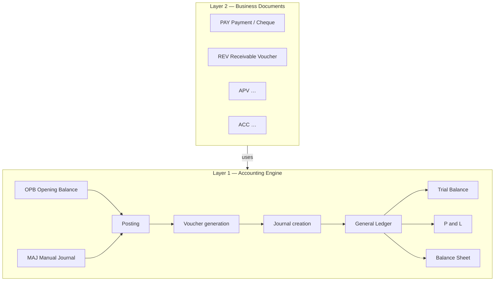
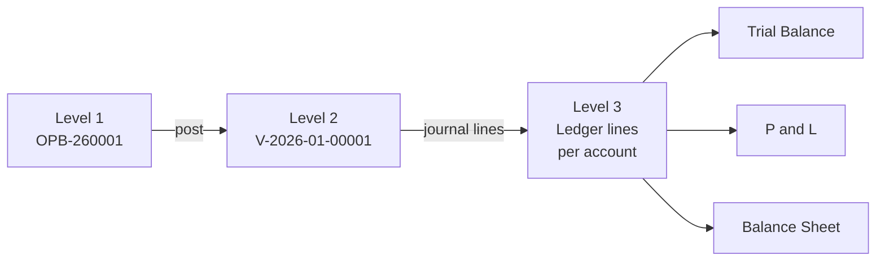

# Finance Transaction Universe

Status: **Design direction** — captures current understanding after Finance Core work (OPB, MAJ, posting, reports, identity, layout, navigation)  
Scope: Architecture and document-family taxonomy — **not** an implementation spec  
Type: Design-direction document  
Related: [FINANCE_DOCUMENT_IDENTITY_STANDARD.md](./FINANCE_DOCUMENT_IDENTITY_STANDARD.md), [99_ASA_HANDBOOK.md](./99_ASA_HANDBOOK.md), [11_FINANCE_POSTING_ARCHITECTURE.md](./11_FINANCE_POSTING_ARCHITECTURE.md), [39_FINANCE_CORE_17B_OPENING_BALANCE.md](./39_FINANCE_CORE_17B_OPENING_BALANCE.md), [32_FINANCE_CORE_16B_MANUAL_JOURNAL.md](./32_FINANCE_CORE_16B_MANUAL_JOURNAL.md), [20_FINANCE_TRACEABILITY.md](./20_FINANCE_TRACEABILITY.md), [37_FINANCE_CORE_16J_GENERAL_LEDGER.md](./37_FINANCE_CORE_16J_GENERAL_LEDGER.md), [33_FINANCE_CORE_16F_BALANCE_SHEET.md](./33_FINANCE_CORE_16F_BALANCE_SHEET.md)

---

## 1. Executive Summary

Finance Core is **substantially complete**.

The accounting engine — opening balance, manual journals, posting, voucher generation, general ledger infrastructure, trial balance, profit & loss, and balance sheet — is operational and has been exercised through OPB and MAJ workflows, report surfaces, identity standardization, and navigation work.

**Remaining finance work is primarily:**

| Area | Focus |
|------|-------|
| Business document design | PAY, REV, APV, ACC, and other user-facing operational forms |
| Document storage | Attachments, evidence, supporting files |
| Audit and traceability | Consistent lineage from business document through voucher to ledger and reports |
| User workflow | Submit → Confirm → Post UX, settlement processes, inquiry hubs |

This is **not** accounting engine development. Future phases should treat business documents as specialized workflows built on top of the existing MAJ/posting path unless a genuine new accounting capability is required.

---

## 2. Finance Architecture Layers

Finance is understood as two distinct layers. They share posting infrastructure but serve different purposes.

### Layer 1 — Accounting Engine

**Status: operational (substantially complete)**

Already implemented:

| Capability | Notes |
|------------|-------|
| OPB | Opening balance via `ManualJournalEntry` — see [39_FINANCE_CORE_17B_OPENING_BALANCE.md](./39_FINANCE_CORE_17B_OPENING_BALANCE.md) |
| MAJ | Manual journal and reversal — see [32_FINANCE_CORE_16B_MANUAL_JOURNAL.md](./32_FINANCE_CORE_16B_MANUAL_JOURNAL.md) |
| Posting | Centralized `lib/finance/posting.ts` — see [11_FINANCE_POSTING_ARCHITECTURE.md](./11_FINANCE_POSTING_ARCHITECTURE.md) |
| Voucher generation | Immutable posted vouchers with `voucherNo` |
| Journal creation | Balanced `JournalEntry` / `JournalEntryLine` |
| General Ledger infrastructure | Account drill-down — see [37_FINANCE_CORE_16J_GENERAL_LEDGER.md](./37_FINANCE_CORE_16J_GENERAL_LEDGER.md) |
| Trial Balance | Period integrity across accounts (Finance Core 16C) |
| Profit & Loss | Income statement from posted GL (Finance Core 16E) |
| Balance Sheet | Read-only statement — see [33_FINANCE_CORE_16F_BALANCE_SHEET.md](./33_FINANCE_CORE_16F_BALANCE_SHEET.md) |

The accounting engine is considered **operational**. Reports read posted GL only; operational documents are workflow and trace layers — see [99_ASA_HANDBOOK.md § Reporting boundary](./99_ASA_HANDBOOK.md).

### Layer 2 — Business Documents

**Status: primary area of future work**

Business documents are **user-facing workflows** built on top of MAJ and posting. They are specialized business forms — not new accounting engines.

| Code | Name | Role |
|------|------|------|
| **PAY** | Payment / Cheque | Outbound payment workflow |
| **REV** | Receivable Voucher | Amounts owed to the company, not yet received |
| **APV** | *(TBD)* | Accounts payable voucher family — design pending |
| **ACC** | *(TBD)* | Accrual / acceptance family — design pending |

Most future finance documents should follow the same pattern as OPB and MAJ: an operational document model, a workflow (draft through post), and a posting hook into the existing voucher/journal path — not a parallel GL implementation.

---

## 3. Identity Hierarchy

Every finance event is recognized at three levels. Each level has a distinct role; levels must not compete for the same UI slot — see [FINANCE_DOCUMENT_IDENTITY_STANDARD.md](./FINANCE_DOCUMENT_IDENTITY_STANDARD.md).

| Level | Name | Role | Examples |
|-------|------|------|----------|
| **1** | Business Document | Primary user-facing identity | `OPB-260001`, `MAJ-260001`, `PAY-260001`, `REV-260001` |
| **2** | Posted Journal / Voucher | Accounting posting reference | `V-2026-01-00001` |
| **3** | Ledger Transactions | Account-level postings that feed TB, P&L, and BS | Debit/credit lines on `JournalEntryLine` per GL account |

### Level 1 — Business Document

- Format: `<CODE>-<YY><NNNN>` per [99_ASA_HANDBOOK.md](./99_ASA_HANDBOOK.md)
- Field: `ManualJournalEntry.entryNo` (and future operational document numbers)
- Used in: page headers, list primary columns, PDF titles, search, audit references

### Level 2 — Posted Journal / Voucher

- Format: `V-{periodKey}-{seq}` (e.g. `V-2026-01-00001`)
- Field: `Voucher.voucherNo`
- Linkage: `Voucher.refNo` stores Level 1 at post time
- Used in: Accounting Information section — not as page title or list primary column

### Level 3 — Ledger Transactions

- Account-level debit/credit postings on `JournalEntryLine`
- Aggregate into Trial Balance, Profit & Loss, and Balance Sheet
- This is the **accounting truth layer** for financial statements; users typically reach it via GL drill-down rather than by document number alone

---

## 4. Finance Transaction Universe

### Implemented document families

| Code | Name | `ManualJournalEntryType` | Status |
|------|------|--------------------------|--------|
| **OPB** | Opening Balance | `OPENING_BALANCE` | Implemented |
| **MAJ** | Manual Accounting Journal | `MANUAL` | Implemented |
| **ADJ** | Adjustment Journal | `ADJUSTMENT` | Registered; same MJE family |
| **REJ** | Reclass Journal | `RECLASS` | Registered; same MJE family |
| **ACJ** | Accrual Journal | `ACCRUAL` | Registered; same MJE family |
| **AUJ** | Auditor Adjustment Journal | `AUDITOR_ADJUSTMENT` | Registered; same MJE family |

OPB and MAJ are the primary exercised paths. Other MJE-family codes share the same operational model and posting infrastructure.

### Planned business document families

| Code | Name | Business meaning | Status |
|------|------|------------------|--------|
| **PAY** | Payment / Cheque | Outbound payments (cheque, transfer, settlement disbursement) | Design pending |
| **REV** | Receivable Voucher | Money **owed to the company** but **not yet received** | Design pending |
| **APV** | Accounts Payable Voucher | Payables workflow — scope TBD | Design pending |
| **ACC** | *(TBD)* | Accrual / acceptance — scope TBD | Design pending |

### REV — business meaning (important distinction)

**REV = Receivable Voucher.** Money is owed to the company but has not yet been received.

Examples:

- Mall settlements (amounts due from mall operators)
- Partner settlements
- Amounts collected by third parties on the company's behalf
- Recoverable payments

**REV is not a receipt.** It records a receivable — an obligation owed to the company.

**POS receipts are not REV.** POS checkout represents money **already received** at point of sale. POS flows through operational checkout → finance posting hooks ([13_FINANCE_OPERATIONAL_WIRING.md](./13_FINANCE_OPERATIONAL_WIRING.md)); they do not use the REV document family.

### Document families outside this universe (operational → GL)

These are not Manual Journal Entry family documents but still produce Level 2 vouchers and Level 3 ledger lines:

| Source | refType | Notes |
|--------|---------|-------|
| POS sale | `POS_SALE` | Cash/transfer/QR already received |
| Stock document post | `STOCK_DOC_POST` | Inventory accounting from stock posting |

See [20_FINANCE_TRACEABILITY.md](./20_FINANCE_TRACEABILITY.md) for operational → voucher lineage.

---

## 5. Current System Flow

Standard path for Manual Journal Entry family documents (OPB, MAJ, and future business documents on the same model):

| Step | Meaning |
|------|---------|
| **Business Document** | User creates/edits operational document (e.g. `MAJ-260001`) |
| **Submit** | Document leaves draft; enters review queue |
| **Confirm** | Authorized reviewer approves for posting |
| **Post** | Accounting engine creates voucher + journal; document status → POSTED |
| **Voucher** | Level 2 identity assigned (`V-2026-01-00001`); `refNo` = Level 1 |
| **Ledger** | Level 3 account postings on `JournalEntryLine` |
| **Trial Balance** | Period totals across all accounts |
| **P&L / Balance Sheet** | Financial statements from same posted GL scope |

Operational sources (POS, stock documents) skip the MJE workflow but still land on voucher → ledger → reports through finance posting hooks.

---

## 6. Key Discovery

> **Accounting Engine ≠ Business Documents**

This is the major realization from the OPB / MAJ / reports / identity phase:

| Layer | State |
|-------|-------|
| Accounting engine | Largely complete — posting, vouchers, journals, TB, P&L, BS |
| Business documents | Mostly ahead — PAY, REV, APV, ACC need design and UX |

The team repeatedly converged on building **another engine** when the real need was a **better form and workflow** on top of the existing engine.

Implications:

- OPB and MAJ prove the pattern: one operational document model, workflow states, post into existing voucher path
- New document types should default to **specialized business forms**, not new GL subsystems
- Report and identity work validated that the downstream chain (voucher → ledger → TB / P&L / BS) is sound

---

## 7. Future Direction

### Near-term focus

| Priority | Area |
|----------|------|
| 1 | **PAY document design** — payment/cheque workflow, fields, approval rules |
| 2 | **REV document design** — receivable recognition vs collection; settlement scenarios |
| 3 | **Attachment strategy** — where files live, how they link to Level 1 identity |
| 4 | **Evidence management** — supporting documents for audit and close |
| 5 | **Audit trail improvements** — consistent lineage across surfaces (see identity standard gaps) |
| 6 | **Settlement workflows** — mall/partner/third-party collection patterns that feed REV and eventual receipt |

### Guiding principle

**Avoid creating new accounting engines** unless required by a genuine accounting need (e.g. a posting rule that cannot be expressed through the existing voucher/journal path).

When in doubt: design the business document first; confirm posting lines; reuse MAJ/MJE infrastructure.

---

## 8. Explicit Non-Goals

Do **not** redesign the following without evidence of accounting defects:

| Component | Rationale |
|-----------|-----------|
| Posting engine | Centralized, tested, idempotent — [11_FINANCE_POSTING_ARCHITECTURE.md](./11_FINANCE_POSTING_ARCHITECTURE.md) |
| Voucher engine | Immutable posted vouchers with compensating-entry corrections only |
| Trial Balance | Single source for period integrity; BS and P&L reuse same aggregation |
| Profit & Loss | Derived from posted GL; closing entry path exists (16G / 16H) |
| Balance Sheet | Implemented read-only layer — [33_FINANCE_CORE_16F_BALANCE_SHEET.md](./33_FINANCE_CORE_16F_BALANCE_SHEET.md) |

Changes to these layers require a documented accounting defect or regulatory requirement — not UX convenience or new document types.

---

## Appendix A — Documentation alignment notes

This section records known tensions with existing docs. Resolution belongs in handbook / identity standard updates — not in this design-direction doc alone.

| Topic | This document | Existing doc | Notes |
|-------|---------------|--------------|-------|
| Payment code | **PAY** | [FINANCE_DOCUMENT_IDENTITY_STANDARD.md](./FINANCE_DOCUMENT_IDENTITY_STANDARD.md) uses **PV** (Payment Voucher) | Code must be registered in [99_ASA_HANDBOOK.md](./99_ASA_HANDBOOK.md) before implementation; reconcile PAY vs PV |
| Receivable vs receipt code | **REV** (Receivable Voucher — money owed, not received) | Identity standard uses **RV** (Receipt Voucher — money received) | Opposite business meaning; REV here is receivable recognition, not cash receipt |
| AR/AP journals | REV, APV as business documents | Handbook reserves **ARJ**, **APJ** for Accounts Receivable / Payable Journal | Clarify whether REV/APV replace ARJ/APJ or sit above them |
| ACC code | Listed as planned family | Handbook uses **ACJ** for Accrual Journal (implemented MJE type) | ACC may need renaming or explicit distinction from ACJ |
| Identity Level 3 | Ledger transactions (account postings) | Identity standard Level 3 = technical IDs (`JournalEntry.id`, etc.) | Complementary framing: identity standard Level 3 = system refs; this doc Level 3 = GL line layer for reporting |
| TB / P&L doc files | Referenced as Finance Core 16C / 16E | No standalone `16C` / `16E` markdown files in repo | Capabilities exist in code and are referenced by 16F / 16J; dedicated docs may be added later — see Appendix D row 8 |
| 11 / 12 / 13 status headers | Treats engine as operational | ~~Header still says "Planned — architecture only"~~ | **Aligned** (2026-06-20): [11](./11_FINANCE_POSTING_ARCHITECTURE.md), [12](./12_FINANCE_RECONCILIATION_AND_CLOSE_POLICY.md), [13](./13_FINANCE_OPERATIONAL_WIRING.md) status headers updated to Done; invariants unchanged |

---

## Appendix B — Cross-links

### Primary references

| Document | Relevance |
|----------|-----------|
| [FINANCE_DOCUMENT_IDENTITY_STANDARD.md](./FINANCE_DOCUMENT_IDENTITY_STANDARD.md) | Level 1 / Level 2 presentation rules |
| [99_ASA_HANDBOOK.md](./99_ASA_HANDBOOK.md) | Document codes, numbering, reporting boundary |
| [11_FINANCE_POSTING_ARCHITECTURE.md](./11_FINANCE_POSTING_ARCHITECTURE.md) | Posting invariants, voucher/journal model |
| [39_FINANCE_CORE_17B_OPENING_BALANCE.md](./39_FINANCE_CORE_17B_OPENING_BALANCE.md) | OPB reference implementation |
| [32_FINANCE_CORE_16B_MANUAL_JOURNAL.md](./32_FINANCE_CORE_16B_MANUAL_JOURNAL.md) | MAJ reference implementation |

### Reports and GL

| Document | Relevance |
|----------|-----------|
| [37_FINANCE_CORE_16J_GENERAL_LEDGER.md](./37_FINANCE_CORE_16J_GENERAL_LEDGER.md) | Level 3 drill-down |
| [33_FINANCE_CORE_16F_BALANCE_SHEET.md](./33_FINANCE_CORE_16F_BALANCE_SHEET.md) | BS from posted GL |
| [34_FINANCE_CORE_16G_RETAINED_EARNINGS.md](./34_FINANCE_CORE_16G_RETAINED_EARNINGS.md) | RE bridge |
| [35_FINANCE_CORE_16H_CLOSING_ENTRY.md](./35_FINANCE_CORE_16H_CLOSING_ENTRY.md) | Period close posting |

### Audit, traceability, close

| Document | Relevance |
|----------|-----------|
| [20_FINANCE_TRACEABILITY.md](./20_FINANCE_TRACEABILITY.md) | Operational → voucher → journal lineage |
| [23_FINANCE_CLOSE_EVIDENCE.md](./23_FINANCE_CLOSE_EVIDENCE.md) | Close evidence snapshots |
| [27_FINANCE_PERIOD_AUDIT_TIMELINE.md](./27_FINANCE_PERIOD_AUDIT_TIMELINE.md) | Period audit history |

### Operational integration

| Document | Relevance |
|----------|-----------|
| [13_FINANCE_OPERATIONAL_WIRING.md](./13_FINANCE_OPERATIONAL_WIRING.md) | POS / stock → finance hooks |
| [08_POS_CHECKOUT_ARCHITECTURE.md](./08_POS_CHECKOUT_ARCHITECTURE.md) | Why POS ≠ REV |

---

## Appendix C — Current Project Position

### Finance Core Status

✓ OPB  
✓ MAJ  
✓ Posting  
✓ Voucher Generation  
✓ General Ledger  
✓ Trial Balance  
✓ Profit & Loss  
✓ Balance Sheet  

### Current conclusion

Finance Core is considered **operational and substantially complete**.

Future work should focus on:

- Business document design
- Settlement workflows
- Attachments and evidence
- Audit and traceability

Avoid creating new accounting engines unless a genuine accounting requirement is discovered.

---

## Appendix D — Vocabulary Decisions Pending

This appendix lists **unresolved** naming and vocabulary conflicts. No decision is made here. Resolution belongs to future handbook and identity-standard updates — see decision-owner column.

| # | Current term | Conflicting term | Document source | Recommended future decision owner |
|---|--------------|------------------|-----------------|-----------------------------------|
| 1 | **PAY** — Payment / Cheque (outbound payment business document) | **PV** — Payment Voucher | [FINANCE_TRANSACTION_UNIVERSE.md](./FINANCE_TRANSACTION_UNIVERSE.md) §4 vs [FINANCE_DOCUMENT_IDENTITY_STANDARD.md](./FINANCE_DOCUMENT_IDENTITY_STANDARD.md) §8 (`PV-260001`) | [99_ASA_HANDBOOK.md](./99_ASA_HANDBOOK.md) — document code registry |
| 2 | **REV** — Receivable Voucher (money owed, not yet received) | **RV** — Receipt Voucher (money received) | [FINANCE_TRANSACTION_UNIVERSE.md](./FINANCE_TRANSACTION_UNIVERSE.md) §4 vs [FINANCE_DOCUMENT_IDENTITY_STANDARD.md](./FINANCE_DOCUMENT_IDENTITY_STANDARD.md) §2, §8 (`RV-260001`) | [99_ASA_HANDBOOK.md](./99_ASA_HANDBOOK.md) — document code registry |
| 3 | **REV** — Receivable Voucher (business document family) | **ARJ** — Accounts Receivable Journal (reserved code) | [FINANCE_TRANSACTION_UNIVERSE.md](./FINANCE_TRANSACTION_UNIVERSE.md) §4 vs [99_ASA_HANDBOOK.md](./99_ASA_HANDBOOK.md) § Reserved codes | [99_ASA_HANDBOOK.md](./99_ASA_HANDBOOK.md) + [FINANCE_TRANSACTION_UNIVERSE.md](./FINANCE_TRANSACTION_UNIVERSE.md) maintainers |
| 4 | **APV** — Accounts Payable Voucher (business document family, scope TBD) | **APJ** — Accounts Payable Journal (reserved code) | [FINANCE_TRANSACTION_UNIVERSE.md](./FINANCE_TRANSACTION_UNIVERSE.md) §2, §4 vs [99_ASA_HANDBOOK.md](./99_ASA_HANDBOOK.md) § Reserved codes | [99_ASA_HANDBOOK.md](./99_ASA_HANDBOOK.md) + [FINANCE_TRANSACTION_UNIVERSE.md](./FINANCE_TRANSACTION_UNIVERSE.md) maintainers |
| 5 | **ACC** — planned business document family (accrual / acceptance — scope TBD) | **ACJ** — Accrual Journal (`ManualJournalEntryType = ACCRUAL`, implemented MJE family) | [FINANCE_TRANSACTION_UNIVERSE.md](./FINANCE_TRANSACTION_UNIVERSE.md) §2, §4 vs [99_ASA_HANDBOOK.md](./99_ASA_HANDBOOK.md) § Active codes | [99_ASA_HANDBOOK.md](./99_ASA_HANDBOOK.md) — document code registry |
| 6 | **Level 3 — Ledger Transactions** (account-level `JournalEntryLine` postings feeding TB / P&L / BS) | **Level 3 — Technical References** (`JournalEntry.id`, `Voucher.id`, `ManualJournalEntry.id`) | [FINANCE_TRANSACTION_UNIVERSE.md](./FINANCE_TRANSACTION_UNIVERSE.md) §3 vs [FINANCE_DOCUMENT_IDENTITY_STANDARD.md](./FINANCE_DOCUMENT_IDENTITY_STANDARD.md) §2 | [FINANCE_DOCUMENT_IDENTITY_STANDARD.md](./FINANCE_DOCUMENT_IDENTITY_STANDARD.md) — presentation identity |
| 7 | **JV** — Journal Voucher (`JV-260001`, planned in identity standard) | *(not listed)* — no corresponding family in transaction universe | [FINANCE_DOCUMENT_IDENTITY_STANDARD.md](./FINANCE_DOCUMENT_IDENTITY_STANDARD.md) §2, §8 only | [99_ASA_HANDBOOK.md](./99_ASA_HANDBOOK.md) — register or retire before use |
| 8 | Finance Core **16C** (Trial Balance) and **16E** (Profit & Loss) — referenced as implemented capabilities | No standalone `32_FINANCE_CORE_16C_*` or `32_FINANCE_CORE_16E_*` markdown files | [FINANCE_TRANSACTION_UNIVERSE.md](./FINANCE_TRANSACTION_UNIVERSE.md) §2, [33_FINANCE_CORE_16F_BALANCE_SHEET.md](./33_FINANCE_CORE_16F_BALANCE_SHEET.md) § Finance Core chain, [37_FINANCE_CORE_16J_GENERAL_LEDGER.md](./37_FINANCE_CORE_16J_GENERAL_LEDGER.md) § What 16J is not | Finance Core documentation maintainers |

**Note:** Until rows 1–5 are resolved, do not register new three-letter codes in the handbook or implement PAY / REV / APV / ACC document families.
