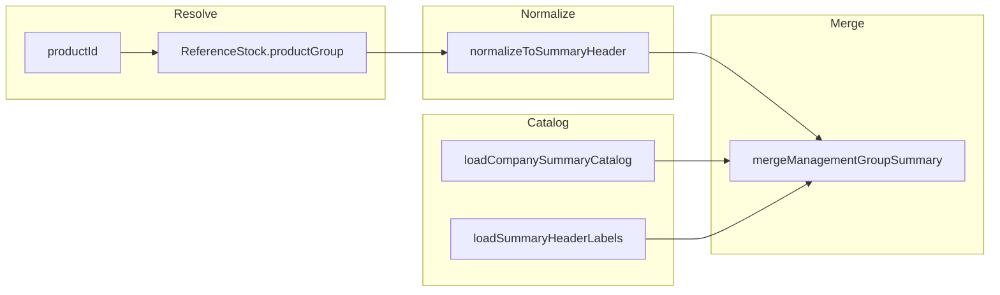

# Management Product Group — Data Audit & Plan

**Date:** 2026-06-08 (Step 0) · **Updated:** 2026-06-08 (Policy v2)  
**Repo:** `asa-con-v0`  
**Mode:** Read-only audit + plan docs only — no production code, no schema changes, no data mutation

---

## Locked policy (v2 — current)

Product Group Summary uses **configured 7-digit management headers** from `Product` / `ReferenceStock`.  
Primary line source: `ReferenceStock.productGroup` on each sellable SKU.  
Display label: `Product.name` where `Product.code` = **summary header code** (after normalization).

### Summary level rules

| Rule | Summary header pattern | Examples |
|------|------------------------|----------|
| **Default** | `GG00900` (GG + `00900`) | `5100900` Ladies' Heels · `5500900` Ladies' Soles · `6100900` Men's Heels · `6500900` Men's Soles · `0100900` Home Key (GG=01) |
| **Exception GG=70** | `GGTT900` | `7001900` Stretching · `7002900` Glue/Stitching |
| **Known explicit headers** | Use as-is when configured | `4100900` Keys Add-On Sales · `8001900` Shoe Add-On Sales |

### Normalization (reporting layer)

```
Input: configured 7-digit ReferenceStock.productGroup (e.g. 0101901, 0101902)

If value is already an explicit management summary header → preserve
Else if GG == "70" → GG + TT + "900"
Else → GG + "00900"
```

**Prohibited:** `Product.groupCode` rollup · XX90X collapse · universal first-4 slicing · `computeShoeGroupCode` as business truth.

### Consumers (same helper)

- READ_Z Product Group Summary (Z: zero-fill company catalog)
- Stock Document Product Group Summary (sales/counting scoped; same key + label rules)

---

## A. Target management header Product rows

Checked codes (explicit policy list):

| Header code | Expected label (business) | `Product` row exists? | `Product.name` |
|-------------|---------------------------|----------------------|----------------|
| `4100900` | Keys Add-On Sales | **MISSING** | — |
| `5100900` | Ladies' Heels | **MISSING** | — |
| `5500900` | Ladies' Soles | **MISSING** | — |
| `6100900` | Men's Heels | **MISSING** | — |
| `6500900` | Men's Soles | **MISSING** | — |
| `7001900` | Stretching | **MISSING** | — |
| `7002900` | Glue/Stitching | **MISSING** | — |
| `8001900` | Shoe Add-On Sales | **MISSING** | — |

**Additional finding:** **No** `Product` in the database ends with `00900` or `900` at all (`productsEnding900 = 0`).  
Management headers today are stored at **901/902 variant level** (e.g. `0101901`, `1101901`) — not at `GG00900` summary level.

### Related sellable SKUs exist (no summary headers)

| Prefix | Sample SKUs | Count |
|--------|-------------|------:|
| `41` | `4101001` ติดตั้งกุญแจ, `4101003` ค่าตัดกุญแจธรรมดา | 14 |
| `51`–`55` | `5101001` CREPINA, `5502001` … | 72 shoe SKUs |
| `61`–`65` | (in shoe SKU set) | (included above) |
| `70` | `7001001` ขยายรองเท้าหญิง, `7002001` ทากาว | 20 |
| `80` | `8001001` แผ่นรองพื้นรองเท้า | 7 |

---

## B. ReferenceStock.productGroup → summary headers

### Current stored values (595 active rows)

All 595 rows have non-null 7-digit `productGroup`. **20 distinct** stored values — all key products (`0101901` … `3103902`). **0** rows point directly to any v2 target header (`4100900`, `5100900`, …).

| Stored `productGroup` | Ref rows | Normalized summary (`GG00900` / `GGTT900`) |
|----------------------|--------:|---------------------------------------------|
| `0101901`, `0101902`, `0102901`, `0102902`, `0103901`, `0104901`, `0105901`, `0105902` | 328 | **`0100900`** |
| `1101901` | 58 | **`1100900`** |
| `1201901` | 41 | **`1200900`** |
| `2101901`, `2101902`, `2102901`, `2103901` | 89 | **`2100900`** |
| `2201901`, `2202901` | 58 | **`2200900`** |
| `3101901`, `3102901`, `3103901`, `3103902` | 21 | **`3100900`** |

**Can `ReferenceStock.productGroup` point to `GG00900` headers?**  
**Yes** — field is a free 7-digit string; Master/import can set `5100900`, etc. Today it points to finer configured headers that **normalize upward** at summary time.

**Shoe / add-on / services:** 0 `ReferenceStock` rows for `hookGroup = 'S'`; no refs for `41*`, `70*`, `80*` SKUs.

---

## C. Shared helper design (plan only)

**File:** `lib/product-groups/management-product-group.ts`

### Responsibilities



| Function | Purpose |
|----------|---------|
| `resolveConfiguredProductGroup(productId, refMap)` | Return stored `ReferenceStock.productGroup` (null if missing) |
| `normalizeToSummaryHeader(configuredCode7)` | Apply v2 rules; preserve explicit summary headers |
| `isExplicitSummaryHeader(code7)` | True for policy seed headers + codes already matching `GG00900` or `GGTT900` (GG=70) |
| `loadCompanySummaryCatalog(db)` | Union: normalized headers from all refs + explicit `Product` management headers + policy seed list |
| `loadSummaryHeaderLabels(db, codes)` | `Product.name` by `code`; fallback `"—"` if missing |
| `mergeManagementGroupSummary({ catalog, aggregates, includeZeroRows })` | Zero-fill; sort by header code |

### Normalization pseudocode

```typescript
const POLICY_SEED_HEADERS = [
  "4100900", "5100900", "5500900", "6100900", "6500900",
  "7001900", "7002900", "8001900",
] as const

function normalizeToSummaryHeader(configured: string): string | null {
  const d = digitsOnly(configured)
  if (d.length !== 7) return null
  if (POLICY_SEED_HEADERS.includes(d) || d.endsWith("00900")) return d
  const gg = d.slice(0, 2)
  const tt = d.slice(2, 4)
  if (gg === "70") return `${gg}${tt}900`
  return `${gg}00900`
}
```

### Company-wide zero-fill catalog (implied size: **14**)

**From current refs (normalized):** `0100900`, `1100900`, `1200900`, `2100900`, `2200900`, `3100900`  
**Policy seeds (missing Product rows):** `4100900`, `5100900`, `5500900`, `6100900`, `6500900`, `7001900`, `7002900`, `8001900`

READ Z zero-fill shows all 14 with qty/amount `0` when no sales. Labels require header `Product` rows (see backfill).

### Consumer flags

| Consumer | `includeZeroRows` | Metrics |
|----------|-------------------|---------|
| READ Z | `true` | qty, amount |
| READ X / COLLECT | `false` | qty, amount |
| Stock Document sidebar | `false` (current UX) | items, totalQty |

---

## Step 0 audit (unchanged facts)

| Metric | Value |
|--------|------:|
| `ReferenceStock` active | 595 |
| `productGroup` null | 0 |
| Non-smoke POS sale items resolvable (90d) | 45/45 |
| Unresolved POS (smoke test only) | `SMOKE-PROD-001`, `P1C-PROD-001` |
| Shoe SKUs without `ReferenceStock` | 72 |
| `StockDocumentLine` rows | 0 |

---

## Recommended data backfill (before full zero-fill)

### Priority 1 — Create summary header `Product` rows

Add management header products (sellable header / group product type per import conventions):

| Code | Suggested `Product.name` |
|------|--------------------------|
| `0100900` | Home Key (or Thai equivalent) |
| `1100900` | Car Key |
| `1200900` | Motorcycle Key |
| `2100900` | Car Safety Head |
| `2200900` | Motorcycle Safety Head |
| `3100900` | Special Key |
| `4100900` | Keys Add-On Sales |
| `5100900` | Ladies' Heels |
| `5500900` | Ladies' Soles |
| `6100900` | Men's Heels |
| `6500900` | Men's Soles |
| `7001900` | Stretching |
| `7002900` | Glue/Stitching |
| `8001900` | Shoe Add-On Sales |

*Names should match management reporting labels; exact Thai strings to be confirmed with operations.*

### Priority 2 — `ReferenceStock` links

| Segment | Action |
|---------|--------|
| Keys (existing 595 refs) | **Optional:** leave stored `productGroup` at `0101901` etc.; normalization handles summary. Or migrate stored value to `GG00900` for clarity. |
| Shoe SKUs (72) | Create `ReferenceStock` rows; set `productGroup` to `5100900` / `5500900` / `6100900` / `6500900` per [PRODUCT CODE ASSIGNED](../../asa-con/docs/PRODUCT%20CODE%20ASSIGNED.md) GG prefix |
| Add-on `41*` SKUs | Link refs with `productGroup = 4100900` |
| Services `70*` SKUs | Link refs; stored group can be `7001001` etc. — normalizes to `7001900` / `7002900` by TT |
| Retail `80*` SKUs | Link refs with `productGroup = 8001900` |

### Priority 3 — Retire fallback paths (after backfill)

- Remove `computeShoeGroupCode` from summary and input-list paths
- Stop using `Product.groupCode` in READ Z aggregation

---

## Risk classification (v2)

| Status | Scope |
|--------|--------|
| **SAFE to build helper + unit tests** | Normalization logic; key ref → `GG00900` rollup; merge/zero-fill |
| **NEEDS DATA BACKFILL before production zero-fill** | All 8 explicit policy headers + 6 normalized key summary headers missing as `Product` rows |
| **NEEDS DATA BACKFILL before shoe/add-on reporting** | 72 shoe + 14 add-on + 20 service SKUs without `ReferenceStock` |
| **NEEDS MASTER UI validation** | Require `productGroup` + header `Product` exists on Save All; block shoe rows without configured group |

---

## Implementation plan (Step 1+)

| Step | Work | Blocker |
|------|------|---------|
| **1** | `lib/product-groups/management-product-group.ts` + unit tests (normalization, merge, zero-fill) | None |
| **2** | Master data: create 14 summary header `Product` rows | Backfill |
| **3** | Master data: `ReferenceStock` for shoe / 41 / 70 / 80 SKUs | Backfill |
| **4** | Wire READ_Z aggregation → shared helper | After Step 1 |
| **5** | Wire Stock Document summary → shared helper | After Step 1 |
| **6** | UI payloads + tests + build | After 4–5 |
| **7** | AD002 in `99_ASA_HANDBOOK.md` | With Step 4 |

**Do not implement Steps 1–7 until approved.** Step 0 audit complete.

---

## Query notes (Prisma — read-only)

```typescript
// Target header existence
await prisma.product.findMany({
  where: { code: { in: ["4100900","5100900","5500900","6100900","6500900","7001900","7002900","8001900"] } },
  select: { code: true, name: true, deleted: true },
})

// Normalization helper (audit simulation)
function normalizeToSummaryHeader(code7: string): string | null {
  const d = code7.replace(/\D/g, "")
  if (d.length !== 7) return null
  const SEED = new Set(["4100900","5100900","5500900","6100900","6500900","7001900","7002900","8001900"])
  if (SEED.has(d) || d.endsWith("00900")) return d
  const gg = d.slice(0, 2), tt = d.slice(2, 4)
  if (gg === "70") return `${gg}${tt}900`
  return `${gg}00900`
}

// Refs pointing to target headers
await prisma.referenceStock.count({
  where: { deleted: false, productGroup: { in: [...SEED] } },
})
```

---

## ASA Handbook

Record **Architecture Decision 002** when implementation starts:

> Product Group Summary normalizes configured `ReferenceStock.productGroup` to management summary headers: default `GG00900`, exception `GGTT900` for GG=70. Labels from `Product.name`. One shared helper for READ Z and Stock Document. No runtime SKU slicing.

---

*Policy v2 investigation complete. Production code not implemented.*
