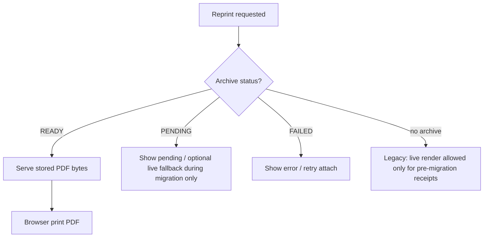

# Phase 17A — Document Archive & Snapshot Engine Foundation

Status: **Design only — no schema or code in this phase**  
Scope: Immutable PDF snapshots for completed documents; POS Receipt as first consumer  
Reference pattern: Manual Journal Entry PDF snapshot (implemented in `lib/finance/manual-journal-entry/`)

Related:

- [08_POS_CHECKOUT_ARCHITECTURE.md](./08_POS_CHECKOUT_ARCHITECTURE.md) — checkout orchestration, receipt numbering
- [RECEIPT_SETUP.md](./RECEIPT_SETUP.md) — receipt layout and tax ID rules
- [POS_COMPLETION_ROADMAP.md](./POS_COMPLETION_ROADMAP.md) — thermal 80mm architecture (P2)
- [FINANCE_PRESENTATION_CONTRACT.md](./FINANCE_PRESENTATION_CONTRACT.md) — frozen snapshot principle (finance vouchers)
- [FINANCE_MJV_PRINT_ARCHITECTURE.md](./FINANCE_MJV_PRINT_ARCHITECTURE.md) — MJV PDF attach / serve pattern

> **Phase numbering note:** Finance reconciliation uses “Phase 17” in [17_RECONCILIATION_DRILLDOWN.md](./17_RECONCILIATION_DRILLDOWN.md). This document uses **Phase 17A** in the **Document Archive** track — a separate numbering line for cross-domain document archival. Finance Core docs (e.g. [39_FINANCE_CORE_17B_OPENING_BALANCE.md](./39_FINANCE_CORE_17B_OPENING_BALANCE.md)) refer to Manual Journal phases under their own 17A label.

---

## 1. Business explanation

### Problem

Today, a completed POS receipt is **live-rendered** every time it is viewed or reprinted:

1. Checkout commits sale data to the database.
2. The print tab loads `/shop/receipt/[saleId]`, queries current sale/payment/branch/layout data, and calls `window.print()`.

If product names, thermal layout settings, tax display rules, or branch contact data change later, a reprinted receipt may **not match** what the customer received at checkout time. That breaks audit expectations for abbreviated tax invoices and shop operations.

Finance Manual Journal Entries already solve this for A4 vouchers: on POST, the system freezes a snapshot, generates a PDF once, stores it, and serves stored bytes on view/reprint.

### Goal

Introduce a **Document Archive & Snapshot Engine** — a shared foundation for immutable PDF snapshots of completed documents.

| Rule | Detail |
|------|--------|
| Snapshot at completion | When a document is completed (checkout for receipts), freeze presentation data |
| Generate PDF once | Render PDF from frozen snapshot; store to filesystem or Blob |
| Link to source document | Receipt (and later MJV, refund slip, stock slip, etc.) points to archive |
| View / reprint from PDF | Once status is **READY**, never live-render the old document again |
| Lookup | Staff can search by document number, see metadata, open or reprint stored PDF |

### First consumer: POS Receipt

Receipt is the pilot because:

- Checkout already produces a stable business key (`receiptNo`).
- Thermal print infrastructure exists (`lib/thermal/`, `PosSaleReceiptSlip`).
- High reprint volume at shop counters makes immutability valuable immediately.

### Out of scope for 17A

Schema migration, code, UI, and PDF renderer implementation. This document is the approval gate for those.

---

## 2. Audit — existing PDF infrastructure

### 2.1 Manual Journal Entry (reference implementation)

The MJV stack is the **reusable pattern** to generalize.

| Layer | Module(s) | Behavior |
|-------|-----------|----------|
| Snapshot builder | `manual-journal-entry-pdf-snapshot.ts` | Builds frozen POST-time JSON from saved entry + lines |
| Snapshot types | `manual-journal-entry-pdf-snapshot-types.ts` | Versioned payload (`snapshotVersion: 1`) |
| PDF render | `manual-journal-entry-pdf-render.ts` | PDFKit → `Buffer` from snapshot only |
| Attach orchestrator | `manual-journal-entry-pdf.ts` | Idempotent: skip if `pdfPath` already set |
| DB writer | `manual-journal-entry-status.ts` → `applyPdfSnapshot()` | Sole writer for `pdfPath` / `pdfBlobUrl` / `pdfGeneratedAt` |
| Storage facade | `manual-journal-entry-pdf-storage.ts` | `store*` / `readStored*` with backend resolution |
| Local storage | `manual-journal-entry-pdf-storage-local.ts` | Root: `data/finance-document-pdf/` (override: `FINANCE_DOCUMENT_PDF_DIR`) |
| Blob storage | `manual-journal-entry-pdf-storage-blob.ts` | Vercel Blob via `@vercel/blob` `put()` |
| Path builder | `manual-journal-entry-pdf-path.ts` | `manual-journal/{entryId}.pdf` |
| Blob URL resolver | `manual-journal-entry-pdf-blob-url.ts` | Explicit URL or derived from pathname |
| Readiness | `manual-journal-entry-pdf-readiness.ts` | `ready` vs `pending`; blob metadata checks |
| Serve API | `app/api/finance/manual-journal-entries/[id]/pdf/route.ts` | GET stored bytes; `PDF_PENDING` / `PDF_NOT_AVAILABLE` |
| Retry API | `.../pdf/retry/route.ts` | Re-attach when POST succeeded but PDF failed |
| Repair | `manual-journal-entry-pdf-repair.ts`, `scripts/repair-manual-journal-archived-pdfs.ts` | Explicit regenerate for stale layout |
| Post hook | `manual-journal-entry-post.ts` + `[id]/post/route.ts` | Post tx → build snapshot → attach PDF after commit |

**Key invariants from MJV:**

1. PDF render input is **snapshot JSON only** — not live DB joins at view time.
2. Attach is **idempotent** — existing `pdfPath` never triggers re-render.
3. View API returns **stored bytes** — no on-the-fly regeneration.
4. Storage backend resolves: explicit env → Blob on Vercel → local filesystem.
5. Failure is non-fatal to business completion — POST/checkout succeeds; PDF may be `PENDING` with retry path.

### 2.2 PDF storage — local vs Blob

| Backend | Env | Root / mechanism |
|---------|-----|------------------|
| Filesystem | `FINANCE_DOCUMENT_PDF_STORAGE=filesystem` (default locally) | `data/finance-document-pdf/` or `FINANCE_DOCUMENT_PDF_DIR` |
| Blob | `FINANCE_DOCUMENT_PDF_STORAGE=blob` or `VERCEL=1` | Vercel Blob; pathname stored in `pdfPath`, public URL in `pdfBlobUrl` |

Stored ref shape (already standardized in MJV):

```typescript
type StoredPdfRef = {
  pdfPath: string      // relative pathname (portable key)
  pdfBlobUrl: string | null
}
```

Path safety: relative paths only; reject `..` and absolute paths (`resolveLocalManualJournalPdfAbsolutePath`).

### 2.3 PDF path fields on source document (MJV)

`ManualJournalEntry` columns (today):

| Field | Purpose |
|-------|---------|
| `pdfPath` | Immutable pathname — set once |
| `pdfBlobUrl` | Blob public URL when backend is Blob |
| `pdfGeneratedAt` | Timestamp when PDF was stored |

These are **denormalized fast-path fields** on the business document. A generic `DocumentArchive` table complements (not replaces) this pattern for cross-domain queries and future migration.

### 2.4 PDF serving API (MJV)

`GET /api/finance/manual-journal-entries/[id]/pdf`

| Query | Response |
|-------|----------|
| `disposition=inline` (default) | Browser inline PDF |
| `disposition=attachment` | Download |

Headers: `Content-Type: application/pdf`, `Cache-Control: private, no-store`.

Error codes: `PDF_NOT_AVAILABLE` (not POSTED), `PDF_PENDING` (no path yet).

### 2.5 Receipt print — current state (no archive)

| Piece | Role |
|-------|------|
| `lib/pos/checkout.ts` | Creates `Receipt` row; **no PDF step** |
| `lib/pos/load-sale-receipt.ts` | Live DB load for print view |
| `lib/pos/receipt-print-context.ts` | Adds branch contact, tax IDs, thermal layout |
| `app/(main)/shop/receipt/[saleId]/page.tsx` | Server page → `PosSaleReceiptPage` |
| `components/pos/PosSaleReceiptPage.tsx` | Live React slip + `window.print()` |
| `lib/thermal/build-receipt-slip.ts` | Text/layout builder (preview = print source) |
| `lib/pos-ui/pos-receipt-print.ts` | Opens print tab after checkout |

**Gap:** Reprint and lookup always re-query live data and re-render React. No `pdfPath` on `Receipt`. No archive record.

### 2.6 Reusable pattern summary

Extract into a shared **`lib/document-archive/`** kernel (proposed in Phase 17B):

```
snapshot builder (domain-specific)
  → render PDF from snapshot (domain-specific renderer)
  → store PDF (shared local/blob)
  → write DocumentArchive + link source document
  → serve GET /api/.../pdf (shared handler shape)
  → retry / repair (shared orchestration)
```

MJV modules remain until migrated; new receipt archive uses the shared kernel from day one.

---

## 3. Schema proposal — `DocumentArchive`

> **Not implemented until approved.** Prisma migration is Phase 17B.

### 3.1 Model

```prisma
enum DocumentArchiveStatus {
  PENDING
  READY
  FAILED
}

enum DocumentArchiveType {
  RECEIPT
  // future: REFUND, MANUAL_JOURNAL, STOCK_DOCUMENT, REPAIR_TICKET, READ_Z, ...
}

model DocumentArchive {
  id               String                @id @default(uuid())
  documentType     DocumentArchiveType
  documentId       String                // source row PK (e.g. Receipt.id)
  documentNo       String                // business number (e.g. REC-SH001-202606-0001)
  legalEntityId    String?               // optional — finance docs; null for shop receipts initially
  branchId         String?               // shop branch scope

  pdfPath          String?
  pdfBlobUrl       String?
  snapshotJson     Json?                 // frozen presentation payload
  snapshotVersion  Int                   // domain snapshot schema version

  status           DocumentArchiveStatus @default(PENDING)
  generatedAt      DateTime?
  errorMessage     String?               @db.Text

  createdAt        DateTime              @default(now())
  updatedAt        DateTime              @updatedAt

  @@unique([documentType, documentId])
  @@index([documentType, documentNo])
  @@index([branchId, documentType, createdAt])
  @@index([status])
}
```

### 3.2 Field semantics

| Field | Notes |
|-------|-------|
| `documentType` + `documentId` | Stable polymorphic key; one archive row per completed document |
| `documentNo` | Human/searchable number; indexed for lookup UI |
| `snapshotJson` | Full frozen payload used for PDF render and audit; JSON not recomputed at view |
| `snapshotVersion` | Per-domain version constant (e.g. receipt `1`) — bump when snapshot shape changes |
| `status` | `PENDING` → generating; `READY` → PDF stored and readable; `FAILED` → last error in `errorMessage` |
| `pdfPath` / `pdfBlobUrl` | Same contract as MJV stored ref |
| `generatedAt` | Set when PDF successfully stored (maps to MJV `pdfGeneratedAt`) |

### 3.3 Receipt extensions (denormalized link)

Add to `Receipt` (Phase 17B):

```prisma
model Receipt {
  // ... existing fields ...

  documentArchiveId String?  @unique
  pdfPath           String?
  pdfBlobUrl        String?
  pdfGeneratedAt    DateTime?

  documentArchive DocumentArchive? @relation(fields: [documentArchiveId], references: [id])
}
```

**Why both `DocumentArchive` and `Receipt.pdfPath`?**

| Approach | Reason |
|----------|--------|
| `DocumentArchive` row | Cross-domain registry, lookup search, future HO document browser |
| `Receipt.pdfPath` | Fast path matching MJV pattern; checkout/reprint checks without join |
| `documentArchiveId` | Explicit FK integrity; repair jobs target archive row |

Denormalized `pdfPath` on `Receipt` is written **once** by the archive attach module (sole writer), same as `applyPdfSnapshot` on MJE.

### 3.4 Migration note — MJV (future, not 17A)

`ManualJournalEntry` already has `pdfPath` / `pdfBlobUrl` / `pdfGeneratedAt` without `DocumentArchive`. Backfill into `DocumentArchive` with `documentType = MANUAL_JOURNAL` is a **later migration phase** — do not block receipt pilot.

---

## 4. Storage proposal

### 4.1 Root directory layout

Separate from finance MJV root to keep shop documents organized:

| Env var (proposed) | Default |
|--------------------|---------|
| `DOCUMENT_ARCHIVE_PDF_DIR` | `data/document-archive/` |
| `DOCUMENT_ARCHIVE_PDF_STORAGE` | `filesystem` locally; `blob` on Vercel (same resolution rules as MJV) |

Unified env alias (optional later): `DOCUMENT_PDF_STORAGE` shared by finance + archive kernels.

### 4.2 Path convention — Receipt

Predictable, human-auditable paths keyed by **document number** and **issue date** (Bangkok calendar, consistent with receipt month sequence):

```
documents/
  receipt/
    {YYYY}/
      {MM}/
        {receiptNo}.pdf
```

Example:

```
documents/receipt/2026/06/REC-SH001-202606-0001.pdf
```

Path builder inputs:

- `receiptNo` from `Receipt.receiptNo` (already unique per branch)
- Year/month from `Receipt.issuedAt` (Bangkok TZ for folder partition)

Rules:

- Filename = `{receiptNo}.pdf` — receipt number is filesystem-safe (`REC-SH001-202606-0001`)
- No UUID filenames for receipts (unlike MJV `manual-journal/{uuid}.pdf`) — aids manual audit on disk
- `buildReceiptArchivePdfPathname(receiptNo, issuedAt)` in `lib/document-archive/paths/receipt.ts`

### 4.3 Blob storage

Same Vercel Blob integration as MJV (`put` with `contentType: application/pdf`, `addRandomSuffix: false`). Store `blob.pathname` in `pdfPath`, `blob.url` in `pdfBlobUrl`.

### 4.4 Shared storage interface (proposed)

```typescript
type DocumentArchiveStorageBackend = "filesystem" | "blob"

type StoredDocumentPdfRef = {
  pdfPath: string
  pdfBlobUrl: string | null
}

function resolveDocumentArchiveStorageBackend(): DocumentArchiveStorageBackend
async function storeDocumentPdf(relativePath: string, buffer: Buffer): Promise<StoredDocumentPdfRef>
async function readStoredDocumentPdf(ref: { pdfPath: string; pdfBlobUrl?: string | null }): Promise<Buffer>
```

MJV local/blob modules can be **wrapped or gradually moved** into `lib/document-archive/storage/` — do not duplicate path-escape logic.

---

## 5. Receipt snapshot & PDF flow

### 5.1 Trigger point

After successful checkout transaction in `lib/pos/checkout.ts`:

```
checkout $transaction commits
  → Sale + SaleItem + Payment + Receipt (+ stock + finance) persisted
  → return CheckoutResult to client (print tab opens immediately — see §5.4)
  → attach receipt archive (sync or async — see §5.5)
```

**Do not change:** receipt numbering (`allocateReceiptNo`), checkout accounting, stock calls, finance posting.

### 5.2 Snapshot builder (proposed)

New module: `lib/pos/receipt-pdf-snapshot.ts`

Input: post-checkout context inside or immediately after tx (sale id, branch id).

Output: `ReceiptPdfSnapshot` (versioned JSON):

| Section | Source (frozen at checkout time) |
|---------|-----------------------------------|
| Identity | `receiptNo`, `saleId`, `issuedAt`, branch code/name |
| Contact | branch address, phone, company tax ID, machine tax ID |
| Lines | product code, display name, qty, unit price, line total |
| Totals | sale total, VAT display fields (display-only, per RECEIPT_SETUP) |
| Payment | method label, paid amount, change |
| Staff | cashier display |
| Layout | resolved `ThermalDocumentLayout` for `RECEIPT` (header/footer/subheader blocks, font sizes, flags) |

`buildReceiptPdfSnapshot()` should call the **same data assembly** as `loadReceiptPrintContext()` to avoid drift — ideally one internal builder feeding both live print (transitional) and snapshot (authoritative after READY).

Snapshot version constant: `RECEIPT_PDF_SNAPSHOT_VERSION = 1`.

### 5.3 PDF generation (proposed — decision in 17B)

Requirement: PDF must match thermal 80mm slip as printed at checkout **without changing** `PosSaleReceiptSlip` visual layout.

| Option | Pros | Cons |
|--------|------|------|
| **A. Headless browser (Playwright)** | Pixel-faithful to existing React + CSS; reuses `PosSaleReceiptSlip` | Server runtime weight; needs Node + Chromium in deploy |
| **B. Dedicated thermal PDF renderer** | Lighter server deps | Risk of layout drift from React slip; duplicates formatting |
| **C. Browser-only PDF at checkout** | No server PDF infra | Unreliable (user closes tab); no archive if print skipped |

**Recommendation for 17B:** Option **A** — render a minimal print HTML page from snapshot JSON via a server-only route or inline HTML string, then `page.pdf({ width: '80mm' })`. Playwright is already a dev dependency; promote to production dependency for archive only.

Print CSS changes allowed **only** if required for PDF output (e.g. `@page` size, font embedding) — not for visual redesign.

### 5.4 Checkout print tab — transitional behavior

| Phase | Checkout print tab behavior |
|-------|----------------------------|
| 17B (initial) | Still opens live `/shop/receipt/[saleId]?autoprint=1` for instant customer copy |
| 17C | After archive READY, reprint endpoints use PDF; first print may still be live until attach completes |
| 17D+ | Lookup/reprint always PDF when READY; live render gated to `PENDING` fallback only |

**Hard rule once READY:** view and reprint **must not** live-render.

### 5.5 Attach orchestration (proposed)

New module: `lib/document-archive/attach-receipt-pdf.ts`

Mirrors `attachManualJournalEntryPdfFromSnapshot`:

1. Load `Receipt` + check not already archived (`pdfPath` set → return existing).
2. Insert or upsert `DocumentArchive` with `status = PENDING`, `snapshotJson`.
3. Render PDF buffer from snapshot.
4. Store via `storeDocumentPdf(path, buffer)`.
5. Update `DocumentArchive` → `READY`, set paths and `generatedAt`.
6. Update `Receipt` → `documentArchiveId`, `pdfPath`, `pdfBlobUrl`, `pdfGeneratedAt`.
7. On failure: `DocumentArchive.status = FAILED`, `errorMessage`; checkout already committed.

Idempotent; safe to retry.

**Sync vs async:**

| Mode | When |
|------|------|
| Sync (inline after checkout) | Simplest; adds latency (~1–3s) to checkout API |
| Async (queue / fire-and-forget) | Better UX; requires retry UI and `PENDING` state |

**Recommendation:** Start **async** with retry API — checkout response unchanged; print tab uses live render only while `PENDING`, then PDF thereafter.

### 5.6 Serve API (proposed)

```
GET /api/pos/receipts/[receiptId]/pdf
GET /api/pos/receipts/by-no/[receiptNo]/pdf   // branch-scoped lookup
```

Query: `disposition=inline|attachment`, `branchId` (session branch or HO override).

Responses mirror MJV: stored bytes, `PDF_PENDING`, `PDF_NOT_FOUND`.

---

## 6. Lookup & reprint flow

### 6.1 User story

Shop staff or HO ops needs to find a past receipt by number, confirm metadata, view the **exact** PDF issued at sale time, and reprint it.

### 6.2 Proposed lookup API

```
GET /api/pos/receipts/lookup?receiptNo=REC-SH001-202606-0001&branchId=...
```

Response:

```typescript
type ReceiptLookupResult = {
  receipt: {
    id: string
    receiptNo: string
    issuedAt: string
    saleId: string
    branchCode: string
    total: string
    paymentMethod: string
    cashierDisplay: string | null
  }
  archive: {
    status: "PENDING" | "READY" | "FAILED"
    pdfUrl: string | null      // API path when READY
    generatedAt: string | null
    errorMessage: string | null
  }
}
```

Search scope: session branch by default; HO roles may pass `branchId` (same pattern as `resolveHoPrintBranchId` on receipt page).

Existing `searchRefundableReceipts` is **refund-specific** — receipt lookup is a separate read module (`lib/pos/receipt-lookup.ts`).

### 6.3 UI flow (proposed — Phase 17D)

```
POS or Shop Management → Receipt Lookup
  → enter receiptNo (or scan)
  → GET lookup API
  → show metadata card (date, total, payment, cashier)
  → if archive READY:
       [View PDF]  → inline GET .../pdf?disposition=inline
       [Reprint]   → open PDF in print window OR trigger browser print on PDF blob
     if PENDING:
       show "Archive preparing…" + retry
     if FAILED:
       show error + admin retry action
```

### 6.4 Reprint rule (critical)



After migration cutoff (TBD), **no live fallback** for receipts without archive — ops runs backfill repair job.

### 6.5 Reuse for checkout reprint

`/shop/receipt/[saleId]` page behavior change (Phase 17C):

| Condition | Behavior |
|-----------|----------|
| `Receipt.pdfPath` set (READY) | Redirect or embed PDF viewer; reprint prints PDF |
| PENDING / no archive | Current live render (temporary) |

---

## 7. Implementation phases

| Phase | Deliverable | Touches |
|-------|-------------|---------|
| **17A** (this doc) | Design approval | Docs only |
| **17B** | Schema + `lib/document-archive/` kernel (storage, attach orchestration, status writer, path builders, tests) | `prisma/schema.prisma`, new lib module |
| **17C** | Receipt snapshot builder + PDF renderer + checkout hook + serve API | `lib/pos/`, `app/api/pos/receipts/`, checkout route |
| **17D** | Receipt lookup API + UI (view/reprint from PDF) | `components/pos/` or shop management |
| **17E** | Backfill job for receipts issued before 17C | `scripts/backfill-receipt-archives.ts` |
| **17F** | Retry/repair admin tools | API + script mirroring MJV retry |
| **Future** | Migrate MJV to `DocumentArchive`; REFUND, READ_Z, stock slips | Finance + thermal domains |

Suggested module layout:

```
lib/document-archive/
├── types.ts
├── errors.ts
├── storage/
│   ├── resolve-backend.ts
│   ├── storage-local.ts
│   ├── storage-blob.ts
│   └── storage.ts          # store / read facade
├── paths/
│   └── receipt.ts
├── attach-receipt-pdf.ts
├── receipt-readiness.ts
└── index.ts

lib/pos/
├── receipt-pdf-snapshot.ts
├── receipt-pdf-render.ts   # Playwright or chosen renderer
└── receipt-lookup.ts
```

API routes stay thin per [02_FOLDER_CONVENTIONS.md](./02_FOLDER_CONVENTIONS.md).

---

## 8. Risks

| Risk | Impact | Mitigation |
|------|--------|------------|
| PDF attach fails after checkout | No immutable copy | Non-blocking attach; `PENDING`/`FAILED` + retry API; monitor FAILED rate |
| Async attach vs instant print | First print may differ from archived PDF if layout changes mid-second | Minimize window: start attach immediately; live print only while PENDING |
| Playwright in production | Deploy size, cold start | Dedicated serverless function with `runtime: nodejs`; cache Chromium layer |
| Layout/version drift | Old snapshots render with old layout version | `snapshotVersion` in JSON; repair job re-generates when intentionally bumping version |
| Disk growth | Many 80mm PDFs per branch | Year/month partitioning; Blob in prod; retention policy later |
| Duplicate path on retry | Overwrite same `receiptNo.pdf` | Idempotent attach; `allowOverwrite: true` on Blob (MJV pattern) |
| HO multi-branch lookup | Wrong branch receiptNo collision | `@@unique([branchId, receiptNo])` already prevents duplicate numbers per branch; lookup requires branch scope |
| Denormalized `pdfPath` vs archive row out of sync | Broken reprint | Single attach function updates both in one tx |
| Pre-migration receipts | No archive | Backfill script; time-bound live-render fallback |
| Phase number collision | Doc confusion | This doc uses “Document Archive 17A”; reconciliation stays “Phase 17” |

---

## 9. What not to change

The following are **explicitly out of scope** for the Document Archive track:

| Area | Rule |
|------|------|
| Receipt numbering | Keep `REC-{BranchCode}-{YYYYMM}-{Seq4}` and `allocateReceiptNo` logic unchanged |
| Checkout accounting | No changes to payment calculation, totals, or tender handling |
| Stock logic | No changes to `issueStock`, product type skip rules, or ledger refs |
| Finance posting | No changes to `postSaleVoucher` or POS finance hooks |
| Receipt visual layout | Do not redesign `PosSaleReceiptSlip`, thermal builders, or slip typography |
| Print CSS | No changes except what is **strictly required** for server PDF capture (e.g. `@page` width) |
| Refund workflow | Refund receipt archive is a **future** consumer — not Phase 17C |
| MJV PDF path | Do not refactor MJV attach until shared kernel is proven with receipts |

---

## 10. Approval checklist

Before Phase 17B implementation, confirm:

- [ ] `DocumentArchive` model fields and indexes approved
- [ ] `Receipt` extension fields (`documentArchiveId`, `pdfPath`, `pdfBlobUrl`, `pdfGeneratedAt`) approved
- [ ] Path convention `documents/receipt/{YYYY}/{MM}/{receiptNo}.pdf` approved
- [ ] PDF renderer choice (Playwright recommended) approved for production
- [ ] Sync vs async attach strategy approved (async recommended)
- [ ] Live-render fallback policy for `PENDING` and pre-migration receipts approved
- [ ] Lookup UI placement (POS keypad vs shop management) approved

---

## 11. Appendix — MJV → shared kernel mapping

| MJV module | Shared archive equivalent |
|------------|---------------------------|
| `manual-journal-entry-pdf-snapshot.ts` | Domain snapshot builders (`receipt-pdf-snapshot.ts`, etc.) |
| `manual-journal-entry-pdf-render.ts` | Domain renderers (`receipt-pdf-render.ts`) |
| `manual-journal-entry-pdf-storage*.ts` | `lib/document-archive/storage/*` |
| `manual-journal-entry-pdf.ts` | `attach-*-pdf.ts` per document type |
| `manual-journal-entry-status.ts` → `applyPdfSnapshot` | `document-archive-status.ts` → `applyArchivePdfSnapshot` |
| `manual-journal-entry-pdf-readiness.ts` | `receipt-readiness.ts` / generic readiness helpers |
| `ManualJournalEntry.pdfPath` | `DocumentArchive` + denormalized fields on source doc |
| `GET .../manual-journal-entries/[id]/pdf` | `GET .../pos/receipts/.../pdf` |

This mapping is the reusable pattern Phase 17A extracts from production finance code and applies to POS receipts first.
