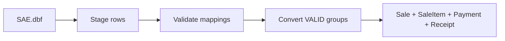

# Legacy Sales DBF Import (2026 Parallel Run)

**Project:** asa-con-v0  
**Source file:** `SAE.dbf` (Delphi legacy POS sales lines)  
**Scope:** Stage → validate → convert for **2026-01-01 onward only**. No finance posting. No stock movement.

---

## 1. Source field mapping

| Legacy DBF | Staging column | Notes |
|------------|----------------|-------|
| `S_TRANS` | `legacyTransNo` | Legacy receipt/transaction counter — **not** used as v0 receipt number |
| `S_DATE` | `legacyDate` | `DD/MM/YYYY` text |
| `S_TIME` | `legacyTime` | `HH:MM:SS` text |
| `S_ID` | `legacyBranchId` | Shop id → mapped via `SH{pad3}` branch code |
| `E_ID` | `legacyStaffId` | Optional; maps to `Staff.staffId` when present |
| `I_ID` | `legacyProductCode` | 7-digit product code → `Product.code` |
| `S_QTY` | `qty` | Must be **> 0** (POS rule) |
| `S_AMOUNT` | `amount` | Line total; negative rows flagged for review |

Computed:

- `normalizedSaleDateTime` — local date/time from `S_DATE` + `S_TIME`
- `sourceRowNo` — 1-based row index in DBF (idempotency key with `sourceFileName`)

---

## 2. Old data cutoff rule

- Rows with `S_DATE` **before 2026-01-01** are **never staged**.
- Cutoff constant: `LEGACY_SALES_CUTOFF_DATE = "2026-01-01"` in `lib/import/legacy-sales/constants.ts`.
- Known file stats (~320k rows): ~16k rows / ~10.9k transactions in 2026.

---

## 3. Receipt / Rec No rule

- **Do not trust `S_TRANS` as receipt number.**
- `S_TRANS` repeats across shop/year — keep as `legacyTransNo` only.
- Convert creates v0 `Receipt.receiptNo` using existing POS formula:

  `REC-{BranchCode}-{YYYYMM}-{Seq4}`

  via `allocateReceiptNo()` in `lib/pos/receipt.ts`.

- Audit link: `LegacySaleReference` stores `(sourceFileName, legacyBranchId, legacySaleDate, legacyTransNo) → saleId`.

---

## 4. Staging-first flow



### Prisma models

- `LegacySalesImportBatch` — run header / counters
- `LegacySalesImportRow` — one DBF line (`PENDING → VALID/INVALID → IMPORTED`)
- `LegacySaleReference` — idempotent legacy transaction → `Sale` link

### Idempotency

| Layer | Key |
|-------|-----|
| Staging row | `(sourceFileName, sourceRowNo)` unique |
| Convert transaction | `(sourceFileName, legacyBranchId, legacySaleDate, legacyTransNo)` unique on `LegacySaleReference` |

Re-running stage skips duplicate staging rows. Re-running convert skips transactions already linked.

---

## 5. Validation checklist

Before `--apply` convert:

1. Stage dry-run — confirm ~16k accepted rows for 2026 file
2. **Seed legacy compatibility products** if validation reports unmatched codes (see §10)
3. Validate with `--apply` — review:
   - unmatched branches (`S_ID` → `SHxxx`)
   - unmatched products (`I_ID` 7-digit code)
   - unmatched staff (warning only — import proceeds with `staffId = null`)
   - zero qty → `INVALID`
   - negative amount → `INVALID` (manual review)
4. Convert dry-run — transaction group count ≈ ~10.9k
5. Convert `--apply` only after validation clean enough for parallel run

Transaction grouping key:

`legacyBranchId + legacyDate + legacyTransNo`

---

## 6. Rollback / idempotency notes

- Staging rows are append-only per `(sourceFileName, sourceRowNo)`.
- Convert does **not** call `checkout()` — no stock ledger, no finance voucher.
- To rollback converted sales: delete `Sale` rows (cascades items/payment/receipt/reference) and reset staging row status manually — **no automated rollback in this phase**.
- Safe re-run: convert skips existing `LegacySaleReference` rows.

---

## 7. Commands

Default is **dry-run** (no DB writes). Pass `--apply` to persist.

### Stage

```bash
npm run legacy:sales:stage -- --file SAE.dbf --year 2026
npm run legacy:sales:stage -- --file O:/OFFICE/document/ASACOM/DATA/SAE.dbf --apply
```

Env override for source folder: `LEGACY_SALES_SOURCE_DIR`

### Validate

```bash
npm run legacy:sales:validate -- --batch latest
npm run legacy:sales:validate -- --batch latest --apply
```

### Control (pre-convert)

```bash
npm run legacy:sales:control -- --batch latest
```

Report-only: VALID positive sales, excluding refund candidates (`R*` / negative amount), branch `00`, zero qty, and invalid rows.

### Convert

```bash
npm run legacy:sales:convert -- --batch latest
npm run legacy:sales:convert -- --batch latest --apply
```

---

## 8. Implementation layout

| Path | Role |
|------|------|
| `lib/import/legacy-sales/` | Parser, stage, validate, convert kernel |
| `scripts/import-legacy-sales-dbf.ts` | Stage CLI |
| `scripts/validate-legacy-sales-staging.ts` | Validate CLI |
| `scripts/convert-legacy-sales-staging.ts` | Convert CLI |
| `scripts/seed-legacy-sales-import-products.ts` | Add missing legacy product codes |
| `prisma/schema.prisma` | Staging + audit models |

---

## 9. Out of scope (this phase)

- Finance auto-posting (`postSaleVoucher`)
- Stock movement (`issueStock`)
- Changing live POS checkout behaviour

---

## 10. Legacy compatibility products

Some `I_ID` values in `SAE.dbf` are not in the main `POSINY.DBF` product import. Before convert, seed these **legacy sales import compatibility** products:

| Code | Name | Category | `ProductType` | Stock at sale |
|------|------|----------|---------------|---------------|
| `0103005` | Misc count key / Legacy misc item | Misc | `CONSUMABLE` | No |
| `7002015` | Promotion item | Promotion | `CONSUMABLE` | No |
| `7003003` | Additional shoe services | Service | `CONSUMABLE` | No |

Notes:

- Codes are kept **exactly** as legacy 7-digit values (not remapped).
- `CONSUMABLE` = sellable at POS/import but **no stock ledger** at sale (`ledgerSkippedReason: CONSUMABLE`).
- **No `ReferenceStock` rows** are created for these items.
- Added for **2026 parallel-run legacy sales import compatibility** only; review for master-data cleanup after cutover.

Seed command:

```bash
npx tsx scripts/seed-legacy-sales-import-products.ts
npx tsx scripts/seed-legacy-sales-import-products.ts --apply
```

Implementation: `lib/import/legacy-sales/legacy-import-products.ts`
