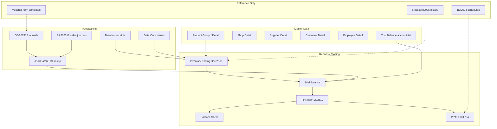

# Legacy System Discovery — ASAD (Phase M0)

**Project:** asa-con-v0  
**Inspection date:** 2026-06-11  
**Legacy folder:** `O:/asa-con/account/asad/`  
**Migration target:** Closing **31/12/2025** → Opening **01/01/2026**  
**Scope:** Read-only discovery. No database writes, schema changes, imports, journals, or stock documents.

**Related prior work:** [ASAD_FINANCIAL_REPORT_202512_INSPECTION.md](./ASAD_FINANCIAL_REPORT_202512_INSPECTION.md)

---

## 1. Legacy System Overview

### Folder summary

| Metric | Value |
|--------|-------|
| Files scanned (recursive) | **207** |
| Root-level workbooks | **12** |
| Stockcard2025 per-product files | **~99 active xlsx** (+ archive `Stockcard2020.old/`) |
| Legacy ERP (inferred) | Thai accounting package exporting formatted `.xls` / `.xlsx` |
| Company | บริษัท อาสา ดิสทริบิวชั่น (ประเทศไทย) จำกัด |

### Root workbooks

| File | Type | Size | Sheets (count) | Purpose (inferred) | Likely module | Category |
|------|------|------|----------------|-------------------|---------------|----------|
| `FinReport-202512.xls` | .xls | 539 KB | 6 | Year-end TB, BS, P&L, equity, working paper | Finance | **REPORT DATA** |
| `ASAD_Inventory202512.xls` | .xls | 5.4 MB | 23 | Inventory month-end export + master data | Inventory / Master | **MASTER DATA** |
| `AsadData68.xls` | .xls | 3.5 MB | 1 (+ empty) | Full GL transaction dump | Finance | **TRANSACTION DATA** |
| `GJ-202512-no.1.xls` | .xls | 207 KB | 1 | General journal Dec 2025 (operational) | Finance | **TRANSACTION DATA** |
| `GJ-202512_No.2.xls` | .xls | 139 KB | 1 | General journal Dec 2025 (close / revenue) | Finance | **TRANSACTION DATA** |
| `SJ000-202512.xls` | .xls | 64 KB | 1 | Sales journal — HO branch | Sales / Finance | **TRANSACTION DATA** |
| `SJ001-202512.xls` | .xls | 64 KB | 1 | Sales journal — HO (alt period) | Sales / Finance | **TRANSACTION DATA** |
| `Sales Tax2604.xlsx` | .xlsx | 13 KB | 1 | VAT sales schedule — **April 2569** | Tax | **REPORT DATA** |
| `Purchase Tax2604.xlsx` | .xlsx | 15 KB | 1 | VAT purchase schedule — **April 2569** | Tax | **REPORT DATA** |
| `ASADForm-Voucher.xlsx` | .xlsx | 682 KB | 39 | Payment voucher print templates | Finance | **REFERENCE DATA** |
| `ASADForm-Voucher(Receipt).xlsx` | .xlsx | 171 KB | 8 | Receipt voucher print templates | Finance | **REFERENCE DATA** |
| `ASADForm-Voucher -JV-2026-01-12.xlsx` | .xlsx | 1.9 MB | 107 | JV voucher print templates (2026 samples) | Finance | **REFERENCE DATA** |

### `FinReport-202512.xls` sheets

| Sheet | Rows | Purpose |
|-------|------|---------|
| Trial Balance | 1,424 | GL accounts, debit/credit as of 31/12/2568 |
| Working Paper | 1,484 | TB ↔ P&L ↔ BS cross-check |
| Profit Loss | 1,265 | Income statement summary |
| Profit Loss Compare | 1,298 | Monthly/YTD P&L comparison |
| Balance Sheet | 1,259 | Statement of financial position |
| งบแสดงการเปลี่ยนแปลงส่วน | 1,283 | Statement of changes in equity |

### `ASAD_Inventory202512.xls` sheets (key)

| Sheet | Rows | Purpose |
|-------|------|---------|
| Data In | 1,275 | Purchase/receipt transactions (Dec 2568) |
| Data Out | 72 | Issue/transfer transactions |
| Data Inventory | 363 | Inventory adjustment lines |
| Product Detail | 996 | SKU master (รหัสสินค้า, unit, group) |
| Product Group | 3,677 | Product group master + sell price |
| Customer Detail | 11 | Customer master (**3 data rows**) |
| Supplier Detail | 28 | Supplier master |
| Shop Detail | 184 | Branch / franchise shop master |
| Employee Detail | 31 | Staff master |
| Price / SetPrice | 848 / 3,507 | Price history / cost+sell |
| Begining / Received / Ending | ~1,318 each | Dec 2568 stock movement report |
| Detail Inventory | 1,409 | Valuation detail (**header dated 31/12/2551 — stale**) |
| Stock Card | 777 | Sample stock card report |
| Cost11 / Cost12 | large | Cost reports Nov/Dec 2568 |

### `AsadData68.xls`

| Sheet | Rows | Columns | Purpose |
|-------|------|---------|---------|
| Data | **60,047** | 17 | Flat GL lines: date, voucher refs, journal book, account, debit, credit |
| CODE ที่ถูก | 0 | — | Empty |

Date range (Excel serial): **45658 → 46022** (covers FY including year-end close).  
Last recorded entry: year-end close to account **401** (กำไรสุทธิ) credit **759,468.09** via `GJ-202512`.

### `Stockcard2025/` folder

| Content | Count | Purpose |
|---------|-------|---------|
| `2025-{productGroup}.xlsx` | ~99 | Per-product-group stock card (receipts/issues by voucher) |
| `Stockcard2020.old/` | ~90 .xls | Archived 2020 cards — **not for migration** |
| `ASAD_InvDetail.xlsx` | 1 | Inventory detail reference |

Filename pattern `2025-1019018.xlsx` maps to product group code **1019018**.

### Voucher form workbooks (reference only)

- **39 payment templates** — salary, tax, dividend, supplier variants  
- **8 receipt templates** — including ASAS franchise variants  
- **107 JV templates** — sample 2026 JVs (post-migration period)  

These are **print layouts**, not transactional exports. Evidence of document types: ใบสำคัญจ่าย, ใบสำคัญรับ, ใบสำคัญรายวันทั่วไป.

---

## 2. Source of Truth Analysis

### Finance

| Role | Source | Confidence |
|------|--------|------------|
| **Primary (closing TB)** | `FinReport-202512.xls` → Trial Balance | **High** |
| **Primary (opening transform)** | TB + year-end close logic (P&L → RE `301`) | **High** |
| **Secondary (transaction proof)** | `AsadData68.xls` | **High** |
| **Secondary (Dec journals)** | `GJ-202512-no.1.xls`, `GJ-202512_No.2.xls` | **Medium–High** |
| **Validation** | FinReport BS / P&L / Equity sheets | **Medium** |
| **Not source of truth** | Voucher form xlsx files | **N/A** |

**Rationale:** FinReport TB is the audited closing position (balanced 8,295,763.67). AsadData68 corroborates every journal line including explicit year-end close. GJ exports are December subsets useful for audit trail but incomplete alone.

### Inventory

| Role | Source | Confidence |
|------|--------|------------|
| **Primary (closing qty)** | `ASAD_Inventory202512.xls` → **Ending** | **High** |
| **Primary (product master)** | Product Group + Product Detail | **High** |
| **Primary (locations)** | Shop Detail | **High** |
| **Validation (GL value)** | FinReport TB accounts 1301–1311 | **High** |
| **Validation (movement)** | Stockcard2025 per-product files | **Medium** |
| **Do not use** | Detail Inventory sheet (dated 2551) | **Low** |

### Sales

| Role | Source | Confidence |
|------|--------|------------|
| **Secondary** | `SJ000-202512.xls`, `SJ001-202512.xls` | **Low** |
| **Validation** | FinReport revenue account 5001 | **High** |
| **Reference** | Sales Tax2604.xlsx | **Low** (wrong period for opening) |

SJ files contain **1–2 invoice rows each** for Dec 2025 — likely summary journals, not full sales subledger.

### Purchasing

| Role | Source | Confidence |
|------|--------|------------|
| **Secondary** | ASAD_Inventory `Data In` (1,274 receipt lines) | **Medium** |
| **Master** | Supplier Detail | **Medium** |
| **Validation** | Purchase Tax2604.xlsx | **Low** (April 2026) |

No dedicated purchase journal (`PJ`) file in folder.

### Tax

| Role | Source | Confidence |
|------|--------|------------|
| **Validation (ongoing)** | Sales/Purchase Tax2604.xlsx | **Medium** |
| **Validation (GL)** | FinReport TB 4602, 461x, 9001 | **High** |
| **Opening package** | **Not covered** for Dec 2025 VAT position | **Missing** |

Tax files are **เดือนภาษี เมษายน 2569** (April 2026), not December 2025 closing.

### AR

| Role | Source | Confidence |
|------|--------|------------|
| **Primary (control balance)** | FinReport TB `1121`, `1131` | **Medium** |
| **Master (limited)** | Customer Detail (3 customers) | **Low** |
| **Secondary** | SJ customer names, voucher receipts | **Low** |

**No AR aging / open-invoice subledger** in folder.

### AP

| Role | Source | Confidence |
|------|--------|------------|
| **Primary (control balance)** | FinReport TB `4101`, accruals `45xx` | **Medium** |
| **Master** | Supplier Detail (27 suppliers) | **Medium** |

**No AP open-item subledger** in folder.

---

## 3. Dependency Map

### Upstream → downstream

| Upstream | Downstream | Relationship |
|----------|------------|--------------|
| Product Group | Ending qty report | Group code keys stock |
| Data In / Out | Ending | Movements roll into closing |
| GJ / SJ / PV / JV vouchers | AsadData68 | Posted GL lines |
| AsadData68 | FinReport TB | Aggregated balances |
| FinReport TB | BS / P&L / Equity | Financial statement presentation |
| TB 13xx balances | BS inventory line | GL valuation cross-check |
| Stockcard2025 | Ending | Per-product audit trail |

---

## 4. Migration Readiness Matrix

See [MIGRATION_READINESS_MATRIX.md](./MIGRATION_READINESS_MATRIX.md) for the full table.

| Target | Status | Confidence |
|--------|--------|------------|
| Chart of Accounts | Available | High |
| Opening Journal | Available (with close step) | High |
| Trial Balance | Available | High |
| Products | Available | High |
| Inventory qty | Available | High |
| Inventory value | Partial | Medium |
| Branches/Shops | Available | High |
| Suppliers | Available | Medium |
| Customers | Partial | Low |
| AR | Partial (control only) | Medium |
| AP | Partial (control only) | Medium |
| Employees | Available | Medium |
| Tax opening | Missing | Low |

---

## 5. Finance Migration Readiness

### 31/12/2025 closing trial balance

| Metric | Value |
|--------|-------|
| Source | `FinReport-202512.xls` → Trial Balance |
| Account rows | 197 |
| Non-zero balances | 43 |
| Total debit | **8,295,763.67** |
| Total credit | **8,295,763.67** |
| Balanced | **Yes** |

### Opening journal candidate (01/01/2026)

| Scenario | Debit | Credit | Balanced |
|----------|-------|--------|----------|
| Raw TB (incl. open P&L) | 8,295,763.67 | 8,295,763.67 | Yes — **not suitable** as opening |
| BS + equity only (no close) | 5,010,280.88 | 4,250,812.79 | No — diff = 759,468.09 |
| **Adjusted (P&L closed to RE 301)** | **5,010,280.88** | **5,010,280.88** | **Yes** |

### Revenue / expense / retained earnings

| Class | Key accounts | Dec 2025 YTD (TB) |
|-------|--------------|-------------------|
| Revenue | `5001` | Credit 4,044,317.23 |
| COGS / expense | `6xxx`–`8xxx` | Various debits |
| Tax expense | `9001` | Debit 81,082.60 |
| **Net profit** | — | **759,468.09** (matches P&L sheet) |
| Retained earnings (pre-close) | `301` | Credit 1,177,300.98 |
| Retained earnings (post-close) | `301` | Credit **1,936,769.07** |
| Year-end close target (AsadData68) | `401` | Credit 759,468.09 in close entry |

**Evidence of year-end close in legacy system:** `AsadData68.xls` final lines post net profit to account **401** (กำไรสุทธิ) via `GJ-202512` page 25. FinReport TB still shows **open P&L balances** — export appears to be **pre-close presentation** or close reflected only in transaction log. Migration must apply explicit close before opening.

### Balance sheet / P&L validation

| Report | Source | Net profit / totals | Use |
|--------|--------|---------------------|-----|
| P&L | FinReport | Net 759,468.09 | 16E validation — **High** |
| BS | FinReport | Assets 4,457,414.42 = L+E | Future 16F validation — **Medium** |
| Equity stmt | FinReport | Dividend 1,000,000 paid | RE reconciliation — **Medium** |

---

## 6. Inventory Migration Readiness

### Closing data (Dec 2568 = Dec 2025)

| Source | Metric | Value |
|--------|--------|-------|
| **Ending sheet** | Product groups with qty | **188** |
| **Ending sheet** | Total quantity (sum) | **110,172** units |
| **Product Group** | Master rows | **3,676** |
| **Product Detail** | SKU rows | **995** |
| **Shop Detail** | Branches | **183** |
| **FinReport GL** | Inventory value (13xx) | **2,007,766.55** |

### Product code structure

- **Product Group** (`รหัสกรุ๊ป`): e.g. `1019018` — used in Ending qty and stockcard filenames  
- **Product Detail** (`รหัสสินค้า`): e.g. `1010015` — SKU variants under a group  
- **Units:** ดอก, คู่, etc.

### Opening stock document feasibility

| Question | Answer | Confidence |
|----------|--------|------------|
| Can we build opening qty by product group? | **Yes** — from Ending sheet | **High** |
| Can we build opening qty by SKU? | **Partial** — need group→SKU split rules | **Medium** |
| Can we match GL inventory value? | **Partial** — GL uses 5 accounts (keys, materials, in-transit); stock file uses 188 groups | **Medium** |
| Can Stockcard2025 substitute Ending? | **No** — movement history, not authoritative closing snapshot | **Low** |

**Recommended opening stock approach:** Import product master from Inventory file → create opening receive document at **HO warehouse** using **Ending** quantities → reconcile total value to FinReport 13xx GL accounts.

---

## 7. AR / AP Readiness

### Customer / AR

| Data | Source | Amount / count |
|------|--------|----------------|
| AR — other | TB `1121` | 321,364.00 |
| AR — related party | TB `1131` | 1,207,708.75 |
| **Total AR control** | TB | **1,529,072.75** |
| Customer master | Customer Detail | **3** rows (related-party entities) |
| Invoice detail | SJ Dec 2025 | **~3 rows total** |

**Missing:** Open invoice list, aging, customer-level balances.

### Supplier / AP

| Data | Source | Amount / count |
|------|--------|----------------|
| AP trade | TB `4101` | 27,948.94 |
| Accrued payroll | TB `4501` | 130,000.00 |
| Other accruals | TB `4551`–`4613` | various |
| Supplier master | Supplier Detail | **27** rows |

**Missing:** Open bill list, supplier statement balances.

### Migration implication

Opening journal can post **control account totals**. Subledger migration (invoice-level AR/AP) is **not supported** by current files.

---

## 8. Validation Package

| Report | Source file | Migration validation value | Notes |
|--------|-------------|----------------------------|-------|
| Trial Balance | FinReport-202512 | **High** | Primary finance validation |
| Balance Sheet | FinReport-202512 | **High** | Total assets = L+E |
| P&L | FinReport-202512 | **High** | Net profit vs TB roll-up |
| Equity changes | FinReport-202512 | **Medium** | Dividends, RE movement |
| GL transaction log | AsadData68 | **High** | Line-level audit |
| General Journal | GJ-202512 x2 | **Medium** | December sample |
| Inventory Ending | ASAD_Inventory202512 | **High** | Qty opening validation |
| GL inventory value | FinReport TB 13xx | **High** | Value reconciliation |
| Stockcard2025 | per-product files | **Medium** | Movement plausibility |
| Sales Tax | Sales Tax2604 | **Low** | Wrong period (Apr 2026) |
| Purchase Tax | Purchase Tax2604 | **Low** | Wrong period (Apr 2026) |
| Detail Inventory | ASAD_Inventory202512 | **Low** | Stale date 2551 |

---

## 9. Risk Assessment

| Risk | Severity | Detail |
|------|----------|--------|
| Open P&L in FinReport TB | **High** | Must close to RE before 01/01/2026 opening |
| No AR/AP subledger | **High** | Control balances only |
| Customer master incomplete | **High** | 3 rows vs 1.5M AR balance |
| Inventory GL vs stock valuation gap | **Medium** | GL 2.0M vs stale Detail Inv 3.18M |
| Product group vs SKU hierarchy | **Medium** | Mapping rules needed |
| Tax files wrong period | **Medium** | Apr 2026, not Dec 2025 close |
| Equity code collision (1 vs 1001) | **Medium** | CoA import normalisation |
| Voucher templates mistaken for data | **Medium** | 154 template sheets |
| Duplicate stock sources | **Low** | Ending vs Stockcard vs TB — define precedence |
| Stockcard2020.old archive | **Low** | Exclude from migration |

---

## 10. Final Recommendation

### Can asa-con-v0 go live on 01/01/2026 using only these files?

**Partially yes** — with gaps explicitly accepted or supplemented.

| Area | Go-live ready? | Confidence |
|------|----------------|------------|
| Finance opening (GL) | **Yes** — with P&L close transform | High |
| CoA | **Yes** — with type mapping | High |
| Inventory opening (qty) | **Yes** — product group level | High |
| Product / shop master | **Yes** | High |
| AR / AP (control) | **Yes** — control accounts only | Medium |
| AR / AP (subledger) | **No** | — |
| Customer master | **No** — insufficient | Low |
| Tax opening balances | **Unclear** — need Dec 2025 VAT position | Low |

### Additional files recommended

| Need | Suggested source |
|------|------------------|
| AR open items / aging | Legacy AR aging export (not in folder) |
| Customer master (trade debtors) | CRM / franchise billing export |
| Dec 2025 VAT reconciliation | ภาษีขาย/ซื้อ ธ.ค. 2568 reports |
| Purchase journals | PJ-202512 if exists elsewhere |
| Bank statement 31/12/2025 | For cash validation |
| Written CoA mapping | Internal mapping spreadsheet |

### Recommended next migration phase

**Phase M1 — Mapping & transform (no import)**

1. CoA mapping table (197 accounts → `GlAccountType`)  
2. Opening journal transform spec (P&L → `301`, zero 5xxx–9xxx)  
3. Product group → asa-con-v0 product catalog mapping  
4. Shop → branch mapping (183 rows)  
5. Opening stock document draft from Ending sheet  
6. Reconciliation checklist: TB ↔ BS ↔ inventory GL  

---

## Artifacts

| Artifact | Path |
|----------|------|
| File inventory CSV | `data/migration/discovery/legacy_file_inventory.csv` |
| Finance sources CSV | `data/migration/discovery/legacy_finance_sources.csv` |
| Inventory sources CSV | `data/migration/discovery/legacy_inventory_sources.csv` |
| Migration matrix CSV | `data/migration/discovery/legacy_migration_matrix.csv` |
| Discovery script | `scripts/migration/discover-legacy-asad-folder.ts` |
| FinReport inspection | `docs/migration/ASAD_FINANCIAL_REPORT_202512_INSPECTION.md` |

*Re-run discovery: `npx tsx scripts/migration/discover-legacy-asad-folder.ts`*
