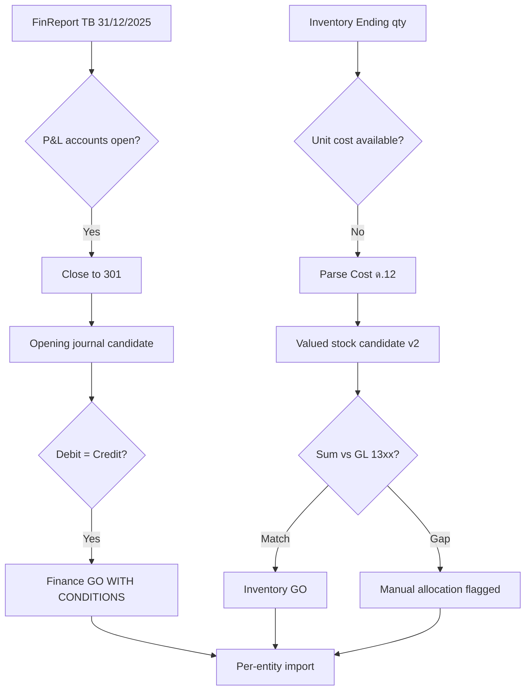

# ASAS M1 — Reconciliation Plan

**Company:** บริษัท อาสา เซอร์วิส (ประเทศไทย) จำกัด  
**Closing date:** 31/12/2025  
**Opening date:** 01/01/2026  
**Outputs:** `data/migration/asas/m1/asas_reconciliation_summary.csv`

---

## 1. Finance Reconciliation

### Trial Balance

| Check | Value (THB) | Status |
|-------|-------------|--------|
| TB total debits | 40,640,308.66 | PASS |
| TB total credits | 40,640,308.66 | PASS |
| Difference | 0.00 | PASS |

### Opening Journal (post P&L close)

| Check | Value (THB) | Status |
|-------|-------------|--------|
| Opening debits | 22,281,061.82 | PASS |
| Opening credits | 22,281,061.82 | PASS |
| Difference | 0.00 | PASS |

### P&L Close

| Item | Value (THB) | Status |
|------|-------------|--------|
| Net profit 2025 | 23,494.96 | PASS |
| `301` before close | 1,956,275.55 | — |
| `301` after close (opening) | 1,979,770.51 | PASS |

### Balance Sheet Cross-Check

| Item | FinReport BS | Opening journal (derived) | Status |
|------|--------------|---------------------------|--------|
| Total assets | 6,929,390.20 | Matches BS accounts in opening | PASS |
| Total equity | 4,179,770.51 | Matches equity + RE | PASS |

---

## 2. Inventory Reconciliation

### GL vs Stock Candidate

| Measure | GL (TB 13xx) | Stock candidate | Difference | Status |
|---------|--------------|-----------------|------------|--------|
| Value | 2,268,125.31 | 0.00 | 2,268,125.31 | **WARNING** |
| Quantity lines | — | 30 (28 importable) | — | PASS (qty) |

### Inventory account breakdown

| GL | Name | TB debit |
|----|------|----------|
| 1302 | ลูกกุญแจ | 957,277.27 |
| 1303 | วัสดุรองเท้า | 1,292,601.54 |
| 1305 | เบ็ดเตล็ด | 212.00 |
| 1306 | วัสดุสิ้นเปลือง | 18,034.50 |

**Action:** Use GL as control balance until Cost (ด.12) bridge produces valued candidate.

---

## 3. Subledger vs Control

| Subledger | Control account | TB balance | Subledger file | Status |
|-----------|-----------------|------------|----------------|--------|
| AR | 1101 | 227,464.10 | None | **GO WITH CONDITIONS** — control only |
| AP trade | 4101 | 37,814.51 | None | **GO WITH CONDITIONS** |
| AP related | 4151 | 1,207,708.75 | None | **GO WITH CONDITIONS** — map to ASAD |
| VAT input | 1452 | 8,834.55 | Purchase Tax2512 | PASS (validation) |
| VAT output | 4602 | 48,785.02 | Sales Tax2512 | PASS (validation) |

---

## 4. Cross-Entity Checks (ASAD)

| Check | Result |
|-------|--------|
| ASAS inventory explains ASAD gap? | **No** — separate GL, separate qty pools |
| Combined stock value | 438,604.93 (ASAD only) — does not sum to either GL |
| Related party link | ASAD customer #3 = ASAS; ASAS AP 4151 = 1.21M |

See: `docs/migration/combined/ASAD_ASAS_INVENTORY_RECONCILIATION.md`

---

## 5. Reconciliation Workflow (M2)

---

## 6. Sign-Off Checklist (before import)

- [ ] Accountant confirms P&L close amount 23,494.96
- [ ] Opening journal 41 lines approved
- [ ] Subtotal rows 1302/1303 excluded from stock import
- [ ] Inventory valuation method chosen (Cost12 vs manual)
- [ ] Related party 4151 counterparty confirmed
- [ ] ASAS migrated as **separate company** — not merged with ASAD

---

## 7. Output Files

| File | Purpose |
|------|---------|
| `asas_reconciliation_summary.csv` | Pass/warn/fail checks |
| `asas_opening_journal_candidate.csv` | Balanced opening |
| `asas_opening_stock_candidate.csv` | Qty candidate |
| `asad_asas_stock_value_bridge.csv` | Cross-entity valuation bridge |
| `asad_asas_readiness_score.csv` | Combined readiness |
